# EDA: Prediksi Ketepatan Lulus Mahasiswa
---
**Tujuan**: Memahami dataset sebelum preprocessing — identifikasi missing values, distribusi, korelasi, dan sinyal fitur terhadap target.

**Data**: `dataset.csv` (608 rows x 27 kolom)  
**Target**: `1` = Tepat Waktu, `0` = Tidak Tepat


```python
import pandas as pd
import numpy as np
import matplotlib.pyplot as plt
import seaborn as sns
import missingno as msno

plt.style.use('seaborn-v0_8-whitegrid')
sns.set_palette('Set2')
pd.set_option('display.max_columns', None)
pd.set_option('display.float_format', '{:.4f}'.format)

%matplotlib inline
```


```python
df = pd.read_csv('dataset.csv')
print(f'Shape: {df.shape}')
df.head()
```

    Shape: (608, 27)


<div>
<style scoped>
    .dataframe tbody tr th:only-of-type {
        vertical-align: middle;
    }

    .dataframe tbody tr th {
        vertical-align: top;
    }

    .dataframe thead th {
        text-align: right;
    }
</style>
<table border="1" class="dataframe">
  <thead>
    <tr style="text-align: right;">
      <th></th>
      <th>student_id</th>
      <th>angkatan</th>
      <th>program</th>
      <th>jenis_kelamin</th>
      <th>id_agama</th>
      <th>ips_sem1</th>
      <th>ips_sem2</th>
      <th>ips_sem3</th>
      <th>ips_sem4</th>
      <th>ipk_sem4</th>
      <th>sks_sem1</th>
      <th>sks_sem2</th>
      <th>sks_sem3</th>
      <th>sks_sem4</th>
      <th>total_sks_lulus_sem4</th>
      <th>failed_courses</th>
      <th>failed_in_sem1</th>
      <th>repeated_courses</th>
      <th>avg_attendance</th>
      <th>ips_trend</th>
      <th>avg_ips</th>
      <th>ips_std</th>
      <th>ips_max</th>
      <th>ips_min</th>
      <th>sks_completion_ratio</th>
      <th>semester_count</th>
      <th>target</th>
    </tr>
  </thead>
  <tbody>
    <tr>
      <th>0</th>
      <td>207421001</td>
      <td>2020</td>
      <td>IH</td>
      <td>P</td>
      <td>2</td>
      <td>2.9000</td>
      <td>3.4300</td>
      <td>3.1700</td>
      <td>3.6300</td>
      <td>3.2800</td>
      <td>20.0000</td>
      <td>21.0000</td>
      <td>18.0000</td>
      <td>19.0000</td>
      <td>78</td>
      <td>1</td>
      <td>1</td>
      <td>0</td>
      <td>83.6700</td>
      <td>0.7300</td>
      <td>3.2825</td>
      <td>0.3170</td>
      <td>3.6300</td>
      <td>2.9000</td>
      <td>0.9750</td>
      <td>8</td>
      <td>1</td>
    </tr>
    <tr>
      <th>1</th>
      <td>207421003</td>
      <td>2020</td>
      <td>IH</td>
      <td>P</td>
      <td>1</td>
      <td>3.4500</td>
      <td>3.4300</td>
      <td>3.3300</td>
      <td>3.2600</td>
      <td>3.3700</td>
      <td>20.0000</td>
      <td>21.0000</td>
      <td>18.0000</td>
      <td>19.0000</td>
      <td>78</td>
      <td>1</td>
      <td>0</td>
      <td>0</td>
      <td>81.6700</td>
      <td>-0.1900</td>
      <td>3.3675</td>
      <td>0.0888</td>
      <td>3.4500</td>
      <td>3.2600</td>
      <td>0.9750</td>
      <td>8</td>
      <td>1</td>
    </tr>
    <tr>
      <th>2</th>
      <td>207421004</td>
      <td>2020</td>
      <td>IH</td>
      <td>L</td>
      <td>1</td>
      <td>3.1000</td>
      <td>3.3300</td>
      <td>3.3300</td>
      <td>3.3700</td>
      <td>3.2800</td>
      <td>20.0000</td>
      <td>21.0000</td>
      <td>18.0000</td>
      <td>19.0000</td>
      <td>78</td>
      <td>0</td>
      <td>0</td>
      <td>0</td>
      <td>83.0800</td>
      <td>0.2700</td>
      <td>3.2825</td>
      <td>0.1231</td>
      <td>3.3700</td>
      <td>3.1000</td>
      <td>0.9750</td>
      <td>8</td>
      <td>1</td>
    </tr>
    <tr>
      <th>3</th>
      <td>207421005</td>
      <td>2020</td>
      <td>IH</td>
      <td>L</td>
      <td>1</td>
      <td>3.1000</td>
      <td>3.2400</td>
      <td>3.6700</td>
      <td>0.0000</td>
      <td>2.5100</td>
      <td>20.0000</td>
      <td>21.0000</td>
      <td>18.0000</td>
      <td>19.0000</td>
      <td>78</td>
      <td>8</td>
      <td>0</td>
      <td>0</td>
      <td>78.9700</td>
      <td>-3.1000</td>
      <td>2.5025</td>
      <td>1.6859</td>
      <td>3.6700</td>
      <td>0.0000</td>
      <td>0.9750</td>
      <td>4</td>
      <td>0</td>
    </tr>
    <tr>
      <th>4</th>
      <td>207421006</td>
      <td>2020</td>
      <td>IH</td>
      <td>L</td>
      <td>1</td>
      <td>3.2000</td>
      <td>3.4300</td>
      <td>3.3300</td>
      <td>3.6300</td>
      <td>3.4000</td>
      <td>20.0000</td>
      <td>21.0000</td>
      <td>18.0000</td>
      <td>19.0000</td>
      <td>78</td>
      <td>0</td>
      <td>0</td>
      <td>0</td>
      <td>82.0900</td>
      <td>0.4300</td>
      <td>3.3975</td>
      <td>0.1814</td>
      <td>3.6300</td>
      <td>3.2000</td>
      <td>0.9750</td>
      <td>4</td>
      <td>0</td>
    </tr>
  </tbody>
</table>
</div>


## 1. Structure & Types


```python
df.info()
```

    <class 'pandas.DataFrame'>
    RangeIndex: 608 entries, 0 to 607
    Data columns (total 27 columns):
     #   Column                Non-Null Count  Dtype  
    ---  ------                --------------  -----  
     0   student_id            608 non-null    str    
     1   angkatan              608 non-null    int64  
     2   program               608 non-null    str    
     3   jenis_kelamin         608 non-null    str    
     4   id_agama              608 non-null    int64  
     5   ips_sem1              441 non-null    float64
     6   ips_sem2              489 non-null    float64
     7   ips_sem3              590 non-null    float64
     8   ips_sem4              417 non-null    float64
     9   ipk_sem4              608 non-null    float64
     10  sks_sem1              377 non-null    float64
     11  sks_sem2              319 non-null    float64
     12  sks_sem3              590 non-null    float64
     13  sks_sem4              417 non-null    float64
     14  total_sks_lulus_sem4  608 non-null    int64  
     15  failed_courses        608 non-null    int64  
     16  failed_in_sem1        608 non-null    int64  
     17  repeated_courses      608 non-null    int64  
     18  avg_attendance        287 non-null    float64
     19  ips_trend             490 non-null    float64
     20  avg_ips               490 non-null    float64
     21  ips_std               490 non-null    float64
     22  ips_max               490 non-null    float64
     23  ips_min               490 non-null    float64
     24  sks_completion_ratio  608 non-null    float64
     25  semester_count        608 non-null    int64  
     26  target                608 non-null    int64  
    dtypes: float64(16), int64(8), str(3)
    memory usage: 128.4 KB


```python
df.describe(include='all').T
```


<div>
<style scoped>
    .dataframe tbody tr th:only-of-type {
        vertical-align: middle;
    }

    .dataframe tbody tr th {
        vertical-align: top;
    }

    .dataframe thead th {
        text-align: right;
    }
</style>
<table border="1" class="dataframe">
  <thead>
    <tr style="text-align: right;">
      <th></th>
      <th>count</th>
      <th>unique</th>
      <th>top</th>
      <th>freq</th>
      <th>mean</th>
      <th>std</th>
      <th>min</th>
      <th>25%</th>
      <th>50%</th>
      <th>75%</th>
      <th>max</th>
    </tr>
  </thead>
  <tbody>
    <tr>
      <th>student_id</th>
      <td>608</td>
      <td>608</td>
      <td>207421001</td>
      <td>1</td>
      <td>NaN</td>
      <td>NaN</td>
      <td>NaN</td>
      <td>NaN</td>
      <td>NaN</td>
      <td>NaN</td>
      <td>NaN</td>
    </tr>
    <tr>
      <th>angkatan</th>
      <td>608.0000</td>
      <td>NaN</td>
      <td>NaN</td>
      <td>NaN</td>
      <td>2019.1760</td>
      <td>2.9309</td>
      <td>2015.0000</td>
      <td>2016.0000</td>
      <td>2020.0000</td>
      <td>2022.0000</td>
      <td>2023.0000</td>
    </tr>
    <tr>
      <th>program</th>
      <td>608</td>
      <td>2</td>
      <td>IH</td>
      <td>461</td>
      <td>NaN</td>
      <td>NaN</td>
      <td>NaN</td>
      <td>NaN</td>
      <td>NaN</td>
      <td>NaN</td>
      <td>NaN</td>
    </tr>
    <tr>
      <th>jenis_kelamin</th>
      <td>608</td>
      <td>2</td>
      <td>L</td>
      <td>407</td>
      <td>NaN</td>
      <td>NaN</td>
      <td>NaN</td>
      <td>NaN</td>
      <td>NaN</td>
      <td>NaN</td>
      <td>NaN</td>
    </tr>
    <tr>
      <th>id_agama</th>
      <td>608.0000</td>
      <td>NaN</td>
      <td>NaN</td>
      <td>NaN</td>
      <td>1.1382</td>
      <td>0.3985</td>
      <td>1.0000</td>
      <td>1.0000</td>
      <td>1.0000</td>
      <td>1.0000</td>
      <td>4.0000</td>
    </tr>
    <tr>
      <th>ips_sem1</th>
      <td>441.0000</td>
      <td>NaN</td>
      <td>NaN</td>
      <td>NaN</td>
      <td>1.9623</td>
      <td>1.5783</td>
      <td>0.0000</td>
      <td>0.0000</td>
      <td>3.0000</td>
      <td>3.2500</td>
      <td>4.0000</td>
    </tr>
    <tr>
      <th>ips_sem2</th>
      <td>489.0000</td>
      <td>NaN</td>
      <td>NaN</td>
      <td>NaN</td>
      <td>3.2217</td>
      <td>0.4670</td>
      <td>0.0000</td>
      <td>3.1300</td>
      <td>3.2500</td>
      <td>3.3800</td>
      <td>4.0000</td>
    </tr>
    <tr>
      <th>ips_sem3</th>
      <td>590.0000</td>
      <td>NaN</td>
      <td>NaN</td>
      <td>NaN</td>
      <td>3.4794</td>
      <td>0.6180</td>
      <td>0.0000</td>
      <td>3.1500</td>
      <td>3.6700</td>
      <td>3.8775</td>
      <td>4.0000</td>
    </tr>
    <tr>
      <th>ips_sem4</th>
      <td>417.0000</td>
      <td>NaN</td>
      <td>NaN</td>
      <td>NaN</td>
      <td>2.8929</td>
      <td>1.0037</td>
      <td>0.0000</td>
      <td>3.0000</td>
      <td>3.1100</td>
      <td>3.4300</td>
      <td>4.0000</td>
    </tr>
    <tr>
      <th>ipk_sem4</th>
      <td>608.0000</td>
      <td>NaN</td>
      <td>NaN</td>
      <td>NaN</td>
      <td>3.1964</td>
      <td>0.4379</td>
      <td>0.7500</td>
      <td>3.0275</td>
      <td>3.2300</td>
      <td>3.3600</td>
      <td>4.0000</td>
    </tr>
    <tr>
      <th>sks_sem1</th>
      <td>377.0000</td>
      <td>NaN</td>
      <td>NaN</td>
      <td>NaN</td>
      <td>11.9151</td>
      <td>9.1520</td>
      <td>2.0000</td>
      <td>2.0000</td>
      <td>14.0000</td>
      <td>20.0000</td>
      <td>24.0000</td>
    </tr>
    <tr>
      <th>sks_sem2</th>
      <td>319.0000</td>
      <td>NaN</td>
      <td>NaN</td>
      <td>NaN</td>
      <td>14.8840</td>
      <td>6.8176</td>
      <td>2.0000</td>
      <td>10.0000</td>
      <td>18.0000</td>
      <td>21.0000</td>
      <td>22.0000</td>
    </tr>
    <tr>
      <th>sks_sem3</th>
      <td>590.0000</td>
      <td>NaN</td>
      <td>NaN</td>
      <td>NaN</td>
      <td>11.8068</td>
      <td>6.5202</td>
      <td>1.0000</td>
      <td>6.0000</td>
      <td>9.0000</td>
      <td>19.0000</td>
      <td>22.0000</td>
    </tr>
    <tr>
      <th>sks_sem4</th>
      <td>417.0000</td>
      <td>NaN</td>
      <td>NaN</td>
      <td>NaN</td>
      <td>12.3549</td>
      <td>8.3274</td>
      <td>1.0000</td>
      <td>3.0000</td>
      <td>19.0000</td>
      <td>19.0000</td>
      <td>21.0000</td>
    </tr>
    <tr>
      <th>total_sks_lulus_sem4</th>
      <td>608.0000</td>
      <td>NaN</td>
      <td>NaN</td>
      <td>NaN</td>
      <td>82.3947</td>
      <td>49.6392</td>
      <td>4.0000</td>
      <td>58.0000</td>
      <td>78.0000</td>
      <td>133.0000</td>
      <td>166.0000</td>
    </tr>
    <tr>
      <th>failed_courses</th>
      <td>608.0000</td>
      <td>NaN</td>
      <td>NaN</td>
      <td>NaN</td>
      <td>0.4161</td>
      <td>2.0326</td>
      <td>0.0000</td>
      <td>0.0000</td>
      <td>0.0000</td>
      <td>0.0000</td>
      <td>18.0000</td>
    </tr>
    <tr>
      <th>failed_in_sem1</th>
      <td>608.0000</td>
      <td>NaN</td>
      <td>NaN</td>
      <td>NaN</td>
      <td>0.0674</td>
      <td>0.5138</td>
      <td>0.0000</td>
      <td>0.0000</td>
      <td>0.0000</td>
      <td>0.0000</td>
      <td>7.0000</td>
    </tr>
    <tr>
      <th>repeated_courses</th>
      <td>608.0000</td>
      <td>NaN</td>
      <td>NaN</td>
      <td>NaN</td>
      <td>0.4194</td>
      <td>0.9040</td>
      <td>0.0000</td>
      <td>0.0000</td>
      <td>0.0000</td>
      <td>1.0000</td>
      <td>12.0000</td>
    </tr>
    <tr>
      <th>avg_attendance</th>
      <td>287.0000</td>
      <td>NaN</td>
      <td>NaN</td>
      <td>NaN</td>
      <td>82.3530</td>
      <td>19.3125</td>
      <td>12.5000</td>
      <td>72.7250</td>
      <td>89.8000</td>
      <td>97.2200</td>
      <td>100.0000</td>
    </tr>
    <tr>
      <th>ips_trend</th>
      <td>490.0000</td>
      <td>NaN</td>
      <td>NaN</td>
      <td>NaN</td>
      <td>0.8683</td>
      <td>1.9079</td>
      <td>-3.4500</td>
      <td>-0.0375</td>
      <td>0.2750</td>
      <td>3.0000</td>
      <td>3.4300</td>
    </tr>
    <tr>
      <th>avg_ips</th>
      <td>490.0000</td>
      <td>NaN</td>
      <td>NaN</td>
      <td>NaN</td>
      <td>2.9402</td>
      <td>0.4980</td>
      <td>1.0825</td>
      <td>2.5225</td>
      <td>3.0000</td>
      <td>3.3519</td>
      <td>4.0000</td>
    </tr>
    <tr>
      <th>ips_std</th>
      <td>490.0000</td>
      <td>NaN</td>
      <td>NaN</td>
      <td>NaN</td>
      <td>0.9108</td>
      <td>0.7617</td>
      <td>0.0000</td>
      <td>0.1660</td>
      <td>0.4991</td>
      <td>1.7128</td>
      <td>2.1213</td>
    </tr>
    <tr>
      <th>ips_max</th>
      <td>490.0000</td>
      <td>NaN</td>
      <td>NaN</td>
      <td>NaN</td>
      <td>3.6517</td>
      <td>0.2842</td>
      <td>2.6700</td>
      <td>3.4700</td>
      <td>3.7000</td>
      <td>3.8900</td>
      <td>4.0000</td>
    </tr>
    <tr>
      <th>ips_min</th>
      <td>490.0000</td>
      <td>NaN</td>
      <td>NaN</td>
      <td>NaN</td>
      <td>1.6888</td>
      <td>1.5724</td>
      <td>0.0000</td>
      <td>0.0000</td>
      <td>2.8100</td>
      <td>3.1275</td>
      <td>4.0000</td>
    </tr>
    <tr>
      <th>sks_completion_ratio</th>
      <td>608.0000</td>
      <td>NaN</td>
      <td>NaN</td>
      <td>NaN</td>
      <td>1.0299</td>
      <td>0.6205</td>
      <td>0.0500</td>
      <td>0.7250</td>
      <td>0.9750</td>
      <td>1.6625</td>
      <td>2.0750</td>
    </tr>
    <tr>
      <th>semester_count</th>
      <td>608.0000</td>
      <td>NaN</td>
      <td>NaN</td>
      <td>NaN</td>
      <td>4.8799</td>
      <td>1.5047</td>
      <td>3.0000</td>
      <td>3.0000</td>
      <td>5.0000</td>
      <td>6.0000</td>
      <td>12.0000</td>
    </tr>
    <tr>
      <th>target</th>
      <td>608.0000</td>
      <td>NaN</td>
      <td>NaN</td>
      <td>NaN</td>
      <td>0.8882</td>
      <td>0.3154</td>
      <td>0.0000</td>
      <td>1.0000</td>
      <td>1.0000</td>
      <td>1.0000</td>
      <td>1.0000</td>
    </tr>
  </tbody>
</table>
</div>


```python
# Drop student_id (not a feature)
df_eda = df.drop(columns=['student_id'])

# Separate feature groups
cat_cols = ['program', 'jenis_kelamin', 'id_agama']
ips_cols = ['ips_sem1', 'ips_sem2', 'ips_sem3', 'ips_sem4']
sks_cols = ['sks_sem1', 'sks_sem2', 'sks_sem3', 'sks_sem4']
grade_cols = ['failed_courses', 'failed_in_sem1', 'repeated_courses']
derived_cols = ['ips_trend', 'avg_ips', 'ips_std', 'ips_max', 'ips_min', 
                'sks_completion_ratio', 'semester_count', 'avg_attendance']
meta_cols = ['angkatan', 'ipk_sem4', 'total_sks_lulus_sem4']
target_col = 'target'
```

## 2. Missing Values Analysis


```python
missing = df.isnull().sum()
missing_pct = (missing / len(df) * 100).round(1)
missing_df = pd.DataFrame({'Count': missing, '%': missing_pct})
missing_df[missing_df['Count'] > 0].sort_values('Count', ascending=False)
```


<div>
<style scoped>
    .dataframe tbody tr th:only-of-type {
        vertical-align: middle;
    }

    .dataframe tbody tr th {
        vertical-align: top;
    }

    .dataframe thead th {
        text-align: right;
    }
</style>
<table border="1" class="dataframe">
  <thead>
    <tr style="text-align: right;">
      <th></th>
      <th>Count</th>
      <th>%</th>
    </tr>
  </thead>
  <tbody>
    <tr>
      <th>avg_attendance</th>
      <td>321</td>
      <td>52.8000</td>
    </tr>
    <tr>
      <th>sks_sem2</th>
      <td>289</td>
      <td>47.5000</td>
    </tr>
    <tr>
      <th>sks_sem1</th>
      <td>231</td>
      <td>38.0000</td>
    </tr>
    <tr>
      <th>ips_sem4</th>
      <td>191</td>
      <td>31.4000</td>
    </tr>
    <tr>
      <th>sks_sem4</th>
      <td>191</td>
      <td>31.4000</td>
    </tr>
    <tr>
      <th>ips_sem1</th>
      <td>167</td>
      <td>27.5000</td>
    </tr>
    <tr>
      <th>ips_sem2</th>
      <td>119</td>
      <td>19.6000</td>
    </tr>
    <tr>
      <th>ips_max</th>
      <td>118</td>
      <td>19.4000</td>
    </tr>
    <tr>
      <th>ips_trend</th>
      <td>118</td>
      <td>19.4000</td>
    </tr>
    <tr>
      <th>avg_ips</th>
      <td>118</td>
      <td>19.4000</td>
    </tr>
    <tr>
      <th>ips_min</th>
      <td>118</td>
      <td>19.4000</td>
    </tr>
    <tr>
      <th>ips_std</th>
      <td>118</td>
      <td>19.4000</td>
    </tr>
    <tr>
      <th>ips_sem3</th>
      <td>18</td>
      <td>3.0000</td>
    </tr>
    <tr>
      <th>sks_sem3</th>
      <td>18</td>
      <td>3.0000</td>
    </tr>
  </tbody>
</table>
</div>


```python
fig, axes = plt.subplots(1, 2, figsize=(16, 6))

msno.matrix(df_eda, ax=axes[0], sparkline=False, fontsize=10)
axes[0].set_title('Missing Value Matrix', fontsize=13, pad=15)

msno.bar(df_eda, ax=axes[1], fontsize=10)
axes[1].set_title('Missing Value Count per Column', fontsize=13, pad=15)

plt.tight_layout()
plt.show()
```


    
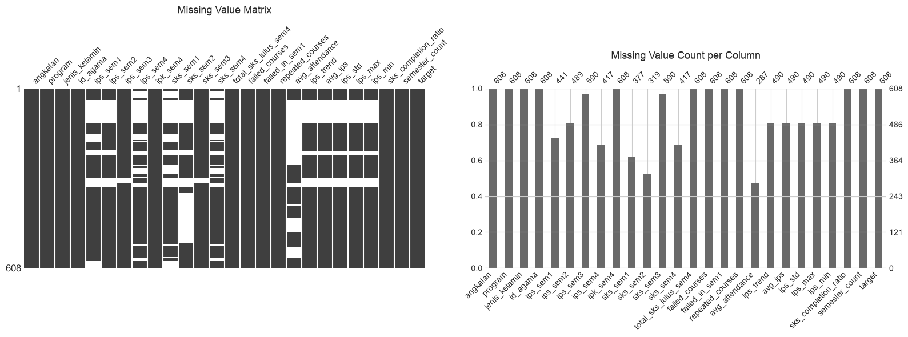
    


```python
# Missing by angkatan (is it concentrated in old cohorts?)
missing_by_angkatan = df_eda.groupby('angkatan').apply(
    lambda g: g[ips_cols].isnull().sum(axis=1).mean()
)
print('Rata-rata missing IPS per mahasiswa, by angkatan:')
missing_by_angkatan
```

    Rata-rata missing IPS per mahasiswa, by angkatan:


    angkatan
    2015   1.9914
    2016   0.8889
    2017   0.8750
    2018   1.8478
    2019   0.8519
    2020   0.6250
    2021   0.5000
    2022   0.0276
    2023   0.2600
    dtype: float64


```python
# Missing by semester_count (how many semesters the student has)
missing_by_sem = df_eda.groupby('semester_count').apply(
    lambda g: g[ips_cols].isnull().sum(axis=1).mean()
)
print('Rata-rata missing IPS per mahasiswa, by semester_count:')
missing_by_sem
```

    Rata-rata missing IPS per mahasiswa, by semester_count:


    semester_count
    3    2.1675
    4    0.1186
    5    0.0000
    6    0.0000
    7    1.5278
    8    1.4545
    9    0.0000
    12   3.0000
    dtype: float64


## 3. Target Variable


```python
fig, axes = plt.subplots(1, 3, figsize=(16, 5))

target_counts = df['target'].value_counts()
axes[0].bar(['Tidak Tepat (0)', 'Tepat Waktu (1)'], target_counts.values, color=['#E74C3C', '#2ECC71'])
axes[0].set_title(f'Target Distribution (n={len(df)})', fontsize=13)
for i, v in enumerate(target_counts.values):
    axes[0].text(i, v + 5, f'{v}\n({v/len(df)*100:.1f}%)', ha='center', fontsize=11)

ct = pd.crosstab(df['program'], df['target'], margins=True)
ct_pct = pd.crosstab(df['program'], df['target'], normalize='index') * 100
ct_pct.plot(kind='bar', ax=axes[1], color=['#E74C3C', '#2ECC71'])
axes[1].set_title('Target Distribution by Program', fontsize=13)
axes[1].set_ylabel('%')
axes[1].legend(['Tidak Tepat', 'Tepat Waktu'])

ct_angkatan = pd.crosstab(df['angkatan'], df['target'])
ct_angkatan.plot(kind='bar', stacked=True, ax=axes[2], color=['#E74C3C', '#2ECC71'])
axes[2].set_title('Target Distribution by Angkatan', fontsize=13)
axes[2].legend(['Tidak Tepat', 'Tepat Waktu'])

plt.tight_layout()
plt.show()
```


    
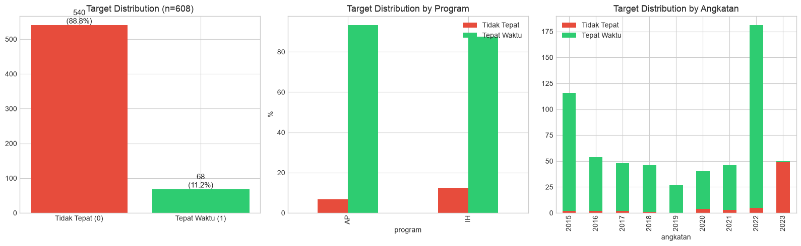
    


```python
print('Crosstab: program x target')
print(ct)
print('\nPercentages by program:')
print(ct_pct.round(1))
```

    Crosstab: program x target
    target    0    1  All
    program              
    AP       10  137  147
    IH       58  403  461
    All      68  540  608
    
    Percentages by program:
    target        0       1
    program                
    AP       6.8000 93.2000
    IH      12.6000 87.4000


## 4. Categorical Features vs Target


```python
fig, axes = plt.subplots(1, 3, figsize=(16, 5))

for ax, col in zip(axes, ['program', 'jenis_kelamin', 'id_agama']):
    ct = pd.crosstab(df[col], df['target'], normalize='index') * 100
    ct.plot(kind='bar', ax=ax, color=['#E74C3C', '#2ECC71'])
    ax.set_title(f'{col} vs Target', fontsize=12)
    ax.set_ylabel('%')
    ax.set_xlabel(col)
    ax.legend(['Tidak Tepat', 'Tepat Waktu'])

plt.tight_layout()
plt.show()
```


    
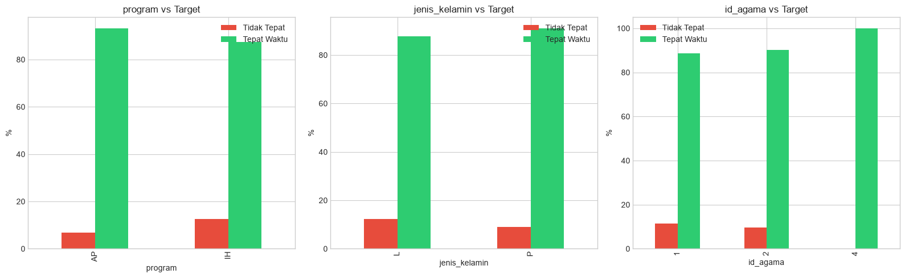
    


## 5. IPS Features Distribution


```python
fig, axes = plt.subplots(2, 2, figsize=(14, 10))
axes = axes.flatten()

for i, col in enumerate(ips_cols):
    # All values
    data = df[col].dropna()
    axes[i].hist(data, bins=30, alpha=0.7, color='#3498DB', edgecolor='white')
    axes[i].axvline(data.median(), color='#E74C3C', linestyle='--', label=f'Median={data.median():.2f}')
    axes[i].axvline(data.mean(), color='#F39C12', linestyle='--', label=f'Mean={data.mean():.2f}')
    axes[i].set_title(f'{col} (n={len(data)}, missing={df[col].isnull().sum()})', fontsize=12)
    axes[i].legend(fontsize=9)

plt.suptitle('IPS Distribution per Semester', fontsize=14, y=1.02)
plt.tight_layout()
plt.show()
```


    
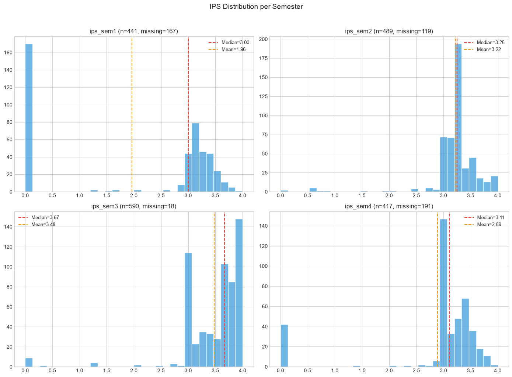
    


```python
# IPS by program (boxplot)
fig, axes = plt.subplots(2, 2, figsize=(14, 10))
axes = axes.flatten()

for i, col in enumerate(ips_cols):
    df.boxplot(column=col, by='program', ax=axes[i])
    axes[i].set_title(f'{col} by Program', fontsize=12)
    axes[i].set_xlabel('Program')

plt.suptitle('IPS Boxplot by Program', fontsize=14, y=1.02)
plt.tight_layout()
plt.show()
```


    
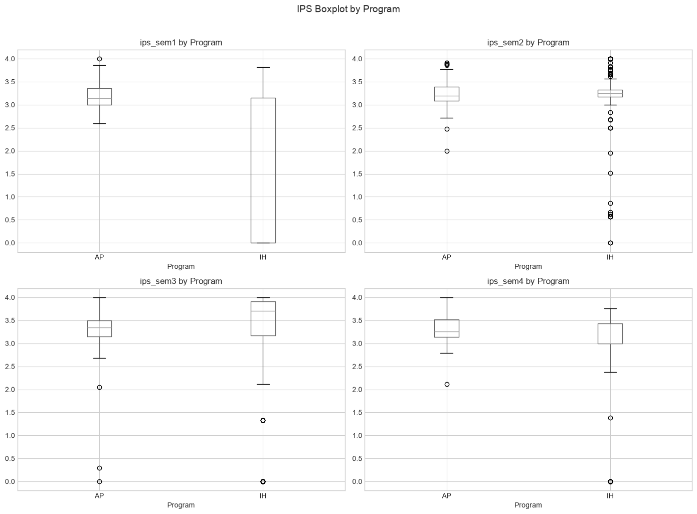
    


```python
# IPS vs Target
fig, axes = plt.subplots(2, 2, figsize=(14, 10))
axes = axes.flatten()

for i, col in enumerate(ips_cols):
    for target_val, color, label in [(0, '#E74C3C', 'Tidak Tepat'), (1, '#2ECC71', 'Tepat Waktu')]:
        data = df[df['target'] == target_val][col].dropna()
        axes[i].hist(data, bins=25, alpha=0.5, color=color, label=label)
    axes[i].set_title(f'{col} by Target', fontsize=12)
    axes[i].legend()

plt.suptitle('IPS Distribution vs Target', fontsize=14, y=1.02)
plt.tight_layout()
plt.show()
```


    
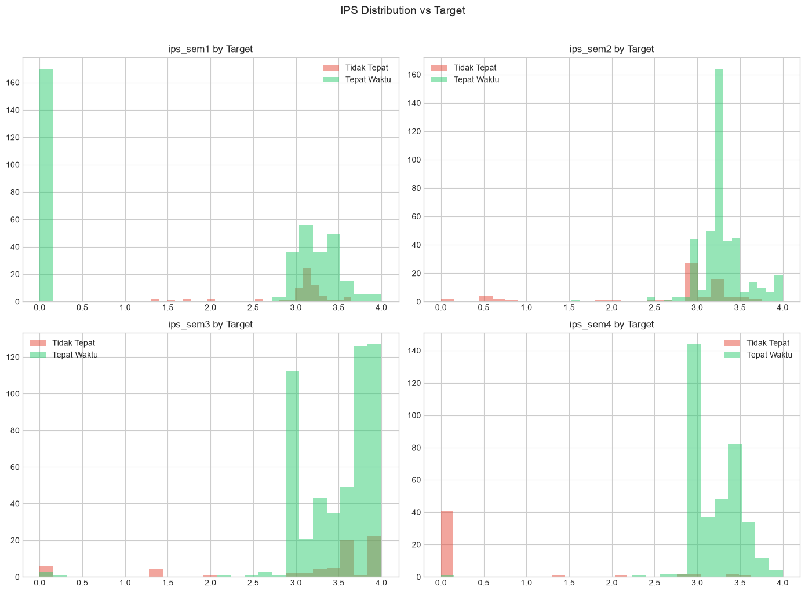
    


## 6. SKS Features


```python
fig, axes = plt.subplots(2, 2, figsize=(14, 10))
axes = axes.flatten()

for i, col in enumerate(sks_cols):
    data = df[col].dropna()
    axes[i].hist(data, bins=25, alpha=0.7, color='#9B59B6', edgecolor='white')
    axes[i].set_title(f'{col} (n={len(data)}, missing={df[col].isnull().sum()})', fontsize=12)

plt.suptitle('SKS Distribution per Semester', fontsize=14, y=1.02)
plt.tight_layout()
plt.show()
```


    
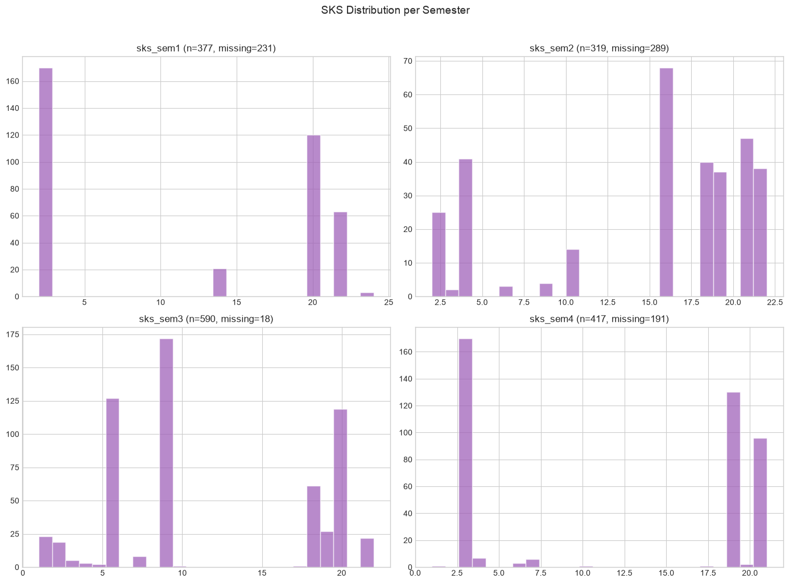
    


## 7. Grade Features


```python
fig, axes = plt.subplots(1, 3, figsize=(16, 5))

for ax, col in zip(axes, grade_cols):
    for target_val, color, label in [(0, '#E74C3C', 'Tidak Tepat'), (1, '#2ECC71', 'Tepat Waktu')]:
        data = df[df['target'] == target_val][col]
        ax.hist(data, bins=15, alpha=0.5, color=color, label=label)
    ax.set_title(f'{col} by Target', fontsize=12)
    ax.set_xlabel(col)
    ax.legend()

plt.suptitle('Grade Features vs Target', fontsize=14, y=1.02)
plt.tight_layout()
plt.show()
```


    
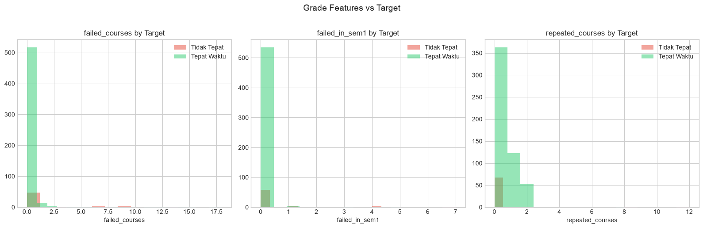
    


```python
# Summary stats for grade features by target
df.groupby('target')[grade_cols].describe().round(2)
```


<div>
<style scoped>
    .dataframe tbody tr th:only-of-type {
        vertical-align: middle;
    }

    .dataframe tbody tr th {
        vertical-align: top;
    }

    .dataframe thead tr th {
        text-align: left;
    }

    .dataframe thead tr:last-of-type th {
        text-align: right;
    }
</style>
<table border="1" class="dataframe">
  <thead>
    <tr>
      <th></th>
      <th colspan="8" halign="left">failed_courses</th>
      <th colspan="8" halign="left">failed_in_sem1</th>
      <th colspan="8" halign="left">repeated_courses</th>
    </tr>
    <tr>
      <th></th>
      <th>count</th>
      <th>mean</th>
      <th>std</th>
      <th>min</th>
      <th>25%</th>
      <th>50%</th>
      <th>75%</th>
      <th>max</th>
      <th>count</th>
      <th>mean</th>
      <th>std</th>
      <th>min</th>
      <th>25%</th>
      <th>50%</th>
      <th>75%</th>
      <th>max</th>
      <th>count</th>
      <th>mean</th>
      <th>std</th>
      <th>min</th>
      <th>25%</th>
      <th>50%</th>
      <th>75%</th>
      <th>max</th>
    </tr>
    <tr>
      <th>target</th>
      <th></th>
      <th></th>
      <th></th>
      <th></th>
      <th></th>
      <th></th>
      <th></th>
      <th></th>
      <th></th>
      <th></th>
      <th></th>
      <th></th>
      <th></th>
      <th></th>
      <th></th>
      <th></th>
      <th></th>
      <th></th>
      <th></th>
      <th></th>
      <th></th>
      <th></th>
      <th></th>
      <th></th>
    </tr>
  </thead>
  <tbody>
    <tr>
      <th>0</th>
      <td>68.0000</td>
      <td>3.0000</td>
      <td>5.0500</td>
      <td>0.0000</td>
      <td>0.0000</td>
      <td>0.0000</td>
      <td>5.2500</td>
      <td>18.0000</td>
      <td>68.0000</td>
      <td>0.4400</td>
      <td>1.2000</td>
      <td>0.0000</td>
      <td>0.0000</td>
      <td>0.0000</td>
      <td>0.0000</td>
      <td>5.0000</td>
      <td>68.0000</td>
      <td>0.1200</td>
      <td>0.9700</td>
      <td>0.0000</td>
      <td>0.0000</td>
      <td>0.0000</td>
      <td>0.0000</td>
      <td>8.0000</td>
    </tr>
    <tr>
      <th>1</th>
      <td>540.0000</td>
      <td>0.0900</td>
      <td>0.7300</td>
      <td>0.0000</td>
      <td>0.0000</td>
      <td>0.0000</td>
      <td>0.0000</td>
      <td>14.0000</td>
      <td>540.0000</td>
      <td>0.0200</td>
      <td>0.3100</td>
      <td>0.0000</td>
      <td>0.0000</td>
      <td>0.0000</td>
      <td>0.0000</td>
      <td>7.0000</td>
      <td>540.0000</td>
      <td>0.4600</td>
      <td>0.8900</td>
      <td>0.0000</td>
      <td>0.0000</td>
      <td>0.0000</td>
      <td>1.0000</td>
      <td>12.0000</td>
    </tr>
  </tbody>
</table>
</div>


## 8. Derived Features


```python
derived_subset = [c for c in derived_cols if c != 'avg_attendance']

fig, axes = plt.subplots(2, 4, figsize=(18, 10))
axes = axes.flatten()

for i, col in enumerate(derived_subset):
    for target_val, color, label in [(0, '#E74C3C', 'Tidak Tepat'), (1, '#2ECC71', 'Tepat Waktu')]:
        data = df[df['target'] == target_val][col].dropna()
        axes[i].hist(data, bins=20, alpha=0.5, color=color, label=label)
    axes[i].set_title(f'{col} by Target', fontsize=11)
    axes[i].legend()

# Hide unused subplots
for j in range(len(derived_subset), len(axes)):
    axes[j].set_visible(False)

plt.suptitle('Derived Features vs Target', fontsize=14, y=1.02)
plt.tight_layout()
plt.show()
```


    
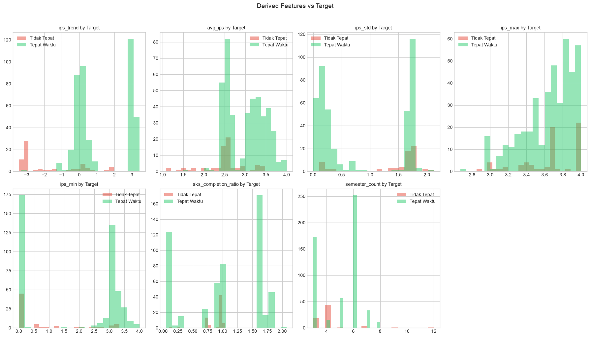
    


```python
# Summary stats for derived features by target
df.groupby('target')[derived_subset].describe().round(3)
```


<div>
<style scoped>
    .dataframe tbody tr th:only-of-type {
        vertical-align: middle;
    }

    .dataframe tbody tr th {
        vertical-align: top;
    }

    .dataframe thead tr th {
        text-align: left;
    }

    .dataframe thead tr:last-of-type th {
        text-align: right;
    }
</style>
<table border="1" class="dataframe">
  <thead>
    <tr>
      <th></th>
      <th colspan="8" halign="left">ips_trend</th>
      <th colspan="8" halign="left">avg_ips</th>
      <th colspan="8" halign="left">ips_std</th>
      <th colspan="8" halign="left">ips_max</th>
      <th colspan="8" halign="left">ips_min</th>
      <th colspan="8" halign="left">sks_completion_ratio</th>
      <th colspan="8" halign="left">semester_count</th>
    </tr>
    <tr>
      <th></th>
      <th>count</th>
      <th>mean</th>
      <th>std</th>
      <th>min</th>
      <th>25%</th>
      <th>50%</th>
      <th>75%</th>
      <th>max</th>
      <th>count</th>
      <th>mean</th>
      <th>std</th>
      <th>min</th>
      <th>25%</th>
      <th>50%</th>
      <th>75%</th>
      <th>max</th>
      <th>count</th>
      <th>mean</th>
      <th>std</th>
      <th>min</th>
      <th>25%</th>
      <th>50%</th>
      <th>75%</th>
      <th>max</th>
      <th>count</th>
      <th>mean</th>
      <th>std</th>
      <th>min</th>
      <th>25%</th>
      <th>50%</th>
      <th>75%</th>
      <th>max</th>
      <th>count</th>
      <th>mean</th>
      <th>std</th>
      <th>min</th>
      <th>25%</th>
      <th>50%</th>
      <th>75%</th>
      <th>max</th>
      <th>count</th>
      <th>mean</th>
      <th>std</th>
      <th>min</th>
      <th>25%</th>
      <th>50%</th>
      <th>75%</th>
      <th>max</th>
      <th>count</th>
      <th>mean</th>
      <th>std</th>
      <th>min</th>
      <th>25%</th>
      <th>50%</th>
      <th>75%</th>
      <th>max</th>
    </tr>
    <tr>
      <th>target</th>
      <th></th>
      <th></th>
      <th></th>
      <th></th>
      <th></th>
      <th></th>
      <th></th>
      <th></th>
      <th></th>
      <th></th>
      <th></th>
      <th></th>
      <th></th>
      <th></th>
      <th></th>
      <th></th>
      <th></th>
      <th></th>
      <th></th>
      <th></th>
      <th></th>
      <th></th>
      <th></th>
      <th></th>
      <th></th>
      <th></th>
      <th></th>
      <th></th>
      <th></th>
      <th></th>
      <th></th>
      <th></th>
      <th></th>
      <th></th>
      <th></th>
      <th></th>
      <th></th>
      <th></th>
      <th></th>
      <th></th>
      <th></th>
      <th></th>
      <th></th>
      <th></th>
      <th></th>
      <th></th>
      <th></th>
      <th></th>
      <th></th>
      <th></th>
      <th></th>
      <th></th>
      <th></th>
      <th></th>
      <th></th>
      <th></th>
    </tr>
  </thead>
  <tbody>
    <tr>
      <th>0</th>
      <td>67.0000</td>
      <td>-1.8570</td>
      <td>1.7310</td>
      <td>-3.4500</td>
      <td>-3.1000</td>
      <td>-3.0000</td>
      <td>-0.1100</td>
      <td>1.9700</td>
      <td>67.0000</td>
      <td>2.4840</td>
      <td>0.4940</td>
      <td>1.0820</td>
      <td>2.4180</td>
      <td>2.5250</td>
      <td>2.5650</td>
      <td>3.4830</td>
      <td>67.0000</td>
      <td>1.4030</td>
      <td>0.5900</td>
      <td>0.1050</td>
      <td>1.3980</td>
      <td>1.6630</td>
      <td>1.7480</td>
      <td>2.1210</td>
      <td>67.0000</td>
      <td>3.6520</td>
      <td>0.3230</td>
      <td>2.8500</td>
      <td>3.4550</td>
      <td>3.6700</td>
      <td>4.0000</td>
      <td>4.0000</td>
      <td>67.0000</td>
      <td>0.6590</td>
      <td>1.1390</td>
      <td>0.0000</td>
      <td>0.0000</td>
      <td>0.0000</td>
      <td>0.6450</td>
      <td>3.3300</td>
      <td>68.0000</td>
      <td>0.8990</td>
      <td>0.1620</td>
      <td>0.1000</td>
      <td>0.7880</td>
      <td>0.9750</td>
      <td>0.9750</td>
      <td>1.0380</td>
      <td>68.0000</td>
      <td>4.0740</td>
      <td>1.4180</td>
      <td>3.0000</td>
      <td>3.0000</td>
      <td>4.0000</td>
      <td>4.0000</td>
      <td>12.0000</td>
    </tr>
    <tr>
      <th>1</th>
      <td>423.0000</td>
      <td>1.3000</td>
      <td>1.5440</td>
      <td>-3.3300</td>
      <td>0.0100</td>
      <td>0.3800</td>
      <td>3.0000</td>
      <td>3.4300</td>
      <td>423.0000</td>
      <td>3.0120</td>
      <td>0.4590</td>
      <td>1.5000</td>
      <td>2.5280</td>
      <td>3.0620</td>
      <td>3.3980</td>
      <td>4.0000</td>
      <td>423.0000</td>
      <td>0.8330</td>
      <td>0.7570</td>
      <td>0.0000</td>
      <td>0.1590</td>
      <td>0.3210</td>
      <td>1.7110</td>
      <td>2.1210</td>
      <td>423.0000</td>
      <td>3.6520</td>
      <td>0.2780</td>
      <td>2.6700</td>
      <td>3.4700</td>
      <td>3.7000</td>
      <td>3.8600</td>
      <td>4.0000</td>
      <td>423.0000</td>
      <td>1.8520</td>
      <td>1.5710</td>
      <td>0.0000</td>
      <td>0.0000</td>
      <td>3.0000</td>
      <td>3.1400</td>
      <td>4.0000</td>
      <td>540.0000</td>
      <td>1.0460</td>
      <td>0.6540</td>
      <td>0.0500</td>
      <td>0.2620</td>
      <td>1.0250</td>
      <td>1.6620</td>
      <td>2.0750</td>
      <td>540.0000</td>
      <td>4.9810</td>
      <td>1.4860</td>
      <td>3.0000</td>
      <td>3.0000</td>
      <td>6.0000</td>
      <td>6.0000</td>
      <td>8.0000</td>
    </tr>
  </tbody>
</table>
</div>


## 9. Attendance Analysis


```python
att_data = df['avg_attendance'].dropna()
print(f'avg_attendance: {len(att_data)} non-null, {df["avg_attendance"].isnull().sum()} missing ({df["avg_attendance"].isnull().mean()*100:.1f}%)')
print(f'Stats: mean={att_data.mean():.2f}, median={att_data.median():.2f}, std={att_data.std():.2f}')

fig, axes = plt.subplots(1, 3, figsize=(16, 5))

# Distribution
axes[0].hist(att_data, bins=20, alpha=0.7, color='#3498DB', edgecolor='white')
axes[0].axvline(att_data.median(), color='#E74C3C', linestyle='--', label=f'Median={att_data.median():.1f}')
axes[0].set_title('avg_attendance Distribution', fontsize=12)
axes[0].set_xlabel('%')
axes[0].legend()

# By target
for target_val, color, label in [(0, '#E74C3C', 'Tidak Tepat'), (1, '#2ECC71', 'Tepat Waktu')]:
    data = df[df['target'] == target_val]['avg_attendance'].dropna()
    axes[1].hist(data, bins=20, alpha=0.5, color=color, label=label)
axes[1].set_title('avg_attendance by Target', fontsize=12)
axes[1].set_xlabel('%')
axes[1].legend()

# Missing target rate by has_attendance
df['has_attendance'] = df['avg_attendance'].notna().astype(int)
ct_att = pd.crosstab(df['has_attendance'], df['target'], normalize='index') * 100
ct_att.plot(kind='bar', ax=axes[2], color=['#E74C3C', '#2ECC71'])
axes[2].set_title('Target Rate: Has vs No Attendance Data', fontsize=12)
axes[2].set_xlabel('has_attendance (0=missing, 1=present)')
axes[2].set_ylabel('%')
axes[2].legend(['Tidak Tepat', 'Tepat Waktu'])
axes[2].set_xticklabels(['Missing', 'Present'], rotation=0)

plt.tight_layout()
plt.show()

print('\nTarget rate by has_attendance:')
print(ct_att.round(1))
```

    avg_attendance: 287 non-null, 321 missing (52.8%)
    Stats: mean=82.35, median=89.80, std=19.31


    
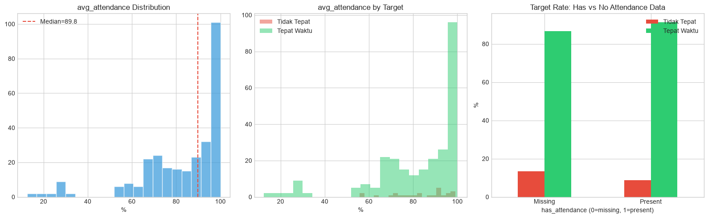
    


    
    Target rate by has_attendance:
    target               0       1
    has_attendance                
    0              13.4000 86.6000
    1               8.7000 91.3000


## 10. Correlation Analysis


```python
# Encode categoricals for correlation matrix
df_corr = df.copy()
df_corr['program_num'] = df_corr['program'].map({'AP': 0, 'IH': 1})
df_corr['gender_num'] = df_corr['jenis_kelamin'].map({'L': 0, 'P': 1})

corr_cols = (
    ['angkatan', 'program_num', 'gender_num', 'id_agama'] +
    ips_cols + sks_cols + ['ipk_sem4', 'total_sks_lulus_sem4'] +
    grade_cols + derived_cols + ['target']
)

corr_matrix = df_corr[corr_cols].corr()

fig, ax = plt.subplots(figsize=(18, 14))
mask = np.triu(np.ones_like(corr_matrix, dtype=bool), k=1)
sns.heatmap(corr_matrix, mask=mask, annot=True, fmt='.2f', cmap='RdBu_r',
            center=0, square=True, linewidths=0.5, cbar_kws={'shrink': 0.6},
            annot_kws={'size': 8})
ax.set_title('Feature Correlation Matrix', fontsize=16, pad=20)
plt.tight_layout()
plt.show()
```


    
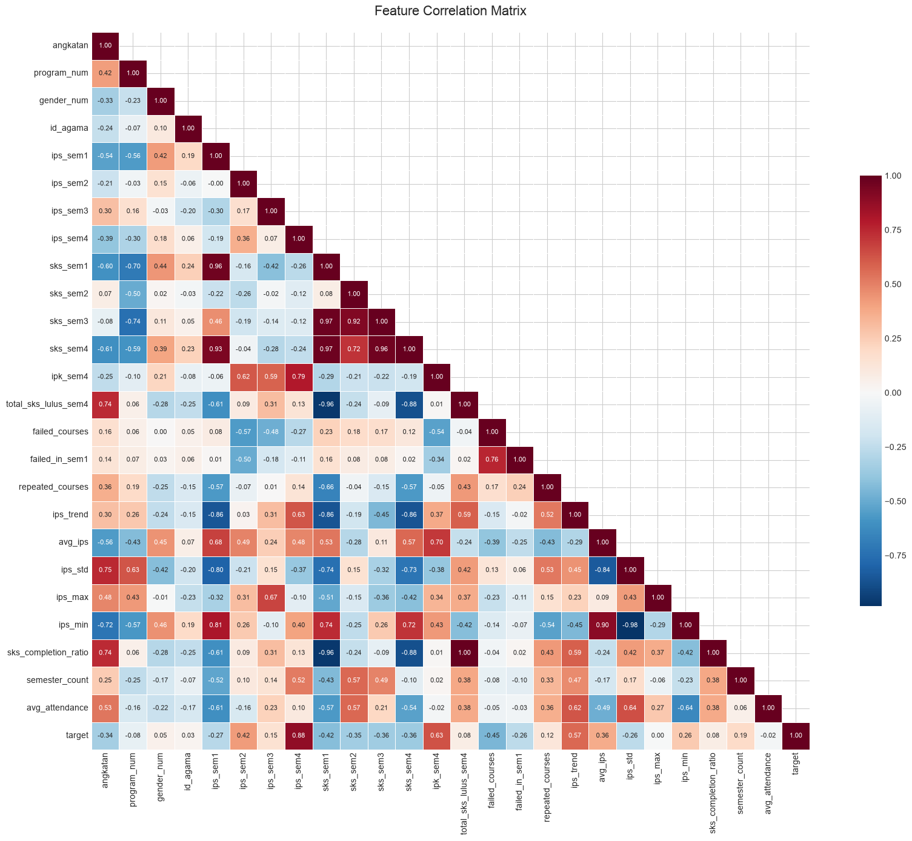
    


```python
# Top correlations with target
target_corr = corr_matrix['target'].drop('target').sort_values(ascending=False)
print('Top correlations with target:')
print(target_corr)

fig, ax = plt.subplots(figsize=(10, 8))
colors = ['#2ECC71' if v > 0 else '#E74C3C' for v in target_corr.values]
target_corr.plot(kind='barh', ax=ax, color=colors)
ax.set_title('Feature Correlation with Target', fontsize=14)
ax.set_xlabel('Pearson Correlation')
ax.axvline(0, color='black', linewidth=0.5)
plt.tight_layout()
plt.show()
```

    Top correlations with target:
    ips_sem4                0.8772
    ipk_sem4                0.6333
    ips_trend               0.5691
    ips_sem2                0.4206
    avg_ips                 0.3648
    ips_min                 0.2609
    semester_count          0.1903
    ips_sem3                0.1542
    repeated_courses        0.1186
    sks_completion_ratio    0.0752
    total_sks_lulus_sem4    0.0752
    gender_num              0.0497
    id_agama                0.0314
    ips_max                 0.0001
    avg_attendance         -0.0162
    program_num            -0.0785
    ips_std                -0.2573
    failed_in_sem1         -0.2583
    ips_sem1               -0.2720
    angkatan               -0.3386
    sks_sem2               -0.3457
    sks_sem3               -0.3550
    sks_sem4               -0.3597
    sks_sem1               -0.4212
    failed_courses         -0.4515
    Name: target, dtype: float64


    
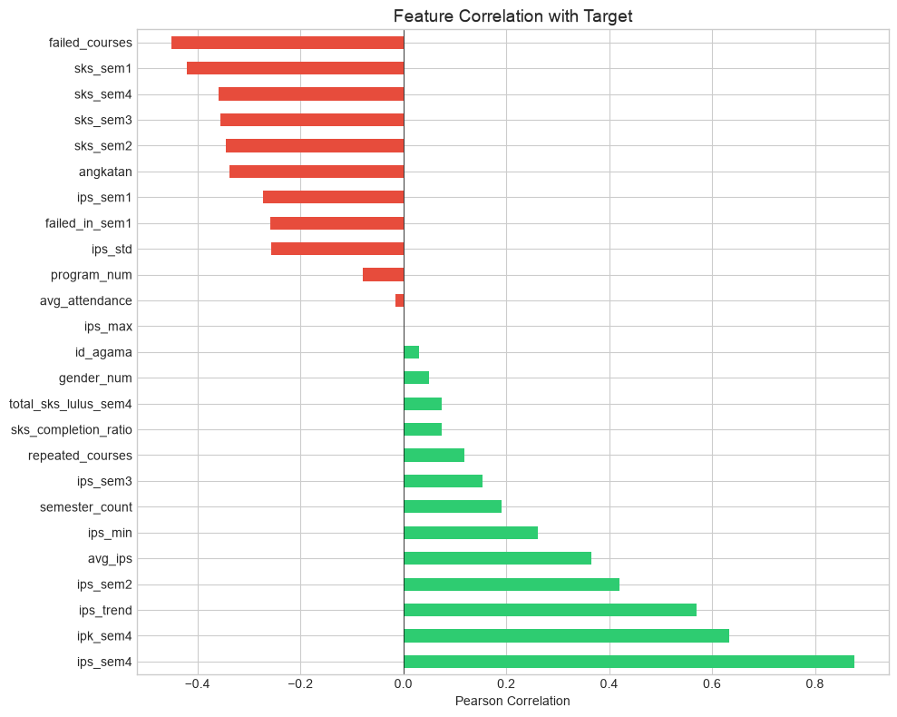
    


```python
# IPS inter-correlations
fig, ax = plt.subplots(figsize=(10, 8))
ips_corr = df_corr[ips_cols + ['ipk_sem4', 'avg_ips', 'ips_max', 'ips_min']].corr()
sns.heatmap(ips_corr, annot=True, fmt='.2f', cmap='RdBu_r', center=0, ax=ax,
            square=True, linewidths=0.5, annot_kws={'size': 9})
ax.set_title('IPS Feature Inter-Correlations', fontsize=14, pad=15)
plt.tight_layout()
plt.show()
```


    
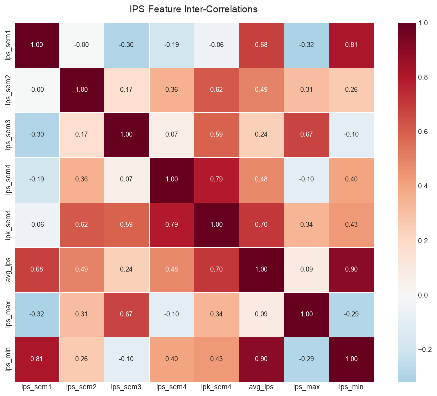
    


## 11. Semester Count & Target Timing


```python
fig, axes = plt.subplots(1, 2, figsize=(14, 5))

sem_ct = pd.crosstab(df['semester_count'], df['target'])
sem_ct.plot(kind='bar', stacked=True, ax=axes[0], color=['#E74C3C', '#2ECC71'])
axes[0].set_title('semester_count vs Target', fontsize=13)
axes[0].set_xlabel('Semester Count')
axes[0].legend(['Tidak Tepat', 'Tepat Waktu'])

sem_pct = pd.crosstab(df['semester_count'], df['target'], normalize='index') * 100
sem_pct[1].plot(kind='bar', ax=axes[1], color='#2ECC71')
axes[1].set_title('% Tepat Waktu by Semester Count', fontsize=13)
axes[1].set_ylabel('% Tepat Waktu')
axes[1].set_xlabel('Semester Count')
axes[1].axhline(88.8, color='#E74C3C', linestyle='--', label='Overall (88.8%)')
axes[1].legend()

plt.tight_layout()
plt.show()
```


    
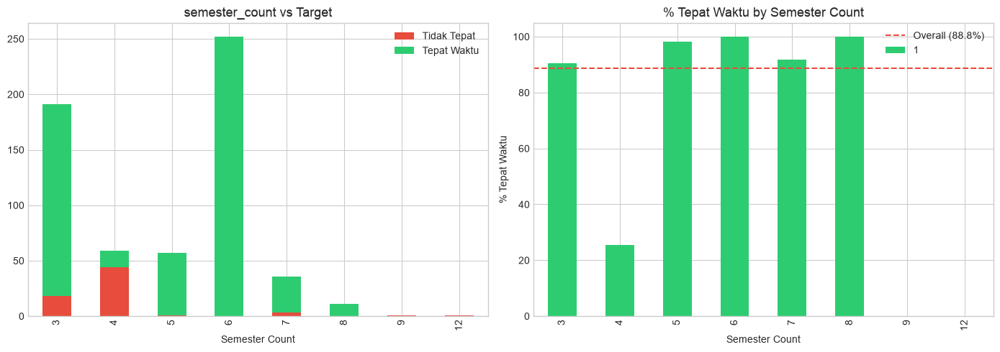
    


## 12. Outlier Check (IPS)


```python
# Check for extreme IPS values
fig, axes = plt.subplots(1, 2, figsize=(14, 5))

df[ips_cols].boxplot(ax=axes[0])
axes[0].set_title('IPS Boxplot (outlier detection)', fontsize=13)
axes[0].set_ylabel('IPS')

# IPS = 0.0 cases
zero_ips = df[(df[ips_cols] == 0.0).any(axis=1)]
print(f'Students with at least one IPS = 0.0: {len(zero_ips)}')
print(f'  Tepat waktu: {(zero_ips["target"]==1).sum()}')
print(f'  Tidak tepat: {(zero_ips["target"]==0).sum()}')

# IPS = 4.0 cases
perfect_ips = df[(df[ips_cols] == 4.0).any(axis=1)]
print(f'Students with at least one IPS = 4.0: {len(perfect_ips)}')

axes[1].scatter(df['angkatan'], df['avg_ips'], alpha=0.5, c=df['target'].map({0: '#E74C3C', 1: '#2ECC71'}))
axes[1].set_title('avg_ips by Angkatan (colored by target)', fontsize=13)
axes[1].set_xlabel('Angkatan')
axes[1].set_ylabel('avg_ips')

plt.tight_layout()
plt.show()
```

    Students with at least one IPS = 0.0: 219
      Tepat waktu: 174
      Tidak tepat: 45
    Students with at least one IPS = 4.0: 118


    
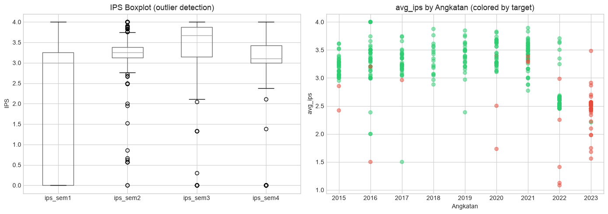
    


## 13. Pairplot (Key Features)

Visualisasi hubungan pairwise untuk fitur-fitur paling penting.


```python
key_features = ['ips_sem1', 'ips_sem2', 'avg_ips', 'ipk_sem4', 
                'failed_courses', 'ips_trend', 'target']
df_pair = df_eda[key_features].dropna()
sns.pairplot(df_pair, hue='target', diag_kind='kde', 
             palette={0: '#E74C3C', 1: '#2ECC71'}, height=2)
plt.suptitle('Pairplot of Key Features', y=1.02, fontsize=14)
plt.show()
```


    
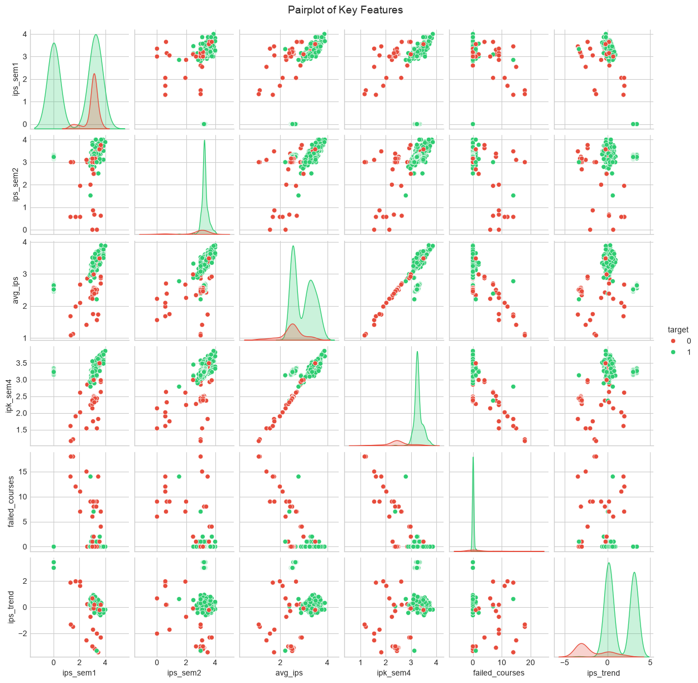
    


---
## Summary & Interpretasi

Setelah menjalankan notebook ini, jawab pertanyaan berikut:

### A. Missing Values
1. Fitur mana yang missing >30%? Apakah pola missing-nya sistematik (by angkatan/semester)?
2. Apakah `avg_attendance` (52.8% missing) menunjukkan sinyal terhadap target? Kalau tidak → dropable.
3. Apakah ada baris yang missing di >5 kolom sekaligus? Perlu didrop?

### B. Distribusi
4. Apakah distribusi IPS per semester normal / skewed? Ada outlier ekstrem (0.0, 4.0)?
5. Bagaimana perbedaan distribusi IPS antara program AP vs IH?
6. Apakah ada fitur dengan near-zero variance?

### C. Target Separation
7. Fitur mana yang paling memisahkan kelas Tepat vs Tidak Tepat? (lihat histogram by target)
8. Apakah `failed_courses` dan `ips_sem1` jadi pemisah yang kuat?
9. Bagaimana `ips_trend` (improving vs declining) terkait target?

### D. Korelasi
10. Apa top 5 fitur paling berkorelasi dengan target?
11. Apakah ada multikolinearitas tinggi antar fitur IPS (r > 0.9)?
12. Fitur derived mana yang redundant dengan base features?

### E. Implikasi Preprocessing
13. Berdasarkan EDA, strategi imputasi apa yang paling masuk akal? Mean? Median? Per-group?
14. Fitur mana yang bisa didrop tanpa kehilangan sinyal?
15. Apakah perlu transformasi (log, sqrt) untuk fitur skewed?
