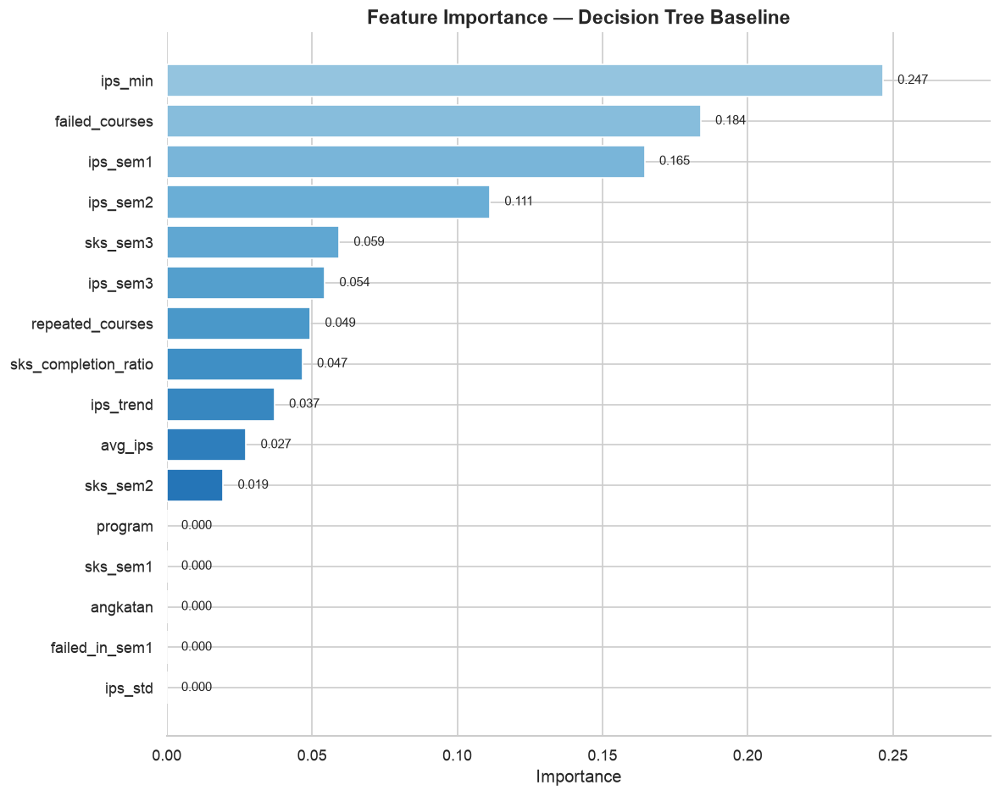
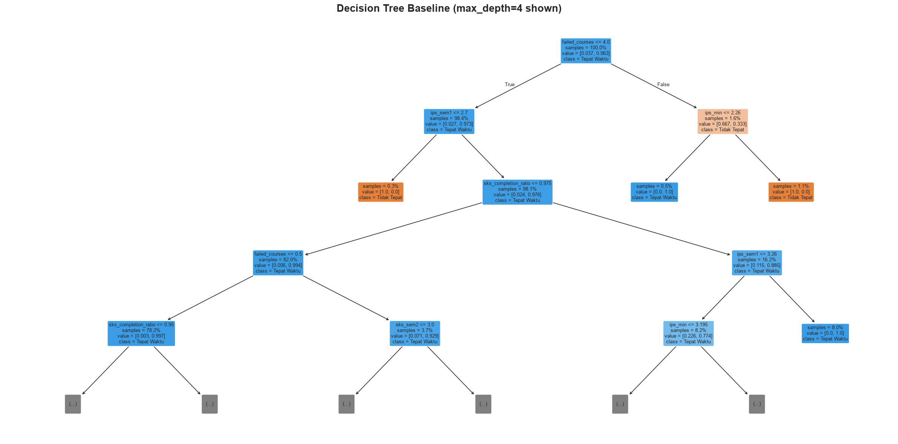

# 01 — Baseline Decision Tree: Prediksi Ketepatan Lulus Mahasiswa

Fase 4 CRISP-DM | Step 1: Baseline model dengan `DecisionTreeClassifier` default.

**Tujuan:**
1. Re-split dataset bersih secara temporal (angkatan ≤ 2021 → train, > 2021 → test)
2. Latih Decision Tree baseline (default hyperparameters)
3. Evaluasi performa: accuracy, precision, recall, F1, confusion matrix, cross-validation
4. Analisis feature importance

**Catatan:** Train hanya punya 14 sampel negatif (3.7%) → accuracy akan menyesatkan. Fokus pada **recall kelas 0**.


```python
import pandas as pd
import numpy as np
import matplotlib
import matplotlib.pyplot as plt
import seaborn as sns

from sklearn.tree import DecisionTreeClassifier, plot_tree, export_text
from sklearn.model_selection import StratifiedKFold, cross_val_score, cross_validate
from sklearn.metrics import (
    accuracy_score, precision_score, recall_score, f1_score,
    confusion_matrix, classification_report,
    roc_auc_score, roc_curve, precision_recall_curve,
    ConfusionMatrixDisplay
)

# Style
sns.set_theme(style='whitegrid')
plt.rcParams['figure.dpi'] = 120
plt.rcParams['savefig.dpi'] = 120
plt.rcParams['savefig.bbox'] = 'tight'

print("Library loaded successfully.")
print(f"  pandas      : {pd.__version__}")
print(f"  numpy       : {np.__version__}")
print(f"  sklearn     : imported")
```

    Library loaded successfully.
      pandas      : 3.0.3
      numpy       : 2.4.6
      sklearn     : imported


```python
# Load clean dataset
DATA_DIR = '../3-data-preparation'
df = pd.read_csv(f'{DATA_DIR}/dataset_clean.csv')

print(f"Shape         : {df.shape}")
print(f"Columns ({len(df.columns)}): {list(df.columns)}")
print(f"NULLs         : {df.isnull().sum().sum()}")
print(f"\nTarget distribution:")
print(df['target'].value_counts())
print(f"\nTarget rate   : {df['target'].mean()*100:.2f}% on-time")
```

    Shape         : (608, 17)
    Columns (17): ['angkatan', 'program', 'ips_sem1', 'ips_sem2', 'ips_sem3', 'sks_sem1', 'sks_sem2', 'sks_sem3', 'failed_courses', 'failed_in_sem1', 'repeated_courses', 'ips_trend', 'avg_ips', 'ips_std', 'ips_min', 'sks_completion_ratio', 'target']
    NULLs         : 0
    
    Target distribution:
    target
    1    540
    0     68
    Name: count, dtype: int64
    
    Target rate   : 88.82% on-time


```python
# Re-split: temporal (angkatan <= 2021 → train, > 2021 → test)
SPLIT_YEAR = 2021

train = df[df['angkatan'] <= SPLIT_YEAR].copy()
test  = df[df['angkatan'] >  SPLIT_YEAR].copy()

X_train = train.drop(columns=['target'])
y_train = train['target']
X_test  = test.drop(columns=['target'])
y_test  = test['target']

print(f"SPLIT YEAR: {SPLIT_YEAR}")
print(f"{'='*50}")
print(f"Train: {X_train.shape[0]} rows")
print(f"  Target: {dict(y_train.value_counts())}  |  {y_train.value_counts(normalize=True)[0]*100:.1f}% neg")
print(f"\nTest:  {X_test.shape[0]} rows")
print(f"  Target: {dict(y_test.value_counts())}  |  {y_test.value_counts(normalize=True)[0]*100:.1f}% neg")

# Angkatan distribution
print(f"\nTrain angkatan: {sorted(train['angkatan'].unique())}")
print(f"Test  angkatan: {sorted(test['angkatan'].unique())}")
```

    SPLIT YEAR: 2021
    ==================================================
    Train: 377 rows
      Target: {1: np.int64(363), 0: np.int64(14)}  |  3.7% neg
    
    Test:  231 rows
      Target: {1: np.int64(177), 0: np.int64(54)}  |  23.4% neg
    
    Train angkatan: [np.int64(2015), np.int64(2016), np.int64(2017), np.int64(2018), np.int64(2019), np.int64(2020), np.int64(2021)]
    Test  angkatan: [np.int64(2022), np.int64(2023)]


```python
# Class balance per angkatan (train only)
print("Train: class balance per angkatan")
print(f"{'Angkatan':<10} {'Total':<8} {'Tepat':<8} {'Tidak':<8} {'% Neg':<8}")
print('-' * 42)
for ang in sorted(train['angkatan'].unique()):
    sub = train[train['angkatan'] == ang]
    t1 = (sub['target'] == 1).sum()
    t0 = (sub['target'] == 0).sum()
    print(f"{ang:<10} {len(sub):<8} {t1:<8} {t0:<8} {t0/len(sub)*100:<8.1f}")
```

    Train: class balance per angkatan
    Angkatan   Total    Tepat    Tidak    % Neg   
    ------------------------------------------
    2015       116      114      2        1.7     
    2016       54       52       2        3.7     
    2017       48       46       2        4.2     
    2018       46       45       1        2.2     
    2019       27       27       0        0.0     
    2020       40       36       4        10.0    
    2021       46       43       3        6.5     


```python
# Baseline: DecisionTreeClassifier with default parameters
dt_baseline = DecisionTreeClassifier(random_state=42)
dt_baseline.fit(X_train, y_train)

print("Baseline DecisionTreeClassifier trained.")
print(f"\nDefault parameters:")
for k, v in dt_baseline.get_params().items():
    print(f"  {k}: {v}")
print(f"\nTree depth   : {dt_baseline.get_depth()}")
print(f"Tree leaves   : {dt_baseline.get_n_leaves()}")
print(f"Node count    : {dt_baseline.tree_.node_count}")
```

    Baseline DecisionTreeClassifier trained.
    
    Default parameters:
      ccp_alpha: 0.0
      class_weight: None
      criterion: gini
      max_depth: None
      max_features: None
      max_leaf_nodes: None
      min_impurity_decrease: 0.0
      min_samples_leaf: 1
      min_samples_split: 2
      min_weight_fraction_leaf: 0.0
      monotonic_cst: None
      random_state: 42
      splitter: best
    
    Tree depth   : 9
    Tree leaves   : 21
    Node count    : 41


```python
# Predict
y_pred_train = dt_baseline.predict(X_train)
y_pred_test  = dt_baseline.predict(X_test)

# Classification report
print("=" * 55)
print("CLASSIFICATION REPORT — TRAIN")
print("=" * 55)
print(classification_report(y_train, y_pred_train, target_names=['Tidak Tepat', 'Tepat Waktu']))

print("=" * 55)
print("CLASSIFICATION REPORT — TEST")
print("=" * 55)
print(classification_report(y_test, y_pred_test, target_names=['Tidak Tepat', 'Tepat Waktu']))

# Key metrics for class 0
print("\nKEY METRICS (Kelas 0 = Tidak Tepat)")
print('-' * 45)
for name, y_true, y_pred in [('Train', y_train, y_pred_train), ('Test', y_test, y_pred_test)]:
    acc  = accuracy_score(y_true, y_pred)
    prec = precision_score(y_true, y_pred, pos_label=0, zero_division=0)
    rec  = recall_score(y_true, y_pred, pos_label=0)
    f1   = f1_score(y_true, y_pred, pos_label=0)
    auc  = roc_auc_score(y_true, y_pred)
    print(f"{name:<8} | Acc={acc:.4f} | Prec(0)={prec:.4f} | Recall(0)={rec:.4f} | "
          f"F1(0)={f1:.4f} | AUC={auc:.4f}")
```

    =======================================================
    CLASSIFICATION REPORT — TRAIN
    =======================================================


                  precision    recall  f1-score   support
    
     Tidak Tepat       1.00      1.00      1.00        14
     Tepat Waktu       1.00      1.00      1.00       363
    
        accuracy                           1.00       377
       macro avg       1.00      1.00      1.00       377
    weighted avg       1.00      1.00      1.00       377
    
    =======================================================
    CLASSIFICATION REPORT — TEST
    =======================================================
                  precision    recall  f1-score   support
    
     Tidak Tepat       1.00      0.04      0.07        54
     Tepat Waktu       0.77      1.00      0.87       177
    
        accuracy                           0.77       231
       macro avg       0.89      0.52      0.47       231
    weighted avg       0.83      0.77      0.68       231
    
    
    KEY METRICS (Kelas 0 = Tidak Tepat)
    ---------------------------------------------
    Train    | Acc=1.0000 | Prec(0)=1.0000 | Recall(0)=1.0000 | F1(0)=1.0000 | AUC=1.0000
    Test     | Acc=0.7749 | Prec(0)=1.0000 | Recall(0)=0.0370 | F1(0)=0.0714 | AUC=0.5185


```python
# Confusion Matrix
fig, axes = plt.subplots(1, 2, figsize=(12, 5))

for ax, (name, y_true, y_pred) in zip(
    axes,
    [('Training Set', y_train, y_pred_train), ('Test Set', y_test, y_pred_test)]
):
    cm = confusion_matrix(y_true, y_pred)
    disp = ConfusionMatrixDisplay(confusion_matrix=cm, display_labels=['Tidak Tepat', 'Tepat Waktu'])
    disp.plot(ax=ax, cmap='Blues', colorbar=False, values_format='d')
    ax.set_title(f'Confusion Matrix — {name}')

plt.tight_layout()
plt.show()
```


    

    


```python
# Stratified 10-fold cross-validation
cv = StratifiedKFold(n_splits=10, shuffle=True, random_state=42)

cv_results = cross_validate(
    dt_baseline, X_train, y_train,
    cv=cv,
    scoring=['accuracy', 'precision', 'recall', 'f1', 'roc_auc'],
    return_train_score=True
)

print("=" * 55)
print("10-FOLD CROSS-VALIDATION (Train only)")
print("=" * 55)
for metric in ['accuracy', 'precision', 'recall', 'f1', 'roc_auc']:
    test_scores = cv_results[f'test_{metric}']
    train_scores = cv_results[f'train_{metric}']
    print(f"\n{metric.upper():<14}  Train: {train_scores.mean():.4f} ± {train_scores.std():.4f}")
    print(f"{'':<14}  Test:  {test_scores.mean():.4f} ± {test_scores.std():.4f}")

# Overfitting gap
print(f"\n{'─'*50}")
print(f"{'Metric':<14}  {'Train':<12} {'Test':<12} {'Gap':<12}")
print(f"{'─'*50}")
for metric in ['accuracy', 'recall', 'f1']:
    gap = cv_results[f'train_{metric}'].mean() - cv_results[f'test_{metric}'].mean()
    print(f"{metric:<14}  {cv_results[f'train_{metric}'].mean():<12.4f} "
          f"{cv_results[f'test_{metric}'].mean():<12.4f} {gap:<+12.4f}")
```

    =======================================================
    10-FOLD CROSS-VALIDATION (Train only)
    =======================================================
    
    ACCURACY        Train: 1.0000 ± 0.0000
                    Test:  0.9498 ± 0.0379
    
    PRECISION       Train: 1.0000 ± 0.0000
                    Test:  0.9752 ± 0.0194
    
    RECALL          Train: 1.0000 ± 0.0000
                    Test:  0.9723 ± 0.0278
    
    F1              Train: 1.0000 ± 0.0000
                    Test:  0.9736 ± 0.0203
    
    ROC_AUC         Train: 1.0000 ± 0.0000
                    Test:  0.6861 ± 0.2199
    
    ──────────────────────────────────────────────────
    Metric          Train        Test         Gap         
    ──────────────────────────────────────────────────
    accuracy        1.0000       0.9498       +0.0502     
    recall          1.0000       0.9723       +0.0277     
    f1              1.0000       0.9736       +0.0264     


```python
# Feature importance
importances = dt_baseline.feature_importances_
feat_imp = pd.DataFrame({
    'feature': X_train.columns,
    'importance': importances
}).sort_values('importance', ascending=False)

print("FEATURE IMPORTANCE (Decision Tree Baseline)")
print("=" * 45)
for i, row in feat_imp.iterrows():
    bar = '█' * int(row['importance'] * 50)
    print(f"  {row['feature']:<25} {row['importance']:.4f}  {bar}")

# Plot
fig, ax = plt.subplots(figsize=(10, 8))
colors = plt.cm.Blues(np.linspace(0.4, 0.9, len(feat_imp)))

# Sort ascending for horizontal bar chart
feat_plot = feat_imp.iloc[::-1]
bars = ax.barh(feat_plot['feature'], feat_plot['importance'], color=colors[::-1])

for bar, val in zip(bars, feat_plot['importance']):
    ax.text(bar.get_width() + 0.005, bar.get_y() + bar.get_height()/2,
            f'{val:.3f}', va='center', fontsize=9)

ax.set_xlabel('Importance', fontsize=12)
ax.set_title('Feature Importance — Decision Tree Baseline', fontsize=14, fontweight='bold')
ax.set_xlim(0, feat_imp['importance'].max() * 1.15)
sns.despine(left=True)
plt.tight_layout()
plt.show()
```

    FEATURE IMPORTANCE (Decision Tree Baseline)
    =============================================
      ips_min                   0.2466  ████████████
      failed_courses            0.1838  █████████
      ips_sem1                  0.1645  ████████
      ips_sem2                  0.1113  █████
      sks_sem3                  0.0593  ██
      ips_sem3                  0.0544  ██
      repeated_courses          0.0495  ██
      sks_completion_ratio      0.0467  ██
      ips_trend                 0.0371  █
      avg_ips                   0.0273  █
      sks_sem2                  0.0194  
      program                   0.0000  
      sks_sem1                  0.0000  
      angkatan                  0.0000  
      failed_in_sem1            0.0000  
      ips_std                   0.0000  


    

    


```python
# Detect features with zero importance
zero_imp = feat_imp[feat_imp['importance'] == 0]
if len(zero_imp) > 0:
    print(f"Features with ZERO importance ({len(zero_imp)}):")
    for _, row in zero_imp.iterrows():
        print(f"  - {row['feature']}")
else:
    print("All features have non-zero importance.")
```

    Features with ZERO importance (5):
      - program
      - sks_sem1
      - angkatan
      - failed_in_sem1
      - ips_std


```python
# Visualize the decision tree (limited depth for readability)
fig, ax = plt.subplots(figsize=(20, 10))
plot_tree(
    dt_baseline,
    feature_names=X_train.columns,
    class_names=['Tidak Tepat', 'Tepat Waktu'],
    filled=True, rounded=True,
    fontsize=8, max_depth=4,
    impurity=False, proportion=True,
    ax=ax
)
ax.set_title('Decision Tree Baseline (max_depth=4 shown)', fontsize=16, fontweight='bold')
plt.tight_layout()
plt.show()
print(f"Full tree depth: {dt_baseline.get_depth()}")
```


    

    


    Full tree depth: 9


```python
# Extract rules (text)
tree_rules = export_text(dt_baseline, feature_names=list(X_train.columns))

with open('rules_baseline.txt', 'w') as f:
    f.write(tree_rules)

# Show first 80 lines
lines = tree_rules.split('\n')
print(f"Total rules/lines: {len(lines)}")
print(f"\nFirst 80 lines:\n{'='*60}")
print('\n'.join(lines[:80]))
print(f"\n... ({len(lines) - 80} more lines)")
print(f"\nFull rules saved to: rules_baseline.txt")
```

    Total rules/lines: 62
    
    First 80 lines:
    ============================================================
    |--- failed_courses <= 4.00
    |   |--- ips_sem1 <= 2.70
    |   |   |--- class: 0
    |   |--- ips_sem1 >  2.70
    |   |   |--- sks_completion_ratio <= 0.97
    |   |   |   |--- failed_courses <= 0.50
    |   |   |   |   |--- sks_completion_ratio <= 0.95
    |   |   |   |   |   |--- class: 1
    |   |   |   |   |--- sks_completion_ratio >  0.95
    |   |   |   |   |   |--- ips_sem1 <= 3.04
    |   |   |   |   |   |   |--- ips_sem2 <= 3.07
    |   |   |   |   |   |   |   |--- class: 1
    |   |   |   |   |   |   |--- ips_sem2 >  3.07
    |   |   |   |   |   |   |   |--- class: 0
    |   |   |   |   |   |--- ips_sem1 >  3.04
    |   |   |   |   |   |   |--- class: 1
    |   |   |   |--- failed_courses >  0.50
    |   |   |   |   |--- sks_sem2 <= 3.00
    |   |   |   |   |   |--- repeated_courses <= 0.50
    |   |   |   |   |   |   |--- class: 0
    |   |   |   |   |   |--- repeated_courses >  0.50
    |   |   |   |   |   |   |--- class: 1
    |   |   |   |   |--- sks_sem2 >  3.00
    |   |   |   |   |   |--- class: 1
    |   |   |--- sks_completion_ratio >  0.97
    |   |   |   |--- ips_sem1 <= 3.26
    |   |   |   |   |--- ips_min <= 3.20
    |   |   |   |   |   |--- ips_sem1 <= 3.12
    |   |   |   |   |   |   |--- avg_ips <= 3.03
    |   |   |   |   |   |   |   |--- sks_sem3 <= 21.00
    |   |   |   |   |   |   |   |   |--- class: 0
    |   |   |   |   |   |   |   |--- sks_sem3 >  21.00
    |   |   |   |   |   |   |   |   |--- class: 1
    |   |   |   |   |   |   |--- avg_ips >  3.03
    |   |   |   |   |   |   |   |--- ips_sem3 <= 3.48
    |   |   |   |   |   |   |   |   |--- class: 1
    |   |   |   |   |   |   |   |--- ips_sem3 >  3.48
    |   |   |   |   |   |   |   |   |--- ips_sem2 <= 3.17
    |   |   |   |   |   |   |   |   |   |--- class: 0
    |   |   |   |   |   |   |   |   |--- ips_sem2 >  3.17
    |   |   |   |   |   |   |   |   |   |--- class: 1
    |   |   |   |   |   |--- ips_sem1 >  3.12
    |   |   |   |   |   |   |--- ips_sem3 <= 3.08
    |   |   |   |   |   |   |   |--- class: 0
    |   |   |   |   |   |   |--- ips_sem3 >  3.08
    |   |   |   |   |   |   |   |--- sks_sem3 <= 21.00
    |   |   |   |   |   |   |   |   |--- class: 1
    |   |   |   |   |   |   |   |--- sks_sem3 >  21.00
    |   |   |   |   |   |   |   |   |--- ips_trend <= 0.34
    |   |   |   |   |   |   |   |   |   |--- class: 0
    |   |   |   |   |   |   |   |   |--- ips_trend >  0.34
    |   |   |   |   |   |   |   |   |   |--- class: 1
    |   |   |   |   |--- ips_min >  3.20
    |   |   |   |   |   |--- class: 0
    |   |   |   |--- ips_sem1 >  3.26
    |   |   |   |   |--- class: 1
    |--- failed_courses >  4.00
    |   |--- ips_min <= 2.26
    |   |   |--- class: 1
    |   |--- ips_min >  2.26
    |   |   |--- class: 0
    
    
    ... (-18 more lines)
    
    Full rules saved to: rules_baseline.txt


```python
# Summary comparison
print("\n" + "=" * 60)
print("BASELINE MODEL SUMMARY")
print("=" * 60)
print(f"Model              : DecisionTreeClassifier (default)")
print(f"Tree depth         : {dt_baseline.get_depth()}")
print(f"Tree leaves        : {dt_baseline.get_n_leaves()}")
print(f"Features used      : {(dt_baseline.feature_importances_ > 0).sum()} / {len(X_train.columns)}")
print(f"{'─'*60}")
print(f"{'Metric':<18} {'Train':<12} {'Test':<12} {'CV (mean)':<12}")
print(f"{'─'*60}")
for metric in ['accuracy', 'precision', 'recall', 'f1', 'roc_auc']:
    tr = cv_results[f'train_{metric}'].mean()
    te = cv_results[f'test_{metric}'].mean()
    print(f"{metric:<18} {tr:<12.4f} {te:<12.4f} {'':<12}")
print(f"{'─'*60}")
print(f"Overfitting check  : Train F1 - CV F1 = {cv_results['train_f1'].mean() - cv_results['test_f1'].mean():.4f}")
print(f"{'─'*60}")
print(f"\nTop 5 features:")
for i, row in feat_imp.head(5).iterrows():
    print(f"  {i+1}. {row['feature']:<25} ({row['importance']:.4f})")

```

    
    ============================================================
    BASELINE MODEL SUMMARY
    ============================================================
    Model              : DecisionTreeClassifier (default)
    Tree depth         : 9
    Tree leaves        : 21
    Features used      : 11 / 16
    ────────────────────────────────────────────────────────────
    Metric             Train        Test         CV (mean)   
    ────────────────────────────────────────────────────────────
    accuracy           1.0000       0.9498                   
    precision          1.0000       0.9752                   
    recall             1.0000       0.9723                   
    f1                 1.0000       0.9736                   
    roc_auc            1.0000       0.6861                   
    ────────────────────────────────────────────────────────────
    Overfitting check  : Train F1 - CV F1 = 0.0264
    ────────────────────────────────────────────────────────────
    
    Top 5 features:
      15. ips_min                   (0.2466)
      9. failed_courses            (0.1838)
      3. ips_sem1                  (0.1645)
      4. ips_sem2                  (0.1113)
      8. sks_sem3                  (0.0593)

