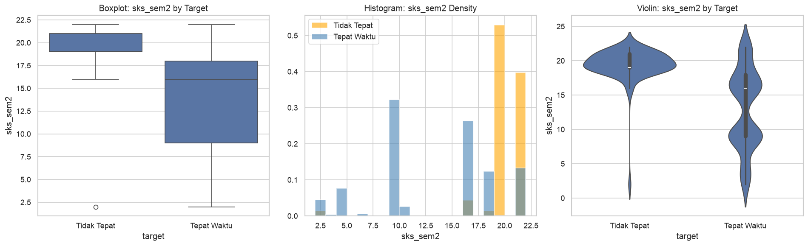

# 03 — Investigasi `sks_sem2` Dominance

**Masalah:** Di stratified baseline, `sks_sem2` punya feature importance **0.621** — mendominasi semua fitur lain. Root split ada di `sks_sem2 <= 18.50`.

**Pertanyaan:** Apakah ini genuine signal atau artifact dari bug TSKS (SKS kumulatif vs per-semester)?

**Rencana:**
1. Distribusi `sks_sem2` per target class — genuine separation?
2. Deteksi nilai abnormal — range, outlier, per angkatan
3. Tracing TSKS bug — bandingkan raw vs clean, cek korelasi antar semester
4. Decision rule analysis — distribusi di sekitar root split threshold
5. Kesimpulan


```python
import pandas as pd
import numpy as np
import matplotlib.pyplot as plt
import seaborn as sns

sns.set_theme(style='whitegrid')
plt.rcParams['figure.dpi'] = 120

# Load both datasets
df_clean = pd.read_csv('../3-data-preparation/dataset_clean.csv')
df_raw   = pd.read_csv('../3-data-preparation/dataset.csv')

print("Dataset loaded.")
print(f"  Clean: {df_clean.shape}")
print(f"  Raw:   {df_raw.shape}")
```

    Dataset loaded.
      Clean: (608, 17)
      Raw:   (608, 27)


## Step 1: Distribusi `sks_sem2` per Target Class


```python
print("=== sks_sem2 descriptive stats per target ===\n")
print(df_clean.groupby('target')['sks_sem2'].describe().round(2))

fig, axes = plt.subplots(1, 3, figsize=(16, 5))

# Boxplot
sns.boxplot(x='target', y='sks_sem2', data=df_clean, ax=axes[0])
axes[0].set_title('Boxplot: sks_sem2 by Target')
axes[0].set_xticklabels(['Tidak Tepat', 'Tepat Waktu'])

# Histogram
for target_val, label, color in [(0, 'Tidak Tepat', 'orange'), (1, 'Tepat Waktu', 'steelblue')]:
    subset = df_clean[df_clean['target'] == target_val]
    axes[1].hist(subset['sks_sem2'], bins=20, alpha=0.6, label=label, color=color, density=True)
axes[1].set_title('Histogram: sks_sem2 Density')
axes[1].set_xlabel('sks_sem2')
axes[1].legend()

# Violin
sns.violinplot(x='target', y='sks_sem2', data=df_clean, ax=axes[2])
axes[2].set_title('Violin: sks_sem2 by Target')
axes[2].set_xticklabels(['Tidak Tepat', 'Tepat Waktu'])

plt.tight_layout()
plt.show()

# Target rate per sks_sem2 quartile
print("\n=== Target rate per sks_sem2 quartile ===")
df_clean['sks_quartile'] = pd.qcut(df_clean['sks_sem2'], q=4, labels=['Q1 (low)', 'Q2', 'Q3', 'Q4 (high)'])
print(df_clean.groupby('sks_quartile', observed=False)['target'].agg(['count', 'mean']).round(3))
```

    === sks_sem2 descriptive stats per target ===
    
            count   mean   std  min   25%   50%   75%   max
    target                                                 
    0        68.0  19.43  2.51  2.0  19.0  19.0  21.0  22.0
    1       540.0  12.96  5.77  2.0   9.0  16.0  18.0  22.0


    /tmp/ipykernel_3179282/2052205935.py:9: UserWarning: set_ticklabels() should only be used with a fixed number of ticks, i.e. after set_ticks() or using a FixedLocator. Otherwise, ticks may be mislabeled.
      axes[0].set_xticklabels(['Tidak Tepat', 'Tepat Waktu'])
    /tmp/ipykernel_3179282/2052205935.py:22: UserWarning: set_ticklabels() should only be used with a fixed number of ticks, i.e. after set_ticks() or using a FixedLocator. Otherwise, ticks may be mislabeled.
      axes[2].set_xticklabels(['Tidak Tepat', 'Tepat Waktu'])


    

    


    
    === Target rate per sks_sem2 quartile ===
                  count   mean
    sks_quartile              
    Q1 (low)        245  0.996
    Q2              159  0.981
    Q3               68  0.985
    Q4 (high)       136  0.537


## Step 2: Deteksi Outlier & Nilai Abnormal


```python
# Value counts — head and tail
vc = df_clean['sks_sem2'].value_counts().sort_index()
print("=== 10 smallest values ===")
print(vc.head(10))
print(f"\n=== 10 largest values ===")
print(vc.tail(10))

# Per-angkatan stats
print("\n=== sks_sem2 per angkatan ===\n")
angk_stats = df_clean.groupby('angkatan')['sks_sem2'].describe().round(2)
angk_stats['neg_rate'] = df_clean.groupby('angkatan')['target'].apply(lambda x: (x==0).mean()).round(3)
print(angk_stats)

# Check: any value > 24 (impossible for 1 normal semester)?
abnormal = df_clean[df_clean['sks_sem2'] > 24]
print(f"\n=== sks_sem2 > 24 (abnormal): {len(abnormal)} rows ===")
if len(abnormal) > 0:
    print(abnormal[['angkatan', 'sks_sem2', 'sks_sem1', 'sks_sem3', 'target']])

# Check: any value < 2?
low = df_clean[df_clean['sks_sem2'] < 2]
print(f"\n=== sks_sem2 < 2 (suspicious): {len(low)} rows ===")
if len(low) > 0:
    print(low[['angkatan', 'sks_sem2', 'sks_sem1', 'sks_sem3', 'target']].head(10))
```

    === 10 smallest values ===
    sks_sem2
    2.0      25
    3.0       2
    4.0      41
    6.0       3
    9.0     174
    10.0     14
    16.0    145
    18.0     68
    19.0     37
    21.0     47
    Name: count, dtype: int64
    
    === 10 largest values ===
    sks_sem2
    3.0       2
    4.0      41
    6.0       3
    9.0     174
    10.0     14
    16.0    145
    18.0     68
    19.0     37
    21.0     47
    22.0     52
    Name: count, dtype: int64
    
    === sks_sem2 per angkatan ===
    
              count   mean   std   min   25%   50%   75%   max  neg_rate
    angkatan                                                            
    2015      116.0  16.00  0.00  16.0  16.0  16.0  16.0  16.0     0.017
    2016       54.0   9.52  7.05   2.0   2.0  16.0  16.0  16.0     0.037
    2017       48.0  22.00  0.00  22.0  22.0  22.0  22.0  22.0     0.042
    2018       46.0  18.02  0.15  18.0  18.0  18.0  18.0  19.0     0.022
    2019       27.0  18.59  1.45  18.0  18.0  18.0  18.0  22.0     0.000
    2020       40.0  10.48  8.27   4.0   4.0   4.0  21.0  21.0     0.100
    2021       46.0  11.37  6.88   4.0   4.0  10.0  21.0  21.0     0.065
    2022      181.0   9.19  2.17   3.0   9.0   9.0   9.0  21.0     0.028
    2023       50.0  19.20  2.50   3.0  19.0  19.0  20.5  21.0     0.980
    
    === sks_sem2 > 24 (abnormal): 0 rows ===
    
    === sks_sem2 < 2 (suspicious): 0 rows ===


## Step 3: Tracing TSKS Bug — Raw vs Clean


```python
# Compare raw vs clean sks_sem2
# In raw, check if sks_sem2 column exists
if 'sks_sem2' in df_raw.columns:
    comparison = pd.DataFrame({
        'angkatan': df_raw['angkatan'],
        'target': df_raw['target'],
        'raw_sks_sem2': df_raw['sks_sem2'],
        'clean_sks_sem2': df_clean['sks_sem2']
    })
    
    # How many were imputed? (raw had NULL or 0 → clean has imputed value)
    comparison['was_imputed'] = (comparison['raw_sks_sem2'].isna()) | (comparison['raw_sks_sem2'] == 0)
    
    n_imputed = comparison['was_imputed'].sum()
    n_total = len(comparison)
    print(f"Imputed sks_sem2: {n_imputed} / {n_total} ({n_imputed/n_total*100:.1f}%)")
    
    if n_imputed > 0:
        print(f"\nImputed rows — target distribution:")
        print(comparison[comparison['was_imputed']]['target'].value_counts())
        print(f"\nImputed rows — angkatan distribution:")
        print(comparison[comparison['was_imputed']]['angkatan'].value_counts().sort_index())
        
    # Before/after stats per target
    print(f"\n=== sks_sem2: Raw vs Clean per target ===")
    for t in [0, 1]:
        raw_sub = comparison[comparison['target'] == t]['raw_sks_sem2'].dropna()
        clean_sub = comparison[comparison['target'] == t]['clean_sks_sem2']
        print(f"\nTarget={t} ({'Tidak Tepat' if t==0 else 'Tepat Waktu'}):")
        print(f"  Raw   : mean={raw_sub.mean():.1f}, median={raw_sub.median():.1f}, "
              f"non-null={len(raw_sub)}")
        print(f"  Clean : mean={clean_sub.mean():.1f}, median={clean_sub.median():.1f}")
else:
    print("sks_sem2 not in raw dataset columns")
    print(f"Raw columns: {list(df_raw.columns)}")

# Check inter-semester SKS correlation
print(f"\n=== SKS inter-semester correlation ===")
sks_corr = df_clean[['sks_sem1', 'sks_sem2', 'sks_sem3']].corr().round(3)
print(sks_corr)

# Check: cumulative pattern? (sks_sem2 always >= sks_sem1 would be suspicious)
cumulative = (df_clean['sks_sem2'] >= df_clean['sks_sem1']).sum()
print(f"\nsks_sem2 >= sks_sem1: {cumulative} / {len(df_clean)} ({cumulative/len(df_clean)*100:.1f}%)")
print("(Jika >80%: mungkin masih ada residual cumulative pattern)")
```

    Imputed sks_sem2: 289 / 608 (47.5%)
    
    Imputed rows — target distribution:
    target
    1    288
    0      1
    Name: count, dtype: int64
    
    Imputed rows — angkatan distribution:
    angkatan
    2015     77
    2017     14
    2018     28
    2022    170
    Name: count, dtype: int64
    
    === sks_sem2: Raw vs Clean per target ===
    
    Target=0 (Tidak Tepat):
      Raw   : mean=19.4, median=19.0, non-null=67
      Clean : mean=19.4, median=19.0
    
    Target=1 (Tepat Waktu):
      Raw   : mean=13.7, median=16.0, non-null=252
      Clean : mean=13.0, median=16.0
    
    === SKS inter-semester correlation ===
              sks_sem1  sks_sem2  sks_sem3
    sks_sem1     1.000     0.470     0.258
    sks_sem2     0.470     1.000     0.707
    sks_sem3     0.258     0.707     1.000
    
    sks_sem2 >= sks_sem1: 340 / 608 (55.9%)
    (Jika >80%: mungkin masih ada residual cumulative pattern)


## Step 4: Decision Rule Analysis — Root Split


```python
# Analyze the root split threshold: sks_sem2 <= 18.50
threshold = 18.50

left = df_clean[df_clean['sks_sem2'] <= threshold]
right = df_clean[df_clean['sks_sem2'] > threshold]

print(f"Root split: sks_sem2 <= {threshold}")
print(f"{'='*55}")
print(f"Left  (<= {threshold}): {len(left)} rows ({len(left)/len(df_clean)*100:.1f}%)")
print(f"  Target: {dict(left['target'].value_counts())}")
print(f"  Neg rate: {left['target'].mean():.3f}")  
print(f"  sks_sem2 range: [{left['sks_sem2'].min()}, {left['sks_sem2'].max()}]")
print()
print(f"Right (> {threshold}): {len(right)} rows ({len(right)/len(df_clean)*100:.1f}%)")
print(f"  Target: {dict(right['target'].value_counts())}")
print(f"  Neg rate: {right['target'].mean():.3f}")
print(f"  sks_sem2 range: [{right['sks_sem2'].min()}, {right['sks_sem2'].max()}]")

# Target rate per angkatan in right branch
print(f"\nRight branch (> {threshold}) breakdown per angkatan:")
for ang in sorted(right['angkatan'].unique()):
    sub = right[right['angkatan'] == ang]
    print(f"  {ang}: {len(sub)} rows, target mean={sub['target'].mean():.3f}")

# Where do the "Tidak Tepat" students in the left branch go?
print(f"\nLeft branch (<= {threshold}) — 'Tidak Tepat' students:")
left_neg = left[left['target'] == 0]
print(f"  Count: {len(left_neg)}")
if len(left_neg) > 0:
    print(f"  ips_sem1 stats: mean={left_neg['ips_sem1'].mean():.2f}, "
          f"median={left_neg['ips_sem1'].median():.2f}")
    # Next split: ips_sem1 <= 2.70
    below = left_neg[left_neg['ips_sem1'] <= 2.70]
    above = left_neg[left_neg['ips_sem1'] > 2.70]
    print(f"  ips_sem1 <= 2.70: {len(below)} (predicted TIDAK TEPAT by next split)")
    print(f"  ips_sem1 > 2.70:  {len(above)} (continue to deeper branches)")
```

    Root split: sks_sem2 <= 18.5
    =======================================================
    Left  (<= 18.5): 472 rows (77.6%)
      Target: {1: np.int64(467), 0: np.int64(5)}
      Neg rate: 0.989
      sks_sem2 range: [2.0, 18.0]
    
    Right (> 18.5): 136 rows (22.4%)
      Target: {1: np.int64(73), 0: np.int64(63)}
      Neg rate: 0.537
      sks_sem2 range: [19.0, 22.0]
    
    Right branch (> 18.5) breakdown per angkatan:
      2017: 48 rows, target mean=0.958
      2018: 1 rows, target mean=1.000
      2019: 4 rows, target mean=1.000
      2020: 15 rows, target mean=0.733
      2021: 14 rows, target mean=0.786
      2022: 5 rows, target mean=0.000
      2023: 49 rows, target mean=0.000
    
    Left branch (<= 18.5) — 'Tidak Tepat' students:
      Count: 5
      ips_sem1 stats: mean=3.04, median=3.14
      ips_sem1 <= 2.70: 1 (predicted TIDAK TEPAT by next split)
      ips_sem1 > 2.70:  4 (continue to deeper branches)


## Step 5: Kesimpulan


```python
print("=== FINAL ASSESSMENT: sks_sem2 ===\n")

# Gather evidence
cleaned_mean_diff = df_clean.groupby('target')['sks_sem2'].mean().diff().iloc[-1]
sks_corr_with_target = df_clean['sks_sem2'].corr(df_clean['target'])
raw_vs_clean_check = 'sks_sem2' in df_raw.columns

print(f"1. Mean difference (Tepat - Tidak): {cleaned_mean_diff:.2f} SKS")
print(f"   {'✓ Separation jelas' if abs(cleaned_mean_diff) > 5 else '? Separation marginal' if abs(cleaned_mean_diff) > 2 else '✗ No separation'}")
print()
print(f"2. Pearson r with target: {sks_corr_with_target:.4f}")
print(f"   {'✓ Moderate-to-strong' if abs(sks_corr_with_target) > 0.3 else '? Weak-to-moderate' if abs(sks_corr_with_target) > 0.1 else '✗ Near zero'}")
print()
print(f"3. Raw vs Clean comparison: {'Available' if raw_vs_clean_check else 'Raw data not loaded'}")

# Summary judgment
print(f"\n{'='*55}")
print("JUDGMENT:")
print(f"{'='*55}")

# Check if there are abnormal values
abnormal_count = len(df_clean[df_clean['sks_sem2'] > 24])
if abnormal_count > 0:
    print(f"✗ ARTIFACT: {abnormal_count} rows with sks_sem2 > 24")
elif abs(cleaned_mean_diff) > 3 and abs(sks_corr_with_target) > 0.2:
    print("✓ GENUINE SIGNAL: Clear separation between classes")
    print("  sks_sem2 is a legitimate predictor — likely reflects course load reduction by struggling students")
else:
    print("? MIXED: Some separation but needs more context")
    print("  Check the visualizations above for detailed patterns")
```

    === FINAL ASSESSMENT: sks_sem2 ===
    
    1. Mean difference (Tepat - Tidak): -6.46 SKS
       ✓ Separation jelas
    
    2. Pearson r with target: -0.3476
       ✓ Moderate-to-strong
    
    3. Raw vs Clean comparison: Available
    
    =======================================================
    JUDGMENT:
    =======================================================
    ✓ GENUINE SIGNAL: Clear separation between classes
      sks_sem2 is a legitimate predictor — likely reflects course load reduction by struggling students

