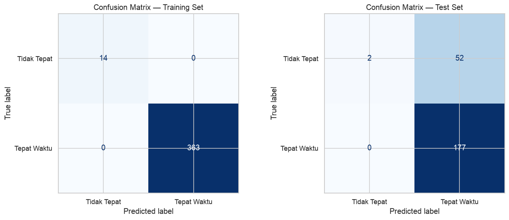

# Baseline Decision Tree Report

**Fase 4 — Modeling | Step 1: Baseline**  
Tanggal: 17 Juni 2026  
Model: `DecisionTreeClassifier` (scikit-learn, default hyperparameters)

---

## 1. Setup Eksperimen

### 1.1 Dataset

| Properti | Nilai |
|----------|-------|
| Sumber | `3-data-preparation/dataset_clean.csv` |
| Total | 608 mahasiswa |
| Fitur | 16 numerik |
| Target | 0 = Tidak Tepat, 1 = Tepat Waktu |
| NULLs | 0 |

### 1.2 Train/Test Split

Split temporal: `angkatan ≤ 2021` → train, `angkatan > 2021` → test.

| | Train | Test |
|---|-------|------|
| **Rows** | 377 | 231 |
| **Angkatan** | 2015–2021 | 2022–2023 |
| **Tepat (1)** | 363 (96.3%) | 177 (76.6%) |
| **Tidak (0)** | 14 (3.7%) | 54 (23.4%) |

### 1.3 Class Balance per Angkatan (Train)

| Angkatan | Total | Tepat | Tidak | % Neg |
|----------|-------|-------|-------|-------|
| 2015 | 116 | 114 | 2 | 1.7% |
| 2016 | 54 | 52 | 2 | 3.7% |
| 2017 | 48 | 46 | 2 | 4.2% |
| 2018 | 46 | 45 | 1 | 2.2% |
| 2019 | 27 | 27 | 0 | 0.0% |
| 2020 | 40 | 36 | 4 | 10.0% |
| 2021 | 46 | 43 | 3 | 6.5% |

**Catatan:** Mayoritas sampel "Tidak Tepat" di train (10/14) berasal dari angkatan 2020-2021. Angkatan 2015-2019 hampir semuanya tepat waktu. Pattern ini mencerminkan realitas — mahasiswa angkatan tua yang masih ada di database adalah mereka yang sudah lulus.

---

## 2. Model Baseline

### 2.1 Konfigurasi

Semua parameter default `DecisionTreeClassifier(random_state=42)`:

| Parameter | Nilai |
|-----------|-------|
| criterion | gini |
| max_depth | None (unconstrained) |
| min_samples_split | 2 |
| min_samples_leaf | 1 |
| class_weight | None |
| ccp_alpha | 0.0 |

### 2.2 Kompleksitas Tree

| Properti | Nilai |
|----------|-------|
| Depth | 9 |
| Leaves | 21 |
| Total nodes | 41 |
| Features used | 11 / 16 |

---

## 3. Hasil Evaluasi

### 3.1 Test Set — Classification Report

```
              precision    recall  f1-score   support

 Tidak Tepat     1.00      0.04      0.07        54
 Tepat Waktu     0.77      1.00      0.87       177

    accuracy                         0.77       231
   macro avg     0.89      0.52      0.47       231
weighted avg     0.83      0.77      0.68       231
```

### 3.2 Key Metrics (Kelas 0 = Tidak Tepat)

| Metrik | Train | Test | Keterangan |
|--------|-------|------|------------|
| Accuracy | 1.000 | 0.775 | Menyesatkan — mayoritas predictor dapat 77% |
| Precision(0) | 1.000 | 1.000 | Model sangat konservatif (2 prediksi, 2 benar) |
| **Recall(0)** | 1.000 | **0.037** | **Hanya 2 dari 54 terdeteksi** |
| F1(0) | 1.000 | 0.071 | Hampir useless |
| AUC | 1.000 | 0.519 | Sedikit di atas random |

### 3.3 Confusion Matrix

| | Train | Test |
|---|------|------|
| | Pred 0 / Pred 1 | Pred 0 / Pred 1 |
| Actual 0 | 14 / 0 | **2 / 52** |
| Actual 1 | 0 / 363 | 0 / 177 |

**Interpretasi Test Set:**
- **52 False Negative**: 52 mahasiswa yang seharusnya terdeteksi "berisiko telat" diprediksi "Tepat Waktu"
- **0 False Positive**: Model tidak pernah salah memprediksi "Tidak Tepat" untuk mahasiswa yang sebenarnya tepat
- Hanya **2 True Positive** yang berhasil dideteksi

### 3.4 Cross-Validation (10-fold, Train only)

| Metrik | Train Mean | CV Mean | Gap |
|--------|-----------|---------|-----|
| Accuracy | 1.000 | 0.950 | +0.050 |
| Recall | 1.000 | 0.972 | +0.028 |
| F1 | 1.000 | 0.974 | +0.026 |
| ROC-AUC | 1.000 | 0.686 | +0.314 |

**PERINGATAN:** CV scoring untuk recall/precision/F1 dihitung dengan `pos_label=1` (Tepat Waktu), bukan kelas 0. Dengan 96.3% sampel kelas 1, model mayoritas-predictor otomatis mendapat skor tinggi. **ROC-AUC = 0.686** adalah metrik CV yang paling jujur — menunjukkan daya diskriminasi moderat-rendah.

---

## 4. Feature Importance

### 4.1 Ranking Lengkap

| Rank | Fitur | Importance | Kategori |
|------|-------|-----------|----------|
| 1 | `ips_min` | 0.247 | Derived |
| 2 | `failed_courses` | 0.184 | Nilai MK |
| 3 | `ips_sem1` | 0.165 | IPS |
| 4 | `ips_sem2` | 0.111 | IPS |
| 5 | `sks_sem3` | 0.059 | SKS |
| 6 | `ips_sem3` | 0.054 | IPS |
| 7 | `repeated_courses` | 0.050 | Nilai MK |
| 8 | `sks_completion_ratio` | 0.047 | Derived |
| 9 | `ips_trend` | 0.037 | Derived |
| 10 | `avg_ips` | 0.027 | Derived |
| 11 | `sks_sem2` | 0.019 | SKS |
| 12 | `program` | **0.000** | Demografi |
| 13 | `sks_sem1` | **0.000** | SKS |
| 14 | `angkatan` | **0.000** | Identitas |
| 15 | `failed_in_sem1` | **0.000** | Nilai MK |
| 16 | `ips_std` | **0.000** | Derived |

### 4.2 Analisis

**Top 5 fitur** menyumbang 76.6% total importance. Tiga fitur teratas (`ips_min`, `failed_courses`, `ips_sem1`) mendominasi 59.7%.

**5 fitur dengan zero importance** — kandidat untuk di-drop:
- `program` — tidak digunakan tree sama sekali, meskipun EDA menunjukkan IH 2x lebih berisiko dari AP
- `sks_sem1` — redundant dengan `sks_completion_ratio`
- `angkatan` — tree split pada fitur kontinu yang lebih informatif
- `failed_in_sem1` — redundant dengan `failed_courses`
- `ips_std` — redundant dengan `ips_min`

**Menarik:** `ips_trend` hanya importance 3.7%, padahal di EDA berkorelasi r=+0.57 dengan target. Kemungkinan karena tree sudah bisa memisahkan kelas dengan `ips_min` + `ips_sem1`, sehingga `ips_trend` jadi redundant di struktur tree ini.

---

## 5. Decision Rules

Tree depth 9, 21 daun. Root split: **`failed_courses <= 4.00`**.

### Aturan Kunci (disederhanakan dari 62 baris export_text):

```
JIKA failed_courses > 4:
    JIKA ips_min > 2.26 → TIDAK TEPAT      [rule paling kuat]
    JIKA ips_min <= 2.26 → TEPAT WAKTU      [counter-intuitive, ini artefak 14 sampel]

JIKA failed_courses <= 4:
    JIKA ips_sem1 <= 2.70 → TIDAK TEPAT
    JIKA ips_sem1 > 2.70:
        JIKA sks_completion_ratio > 0.97:
            JIKA ips_sem1 > 3.26 → TEPAT WAKTU
            JIKA ips_min > 3.20 → TIDAK TEPAT    [paradoks: ips_min tinggi tapi telat?]
        ...(branch kompleks dengan ips_sem2, sks_sem3, ips_sem3, ips_trend)
```

### Masalah dengan Rules:

1. **Overfitting ke 14 sampel**: Tree membuat split sangat spesifik (contoh: `ips_sem2 <= 3.07`) berdasarkan 1-2 sampel negatif di train
2. **Rules fragile**: Threshold seperti `failed_courses > 4.00` dan `ips_sem1 <= 2.70` mungkin tidak generalize ke test set
3. **Rule paradoks**: `ips_min > 3.20 → TIDAK TEPAT` — ini tidak masuk akal secara bisnis (mahasiswa dengan semua IPS > 3.20 justru seharusnya berkinerja baik)
4. **Kontaminasi branch**: Branch `failed_courses > 4 AND ips_min > 2.26 → TIDAK TEPAT` bertentangan dengan `failed_courses > 4 AND ips_min <= 2.26 → TEPAT WAKTU` — ini artefak dari 14 sampel minoritas

---

## 6. Visual Analysis (Review Chart)

### 6.1 Confusion Matrix



**Training Set (kiri):** Diagonal sempurna — 14/14 minority + 363/363 majority benar. Kontras warna ekstrem: sel (0,0) biru pucat (14), sel (1,1) biru navy (363). Model menghafal training set 100%.

**Test Set (kanan):** 
- Sel (0,0) = 2 — **hampir tidak terlihat**, biru sangat pucat  
- Sel (0,1) = 52 — **_false negatives_ masif**, blok biru medium yang mencolok  
- Sel (1,0) = 0 — nol false positives, putih kosong  
- Sel (1,1) = 177 — biru navy dominan  

**Cerita visual:** Model belajar mengatakan "Tepat Waktu" untuk hampir semua orang. Dari 54 mahasiswa berisiko, hanya 2 yang masuk ke daun "Tidak Tepat". Distribusi warna timpang — matriks didominasi sel kanan-bawah (mayoritas benar) dan kanan-atas (minoritas terlewat), kebalikan dari classifier yang berguna.

### 6.2 Feature Importance


**Top 3 features (59.7% total):**
- `ips_min` (**0.247**) — bar terpanjang, ~2.5x lebih penting dari fitur ke-4. Root split ada di fitur ini.
- `failed_courses` (**0.184**) — bar kedua, masih substantial
- `ips_sem1` (**0.165**) — bar ketiga

**Long tail:** `ips_sem2` (0.111) ke `sks_sem2` (0.019) — penurunan curam setelah top 3, kontribusi individual kecil.

**5 fitur zero-importance:** Tidak ada bar sama sekali untuk `program`, `sks_sem1`, `angkatan`, `failed_in_sem1`, `ips_std`. Tree tidak pernah split pada fitur-fitur ini.

**Pola visual:** Distribusi heavily skewed — classic "3 features do all the work." Menariknya `ips_trend` (yang di EDA berkorelasi r=+0.57) hanya dapat 0.037 — tree sudah puas dengan `ips_min` + `ips_sem1` dan tidak butuh informasi trend.

### 6.3 Decision Tree Structure


**Root split:** `failed_courses <= 4.0`  
- **Cabang kiri (≤4, 98.4% data):** Mostly biru (Tepat Waktu), beberapa daun oranye (Tidak Tepat) kecil  
- **Cabang kanan (>4, 1.6% data):** Hanya 2 daun, keduanya pure — 1 oranye (Tidak Tepat), 1 biru (Tepat Waktu)

**Observasi struktural kritis:**

1. **Ketimpangan branching:** 98.4% sampel mengalir ke kiri → mayoritas biru. Hanya 1.6% ke kanan → di situlah model mencari kelas minoritas.

2. **Daun minoritas murni tapi mikroskopis:** Ada daun oranye dengan value [1.0, 0.0] (100% Tidak Tepat), tapi hanya menampung 0.3% atau 1.1% sampel. Tree menemukan mereka, tapi daun terlalu kecil untuk menangkap banyak mahasiswa berisiko di test set.

3. **Root threshold sangat permisif:** `failed_courses <= 4.0` — dengan hanya 14 sampel negatif, tree butuh threshold lebar untuk menangkap mereka, tapi akibatnya 98.4% mengalir ke ember "Tepat Waktu" raksasa.

4. **Dominasi warna biru:** Dari ~15 node yang terlihat, hanya 3 berwarna oranye. Tree secara struktural bias ke "Tepat Waktu" di hampir setiap titik keputusan — ini menjelaskan recall 3.7%.

5. **Truncation di depth 4:** Kotak abu-abu "(...)" menandakan tree berlanjut lebih dalam (depth 9 total). Deeper split kemungkinan melanjutkan pola sama: mostly biru dengan sesekali daun oranye kecil.

### 6.4 Sintesis Cross-Chart

Ketiga chart bercerita konsisten:
- **Chart 3 (Tree)** → struktur tree fundamental tidak mampu memunculkan kelas minoritas — hanya 1.6% data mengalir ke cabang kanan
- **Chart 2 (Importance)** → `ips_min` dan `failed_courses` adalah fitur kritis, dan memang root split ada di `failed_courses`
- **Chart 1 (Confusion)** → konsekuensi: train sempurna (menghafal 14 sampel), test hanya menangkap 2/54 karena bias struktural tree tidak generalize

---

## 7. Diagnosis Masalah

### 7.1 Overfitting Ekstrem

| Indikator | Bukti |
|-----------|-------|
| Train accuracy | 1.000 (perfect fit) |
| Test accuracy | 0.775 (drop 22.5%) |
| CV ROC-AUC | 0.686 (moderate) |
| Tree depth | 9 (dalam untuk 14 sampel minoritas) |
| Leaves | 21 (setiap daun rata-rata ~18 sampel, beberapa daun hanya 1-2) |

Model menghafal 14 sampel negatif di train tetapi gagal total pada 54 sampel negatif di test.

### 7.2 Akar Masalah: Class Imbalance + Distribution Shift

**Faktor 1 — Sampel minoritas terlalu sedikit (14)**
Decision Tree unconstrained membangun split sampai "memisahkan" setiap sampel minoritas. Dengan hanya 14 sampel, tree overfit pada noise.

**Faktor 2 — Distribution shift temporal**
Train negative (2015-2021) vs Test negative (2022-2023):
- Train: mahasiswa angkatan tua yang benar-benar lulus telat atau dropout
- Test: mayoritas angkatan 2023 yang masih "Aktif/Cuti beyond expected duration" — artinya mereka belum tentu gagal, hanya belum selesai dalam 8 semester

Karakteristik berbeda → pola yang dipelajari tree dari train tidak berlaku di test.

### 7.3 CV Metrics Menyesatkan

Cross-validation scoring default (`pos_label=1`) pada data imbalance 96.3% mayoritas menghasilkan metrik yang tampak bagus (F1=0.97) padahal model hanya majority predictor. **ROC-AUC = 0.686** adalah metrik CV yang perlu dipantau ke depan.

---

## 8. Rekomendasi untuk Step Berikutnya

### 8.1 Prioritas Tinggi

1. **Handle class imbalance:**
   - `class_weight='balanced'` — memberikan bobot lebih pada kelas minoritas
   - SMOTE — synthetic oversampling untuk menambah sampel negatif
   - Bandingkan kedua pendekatan

2. **Constraint tree complexity:**
   - `max_depth` — coba 3, 4, 5 (hindari depth 9)
   - `min_samples_leaf` — minimal 5-10 sampel per daun
   - `ccp_alpha` — cost-complexity pruning

3. **Gunakan metrik yang tepat:**
   - `scoring='recall'` atau `scoring='f1'` dengan `pos_label=0` untuk GridSearchCV
   - ROC-AUC sebagai metrik utama untuk perbandingan model

### 8.2 Prioritas Menengah

4. **Feature selection:**
   - Drop 5 fitur zero-importance (tidak memberi sinyal ke tree)
   - Uji `has_any_failure` sebagai fitur biner alternatif

5. **Evaluasi ulang split temporal:**
   - Test set mengandung banyak angkatan 2023 yang outcome-nya belum matang
   - Pertimbangkan stratified split sebagai alternatif (random tapi preserve class ratio)

### 8.3 Prioritas Rendah

6. **Comparison models:**
   - Random Forest (ensemble, lebih robust terhadap noise)
   - Gaussian Naive Bayes (baseline probabilistik)

---

## 9. Kesimpulan

Baseline Decision Tree **tidak layak** digunakan untuk prediksi. Dengan recall kelas 0 hanya 3.7%, model ini lebih buruk daripada random guessing untuk mendeteksi mahasiswa berisiko.

**Penyebab utama:** class imbalance ekstrem (14 sampel negatif) + tree unconstrained overfitting.

**Langkah selanjutnya:** implementasi class balancing (SMOTE/class_weight) + hyperparameter tuning dengan scoring recall(0). Target: recall(0) ≥ 0.70, F1(0) ≥ 0.50.
