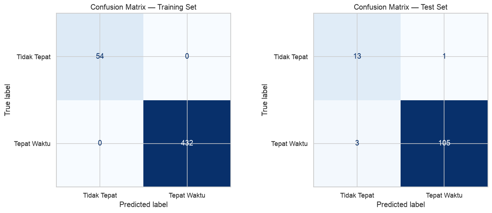
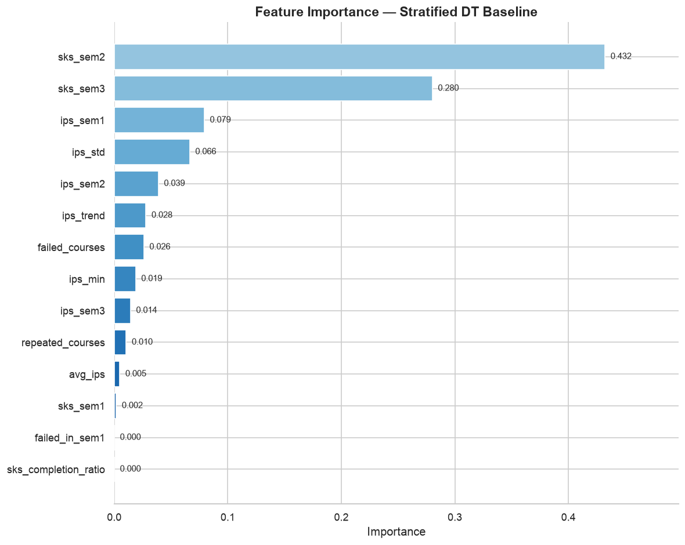
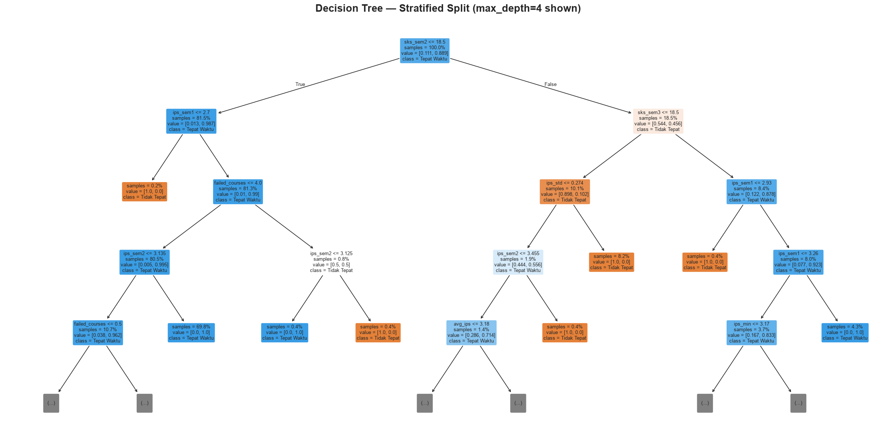

# 02 — Stratified Split Baseline: Decision Tree (No Angkatan)

Fase 4 CRISP-DM | Variasi: Stratified random split (80/20) menggantikan temporal split.

**Tujuan:** Menguji apakah menambah sampel negatif di training (14 → ~54) via stratified split memperbaiki recall kelas 0.

**Perbandingan dengan Notebook 01:**
| | 01 (Temporal) | 02 (Stratified) |
|---|---|---|
| Split logic | angkatan ≤ 2021 / > 2021 | random 80/20, stratify=target |
| Train negatif | 14 (3.7%) | ~54 (11.2%) |
| Test negatif | 54 (23.4%) | ~14 (11.2%) |
| Validitas | Simulasi prediksi masa depan | Generalisasi statistik |

**Catatan:** Fitur `angkatan` dan `program` di-drop untuk mencegah data leakage (angkatan 2023 = semua target=0).

**Experiment: Global Median Imputation** — menggantikan imputation per-angkatan dengan global median untuk mencegah proxy temporal melalui fitur SKS.


```python
import pandas as pd
import numpy as np
import matplotlib.pyplot as plt
import seaborn as sns

from sklearn.tree import DecisionTreeClassifier, plot_tree, export_text
from sklearn.model_selection import (
    train_test_split, StratifiedKFold, cross_validate, learning_curve
)
from sklearn.metrics import (
    accuracy_score, precision_score, recall_score, f1_score,
    confusion_matrix, classification_report,
    roc_auc_score, ConfusionMatrixDisplay
)

sns.set_theme(style='whitegrid')
plt.rcParams['figure.dpi'] = 120
plt.rcParams['savefig.dpi'] = 120
plt.rcParams['savefig.bbox'] = 'tight'

print("Library loaded.")
print(f"  pandas : {pd.__version__}")
print(f"  sklearn: imported")
```

    Library loaded.
      pandas : 3.0.3
      sklearn: imported


```python
# Load clean dataset
df = pd.read_csv('dataset_clean.csv')  # experiment: global median
print(f"Shape  : {df.shape}")
print(f"Target : {dict(df['target'].value_counts())}")
print(f"Rate   : {df['target'].mean()*100:.2f}% on-time")

# Stratified split: 80% train, 20% test
X = df.drop(columns=['target'])
y = df['target']

X_train, X_test, y_train, y_test = train_test_split(
    X, y, test_size=0.2, random_state=42, stratify=y
)

print(f"\n{'='*50}")
print(f"STRATIFIED SPLIT (80/20, random_state=42)")
print(f"{'='*50}")
print(f"Train: {X_train.shape[0]} rows  |  Target: {dict(y_train.value_counts())}  "
      f"|  {y_train.value_counts(normalize=True)[0]*100:.1f}% neg")
print(f"Test:  {X_test.shape[0]} rows  |  Target: {dict(y_test.value_counts())}  "
      f"|  {y_test.value_counts(normalize=True)[0]*100:.1f}% neg")

# Drop angkatan (data leakage risk: 2023 = all target=0)
# Also drop program (zero importance in preliminary runs)
drop_cols = ['angkatan', 'program']
print(f"\nDropping features: {drop_cols}")
X_train = X_train.drop(columns=drop_cols)
X_test  = X_test.drop(columns=drop_cols)
print(f"Remaining features: {list(X_train.columns)}")
print(f"Feature count: {len(X_train.columns)}")
```

    Shape  : (608, 17)
    Target : {1: np.int64(540), 0: np.int64(68)}
    Rate   : 88.82% on-time


    
    ==================================================
    STRATIFIED SPLIT (80/20, random_state=42)
    ==================================================
    Train: 486 rows  |  Target: {1: np.int64(432), 0: np.int64(54)}  |  11.1% neg
    Test:  122 rows  |  Target: {1: np.int64(108), 0: np.int64(14)}  |  11.5% neg
    
    Dropping features: ['angkatan', 'program']
    Remaining features: ['ips_sem1', 'ips_sem2', 'ips_sem3', 'sks_sem1', 'sks_sem2', 'sks_sem3', 'failed_courses', 'failed_in_sem1', 'repeated_courses', 'ips_trend', 'avg_ips', 'ips_std', 'ips_min', 'sks_completion_ratio']
    Feature count: 14


```python
# Baseline: DecisionTreeClassifier default
dt_strat = DecisionTreeClassifier(random_state=42)
dt_strat.fit(X_train, y_train)

print("Baseline DT trained (stratified split).")
print(f"Tree depth   : {dt_strat.get_depth()}")
print(f"Tree leaves  : {dt_strat.get_n_leaves()}")
print(f"Node count   : {dt_strat.tree_.node_count}")
print(f"Features used: {(dt_strat.feature_importances_ > 0).sum()} / {len(X_train.columns)}")
```

    Baseline DT trained (stratified split).
    Tree depth   : 8
    Tree leaves  : 24
    Node count   : 47
    Features used: 12 / 14


```python
# Predict
y_pred_train = dt_strat.predict(X_train)
y_pred_test  = dt_strat.predict(X_test)

print("=" * 55)
print("CLASSIFICATION REPORT — TRAIN")
print("=" * 55)
print(classification_report(y_train, y_pred_train, target_names=['Tidak Tepat', 'Tepat Waktu']))

print("=" * 55)
print("CLASSIFICATION REPORT — TEST")
print("=" * 55)
print(classification_report(y_test, y_pred_test, target_names=['Tidak Tepat', 'Tepat Waktu']))

# Key metrics
print("\nKEY METRICS (Kelas 0 = Tidak Tepat)")
print('-' * 55)
for name, y_true, y_pred in [('Train', y_train, y_pred_train), ('Test', y_test, y_pred_test)]:
    acc  = accuracy_score(y_true, y_pred)
    prec = precision_score(y_true, y_pred, pos_label=0, zero_division=0)
    rec  = recall_score(y_true, y_pred, pos_label=0)
    f1   = f1_score(y_true, y_pred, pos_label=0)
    auc  = roc_auc_score(y_true, y_pred)
    print(f"{name:<8} | Acc={acc:.4f} | Prec(0)={prec:.4f} | Recall(0)={rec:.4f} | "
          f"F1(0)={f1:.4f} | AUC={auc:.4f}")
```

    =======================================================
    CLASSIFICATION REPORT — TRAIN
    =======================================================


                  precision    recall  f1-score   support
    
     Tidak Tepat       1.00      1.00      1.00        54
     Tepat Waktu       1.00      1.00      1.00       432
    
        accuracy                           1.00       486
       macro avg       1.00      1.00      1.00       486
    weighted avg       1.00      1.00      1.00       486
    
    =======================================================
    CLASSIFICATION REPORT — TEST
    =======================================================
                  precision    recall  f1-score   support
    
     Tidak Tepat       0.81      0.93      0.87        14
     Tepat Waktu       0.99      0.97      0.98       108
    
        accuracy                           0.97       122
       macro avg       0.90      0.95      0.92       122
    weighted avg       0.97      0.97      0.97       122
    
    
    KEY METRICS (Kelas 0 = Tidak Tepat)
    -------------------------------------------------------
    Train    | Acc=1.0000 | Prec(0)=1.0000 | Recall(0)=1.0000 | F1(0)=1.0000 | AUC=1.0000


    Test     | Acc=0.9672 | Prec(0)=0.8125 | Recall(0)=0.9286 | F1(0)=0.8667 | AUC=0.9504


```python
# Confusion Matrix
fig, axes = plt.subplots(1, 2, figsize=(12, 5))

for ax, (name, y_true, y_pred) in zip(
    axes,
    [('Training Set', y_train, y_pred_train), ('Test Set', y_test, y_pred_test)]
):
    cm = confusion_matrix(y_true, y_pred)
    disp = ConfusionMatrixDisplay(confusion_matrix=cm, display_labels=['Tidak Tepat', 'Tepat Waktu'])
    disp.plot(ax=ax, cmap='Blues', colorbar=False, values_format='d')
    ax.set_title(f'Confusion Matrix — {name}')

plt.tight_layout()
plt.show()
```


    

    


```python
# Stratified 10-fold CV
cv = StratifiedKFold(n_splits=10, shuffle=True, random_state=42)
cv_results = cross_validate(
    dt_strat, X_train, y_train, cv=cv,
    scoring=['accuracy', 'precision', 'recall', 'f1', 'roc_auc'],
    return_train_score=True
)

print("=" * 55)
print("10-FOLD CROSS-VALIDATION (Train only)")
print("=" * 55)
for metric in ['accuracy', 'precision', 'recall', 'f1', 'roc_auc']:
    test_scores = cv_results[f'test_{metric}']
    train_scores = cv_results[f'train_{metric}']
    print(f"\n{metric.upper():<14}  Train: {train_scores.mean():.4f} +- {train_scores.std():.4f}")
    print(f"{'':<14}  Test:  {test_scores.mean():.4f} +- {test_scores.std():.4f}")

print(f"\n{'─'*50}")
print(f"{'Metric':<14}  {'Train':<12} {'Test':<12} {'Gap':<12}")
print(f"{'─'*50}")
for metric in ['accuracy', 'recall', 'f1', 'roc_auc']:
    gap = cv_results[f'train_{metric}'].mean() - cv_results[f'test_{metric}'].mean()
    print(f"{metric:<14}  {cv_results[f'train_{metric}'].mean():<12.4f} "
          f"{cv_results[f'test_{metric}'].mean():<12.4f} {gap:<+12.4f}")
```

    =======================================================
    10-FOLD CROSS-VALIDATION (Train only)
    =======================================================
    
    ACCURACY        Train: 1.0000 +- 0.0000
                    Test:  0.9384 +- 0.0365
    
    PRECISION       Train: 1.0000 +- 0.0000
                    Test:  0.9702 +- 0.0226
    
    RECALL          Train: 1.0000 +- 0.0000
                    Test:  0.9607 +- 0.0306
    
    F1              Train: 1.0000 +- 0.0000
                    Test:  0.9651 +- 0.0208
    
    ROC_AUC         Train: 1.0000 +- 0.0000
                    Test:  0.8537 +- 0.1048
    
    ──────────────────────────────────────────────────
    Metric          Train        Test         Gap         
    ──────────────────────────────────────────────────
    accuracy        1.0000       0.9384       +0.0616     
    recall          1.0000       0.9607       +0.0393     
    f1              1.0000       0.9651       +0.0349     
    roc_auc         1.0000       0.8537       +0.1463     


```python
# Feature importance
importances = dt_strat.feature_importances_
feat_imp = pd.DataFrame({
    'feature': X_train.columns,
    'importance': importances
}).sort_values('importance', ascending=False)

print("FEATURE IMPORTANCE (Stratified DT Baseline)")
print("=" * 45)
for i, row in feat_imp.iterrows():
    bar = '█' * int(row['importance'] * 50)
    print(f"  {row['feature']:<25} {row['importance']:.4f}  {bar}")

# Plot
fig, ax = plt.subplots(figsize=(10, 8))
colors = plt.cm.Blues(np.linspace(0.4, 0.9, len(feat_imp)))
feat_plot = feat_imp.iloc[::-1]
bars = ax.barh(feat_plot['feature'], feat_plot['importance'], color=colors[::-1])
for bar, val in zip(bars, feat_plot['importance']):
    ax.text(bar.get_width() + 0.005, bar.get_y() + bar.get_height()/2,
            f'{val:.3f}', va='center', fontsize=9)
ax.set_xlabel('Importance', fontsize=12)
ax.set_title('Feature Importance — Stratified DT Baseline', fontsize=14, fontweight='bold')
ax.set_xlim(0, feat_imp['importance'].max() * 1.15)
sns.despine(left=True)
plt.tight_layout()
plt.show()

# Zero importance
zero_imp = feat_imp[feat_imp['importance'] == 0]
if len(zero_imp) > 0:
    print(f"\nFeatures with ZERO importance ({len(zero_imp)}):")
    for _, row in zero_imp.iterrows():
        print(f"  - {row['feature']}")
else:
    print("\nAll features have non-zero importance.")
```

    FEATURE IMPORTANCE (Stratified DT Baseline)
    =============================================
      sks_sem2                  0.4321  █████████████████████
      sks_sem3                  0.2800  ██████████████
      ips_sem1                  0.0792  ███
      ips_std                   0.0663  ███
      ips_sem2                  0.0388  █
      ips_trend                 0.0278  █
      failed_courses            0.0260  █
      ips_min                   0.0187  
      ips_sem3                  0.0142  
      repeated_courses          0.0104  
      avg_ips                   0.0048  
      sks_sem1                  0.0017  
      failed_in_sem1            0.0000  
      sks_completion_ratio      0.0000  


    

    


    
    Features with ZERO importance (2):
      - failed_in_sem1
      - sks_completion_ratio


```python
# Visualize tree (max_depth=4)
fig, ax = plt.subplots(figsize=(20, 10))
plot_tree(
    dt_strat, feature_names=X_train.columns,
    class_names=['Tidak Tepat', 'Tepat Waktu'],
    filled=True, rounded=True, fontsize=8, max_depth=4,
    impurity=False, proportion=True, ax=ax
)
ax.set_title('Decision Tree — Stratified Split (max_depth=4 shown)', fontsize=16, fontweight='bold')
plt.tight_layout()
plt.show()
print(f"Full tree depth: {dt_strat.get_depth()}")
```


    

    


    Full tree depth: 8


```python
tree_rules = export_text(dt_strat, feature_names=list(X_train.columns))
lines = tree_rules.split('\n')
print(f"Total rules/lines: {len(lines)}")
print(f"\nFirst 80 lines:\n{'='*60}")
print('\n'.join(lines[:80]))
if len(lines) > 80:
    print(f"\n... ({len(lines) - 80} more lines)")

with open('rules_stratified.txt', 'w') as f:
    f.write(tree_rules)
```

    Total rules/lines: 71
    
    First 80 lines:
    ============================================================
    |--- sks_sem2 <= 18.50
    |   |--- ips_sem1 <= 2.70
    |   |   |--- class: 0
    |   |--- ips_sem1 >  2.70
    |   |   |--- failed_courses <= 4.00
    |   |   |   |--- ips_sem2 <= 3.14
    |   |   |   |   |--- failed_courses <= 0.50
    |   |   |   |   |   |--- sks_sem1 <= 21.00
    |   |   |   |   |   |   |--- class: 1
    |   |   |   |   |   |--- sks_sem1 >  21.00
    |   |   |   |   |   |   |--- ips_sem1 <= 3.04
    |   |   |   |   |   |   |   |--- ips_sem3 <= 3.38
    |   |   |   |   |   |   |   |   |--- class: 0
    |   |   |   |   |   |   |   |--- ips_sem3 >  3.38
    |   |   |   |   |   |   |   |   |--- class: 1
    |   |   |   |   |   |   |--- ips_sem1 >  3.04
    |   |   |   |   |   |   |   |--- class: 1
    |   |   |   |   |--- failed_courses >  0.50
    |   |   |   |   |   |--- ips_std <= 0.44
    |   |   |   |   |   |   |--- repeated_courses <= 0.50
    |   |   |   |   |   |   |   |--- class: 0
    |   |   |   |   |   |   |--- repeated_courses >  0.50
    |   |   |   |   |   |   |   |--- class: 1
    |   |   |   |   |   |--- ips_std >  0.44
    |   |   |   |   |   |   |--- class: 1
    |   |   |   |--- ips_sem2 >  3.14
    |   |   |   |   |--- class: 1
    |   |   |--- failed_courses >  4.00
    |   |   |   |--- ips_sem2 <= 3.12
    |   |   |   |   |--- class: 1
    |   |   |   |--- ips_sem2 >  3.12
    |   |   |   |   |--- class: 0
    |--- sks_sem2 >  18.50
    |   |--- sks_sem3 <= 18.50
    |   |   |--- ips_std <= 0.27
    |   |   |   |--- ips_sem2 <= 3.46
    |   |   |   |   |--- avg_ips <= 3.18
    |   |   |   |   |   |--- class: 1
    |   |   |   |   |--- avg_ips >  3.18
    |   |   |   |   |   |--- ips_sem1 <= 3.23
    |   |   |   |   |   |   |--- ips_trend <= 0.18
    |   |   |   |   |   |   |   |--- class: 0
    |   |   |   |   |   |   |--- ips_trend >  0.18
    |   |   |   |   |   |   |   |--- class: 1
    |   |   |   |   |   |--- ips_sem1 >  3.23
    |   |   |   |   |   |   |--- class: 1
    |   |   |   |--- ips_sem2 >  3.46
    |   |   |   |   |--- class: 0
    |   |   |--- ips_std >  0.27
    |   |   |   |--- class: 0
    |   |--- sks_sem3 >  18.50
    |   |   |--- ips_sem1 <= 2.93
    |   |   |   |--- class: 0
    |   |   |--- ips_sem1 >  2.93
    |   |   |   |--- ips_sem1 <= 3.26
    |   |   |   |   |--- ips_min <= 3.17
    |   |   |   |   |   |--- ips_sem3 <= 3.48
    |   |   |   |   |   |   |--- class: 1
    |   |   |   |   |   |--- ips_sem3 >  3.48
    |   |   |   |   |   |   |--- ips_std <= 0.25
    |   |   |   |   |   |   |   |--- class: 0
    |   |   |   |   |   |   |--- ips_std >  0.25
    |   |   |   |   |   |   |   |--- class: 1
    |   |   |   |   |--- ips_min >  3.17
    |   |   |   |   |   |--- ips_trend <= 0.36
    |   |   |   |   |   |   |--- class: 0
    |   |   |   |   |   |--- ips_trend >  0.36
    |   |   |   |   |   |   |--- class: 1
    |   |   |   |--- ips_sem1 >  3.26
    |   |   |   |   |--- class: 1
    


```python
print("\n" + "=" * 70)
print("COMPARISON: Temporal (01) vs Stratified (02) Baseline")
print("=" * 70)
print(f"{'Metrik':<18} {'Temporal (01)':<18} {'Stratified (02)':<18} {'Delta':<12}")
print(f"{'─'*70}")

# Values from 01-baseline
temporal = {'accuracy': 0.775, 'recall(0)': 0.037, 'f1(0)': 0.071, 'auc': 0.519}
stratified = {
    'accuracy': accuracy_score(y_test, y_pred_test),
    'recall(0)': recall_score(y_test, y_pred_test, pos_label=0),
    'f1(0)': f1_score(y_test, y_pred_test, pos_label=0),
    'auc': roc_auc_score(y_test, y_pred_test),
}

for m in ['accuracy', 'recall(0)', 'f1(0)', 'auc']:
    delta = stratified[m] - temporal[m]
    symbol = '↑' if delta > 0 else '↓'
    print(f"{m:<18} {temporal[m]:<18.4f} {stratified[m]:<18.4f} {symbol} {abs(delta):.4f}")

print(f"{'─'*70}")
print(f"\nModel complexity comparison:")
print(f"  Temporal (14 neg)  : depth=9, leaves=21, nodes=41")
print(f"  Stratified (~54 neg): depth={dt_strat.get_depth()}, leaves={dt_strat.get_n_leaves()}, nodes={dt_strat.tree_.node_count}")
print(f"\nFeatures used:")
print(f"  Temporal : 11/16")
print(f"  Stratified: {(dt_strat.feature_importances_ > 0).sum()}/16")
print("\nNOTE: angkatan dan program di-drop dari fitur di stratified model.")
```

    
    ======================================================================
    COMPARISON: Temporal (01) vs Stratified (02) Baseline
    ======================================================================
    Metrik             Temporal (01)      Stratified (02)    Delta       
    ──────────────────────────────────────────────────────────────────────
    accuracy           0.7750             0.9672             ↑ 0.1922
    recall(0)          0.0370             0.9286             ↑ 0.8916
    f1(0)              0.0710             0.8667             ↑ 0.7957
    auc                0.5190             0.9504             ↑ 0.4314
    ──────────────────────────────────────────────────────────────────────
    
    Model complexity comparison:
      Temporal (14 neg)  : depth=9, leaves=21, nodes=41
      Stratified (~54 neg): depth=8, leaves=24, nodes=47
    
    Features used:
      Temporal : 11/16
      Stratified: 12/16
    
    NOTE: angkatan dan program di-drop dari fitur di stratified model.

