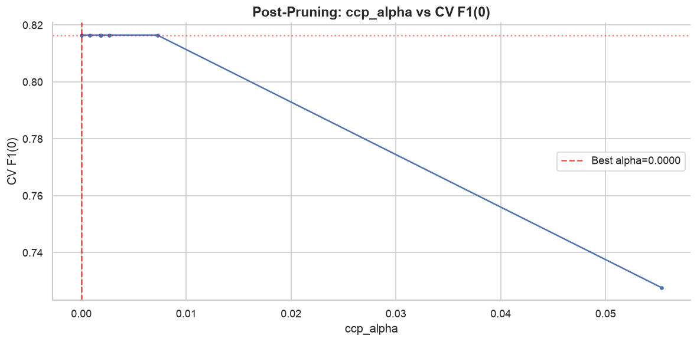
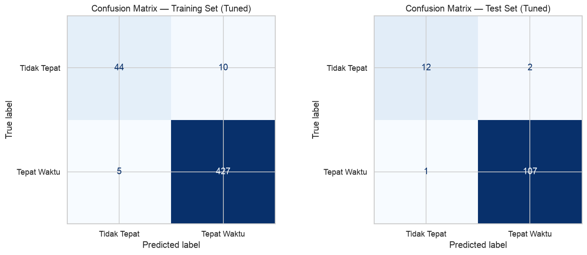
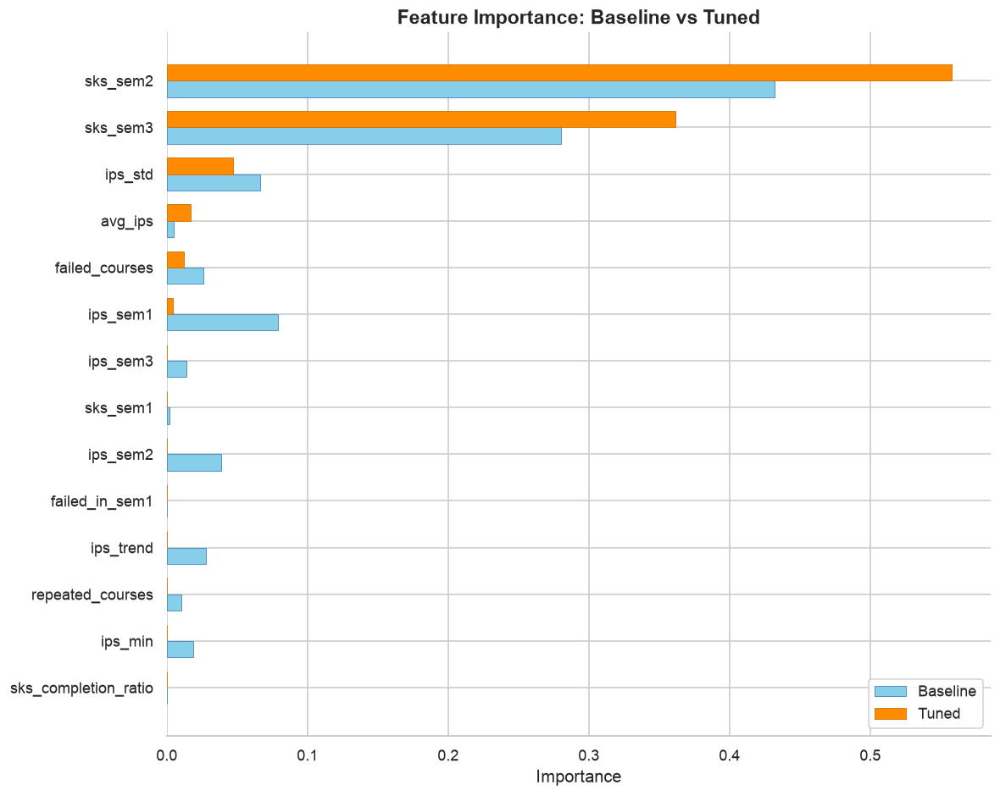
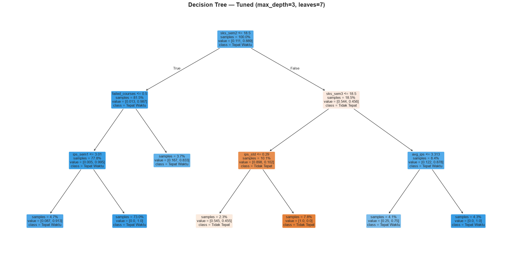
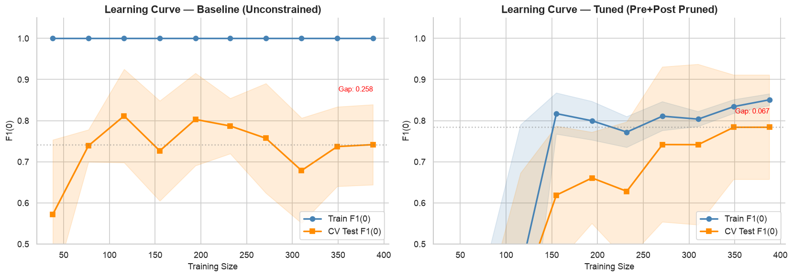
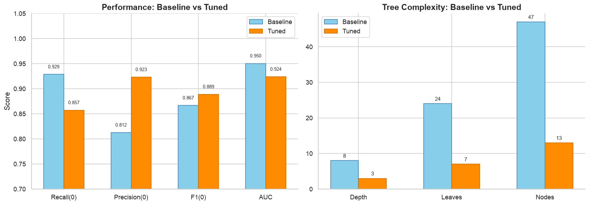

# 01 — Hyperparameter Tuning: Decision Tree dengan Pre-Pruning + Post-Pruning

Fase 4 CRISP-DM | Iterasi 3: Hyperparameter Tuning

**Tujuan:** Mengurangi overfitting Decision Tree baseline (train=1.0, depth=8, 24 leaves)
melalui 2-stage strategy: GridSearchCV pre-pruning + ccp_alpha post-pruning.

**Baseline (Iterasi 2 — Global Median):**
- Recall(0)=0.929, F1(0)=0.867, AUC=0.950
- Overfit gap: train perfect 1.0, CV ROC-AUC 0.854
- Depth 8, 24 leaves — tree terlalu kompleks

**Strategy:**
1. Tahap 1: GridSearchCV pre-pruning (max_depth, min_samples_leaf, min_samples_split, class_weight, criterion)
2. Tahap 2: Post-pruning via ccp_alpha optimal
3. Tahap 3: Final model dengan best params gabungan


```python
import pandas as pd, numpy as np
import matplotlib.pyplot as plt
import seaborn as sns

from sklearn.tree import DecisionTreeClassifier, plot_tree, export_text
from sklearn.model_selection import (
    train_test_split, StratifiedKFold, cross_validate,
    GridSearchCV, learning_curve, cross_val_score
)
from sklearn.metrics import (
    accuracy_score, precision_score, recall_score, f1_score,
    confusion_matrix, classification_report,
    roc_auc_score, ConfusionMatrixDisplay,
    make_scorer
)

sns.set_theme(style='whitegrid')
plt.rcParams['figure.dpi'] = 120

print("Library loaded.")
print(f"  pandas : {pd.__version__}")
print(f"  sklearn: imported")
```

    Library loaded.
      pandas : 3.0.3
      sklearn: imported


```python
# Load data
df = pd.read_csv('dataset_clean.csv')

# Stratified split 80/20 — EXACT SAME as iteration 2
X = df.drop(columns=['target'])
y = df['target']

X_train, X_test, y_train, y_test = train_test_split(
    X, y, test_size=0.2, random_state=42, stratify=y
)

# Drop angkatan + program (data leakage)
drop_cols = ['angkatan', 'program']
X_train = X_train.drop(columns=drop_cols)
X_test  = X_test.drop(columns=drop_cols)

print(f"Dataset: {df.shape[0]} rows x {df.shape[1]} cols")
print(f"After drop: {len(X_train.columns)} features")
print(f"Train: {X_train.shape[0]} rows ({y_train.value_counts().get(1, 0)} Tepat, {y_train.value_counts().get(0, 0)} Tidak)")
print(f"Test:  {X_test.shape[0]} rows ({y_test.value_counts().get(1, 0)} Tepat, {y_test.value_counts().get(0, 0)} Tidak)")
```

    Dataset: 608 rows x 17 cols
    After drop: 14 features
    Train: 486 rows (432 Tepat, 54 Tidak)
    Test:  122 rows (108 Tepat, 14 Tidak)


```python
# Baseline reference: unconstrained tree (same as Iteration 2 stratified baseline)
dt_baseline = DecisionTreeClassifier(random_state=42)
dt_baseline.fit(X_train, y_train)

y_pred_base = dt_baseline.predict(X_test)
base_recall = recall_score(y_test, y_pred_base, pos_label=0)
base_prec   = precision_score(y_test, y_pred_base, pos_label=0)
base_f1     = f1_score(y_test, y_pred_base, pos_label=0)
base_auc    = roc_auc_score(y_test, y_pred_base)

print("BASELINE (Unconstrained Decision Tree)")
print("=" * 50)
print(f"Depth:       {dt_baseline.get_depth()}")
print(f"Leaves:      {dt_baseline.get_n_leaves()}")
print(f"Nodes:       {dt_baseline.tree_.node_count}")
print(f"Recall(0):   {base_recall:.4f}")
print(f"Precision(0): {base_prec:.4f}")
print(f"F1(0):       {base_f1:.4f}")
print(f"AUC:         {base_auc:.4f}")
print(f"Train acc:   {accuracy_score(y_train, dt_baseline.predict(X_train)):.4f} (overfit!)")
```

    BASELINE (Unconstrained Decision Tree)
    ==================================================
    Depth:       8
    Leaves:      24
    Nodes:       47
    Recall(0):   0.9286
    Precision(0): 0.8125
    F1(0):       0.8667
    AUC:         0.9504
    Train acc:   1.0000 (overfit!)


## Tahap 1: Pre-pruning via GridSearchCV

Scoring: `f1_score(pos_label=0)` — fokus pada kelas minoritas (Tidak Tepat).
CV: `StratifiedKFold(n_splits=5)` — proporsi kelas terjaga di setiap fold.


```python
f1_scorer = make_scorer(f1_score, pos_label=0)
cv = StratifiedKFold(n_splits=5, shuffle=True, random_state=42)

param_grid = {
    'max_depth':          [3, 4, 5, 6, None],
    'min_samples_leaf':   [5, 10, 15, 20],
    'min_samples_split':  [5, 10, 20],
    'class_weight':       [None, 'balanced'],
    'criterion':          ['gini', 'entropy'],
}

print(f"Parameter grid: {len(param_grid)} hyperparameters")
print(f"Total combinations: 5 x 4 x 3 x 2 x 2 = {5*4*3*2*2}")
print(f"CV strategy: StratifiedKFold(5 splits)")
print(f"Scoring: f1_score(pos_label=0)")

gs = GridSearchCV(
    DecisionTreeClassifier(random_state=42),
    param_grid, scoring=f1_scorer, cv=cv,
    n_jobs=-1, verbose=2, return_train_score=True
)
gs.fit(X_train, y_train)

print(f"\n{'='*50}")
print("GRIDSEARCH RESULTS")
print(f"{'='*50}")
print(f"Best params: {gs.best_params_}")
print(f"Best CV F1(0): {gs.best_score_:.4f}")
```

    Parameter grid: 5 hyperparameters
    Total combinations: 5 x 4 x 3 x 2 x 2 = 240
    CV strategy: StratifiedKFold(5 splits)
    Scoring: f1_score(pos_label=0)
    Fitting 5 folds for each of 240 candidates, totalling 1200 fits


    [CV] END class_weight=None, criterion=gini, max_depth=3, min_samples_leaf=5, min_samples_split=5; total time=   0.0s
    [CV] END class_weight=None, criterion=gini, max_depth=3, min_samples_leaf=5, min_samples_split=5; total time=   0.0s
    [CV] END class_weight=None, criterion=gini, max_depth=3, min_samples_leaf=5, min_samples_split=10; total time=   0.0s
    [CV] END class_weight=None, criterion=gini, max_depth=3, min_samples_leaf=5, min_samples_split=10; total time=   0.0s
    [CV] END class_weight=None, criterion=gini, max_depth=3, min_samples_leaf=5, min_samples_split=10; total time=   0.0s
    [CV] END class_weight=None, criterion=gini, max_depth=3, min_samples_leaf=5, min_samples_split=20; total time=   0.0s
    [CV] END class_weight=None, criterion=gini, max_depth=3, min_samples_leaf=5, min_samples_split=20; total time=   0.0s
    [CV] END class_weight=None, criterion=gini, max_depth=3, min_samples_leaf=5, min_samples_split=20; total time=   0.0s
    [CV] END class_weight=None, criterion=gini, max_depth=3, min_samples_leaf=10, min_samples_split=5; total time=   0.0s
    [CV] END class_weight=None, criterion=gini, max_depth=3, min_samples_leaf=10, min_samples_split=10; total time=   0.0s
    [CV] END class_weight=None, criterion=gini, max_depth=3, min_samples_leaf=10, min_samples_split=10; total time=   0.0s
    [CV] END class_weight=None, criterion=gini, max_depth=3, min_samples_leaf=10, min_samples_split=20; total time=   0.0s
    [CV] END class_weight=None, criterion=gini, max_depth=3, min_samples_leaf=10, min_samples_split=20; total time=   0.0s
    [CV] END class_weight=None, criterion=gini, max_depth=3, min_samples_leaf=15, min_samples_split=5; total time=   0.0s
    [CV] END class_weight=None, criterion=gini, max_depth=3, min_samples_leaf=15, min_samples_split=5; total time=   0.0s
    [CV] END class_weight=None, criterion=gini, max_depth=3, min_samples_leaf=15, min_samples_split=10; total time=   0.0s
    [CV] END class_weight=None, criterion=gini, max_depth=3, min_samples_leaf=15, min_samples_split=10; total time=   0.0s
    [CV] END class_weight=None, criterion=gini, max_depth=3, min_samples_leaf=15, min_samples_split=20; total time=   0.0s
    [CV] END class_weight=None, criterion=gini, max_depth=3, min_samples_leaf=20, min_samples_split=5; total time=   0.0s
    [CV] END class_weight=None, criterion=gini, max_depth=3, min_samples_leaf=20, min_samples_split=5; total time=   0.0s
    [CV] END class_weight=None, criterion=gini, max_depth=3, min_samples_leaf=20, min_samples_split=5; total time=   0.0s
    [CV] END class_weight=None, criterion=gini, max_depth=3, min_samples_leaf=20, min_samples_split=10; total time=   0.0s
    [CV] END class_weight=None, criterion=gini, max_depth=3, min_samples_leaf=20, min_samples_split=10; total time=   0.0s
    [CV] END class_weight=None, criterion=gini, max_depth=4, min_samples_leaf=5, min_samples_split=5; total time=   0.0s
    [CV] END class_weight=None, criterion=gini, max_depth=4, min_samples_leaf=5, min_samples_split=10; total time=   0.0s
    [CV] END class_weight=None, criterion=gini, max_depth=4, min_samples_leaf=5, min_samples_split=10; total time=   0.0s
    [CV] END class_weight=None, criterion=gini, max_depth=4, min_samples_leaf=5, min_samples_split=10; total time=   0.0s
    [CV] END class_weight=None, criterion=gini, max_depth=4, min_samples_leaf=5, min_samples_split=20; total time=   0.0s
    [CV] END class_weight=None, criterion=gini, max_depth=4, min_samples_leaf=5, min_samples_split=20; total time=   0.0s
    [CV] END class_weight=None, criterion=gini, max_depth=4, min_samples_leaf=5, min_samples_split=20; total time=   0.0s
    [CV] END class_weight=None, criterion=gini, max_depth=4, min_samples_leaf=10, min_samples_split=5; total time=   0.0s
    [CV] END class_weight=None, criterion=gini, max_depth=4, min_samples_leaf=10, min_samples_split=10; total time=   0.0s
    [CV] END class_weight=None, criterion=gini, max_depth=4, min_samples_leaf=10, min_samples_split=20; total time=   0.0s
    [CV] END class_weight=None, criterion=gini, max_depth=4, min_samples_leaf=10, min_samples_split=20; total time=   0.0s
    [CV] END class_weight=None, criterion=gini, max_depth=4, min_samples_leaf=10, min_samples_split=20; total time=   0.0s
    [CV] END class_weight=None, criterion=gini, max_depth=4, min_samples_leaf=15, min_samples_split=10; total time=   0.0s
    [CV] END class_weight=None, criterion=gini, max_depth=4, min_samples_leaf=15, min_samples_split=10; total time=   0.0s
    [CV] END class_weight=None, criterion=gini, max_depth=4, min_samples_leaf=15, min_samples_split=10; total time=   0.0s
    [CV] END class_weight=None, criterion=gini, max_depth=4, min_samples_leaf=15, min_samples_split=10; total time=   0.0s
    [CV] END class_weight=None, criterion=gini, max_depth=4, min_samples_leaf=15, min_samples_split=20; total time=   0.0s
    [CV] END class_weight=None, criterion=gini, max_depth=4, min_samples_leaf=20, min_samples_split=5; total time=   0.0s
    [CV] END class_weight=None, criterion=gini, max_depth=4, min_samples_leaf=20, min_samples_split=5; total time=   0.0s
    [CV] END class_weight=None, criterion=gini, max_depth=4, min_samples_leaf=20, min_samples_split=5; total time=   0.0s
    [CV] END class_weight=None, criterion=gini, max_depth=5, min_samples_leaf=5, min_samples_split=5; total time=   0.0s
    [CV] END class_weight=None, criterion=gini, max_depth=5, min_samples_leaf=5, min_samples_split=5; total time=   0.0s
    [CV] END class_weight=None, criterion=gini, max_depth=5, min_samples_leaf=5, min_samples_split=5; total time=   0.0s
    [CV] END class_weight=None, criterion=gini, max_depth=5, min_samples_leaf=5, min_samples_split=5; total time=   0.0s
    [CV] END class_weight=None, criterion=gini, max_depth=5, min_samples_leaf=10, min_samples_split=5; total time=   0.0s
    [CV] END class_weight=None, criterion=gini, max_depth=5, min_samples_leaf=10, min_samples_split=5; total time=   0.0s
    [CV] END class_weight=None, criterion=gini, max_depth=5, min_samples_leaf=10, min_samples_split=5; total time=   0.0s
    [CV] END class_weight=None, criterion=gini, max_depth=5, min_samples_leaf=10, min_samples_split=5; total time=   0.0s
    [CV] END class_weight=None, criterion=gini, max_depth=5, min_samples_leaf=10, min_samples_split=20; total time=   0.0s
    [CV] END class_weight=None, criterion=gini, max_depth=5, min_samples_leaf=10, min_samples_split=20; total time=   0.0s
    [CV] END class_weight=None, criterion=gini, max_depth=5, min_samples_leaf=15, min_samples_split=5; total time=   0.0s
    [CV] END class_weight=None, criterion=gini, max_depth=5, min_samples_leaf=15, min_samples_split=5; total time=   0.0s
    [CV] END class_weight=None, criterion=gini, max_depth=5, min_samples_leaf=20, min_samples_split=5; total time=   0.0s
    [CV] END class_weight=None, criterion=gini, max_depth=5, min_samples_leaf=20, min_samples_split=5; total time=   0.0s
    [CV] END class_weight=None, criterion=gini, max_depth=5, min_samples_leaf=20, min_samples_split=10; total time=   0.0s
    [CV] END class_weight=None, criterion=gini, max_depth=5, min_samples_leaf=20, min_samples_split=10; total time=   0.0s
    [CV] END class_weight=None, criterion=gini, max_depth=6, min_samples_leaf=5, min_samples_split=5; total time=   0.0s
    [CV] END class_weight=None, criterion=gini, max_depth=6, min_samples_leaf=5, min_samples_split=10; total time=   0.0s
    [CV] END class_weight=None, criterion=gini, max_depth=6, min_samples_leaf=5, min_samples_split=10; total time=   0.0s
    [CV] END class_weight=None, criterion=gini, max_depth=6, min_samples_leaf=5, min_samples_split=10; total time=   0.0s
    [CV] END class_weight=None, criterion=gini, max_depth=6, min_samples_leaf=10, min_samples_split=10; total time=   0.0s
    [CV] END class_weight=None, criterion=gini, max_depth=6, min_samples_leaf=10, min_samples_split=10; total time=   0.0s
    [CV] END class_weight=None, criterion=gini, max_depth=6, min_samples_leaf=10, min_samples_split=10; total time=   0.0s
    [CV] END class_weight=None, criterion=gini, max_depth=6, min_samples_leaf=10, min_samples_split=10; total time=   0.0s
    [CV] END class_weight=None, criterion=gini, max_depth=6, min_samples_leaf=15, min_samples_split=5; total time=   0.0s
    [CV] END class_weight=None, criterion=gini, max_depth=6, min_samples_leaf=15, min_samples_split=5; total time=   0.0s
    [CV] END class_weight=None, criterion=gini, max_depth=6, min_samples_leaf=15, min_samples_split=5; total time=   0.0s[CV] END class_weight=None, criterion=gini, max_depth=3, min_samples_leaf=5, min_samples_split=5; total time=   0.0s
    [CV] END class_weight=None, criterion=gini, max_depth=3, min_samples_leaf=5, min_samples_split=10; total time=   0.0s
    [CV] END class_weight=None, criterion=gini, max_depth=3, min_samples_leaf=5, min_samples_split=10; total time=   0.0s
    [CV] END class_weight=None, criterion=gini, max_depth=3, min_samples_leaf=5, min_samples_split=20; total time=   0.0s
    [CV] END class_weight=None, criterion=gini, max_depth=3, min_samples_leaf=5, min_samples_split=20; total time=   0.0s
    [CV] END class_weight=None, criterion=gini, max_depth=3, min_samples_leaf=10, min_samples_split=5; total time=   0.0s
    [CV] END class_weight=None, criterion=gini, max_depth=3, min_samples_leaf=10, min_samples_split=5; total time=   0.0s
    [CV] END class_weight=None, criterion=gini, max_depth=3, min_samples_leaf=10, min_samples_split=10; total time=   0.0s
    [CV] END class_weight=None, criterion=gini, max_depth=3, min_samples_leaf=10, min_samples_split=10; total time=   0.0s
    [CV] END class_weight=None, criterion=gini, max_depth=3, min_samples_leaf=10, min_samples_split=20; total time=   0.0s
    [CV] END class_weight=None, criterion=gini, max_depth=3, min_samples_leaf=15, min_samples_split=5; total time=   0.0s
    [CV] END class_weight=None, criterion=gini, max_depth=3, min_samples_leaf=15, min_samples_split=5; total time=   0.0s
    [CV] END class_weight=None, criterion=gini, max_depth=3, min_samples_leaf=15, min_samples_split=10; total time=   0.0s
    [CV] END class_weight=None, criterion=gini, max_depth=3, min_samples_leaf=15, min_samples_split=20; total time=   0.0s
    [CV] END class_weight=None, criterion=gini, max_depth=3, min_samples_leaf=15, min_samples_split=20; total time=   0.0s
    [CV] END class_weight=None, criterion=gini, max_depth=3, min_samples_leaf=20, min_samples_split=5; total time=   0.0s
    [CV] END class_weight=None, criterion=gini, max_depth=3, min_samples_leaf=20, min_samples_split=5; total time=   0.0s
    [CV] END class_weight=None, criterion=gini, max_depth=3, min_samples_leaf=20, min_samples_split=20; total time=   0.0s
    [CV] END class_weight=None, criterion=gini, max_depth=3, min_samples_leaf=20, min_samples_split=20; total time=   0.0s
    [CV] END class_weight=None, criterion=gini, max_depth=3, min_samples_leaf=20, min_samples_split=20; total time=   0.0s
    [CV] END class_weight=None, criterion=gini, max_depth=3, min_samples_leaf=20, min_samples_split=20; total time=   0.0s
    [CV] END class_weight=None, criterion=gini, max_depth=4, min_samples_leaf=5, min_samples_split=10; total time=   0.0s
    [CV] END class_weight=None, criterion=gini, max_depth=4, min_samples_leaf=5, min_samples_split=10; total time=   0.0s
    [CV] END class_weight=None, criterion=gini, max_depth=4, min_samples_leaf=5, min_samples_split=20; total time=   0.0s
    [CV] END class_weight=None, criterion=gini, max_depth=4, min_samples_leaf=5, min_samples_split=20; total time=   0.0s
    [CV] END class_weight=None, criterion=gini, max_depth=4, min_samples_leaf=10, min_samples_split=5; total time=   0.0s
    [CV] END class_weight=None, criterion=gini, max_depth=4, min_samples_leaf=10, min_samples_split=5; total time=   0.0s
    [CV] END class_weight=None, criterion=gini, max_depth=4, min_samples_leaf=10, min_samples_split=5; total time=   0.0s
    [CV] END class_weight=None, criterion=gini, max_depth=4, min_samples_leaf=10, min_samples_split=5; total time=   0.0s
    [CV] END class_weight=None, criterion=gini, max_depth=4, min_samples_leaf=10, min_samples_split=20; total time=   0.0s
    [CV] END class_weight=None, criterion=gini, max_depth=4, min_samples_leaf=10, min_samples_split=20; total time=   0.0s
    [CV] END class_weight=None, criterion=gini, max_depth=4, min_samples_leaf=15, min_samples_split=5; total time=   0.0s
    [CV] END class_weight=None, criterion=gini, max_depth=4, min_samples_leaf=15, min_samples_split=5; total time=   0.0s
    [CV] END class_weight=None, criterion=gini, max_depth=4, min_samples_leaf=15, min_samples_split=20; total time=   0.0s
    [CV] END class_weight=None, criterion=gini, max_depth=4, min_samples_leaf=15, min_samples_split=20; total time=   0.0s
    [CV] END class_weight=None, criterion=gini, max_depth=4, min_samples_leaf=15, min_samples_split=20; total time=   0.0s
    [CV] END class_weight=None, criterion=gini, max_depth=4, min_samples_leaf=15, min_samples_split=20; total time=   0.0s
    [CV] END class_weight=None, criterion=gini, max_depth=4, min_samples_leaf=20, min_samples_split=10; total time=   0.0s
    [CV] END class_weight=None, criterion=gini, max_depth=4, min_samples_leaf=20, min_samples_split=10; total time=   0.0s
    [CV] END class_weight=None, criterion=gini, max_depth=4, min_samples_leaf=20, min_samples_split=10; total time=   0.0s
    [CV] END class_weight=None, criterion=gini, max_depth=4, min_samples_leaf=20, min_samples_split=20; total time=   0.0s
    [CV] END class_weight=None, criterion=gini, max_depth=5, min_samples_leaf=5, min_samples_split=10; total time=   0.0s
    [CV] END class_weight=None, criterion=gini, max_depth=5, min_samples_leaf=5, min_samples_split=10; total time=   0.0s
    [CV] END class_weight=None, criterion=gini, max_depth=5, min_samples_leaf=5, min_samples_split=20; total time=   0.0s
    [CV] END class_weight=None, criterion=gini, max_depth=5, min_samples_leaf=5, min_samples_split=20; total time=   0.0s
    [CV] END class_weight=None, criterion=gini, max_depth=5, min_samples_leaf=10, min_samples_split=10; total time=   0.0s
    [CV] END class_weight=None, criterion=gini, max_depth=5, min_samples_leaf=10, min_samples_split=20; total time=   0.0s
    [CV] END class_weight=None, criterion=gini, max_depth=5, min_samples_leaf=10, min_samples_split=20; total time=   0.0s
    [CV] END class_weight=None, criterion=gini, max_depth=5, min_samples_leaf=10, min_samples_split=20; total time=   0.0s
    [CV] END class_weight=None, criterion=gini, max_depth=5, min_samples_leaf=15, min_samples_split=10; total time=   0.0s
    [CV] END class_weight=None, criterion=gini, max_depth=5, min_samples_leaf=15, min_samples_split=10; total time=   0.0s
    [CV] END class_weight=None, criterion=gini, max_depth=5, min_samples_leaf=15, min_samples_split=10; total time=   0.0s
    [CV] END class_weight=None, criterion=gini, max_depth=5, min_samples_leaf=15, min_samples_split=10; total time=   0.0s
    [CV] END class_weight=None, criterion=gini, max_depth=5, min_samples_leaf=15, min_samples_split=20; total time=   0.0s
    [CV] END class_weight=None, criterion=gini, max_depth=5, min_samples_leaf=20, min_samples_split=5; total time=   0.0s
    [CV] END class_weight=None, criterion=gini, max_depth=5, min_samples_leaf=20, min_samples_split=5; total time=   0.0s
    [CV] END class_weight=None, criterion=gini, max_depth=5, min_samples_leaf=20, min_samples_split=5; total time=   0.0s
    [CV] END class_weight=None, criterion=gini, max_depth=6, min_samples_leaf=5, min_samples_split=5; total time=   0.0s
    [CV] END class_weight=None, criterion=gini, max_depth=6, min_samples_leaf=5, min_samples_split=5; total time=   0.0s
    [CV] END class_weight=None, criterion=gini, max_depth=6, min_samples_leaf=5, min_samples_split=5; total time=   0.0s
    [CV] END class_weight=None, criterion=gini, max_depth=6, min_samples_leaf=5, min_samples_split=5; total time=   0.0s
    [CV] END class_weight=None, criterion=gini, max_depth=6, min_samples_leaf=10, min_samples_split=5; total time=   0.0s
    [CV] END class_weight=None, criterion=gini, max_depth=6, min_samples_leaf=10, min_samples_split=5; total time=   0.0s
    [CV] END class_weight=None, criterion=gini, max_depth=6, min_samples_leaf=10, min_samples_split=5; total time=   0.0s
    [CV] END class_weight=None, criterion=gini, max_depth=6, min_samples_leaf=10, min_samples_split=5; total time=   0.0s
    [CV] END class_weight=None, criterion=gini, max_depth=6, min_samples_leaf=15, min_samples_split=10; total time=   0.0s
    [CV] END class_weight=None, criterion=gini, max_depth=6, min_samples_leaf=15, min_samples_split=10; total time=   0.0s
    [CV] END class_weight=None, criterion=gini, max_depth=6, min_samples_leaf=15, min_samples_split=10; total time=   0.0s
    [CV] END class_weight=None, criterion=gini, max_depth=6, min_samples_leaf=15, min_samples_split=10; total time=   0.0s
    [CV] END class_weight=None, criterion=gini, max_depth=6, min_samples_leaf=20, min_samples_split=10; total time=   0.0s

    [CV] END class_weight=None, criterion=gini, max_depth=3, min_samples_leaf=5, min_samples_split=5; total time=   0.1s
    [CV] END class_weight=None, criterion=gini, max_depth=3, min_samples_leaf=10, min_samples_split=5; total time=   0.0s
    [CV] END class_weight=None, criterion=gini, max_depth=3, min_samples_leaf=10, min_samples_split=5; total time=   0.0s
    [CV] END class_weight=None, criterion=gini, max_depth=3, min_samples_leaf=10, min_samples_split=10; total time=   0.0s
    [CV] END class_weight=None, criterion=gini, max_depth=3, min_samples_leaf=10, min_samples_split=20; total time=   0.0s
    [CV] END class_weight=None, criterion=gini, max_depth=3, min_samples_leaf=10, min_samples_split=20; total time=   0.0s
    [CV] END class_weight=None, criterion=gini, max_depth=3, min_samples_leaf=15, min_samples_split=5; total time=   0.0s
    [CV] END class_weight=None, criterion=gini, max_depth=3, min_samples_leaf=15, min_samples_split=10; total time=   0.0s
    [CV] END class_weight=None, criterion=gini, max_depth=3, min_samples_leaf=15, min_samples_split=10; total time=   0.0s
    [CV] END class_weight=None, criterion=gini, max_depth=3, min_samples_leaf=15, min_samples_split=20; total time=   0.0s
    [CV] END class_weight=None, criterion=gini, max_depth=3, min_samples_leaf=15, min_samples_split=20; total time=   0.0s
    [CV] END class_weight=None, criterion=gini, max_depth=3, min_samples_leaf=20, min_samples_split=10; total time=   0.0s
    [CV] END class_weight=None, criterion=gini, max_depth=3, min_samples_leaf=20, min_samples_split=10; total time=   0.0s
    [CV] END class_weight=None, criterion=gini, max_depth=3, min_samples_leaf=20, min_samples_split=10; total time=   0.0s
    [CV] END class_weight=None, criterion=gini, max_depth=3, min_samples_leaf=20, min_samples_split=20; total time=   0.0s
    [CV] END class_weight=None, criterion=gini, max_depth=4, min_samples_leaf=5, min_samples_split=5; total time=   0.0s
    [CV] END class_weight=None, criterion=gini, max_depth=4, min_samples_leaf=5, min_samples_split=5; total time=   0.0s
    [CV] END class_weight=None, criterion=gini, max_depth=4, min_samples_leaf=5, min_samples_split=5; total time=   0.0s
    [CV] END class_weight=None, criterion=gini, max_depth=4, min_samples_leaf=5, min_samples_split=5; total time=   0.0s
    [CV] END class_weight=None, criterion=gini, max_depth=4, min_samples_leaf=10, min_samples_split=10; total time=   0.0s
    [CV] END class_weight=None, criterion=gini, max_depth=4, min_samples_leaf=10, min_samples_split=10; total time=   0.0s
    [CV] END class_weight=None, criterion=gini, max_depth=4, min_samples_leaf=10, min_samples_split=10; total time=   0.0s
    [CV] END class_weight=None, criterion=gini, max_depth=4, min_samples_leaf=10, min_samples_split=10; total time=   0.0s
    [CV] END class_weight=None, criterion=gini, max_depth=4, min_samples_leaf=15, min_samples_split=5; total time=   0.0s
    [CV] END class_weight=None, criterion=gini, max_depth=4, min_samples_leaf=15, min_samples_split=5; total time=   0.0s
    [CV] END class_weight=None, criterion=gini, max_depth=4, min_samples_leaf=15, min_samples_split=5; total time=   0.0s
    [CV] END class_weight=None, criterion=gini, max_depth=4, min_samples_leaf=15, min_samples_split=10; total time=   0.0s
    [CV] END class_weight=None, criterion=gini, max_depth=4, min_samples_leaf=20, min_samples_split=5; total time=   0.0s
    [CV] END class_weight=None, criterion=gini, max_depth=4, min_samples_leaf=20, min_samples_split=5; total time=   0.0s
    [CV] END class_weight=None, criterion=gini, max_depth=4, min_samples_leaf=20, min_samples_split=10; total time=   0.0s
    [CV] END class_weight=None, criterion=gini, max_depth=4, min_samples_leaf=20, min_samples_split=10; total time=   0.0s
    [CV] END class_weight=None, criterion=gini, max_depth=5, min_samples_leaf=5, min_samples_split=5; total time=   0.0s
    [CV] END class_weight=None, criterion=gini, max_depth=5, min_samples_leaf=5, min_samples_split=10; total time=   0.0s
    [CV] END class_weight=None, criterion=gini, max_depth=5, min_samples_leaf=5, min_samples_split=10; total time=   0.0s
    [CV] END class_weight=None, criterion=gini, max_depth=5, min_samples_leaf=5, min_samples_split=10; total time=   0.0s
    [CV] END class_weight=None, criterion=gini, max_depth=5, min_samples_leaf=10, min_samples_split=10; total time=   0.0s
    [CV] END class_weight=None, criterion=gini, max_depth=5, min_samples_leaf=10, min_samples_split=10; total time=   0.0s
    [CV] END class_weight=None, criterion=gini, max_depth=5, min_samples_leaf=10, min_samples_split=10; total time=   0.0s
    [CV] END class_weight=None, criterion=gini, max_depth=5, min_samples_leaf=10, min_samples_split=10; total time=   0.0s
    [CV] END class_weight=None, criterion=gini, max_depth=5, min_samples_leaf=15, min_samples_split=20; total time=   0.0s
    [CV] END class_weight=None, criterion=gini, max_depth=5, min_samples_leaf=15, min_samples_split=20; total time=   0.0s
    [CV] END class_weight=None, criterion=gini, max_depth=5, min_samples_leaf=15, min_samples_split=20; total time=   0.0s
    [CV] END class_weight=None, criterion=gini, max_depth=5, min_samples_leaf=15, min_samples_split=20; total time=   0.0s
    [CV] END class_weight=None, criterion=gini, max_depth=5, min_samples_leaf=20, min_samples_split=20; total time=   0.0s
    [CV] END class_weight=None, criterion=gini, max_depth=5, min_samples_leaf=20, min_samples_split=20; total time=   0.0s
    [CV] END class_weight=None, criterion=gini, max_depth=5, min_samples_leaf=20, min_samples_split=20; total time=   0.0s
    [CV] END class_weight=None, criterion=gini, max_depth=5, min_samples_leaf=20, min_samples_split=20; total time=   0.0s
    [CV] END class_weight=None, criterion=gini, max_depth=6, min_samples_leaf=5, min_samples_split=20; total time=   0.0s
    [CV] END class_weight=None, criterion=gini, max_depth=6, min_samples_leaf=5, min_samples_split=20; total time=   0.0s
    [CV] END class_weight=None, criterion=gini, max_depth=6, min_samples_leaf=5, min_samples_split=20; total time=   0.0s
    [CV] END class_weight=None, criterion=gini, max_depth=6, min_samples_leaf=10, min_samples_split=5; total time=   0.0s
    [CV] END class_weight=None, criterion=gini, max_depth=6, min_samples_leaf=10, min_samples_split=20; total time=   0.0s
    [CV] END class_weight=None, criterion=gini, max_depth=6, min_samples_leaf=10, min_samples_split=20; total time=   0.0s
    [CV] END class_weight=None, criterion=gini, max_depth=6, min_samples_leaf=15, min_samples_split=5; total time=   0.0s
    [CV] END class_weight=None, criterion=gini, max_depth=6, min_samples_leaf=15, min_samples_split=5; total time=   0.0s
    [CV] END class_weight=None, criterion=gini, max_depth=6, min_samples_leaf=20, min_samples_split=5; total time=   0.0s
    [CV] END class_weight=None, criterion=gini, max_depth=6, min_samples_leaf=20, min_samples_split=5; total time=   0.0s
    [CV] END class_weight=None, criterion=gini, max_depth=6, min_samples_leaf=20, min_samples_split=10; total time=   0.0s
    [CV] END class_weight=None, criterion=gini, max_depth=6, min_samples_leaf=20, min_samples_split=10; total time=   0.0s
    [CV] END class_weight=None, criterion=gini, max_depth=None, min_samples_leaf=5, min_samples_split=5; total time=   0.0s
    [CV] END class_weight=None, criterion=gini, max_depth=None, min_samples_leaf=5, min_samples_split=10; total time=   0.0s
    [CV] END class_weight=None, criterion=gini, max_depth=None, min_samples_leaf=5, min_samples_split=10; total time=   0.0s
    [CV] END class_weight=None, criterion=gini, max_depth=None, min_samples_leaf=5, min_samples_split=10; total time=   0.0s
    [CV] END class_weight=None, criterion=gini, max_depth=None, min_samples_leaf=10, min_samples_split=5; total time=   0.0s
    [CV] END class_weight=None, criterion=gini, max_depth=None, min_samples_leaf=10, min_samples_split=5; total time=   0.0s
    [CV] END class_weight=None, criterion=gini, max_depth=None, min_samples_leaf=10, min_samples_split=5; total time=   0.0s
    [CV] END class_weight=None, criterion=gini, max_depth=None, min_samples_leaf=10, min_samples_split=5; total time=   0.0s
    [CV] END class_weight=None, criterion=gini, max_depth=None, min_samples_leaf=10, min_samples_split=10; total time=   0.0s
    [CV] END class_weight=None, criterion=gini, max_depth=None, min_samples_leaf=10, min_samples_split=10; total time=   0.0s

    [CV] END class_weight=None, criterion=gini, max_depth=3, min_samples_leaf=5, min_samples_split=5; total time=   0.0s
    [CV] END class_weight=None, criterion=gini, max_depth=4, min_samples_leaf=20, min_samples_split=20; total time=   0.0s
    [CV] END class_weight=None, criterion=gini, max_depth=4, min_samples_leaf=20, min_samples_split=20; total time=   0.0s
    [CV] END class_weight=None, criterion=gini, max_depth=4, min_samples_leaf=20, min_samples_split=20; total time=   0.0s
    [CV] END class_weight=None, criterion=gini, max_depth=4, min_samples_leaf=20, min_samples_split=20; total time=   0.0s
    [CV] END class_weight=None, criterion=gini, max_depth=5, min_samples_leaf=5, min_samples_split=20; total time=   0.0s
    [CV] END class_weight=None, criterion=gini, max_depth=5, min_samples_leaf=5, min_samples_split=20; total time=   0.0s
    [CV] END class_weight=None, criterion=gini, max_depth=5, min_samples_leaf=5, min_samples_split=20; total time=   0.0s
    [CV] END class_weight=None, criterion=gini, max_depth=5, min_samples_leaf=10, min_samples_split=5; total time=   0.0s
    [CV] END class_weight=None, criterion=gini, max_depth=5, min_samples_leaf=15, min_samples_split=5; total time=   0.0s
    [CV] END class_weight=None, criterion=gini, max_depth=5, min_samples_leaf=15, min_samples_split=5; total time=   0.0s
    [CV] END class_weight=None, criterion=gini, max_depth=5, min_samples_leaf=15, min_samples_split=5; total time=   0.0s
    [CV] END class_weight=None, criterion=gini, max_depth=5, min_samples_leaf=15, min_samples_split=10; total time=   0.0s
    [CV] END class_weight=None, criterion=gini, max_depth=5, min_samples_leaf=20, min_samples_split=10; total time=   0.0s
    [CV] END class_weight=None, criterion=gini, max_depth=5, min_samples_leaf=20, min_samples_split=10; total time=   0.0s
    [CV] END class_weight=None, criterion=gini, max_depth=5, min_samples_leaf=20, min_samples_split=10; total time=   0.0s
    [CV] END class_weight=None, criterion=gini, max_depth=5, min_samples_leaf=20, min_samples_split=20; total time=   0.0s
    [CV] END class_weight=None, criterion=gini, max_depth=6, min_samples_leaf=5, min_samples_split=10; total time=   0.0s
    [CV] END class_weight=None, criterion=gini, max_depth=6, min_samples_leaf=5, min_samples_split=10; total time=   0.0s
    [CV] END class_weight=None, criterion=gini, max_depth=6, min_samples_leaf=5, min_samples_split=20; total time=   0.0s
    [CV] END class_weight=None, criterion=gini, max_depth=6, min_samples_leaf=5, min_samples_split=20; total time=   0.0s
    [CV] END class_weight=None, criterion=gini, max_depth=6, min_samples_leaf=10, min_samples_split=10; total time=   0.0s
    [CV] END class_weight=None, criterion=gini, max_depth=6, min_samples_leaf=10, min_samples_split=20; total time=   0.0s
    [CV] END class_weight=None, criterion=gini, max_depth=6, min_samples_leaf=10, min_samples_split=20; total time=   0.0s
    [CV] END class_weight=None, criterion=gini, max_depth=6, min_samples_leaf=10, min_samples_split=20; total time=   0.0s
    [CV] END class_weight=None, criterion=gini, max_depth=6, min_samples_leaf=15, min_samples_split=20; total time=   0.0s
    [CV] END class_weight=None, criterion=gini, max_depth=6, min_samples_leaf=15, min_samples_split=20; total time=   0.0s
    [CV] END class_weight=None, criterion=gini, max_depth=6, min_samples_leaf=15, min_samples_split=20; total time=   0.0s
    [CV] END class_weight=None, criterion=gini, max_depth=6, min_samples_leaf=15, min_samples_split=20; total time=   0.0s
    [CV] END class_weight=None, criterion=gini, max_depth=6, min_samples_leaf=20, min_samples_split=20; total time=   0.0s
    [CV] END class_weight=None, criterion=gini, max_depth=6, min_samples_leaf=20, min_samples_split=20; total time=   0.0s
    [CV] END class_weight=None, criterion=gini, max_depth=6, min_samples_leaf=20, min_samples_split=20; total time=   0.0s
    [CV] END class_weight=None, criterion=gini, max_depth=6, min_samples_leaf=20, min_samples_split=20; total time=   0.0s
    [CV] END class_weight=None, criterion=gini, max_depth=None, min_samples_leaf=15, min_samples_split=20; total time=   0.0s
    [CV] END class_weight=None, criterion=gini, max_depth=None, min_samples_leaf=15, min_samples_split=20; total time=   0.0s
    [CV] END class_weight=None, criterion=gini, max_depth=None, min_samples_leaf=15, min_samples_split=20; total time=   0.0s
    [CV] END class_weight=None, criterion=gini, max_depth=None, min_samples_leaf=15, min_samples_split=20; total time=   0.0s
    [CV] END class_weight=None, criterion=gini, max_depth=None, min_samples_leaf=15, min_samples_split=20; total time=   0.0s
    [CV] END class_weight=None, criterion=gini, max_depth=None, min_samples_leaf=20, min_samples_split=5; total time=   0.0s
    [CV] END class_weight=None, criterion=gini, max_depth=None, min_samples_leaf=20, min_samples_split=5; total time=   0.0s
    [CV] END class_weight=None, criterion=gini, max_depth=None, min_samples_leaf=20, min_samples_split=5; total time=   0.0s
    [CV] END class_weight=None, criterion=entropy, max_depth=3, min_samples_leaf=10, min_samples_split=10; total time=   0.0s
    [CV] END class_weight=None, criterion=entropy, max_depth=3, min_samples_leaf=10, min_samples_split=10; total time=   0.0s
    [CV] END class_weight=None, criterion=entropy, max_depth=3, min_samples_leaf=10, min_samples_split=10; total time=   0.0s
    [CV] END class_weight=None, criterion=entropy, max_depth=3, min_samples_leaf=10, min_samples_split=10; total time=   0.0s
    [CV] END class_weight=None, criterion=entropy, max_depth=3, min_samples_leaf=10, min_samples_split=10; total time=   0.0s
    [CV] END class_weight=None, criterion=entropy, max_depth=3, min_samples_leaf=10, min_samples_split=20; total time=   0.0s
    [CV] END class_weight=None, criterion=entropy, max_depth=3, min_samples_leaf=10, min_samples_split=20; total time=   0.0s
    [CV] END class_weight=None, criterion=entropy, max_depth=3, min_samples_leaf=10, min_samples_split=20; total time=   0.0s
    [CV] END class_weight=None, criterion=entropy, max_depth=4, min_samples_leaf=10, min_samples_split=5; total time=   0.0s
    [CV] END class_weight=None, criterion=entropy, max_depth=4, min_samples_leaf=10, min_samples_split=5; total time=   0.0s
    [CV] END class_weight=None, criterion=entropy, max_depth=4, min_samples_leaf=10, min_samples_split=5; total time=   0.0s
    [CV] END class_weight=None, criterion=entropy, max_depth=4, min_samples_leaf=10, min_samples_split=5; total time=   0.0s
    [CV] END class_weight=None, criterion=entropy, max_depth=4, min_samples_leaf=10, min_samples_split=10; total time=   0.1s
    [CV] END class_weight=None, criterion=entropy, max_depth=4, min_samples_leaf=10, min_samples_split=10; total time=   0.0s
    [CV] END class_weight=None, criterion=entropy, max_depth=4, min_samples_leaf=10, min_samples_split=10; total time=   0.0s
    [CV] END class_weight=None, criterion=entropy, max_depth=4, min_samples_leaf=10, min_samples_split=10; total time=   0.0s
    [CV] END class_weight=None, criterion=entropy, max_depth=4, min_samples_leaf=20, min_samples_split=5; total time=   0.0s
    [CV] END class_weight=None, criterion=entropy, max_depth=4, min_samples_leaf=20, min_samples_split=5; total time=   0.0s
    [CV] END class_weight=None, criterion=entropy, max_depth=4, min_samples_leaf=20, min_samples_split=10; total time=   0.0s
    [CV] END class_weight=None, criterion=entropy, max_depth=4, min_samples_leaf=20, min_samples_split=10; total time=   0.0s
    [CV] END class_weight=None, criterion=entropy, max_depth=4, min_samples_leaf=20, min_samples_split=10; total time=   0.0s
    [CV] END class_weight=None, criterion=entropy, max_depth=4, min_samples_leaf=20, min_samples_split=10; total time=   0.0s
    [CV] END class_weight=None, criterion=entropy, max_depth=4, min_samples_leaf=20, min_samples_split=10; total time=   0.0s
    [CV] END class_weight=None, criterion=entropy, max_depth=4, min_samples_leaf=20, min_samples_split=20; total time=   0.0s
    [CV] END class_weight=None, criterion=entropy, max_depth=5, min_samples_leaf=5, min_samples_split=20; total time=   0.0s
    [CV] END class_weight=None, criterion=entropy, max_depth=5, min_samples_leaf=5, min_samples_split=20; total time=   0.0s
    [CV] END class_weight=None, criterion=entropy, max_depth=5, min_samples_leaf=5, min_samples_split=20; total time=   0.0s
    [CV] END class_weight=None, criterion=entropy, max_depth=5, min_samples_leaf=10, min_samples_split=5; total time=   0.0s

    
    [CV] END class_weight=None, criterion=gini, max_depth=6, min_samples_leaf=15, min_samples_split=10; total time=   0.0s
    [CV] END class_weight=None, criterion=gini, max_depth=6, min_samples_leaf=15, min_samples_split=20; total time=   0.0s
    [CV] END class_weight=None, criterion=gini, max_depth=6, min_samples_leaf=20, min_samples_split=5; total time=   0.0s
    [CV] END class_weight=None, criterion=gini, max_depth=6, min_samples_leaf=20, min_samples_split=5; total time=   0.0s
    [CV] END class_weight=None, criterion=gini, max_depth=6, min_samples_leaf=20, min_samples_split=5; total time=   0.0s
    [CV] END class_weight=None, criterion=gini, max_depth=None, min_samples_leaf=5, min_samples_split=5; total time=   0.0s
    [CV] END class_weight=None, criterion=gini, max_depth=None, min_samples_leaf=5, min_samples_split=5; total time=   0.0s
    [CV] END class_weight=None, criterion=gini, max_depth=None, min_samples_leaf=5, min_samples_split=5; total time=   0.0s
    [CV] END class_weight=None, criterion=gini, max_depth=None, min_samples_leaf=5, min_samples_split=5; total time=   0.0s
    [CV] END class_weight=None, criterion=gini, max_depth=None, min_samples_leaf=5, min_samples_split=20; total time=   0.0s
    [CV] END class_weight=None, criterion=gini, max_depth=None, min_samples_leaf=5, min_samples_split=20; total time=   0.0s
    [CV] END class_weight=None, criterion=gini, max_depth=None, min_samples_leaf=5, min_samples_split=20; total time=   0.0s
    [CV] END class_weight=None, criterion=gini, max_depth=None, min_samples_leaf=10, min_samples_split=5; total time=   0.0s
    [CV] END class_weight=None, criterion=gini, max_depth=None, min_samples_leaf=10, min_samples_split=10; total time=   0.0s
    [CV] END class_weight=None, criterion=gini, max_depth=None, min_samples_leaf=10, min_samples_split=20; total time=   0.0s
    [CV] END class_weight=None, criterion=gini, max_depth=None, min_samples_leaf=10, min_samples_split=20; total time=   0.0s
    [CV] END class_weight=None, criterion=gini, max_depth=None, min_samples_leaf=10, min_samples_split=20; total time=   0.0s
    [CV] END class_weight=None, criterion=gini, max_depth=None, min_samples_leaf=10, min_samples_split=20; total time=   0.0s
    [CV] END class_weight=None, criterion=gini, max_depth=None, min_samples_leaf=10, min_samples_split=20; total time=   0.0s
    [CV] END class_weight=None, criterion=gini, max_depth=None, min_samples_leaf=15, min_samples_split=5; total time=   0.0s
    [CV] END class_weight=None, criterion=gini, max_depth=None, min_samples_leaf=15, min_samples_split=5; total time=   0.0s
    [CV] END class_weight=None, criterion=entropy, max_depth=3, min_samples_leaf=5, min_samples_split=5; total time=   0.0s
    [CV] END class_weight=None, criterion=entropy, max_depth=3, min_samples_leaf=5, min_samples_split=10; total time=   0.0s
    [CV] END class_weight=None, criterion=entropy, max_depth=3, min_samples_leaf=5, min_samples_split=10; total time=   0.0s
    [CV] END class_weight=None, criterion=entropy, max_depth=3, min_samples_leaf=5, min_samples_split=10; total time=   0.0s
    [CV] END class_weight=None, criterion=entropy, max_depth=3, min_samples_leaf=5, min_samples_split=10; total time=   0.0s
    [CV] END class_weight=None, criterion=entropy, max_depth=3, min_samples_leaf=5, min_samples_split=10; total time=   0.0s
    [CV] END class_weight=None, criterion=entropy, max_depth=3, min_samples_leaf=5, min_samples_split=20; total time=   0.0s
    [CV] END class_weight=None, criterion=entropy, max_depth=3, min_samples_leaf=5, min_samples_split=20; total time=   0.0s
    [CV] END class_weight=None, criterion=entropy, max_depth=3, min_samples_leaf=15, min_samples_split=10; total time=   0.0s
    [CV] END class_weight=None, criterion=entropy, max_depth=3, min_samples_leaf=15, min_samples_split=10; total time=   0.0s
    [CV] END class_weight=None, criterion=entropy, max_depth=3, min_samples_leaf=15, min_samples_split=10; total time=   0.0s
    [CV] END class_weight=None, criterion=entropy, max_depth=3, min_samples_leaf=15, min_samples_split=10; total time=   0.0s
    [CV] END class_weight=None, criterion=entropy, max_depth=3, min_samples_leaf=15, min_samples_split=20; total time=   0.0s
    [CV] END class_weight=None, criterion=entropy, max_depth=3, min_samples_leaf=15, min_samples_split=20; total time=   0.0s
    [CV] END class_weight=None, criterion=entropy, max_depth=3, min_samples_leaf=15, min_samples_split=20; total time=   0.0s
    [CV] END class_weight=None, criterion=entropy, max_depth=3, min_samples_leaf=15, min_samples_split=20; total time=   0.0s
    [CV] END class_weight=None, criterion=entropy, max_depth=4, min_samples_leaf=5, min_samples_split=5; total time=   0.0s
    [CV] END class_weight=None, criterion=entropy, max_depth=4, min_samples_leaf=5, min_samples_split=5; total time=   0.0s
    [CV] END class_weight=None, criterion=entropy, max_depth=4, min_samples_leaf=5, min_samples_split=5; total time=   0.0s
    [CV] END class_weight=None, criterion=entropy, max_depth=4, min_samples_leaf=5, min_samples_split=5; total time=   0.0s
    [CV] END class_weight=None, criterion=entropy, max_depth=4, min_samples_leaf=5, min_samples_split=5; total time=   0.0s
    [CV] END class_weight=None, criterion=entropy, max_depth=4, min_samples_leaf=5, min_samples_split=10; total time=   0.0s
    [CV] END class_weight=None, criterion=entropy, max_depth=4, min_samples_leaf=5, min_samples_split=10; total time=   0.0s
    [CV] END class_weight=None, criterion=entropy, max_depth=4, min_samples_leaf=5, min_samples_split=10; total time=   0.0s
    [CV] END class_weight=None, criterion=entropy, max_depth=4, min_samples_leaf=15, min_samples_split=5; total time=   0.0s
    [CV] END class_weight=None, criterion=entropy, max_depth=4, min_samples_leaf=15, min_samples_split=5; total time=   0.0s
    [CV] END class_weight=None, criterion=entropy, max_depth=4, min_samples_leaf=15, min_samples_split=5; total time=   0.0s
    [CV] END class_weight=None, criterion=entropy, max_depth=4, min_samples_leaf=15, min_samples_split=10; total time=   0.0s
    [CV] END class_weight=None, criterion=entropy, max_depth=4, min_samples_leaf=15, min_samples_split=10; total time=   0.0s
    [CV] END class_weight=None, criterion=entropy, max_depth=4, min_samples_leaf=15, min_samples_split=10; total time=   0.0s
    [CV] END class_weight=None, criterion=entropy, max_depth=4, min_samples_leaf=15, min_samples_split=10; total time=   0.0s
    [CV] END class_weight=None, criterion=entropy, max_depth=4, min_samples_leaf=15, min_samples_split=10; total time=   0.0s
    [CV] END class_weight=None, criterion=entropy, max_depth=5, min_samples_leaf=5, min_samples_split=5; total time=   0.0s
    [CV] END class_weight=None, criterion=entropy, max_depth=5, min_samples_leaf=5, min_samples_split=10; total time=   0.0s
    [CV] END class_weight=None, criterion=entropy, max_depth=5, min_samples_leaf=5, min_samples_split=10; total time=   0.0s
    [CV] END class_weight=None, criterion=entropy, max_depth=5, min_samples_leaf=5, min_samples_split=10; total time=   0.0s
    [CV] END class_weight=None, criterion=entropy, max_depth=5, min_samples_leaf=5, min_samples_split=10; total time=   0.0s
    [CV] END class_weight=None, criterion=entropy, max_depth=5, min_samples_leaf=5, min_samples_split=10; total time=   0.0s
    [CV] END class_weight=None, criterion=entropy, max_depth=5, min_samples_leaf=5, min_samples_split=20; total time=   0.0s
    [CV] END class_weight=None, criterion=entropy, max_depth=5, min_samples_leaf=5, min_samples_split=20; total time=   0.0s
    [CV] END class_weight=None, criterion=entropy, max_depth=5, min_samples_leaf=15, min_samples_split=10; total time=   0.0s
    [CV] END class_weight=None, criterion=entropy, max_depth=5, min_samples_leaf=15, min_samples_split=10; total time=   0.0s
    [CV] END class_weight=None, criterion=entropy, max_depth=5, min_samples_leaf=15, min_samples_split=10; total time=   0.0s
    [CV] END class_weight=None, criterion=entropy, max_depth=5, min_samples_leaf=15, min_samples_split=10; total time=   0.0s
    [CV] END class_weight=None, criterion=entropy, max_depth=5, min_samples_leaf=15, min_samples_split=20; total time=   0.0s
    [CV] END class_weight=None, criterion=entropy, max_depth=5, min_samples_leaf=15, min_samples_split=20; total time=   0.0s
    [CV] END class_weight=None, criterion=entropy, max_depth=5, min_samples_leaf=15, min_samples_split=20; total time=   0.0s
    [CV] END class_weight=None, criterion=gini, max_depth=6, min_samples_leaf=20, min_samples_split=10; total time=   0.0s
    [CV] END class_weight=None, criterion=gini, max_depth=6, min_samples_leaf=20, min_samples_split=10; total time=   0.0s
    [CV] END class_weight=None, criterion=gini, max_depth=6, min_samples_leaf=20, min_samples_split=20; total time=   0.0s
    [CV] END class_weight=None, criterion=gini, max_depth=None, min_samples_leaf=5, min_samples_split=10; total time=   0.0s
    [CV] END class_weight=None, criterion=gini, max_depth=None, min_samples_leaf=5, min_samples_split=10; total time=   0.0s
    [CV] END class_weight=None, criterion=gini, max_depth=None, min_samples_leaf=5, min_samples_split=20; total time=   0.1s
    [CV] END class_weight=None, criterion=gini, max_depth=None, min_samples_leaf=5, min_samples_split=20; total time=   0.0s
    [CV] END class_weight=None, criterion=gini, max_depth=None, min_samples_leaf=15, min_samples_split=5; total time=   0.0s
    [CV] END class_weight=None, criterion=gini, max_depth=None, min_samples_leaf=15, min_samples_split=5; total time=   0.0s
    [CV] END class_weight=None, criterion=gini, max_depth=None, min_samples_leaf=15, min_samples_split=5; total time=   0.0s
    [CV] END class_weight=None, criterion=gini, max_depth=None, min_samples_leaf=15, min_samples_split=10; total time=   0.0s
    [CV] END class_weight=None, criterion=gini, max_depth=None, min_samples_leaf=15, min_samples_split=10; total time=   0.0s
    [CV] END class_weight=None, criterion=gini, max_depth=None, min_samples_leaf=15, min_samples_split=10; total time=   0.0s
    [CV] END class_weight=None, criterion=gini, max_depth=None, min_samples_leaf=15, min_samples_split=10; total time=   0.0s
    [CV] END class_weight=None, criterion=gini, max_depth=None, min_samples_leaf=15, min_samples_split=10; total time=   0.0s
    [CV] END class_weight=None, criterion=gini, max_depth=None, min_samples_leaf=20, min_samples_split=20; total time=   0.0s
    [CV] END class_weight=None, criterion=gini, max_depth=None, min_samples_leaf=20, min_samples_split=20; total time=   0.0s
    [CV] END class_weight=None, criterion=gini, max_depth=None, min_samples_leaf=20, min_samples_split=20; total time=   0.0s
    [CV] END class_weight=None, criterion=gini, max_depth=None, min_samples_leaf=20, min_samples_split=20; total time=   0.0s
    [CV] END class_weight=None, criterion=entropy, max_depth=3, min_samples_leaf=5, min_samples_split=5; total time=   0.0s
    [CV] END class_weight=None, criterion=entropy, max_depth=3, min_samples_leaf=5, min_samples_split=5; total time=   0.0s
    [CV] END class_weight=None, criterion=entropy, max_depth=3, min_samples_leaf=5, min_samples_split=5; total time=   0.0s
    [CV] END class_weight=None, criterion=entropy, max_depth=3, min_samples_leaf=5, min_samples_split=5; total time=   0.0s
    [CV] END class_weight=None, criterion=entropy, max_depth=3, min_samples_leaf=10, min_samples_split=20; total time=   0.0s
    [CV] END class_weight=None, criterion=entropy, max_depth=3, min_samples_leaf=10, min_samples_split=20; total time=   0.0s
    [CV] END class_weight=None, criterion=entropy, max_depth=3, min_samples_leaf=15, min_samples_split=5; total time=   0.0s
    [CV] END class_weight=None, criterion=entropy, max_depth=3, min_samples_leaf=15, min_samples_split=5; total time=   0.0s
    [CV] END class_weight=None, criterion=entropy, max_depth=3, min_samples_leaf=15, min_samples_split=5; total time=   0.0s
    [CV] END class_weight=None, criterion=entropy, max_depth=3, min_samples_leaf=15, min_samples_split=5; total time=   0.0s
    [CV] END class_weight=None, criterion=entropy, max_depth=3, min_samples_leaf=15, min_samples_split=5; total time=   0.0s
    [CV] END class_weight=None, criterion=entropy, max_depth=3, min_samples_leaf=15, min_samples_split=10; total time=   0.0s
    [CV] END class_weight=None, criterion=entropy, max_depth=3, min_samples_leaf=20, min_samples_split=10; total time=   0.0s
    [CV] END class_weight=None, criterion=entropy, max_depth=3, min_samples_leaf=20, min_samples_split=10; total time=   0.0s
    [CV] END class_weight=None, criterion=entropy, max_depth=3, min_samples_leaf=20, min_samples_split=10; total time=   0.0s
    [CV] END class_weight=None, criterion=entropy, max_depth=3, min_samples_leaf=20, min_samples_split=20; total time=   0.0s
    [CV] END class_weight=None, criterion=entropy, max_depth=3, min_samples_leaf=20, min_samples_split=20; total time=   0.0s
    [CV] END class_weight=None, criterion=entropy, max_depth=3, min_samples_leaf=20, min_samples_split=20; total time=   0.0s
    [CV] END class_weight=None, criterion=entropy, max_depth=3, min_samples_leaf=20, min_samples_split=20; total time=   0.0s
    [CV] END class_weight=None, criterion=entropy, max_depth=3, min_samples_leaf=20, min_samples_split=20; total time=   0.0s
    [CV] END class_weight=None, criterion=entropy, max_depth=4, min_samples_leaf=10, min_samples_split=10; total time=   0.0s
    [CV] END class_weight=None, criterion=entropy, max_depth=4, min_samples_leaf=10, min_samples_split=20; total time=   0.0s
    [CV] END class_weight=None, criterion=entropy, max_depth=4, min_samples_leaf=10, min_samples_split=20; total time=   0.0s
    [CV] END class_weight=None, criterion=entropy, max_depth=4, min_samples_leaf=10, min_samples_split=20; total time=   0.0s
    [CV] END class_weight=None, criterion=entropy, max_depth=4, min_samples_leaf=10, min_samples_split=20; total time=   0.0s
    [CV] END class_weight=None, criterion=entropy, max_depth=4, min_samples_leaf=10, min_samples_split=20; total time=   0.0s
    [CV] END class_weight=None, criterion=entropy, max_depth=4, min_samples_leaf=15, min_samples_split=5; total time=   0.0s
    [CV] END class_weight=None, criterion=entropy, max_depth=4, min_samples_leaf=15, min_samples_split=5; total time=   0.0s
    [CV] END class_weight=None, criterion=entropy, max_depth=4, min_samples_leaf=20, min_samples_split=20; total time=   0.0s
    [CV] END class_weight=None, criterion=entropy, max_depth=4, min_samples_leaf=20, min_samples_split=20; total time=   0.0s
    [CV] END class_weight=None, criterion=entropy, max_depth=4, min_samples_leaf=20, min_samples_split=20; total time=   0.0s
    [CV] END class_weight=None, criterion=entropy, max_depth=4, min_samples_leaf=20, min_samples_split=20; total time=   0.0s
    [CV] END class_weight=None, criterion=entropy, max_depth=5, min_samples_leaf=5, min_samples_split=5; total time=   0.0s
    [CV] END class_weight=None, criterion=entropy, max_depth=5, min_samples_leaf=5, min_samples_split=5; total time=   0.0s
    [CV] END class_weight=None, criterion=entropy, max_depth=5, min_samples_leaf=5, min_samples_split=5; total time=   0.0s
    [CV] END class_weight=None, criterion=entropy, max_depth=5, min_samples_leaf=5, min_samples_split=5; total time=   0.0s
    [CV] END class_weight=None, criterion=entropy, max_depth=5, min_samples_leaf=10, min_samples_split=10; total time=   0.0s
    [CV] END class_weight=None, criterion=entropy, max_depth=5, min_samples_leaf=10, min_samples_split=10; total time=   0.0s
    [CV] END class_weight=None, criterion=entropy, max_depth=5, min_samples_leaf=10, min_samples_split=10; total time=   0.0s
    [CV] END class_weight=None, criterion=entropy, max_depth=5, min_samples_leaf=10, min_samples_split=10; total time=   0.0s
    [CV] END class_weight=None, criterion=entropy, max_depth=5, min_samples_leaf=10, min_samples_split=10; total time=   0.0s
    [CV] END class_weight=None, criterion=entropy, max_depth=5, min_samples_leaf=10, min_samples_split=20; total time=   0.0s
    [CV] END class_weight=None, criterion=entropy, max_depth=5, min_samples_leaf=10, min_samples_split=20; total time=   0.0s
    [CV] END class_weight=None, criterion=entropy, max_depth=5, min_samples_leaf=10, min_samples_split=20; total time=   0.0s
    [CV] END class_weight=None, criterion=entropy, max_depth=5, min_samples_leaf=20, min_samples_split=10; total time=   0.0s
    [CV] END class_weight=None, criterion=entropy, max_depth=5, min_samples_leaf=20, min_samples_split=10; total time=   0.0s
    [CV] END class_weight=None, criterion=entropy, max_depth=5, min_samples_leaf=20, min_samples_split=10; total time=   0.0s
    [CV] END class_weight=None, criterion=entropy, max_depth=5, min_samples_leaf=20, min_samples_split=20; total time=   0.0s
    [CV] END class_weight=None, criterion=entropy, max_depth=5, min_samples_leaf=20, min_samples_split=20; total time=   0.0s

    
    [CV] END class_weight=None, criterion=gini, max_depth=None, min_samples_leaf=10, min_samples_split=10; total time=   0.0s
    [CV] END class_weight=None, criterion=gini, max_depth=None, min_samples_leaf=10, min_samples_split=10; total time=   0.0s
    [CV] END class_weight=None, criterion=gini, max_depth=None, min_samples_leaf=20, min_samples_split=5; total time=   0.0s
    [CV] END class_weight=None, criterion=gini, max_depth=None, min_samples_leaf=20, min_samples_split=5; total time=   0.0s
    [CV] END class_weight=None, criterion=gini, max_depth=None, min_samples_leaf=20, min_samples_split=10; total time=   0.0s
    [CV] END class_weight=None, criterion=gini, max_depth=None, min_samples_leaf=20, min_samples_split=10; total time=   0.0s
    [CV] END class_weight=None, criterion=gini, max_depth=None, min_samples_leaf=20, min_samples_split=10; total time=   0.0s
    [CV] END class_weight=None, criterion=gini, max_depth=None, min_samples_leaf=20, min_samples_split=10; total time=   0.0s
    [CV] END class_weight=None, criterion=gini, max_depth=None, min_samples_leaf=20, min_samples_split=10; total time=   0.0s
    [CV] END class_weight=None, criterion=gini, max_depth=None, min_samples_leaf=20, min_samples_split=20; total time=   0.0s
    [CV] END class_weight=None, criterion=entropy, max_depth=3, min_samples_leaf=5, min_samples_split=20; total time=   0.0s
    [CV] END class_weight=None, criterion=entropy, max_depth=3, min_samples_leaf=5, min_samples_split=20; total time=   0.0s
    [CV] END class_weight=None, criterion=entropy, max_depth=3, min_samples_leaf=5, min_samples_split=20; total time=   0.0s
    [CV] END class_weight=None, criterion=entropy, max_depth=3, min_samples_leaf=10, min_samples_split=5; total time=   0.0s
    [CV] END class_weight=None, criterion=entropy, max_depth=3, min_samples_leaf=10, min_samples_split=5; total time=   0.0s
    [CV] END class_weight=None, criterion=entropy, max_depth=3, min_samples_leaf=10, min_samples_split=5; total time=   0.0s
    [CV] END class_weight=None, criterion=entropy, max_depth=3, min_samples_leaf=10, min_samples_split=5; total time=   0.0s
    [CV] END class_weight=None, criterion=entropy, max_depth=3, min_samples_leaf=10, min_samples_split=5; total time=   0.0s
    [CV] END class_weight=None, criterion=entropy, max_depth=3, min_samples_leaf=15, min_samples_split=20; total time=   0.0s
    [CV] END class_weight=None, criterion=entropy, max_depth=3, min_samples_leaf=20, min_samples_split=5; total time=   0.0s
    [CV] END class_weight=None, criterion=entropy, max_depth=3, min_samples_leaf=20, min_samples_split=5; total time=   0.0s
    [CV] END class_weight=None, criterion=entropy, max_depth=3, min_samples_leaf=20, min_samples_split=5; total time=   0.0s
    [CV] END class_weight=None, criterion=entropy, max_depth=3, min_samples_leaf=20, min_samples_split=5; total time=   0.0s
    [CV] END class_weight=None, criterion=entropy, max_depth=3, min_samples_leaf=20, min_samples_split=5; total time=   0.0s
    [CV] END class_weight=None, criterion=entropy, max_depth=3, min_samples_leaf=20, min_samples_split=10; total time=   0.0s
    [CV] END class_weight=None, criterion=entropy, max_depth=3, min_samples_leaf=20, min_samples_split=10; total time=   0.0s
    [CV] END class_weight=None, criterion=entropy, max_depth=4, min_samples_leaf=5, min_samples_split=10; total time=   0.0s
    [CV] END class_weight=None, criterion=entropy, max_depth=4, min_samples_leaf=5, min_samples_split=10; total time=   0.0s
    [CV] END class_weight=None, criterion=entropy, max_depth=4, min_samples_leaf=5, min_samples_split=20; total time=   0.0s
    [CV] END class_weight=None, criterion=entropy, max_depth=4, min_samples_leaf=5, min_samples_split=20; total time=   0.0s
    [CV] END class_weight=None, criterion=entropy, max_depth=4, min_samples_leaf=5, min_samples_split=20; total time=   0.0s
    [CV] END class_weight=None, criterion=entropy, max_depth=4, min_samples_leaf=5, min_samples_split=20; total time=   0.0s
    [CV] END class_weight=None, criterion=entropy, max_depth=4, min_samples_leaf=5, min_samples_split=20; total time=   0.0s
    [CV] END class_weight=None, criterion=entropy, max_depth=4, min_samples_leaf=10, min_samples_split=5; total time=   0.1s
    [CV] END class_weight=None, criterion=entropy, max_depth=4, min_samples_leaf=15, min_samples_split=20; total time=   0.0s
    [CV] END class_weight=None, criterion=entropy, max_depth=4, min_samples_leaf=15, min_samples_split=20; total time=   0.0s
    [CV] END class_weight=None, criterion=entropy, max_depth=4, min_samples_leaf=15, min_samples_split=20; total time=   0.0s
    [CV] END class_weight=None, criterion=entropy, max_depth=4, min_samples_leaf=15, min_samples_split=20; total time=   0.0s
    [CV] END class_weight=None, criterion=entropy, max_depth=4, min_samples_leaf=15, min_samples_split=20; total time=   0.0s
    [CV] END class_weight=None, criterion=entropy, max_depth=4, min_samples_leaf=20, min_samples_split=5; total time=   0.0s
    [CV] END class_weight=None, criterion=entropy, max_depth=4, min_samples_leaf=20, min_samples_split=5; total time=   0.0s
    [CV] END class_weight=None, criterion=entropy, max_depth=4, min_samples_leaf=20, min_samples_split=5; total time=   0.1s
    [CV] END class_weight=None, criterion=entropy, max_depth=5, min_samples_leaf=15, min_samples_split=20; total time=   0.0s
    [CV] END class_weight=None, criterion=entropy, max_depth=5, min_samples_leaf=20, min_samples_split=5; total time=   0.0s
    [CV] END class_weight=None, criterion=entropy, max_depth=5, min_samples_leaf=20, min_samples_split=5; total time=   0.0s
    [CV] END class_weight=None, criterion=entropy, max_depth=5, min_samples_leaf=20, min_samples_split=5; total time=   0.0s
    [CV] END class_weight=None, criterion=entropy, max_depth=5, min_samples_leaf=20, min_samples_split=5; total time=   0.0s
    [CV] END class_weight=None, criterion=entropy, max_depth=5, min_samples_leaf=20, min_samples_split=5; total time=   0.0s
    [CV] END class_weight=None, criterion=entropy, max_depth=5, min_samples_leaf=20, min_samples_split=10; total time=   0.0s
    [CV] END class_weight=None, criterion=entropy, max_depth=5, min_samples_leaf=20, min_samples_split=10; total time=   0.0s
    [CV] END class_weight=None, criterion=entropy, max_depth=6, min_samples_leaf=5, min_samples_split=10; total time=   0.0s
    [CV] END class_weight=None, criterion=entropy, max_depth=6, min_samples_leaf=5, min_samples_split=10; total time=   0.0s
    [CV] END class_weight=None, criterion=entropy, max_depth=6, min_samples_leaf=5, min_samples_split=20; total time=   0.0s
    [CV] END class_weight=None, criterion=entropy, max_depth=6, min_samples_leaf=5, min_samples_split=20; total time=   0.0s
    [CV] END class_weight=None, criterion=entropy, max_depth=6, min_samples_leaf=5, min_samples_split=20; total time=   0.0s
    [CV] END class_weight=None, criterion=entropy, max_depth=6, min_samples_leaf=5, min_samples_split=20; total time=   0.0s
    [CV] END class_weight=None, criterion=entropy, max_depth=6, min_samples_leaf=5, min_samples_split=20; total time=   0.0s
    [CV] END class_weight=None, criterion=entropy, max_depth=6, min_samples_leaf=10, min_samples_split=5; total time=   0.0s
    [CV] END class_weight=None, criterion=entropy, max_depth=6, min_samples_leaf=15, min_samples_split=20; total time=   0.0s
    [CV] END class_weight=None, criterion=entropy, max_depth=6, min_samples_leaf=15, min_samples_split=20; total time=   0.0s
    [CV] END class_weight=None, criterion=entropy, max_depth=6, min_samples_leaf=15, min_samples_split=20; total time=   0.0s
    [CV] END class_weight=None, criterion=entropy, max_depth=6, min_samples_leaf=15, min_samples_split=20; total time=   0.0s
    [CV] END class_weight=None, criterion=entropy, max_depth=6, min_samples_leaf=15, min_samples_split=20; total time=   0.0s
    [CV] END class_weight=None, criterion=entropy, max_depth=6, min_samples_leaf=20, min_samples_split=5; total time=   0.0s
    [CV] END class_weight=None, criterion=entropy, max_depth=6, min_samples_leaf=20, min_samples_split=5; total time=   0.0s
    [CV] END class_weight=None, criterion=entropy, max_depth=6, min_samples_leaf=20, min_samples_split=5; total time=   0.0s
    [CV] END class_weight=None, criterion=entropy, max_depth=None, min_samples_leaf=5, min_samples_split=20; total time=   0.0s
    [CV] END class_weight=None, criterion=entropy, max_depth=None, min_samples_leaf=5, min_samples_split=20; total time=   0.0s

    
    [CV] END class_weight=None, criterion=entropy, max_depth=5, min_samples_leaf=10, min_samples_split=5; total time=   0.0s
    [CV] END class_weight=None, criterion=entropy, max_depth=5, min_samples_leaf=10, min_samples_split=5; total time=   0.0s
    [CV] END class_weight=None, criterion=entropy, max_depth=5, min_samples_leaf=10, min_samples_split=5; total time=   0.0s
    [CV] END class_weight=None, criterion=entropy, max_depth=5, min_samples_leaf=10, min_samples_split=5; total time=   0.0s
    [CV] END class_weight=None, criterion=entropy, max_depth=5, min_samples_leaf=10, min_samples_split=20; total time=   0.0s
    [CV] END class_weight=None, criterion=entropy, max_depth=5, min_samples_leaf=10, min_samples_split=20; total time=   0.0s
    [CV] END class_weight=None, criterion=entropy, max_depth=5, min_samples_leaf=15, min_samples_split=5; total time=   0.0s
    [CV] END class_weight=None, criterion=entropy, max_depth=5, min_samples_leaf=15, min_samples_split=5; total time=   0.0s
    [CV] END class_weight=None, criterion=entropy, max_depth=5, min_samples_leaf=15, min_samples_split=5; total time=   0.0s
    [CV] END class_weight=None, criterion=entropy, max_depth=5, min_samples_leaf=15, min_samples_split=5; total time=   0.0s
    [CV] END class_weight=None, criterion=entropy, max_depth=5, min_samples_leaf=15, min_samples_split=5; total time=   0.0s
    [CV] END class_weight=None, criterion=entropy, max_depth=5, min_samples_leaf=15, min_samples_split=10; total time=   0.0s
    [CV] END class_weight=None, criterion=entropy, max_depth=6, min_samples_leaf=5, min_samples_split=5; total time=   0.0s
    [CV] END class_weight=None, criterion=entropy, max_depth=6, min_samples_leaf=5, min_samples_split=5; total time=   0.0s
    [CV] END class_weight=None, criterion=entropy, max_depth=6, min_samples_leaf=5, min_samples_split=5; total time=   0.0s
    [CV] END class_weight=None, criterion=entropy, max_depth=6, min_samples_leaf=5, min_samples_split=5; total time=   0.0s
    [CV] END class_weight=None, criterion=entropy, max_depth=6, min_samples_leaf=5, min_samples_split=5; total time=   0.0s
    [CV] END class_weight=None, criterion=entropy, max_depth=6, min_samples_leaf=5, min_samples_split=10; total time=   0.0s
    [CV] END class_weight=None, criterion=entropy, max_depth=6, min_samples_leaf=5, min_samples_split=10; total time=   0.0s
    [CV] END class_weight=None, criterion=entropy, max_depth=6, min_samples_leaf=5, min_samples_split=10; total time=   0.0s
    [CV] END class_weight=None, criterion=entropy, max_depth=6, min_samples_leaf=10, min_samples_split=5; total time=   0.0s
    [CV] END class_weight=None, criterion=entropy, max_depth=6, min_samples_leaf=10, min_samples_split=5; total time=   0.0s
    [CV] END class_weight=None, criterion=entropy, max_depth=6, min_samples_leaf=10, min_samples_split=5; total time=   0.0s
    [CV] END class_weight=None, criterion=entropy, max_depth=6, min_samples_leaf=10, min_samples_split=5; total time=   0.0s
    [CV] END class_weight=None, criterion=entropy, max_depth=6, min_samples_leaf=10, min_samples_split=10; total time=   0.0s
    [CV] END class_weight=None, criterion=entropy, max_depth=6, min_samples_leaf=10, min_samples_split=10; total time=   0.0s
    [CV] END class_weight=None, criterion=entropy, max_depth=6, min_samples_leaf=10, min_samples_split=10; total time=   0.0s
    [CV] END class_weight=None, criterion=entropy, max_depth=6, min_samples_leaf=10, min_samples_split=10; total time=   0.0s
    [CV] END class_weight=None, criterion=entropy, max_depth=None, min_samples_leaf=5, min_samples_split=5; total time=   0.0s
    [CV] END class_weight=None, criterion=entropy, max_depth=None, min_samples_leaf=5, min_samples_split=10; total time=   0.0s
    [CV] END class_weight=None, criterion=entropy, max_depth=None, min_samples_leaf=5, min_samples_split=10; total time=   0.0s
    [CV] END class_weight=None, criterion=entropy, max_depth=None, min_samples_leaf=5, min_samples_split=10; total time=   0.0s
    [CV] END class_weight=None, criterion=entropy, max_depth=None, min_samples_leaf=5, min_samples_split=10; total time=   0.0s
    [CV] END class_weight=None, criterion=entropy, max_depth=None, min_samples_leaf=5, min_samples_split=10; total time=   0.0s
    [CV] END class_weight=None, criterion=entropy, max_depth=None, min_samples_leaf=5, min_samples_split=20; total time=   0.0s
    [CV] END class_weight=None, criterion=entropy, max_depth=None, min_samples_leaf=5, min_samples_split=20; total time=   0.0s
    [CV] END class_weight=None, criterion=entropy, max_depth=None, min_samples_leaf=15, min_samples_split=10; total time=   0.0s
    [CV] END class_weight=None, criterion=entropy, max_depth=None, min_samples_leaf=15, min_samples_split=10; total time=   0.0s
    [CV] END class_weight=None, criterion=entropy, max_depth=None, min_samples_leaf=15, min_samples_split=10; total time=   0.0s
    [CV] END class_weight=None, criterion=entropy, max_depth=None, min_samples_leaf=15, min_samples_split=10; total time=   0.0s
    [CV] END class_weight=None, criterion=entropy, max_depth=None, min_samples_leaf=15, min_samples_split=20; total time=   0.0s
    [CV] END class_weight=None, criterion=entropy, max_depth=None, min_samples_leaf=15, min_samples_split=20; total time=   0.0s
    [CV] END class_weight=None, criterion=entropy, max_depth=None, min_samples_leaf=15, min_samples_split=20; total time=   0.0s
    [CV] END class_weight=None, criterion=entropy, max_depth=None, min_samples_leaf=15, min_samples_split=20; total time=   0.0s
    [CV] END class_weight=balanced, criterion=gini, max_depth=3, min_samples_leaf=5, min_samples_split=10; total time=   0.0s
    [CV] END class_weight=balanced, criterion=gini, max_depth=3, min_samples_leaf=5, min_samples_split=10; total time=   0.0s
    [CV] END class_weight=balanced, criterion=gini, max_depth=3, min_samples_leaf=5, min_samples_split=20; total time=   0.0s
    [CV] END class_weight=balanced, criterion=gini, max_depth=3, min_samples_leaf=5, min_samples_split=20; total time=   0.0s
    [CV] END class_weight=balanced, criterion=gini, max_depth=3, min_samples_leaf=5, min_samples_split=20; total time=   0.0s
    [CV] END class_weight=balanced, criterion=gini, max_depth=3, min_samples_leaf=5, min_samples_split=20; total time=   0.0s
    [CV] END class_weight=balanced, criterion=gini, max_depth=3, min_samples_leaf=5, min_samples_split=20; total time=   0.0s
    [CV] END class_weight=balanced, criterion=gini, max_depth=3, min_samples_leaf=10, min_samples_split=5; total time=   0.0s
    [CV] END class_weight=balanced, criterion=gini, max_depth=3, min_samples_leaf=15, min_samples_split=20; total time=   0.0s
    [CV] END class_weight=balanced, criterion=gini, max_depth=3, min_samples_leaf=15, min_samples_split=20; total time=   0.0s
    [CV] END class_weight=balanced, criterion=gini, max_depth=3, min_samples_leaf=15, min_samples_split=20; total time=   0.0s
    [CV] END class_weight=balanced, criterion=gini, max_depth=3, min_samples_leaf=15, min_samples_split=20; total time=   0.0s
    [CV] END class_weight=balanced, criterion=gini, max_depth=3, min_samples_leaf=15, min_samples_split=20; total time=   0.0s
    [CV] END class_weight=balanced, criterion=gini, max_depth=3, min_samples_leaf=20, min_samples_split=5; total time=   0.0s
    [CV] END class_weight=balanced, criterion=gini, max_depth=3, min_samples_leaf=20, min_samples_split=5; total time=   0.0s
    [CV] END class_weight=balanced, criterion=gini, max_depth=3, min_samples_leaf=20, min_samples_split=5; total time=   0.0s
    [CV] END class_weight=balanced, criterion=gini, max_depth=4, min_samples_leaf=5, min_samples_split=5; total time=   0.0s
    [CV] END class_weight=balanced, criterion=gini, max_depth=4, min_samples_leaf=5, min_samples_split=10; total time=   0.0s
    [CV] END class_weight=balanced, criterion=gini, max_depth=4, min_samples_leaf=5, min_samples_split=10; total time=   0.0s
    [CV] END class_weight=balanced, criterion=gini, max_depth=4, min_samples_leaf=5, min_samples_split=10; total time=   0.0s
    [CV] END class_weight=balanced, criterion=gini, max_depth=4, min_samples_leaf=5, min_samples_split=10; total time=   0.0s
    [CV] END class_weight=balanced, criterion=gini, max_depth=4, min_samples_leaf=5, min_samples_split=10; total time=   0.0s
    [CV] END class_weight=balanced, criterion=gini, max_depth=4, min_samples_leaf=5, min_samples_split=20; total time=   0.0s


    
    [CV] END class_weight=None, criterion=entropy, max_depth=5, min_samples_leaf=15, min_samples_split=20; total time=   0.0s
    [CV] END class_weight=None, criterion=entropy, max_depth=6, min_samples_leaf=10, min_samples_split=10; total time=   0.0s
    [CV] END class_weight=None, criterion=entropy, max_depth=6, min_samples_leaf=10, min_samples_split=20; total time=   0.0s
    [CV] END class_weight=None, criterion=entropy, max_depth=6, min_samples_leaf=10, min_samples_split=20; total time=   0.0s
    [CV] END class_weight=None, criterion=entropy, max_depth=6, min_samples_leaf=10, min_samples_split=20; total time=   0.0s
    [CV] END class_weight=None, criterion=entropy, max_depth=6, min_samples_leaf=10, min_samples_split=20; total time=   0.0s
    [CV] END class_weight=None, criterion=entropy, max_depth=6, min_samples_leaf=10, min_samples_split=20; total time=   0.0s
    [CV] END class_weight=None, criterion=entropy, max_depth=6, min_samples_leaf=15, min_samples_split=5; total time=   0.0s
    [CV] END class_weight=None, criterion=entropy, max_depth=6, min_samples_leaf=15, min_samples_split=5; total time=   0.0s
    [CV] END class_weight=None, criterion=entropy, max_depth=6, min_samples_leaf=20, min_samples_split=5; total time=   0.0s
    [CV] END class_weight=None, criterion=entropy, max_depth=6, min_samples_leaf=20, min_samples_split=5; total time=   0.0s
    [CV] END class_weight=None, criterion=entropy, max_depth=6, min_samples_leaf=20, min_samples_split=10; total time=   0.0s
    [CV] END class_weight=None, criterion=entropy, max_depth=6, min_samples_leaf=20, min_samples_split=10; total time=   0.0s
    [CV] END class_weight=None, criterion=entropy, max_depth=6, min_samples_leaf=20, min_samples_split=10; total time=   0.0s
    [CV] END class_weight=None, criterion=entropy, max_depth=6, min_samples_leaf=20, min_samples_split=10; total time=   0.0s
    [CV] END class_weight=None, criterion=entropy, max_depth=6, min_samples_leaf=20, min_samples_split=10; total time=   0.0s
    [CV] END class_weight=None, criterion=entropy, max_depth=6, min_samples_leaf=20, min_samples_split=20; total time=   0.0s
    [CV] END class_weight=None, criterion=entropy, max_depth=None, min_samples_leaf=10, min_samples_split=20; total time=   0.0s
    [CV] END class_weight=None, criterion=entropy, max_depth=None, min_samples_leaf=10, min_samples_split=20; total time=   0.0s
    [CV] END class_weight=None, criterion=entropy, max_depth=None, min_samples_leaf=15, min_samples_split=5; total time=   0.0s
    [CV] END class_weight=None, criterion=entropy, max_depth=None, min_samples_leaf=15, min_samples_split=5; total time=   0.0s
    [CV] END class_weight=None, criterion=entropy, max_depth=None, min_samples_leaf=15, min_samples_split=5; total time=   0.0s
    [CV] END class_weight=None, criterion=entropy, max_depth=None, min_samples_leaf=15, min_samples_split=5; total time=   0.0s
    [CV] END class_weight=None, criterion=entropy, max_depth=None, min_samples_leaf=15, min_samples_split=5; total time=   0.0s
    [CV] END class_weight=None, criterion=entropy, max_depth=None, min_samples_leaf=15, min_samples_split=10; total time=   0.0s
    [CV] END class_weight=None, criterion=entropy, max_depth=None, min_samples_leaf=15, min_samples_split=20; total time=   0.0s
    [CV] END class_weight=None, criterion=entropy, max_depth=None, min_samples_leaf=20, min_samples_split=5; total time=   0.0s
    [CV] END class_weight=None, criterion=entropy, max_depth=None, min_samples_leaf=20, min_samples_split=5; total time=   0.0s
    [CV] END class_weight=None, criterion=entropy, max_depth=None, min_samples_leaf=20, min_samples_split=5; total time=   0.0s
    [CV] END class_weight=None, criterion=entropy, max_depth=None, min_samples_leaf=20, min_samples_split=5; total time=   0.0s
    [CV] END class_weight=None, criterion=entropy, max_depth=None, min_samples_leaf=20, min_samples_split=5; total time=   0.0s
    [CV] END class_weight=None, criterion=entropy, max_depth=None, min_samples_leaf=20, min_samples_split=10; total time=   0.0s
    [CV] END class_weight=None, criterion=entropy, max_depth=None, min_samples_leaf=20, min_samples_split=10; total time=   0.0s
    [CV] END class_weight=balanced, criterion=gini, max_depth=3, min_samples_leaf=10, min_samples_split=5; total time=   0.0s
    [CV] END class_weight=balanced, criterion=gini, max_depth=3, min_samples_leaf=10, min_samples_split=5; total time=   0.0s
    [CV] END class_weight=balanced, criterion=gini, max_depth=3, min_samples_leaf=10, min_samples_split=5; total time=   0.0s
    [CV] END class_weight=balanced, criterion=gini, max_depth=3, min_samples_leaf=10, min_samples_split=5; total time=   0.0s
    [CV] END class_weight=balanced, criterion=gini, max_depth=3, min_samples_leaf=10, min_samples_split=10; total time=   0.0s
    [CV] END class_weight=balanced, criterion=gini, max_depth=3, min_samples_leaf=10, min_samples_split=10; total time=   0.0s
    [CV] END class_weight=balanced, criterion=gini, max_depth=3, min_samples_leaf=10, min_samples_split=10; total time=   0.0s
    [CV] END class_weight=balanced, criterion=gini, max_depth=3, min_samples_leaf=10, min_samples_split=10; total time=   0.0s
    [CV] END class_weight=balanced, criterion=gini, max_depth=3, min_samples_leaf=20, min_samples_split=5; total time=   0.0s
    [CV] END class_weight=balanced, criterion=gini, max_depth=3, min_samples_leaf=20, min_samples_split=5; total time=   0.0s
    [CV] END class_weight=balanced, criterion=gini, max_depth=3, min_samples_leaf=20, min_samples_split=10; total time=   0.0s
    [CV] END class_weight=balanced, criterion=gini, max_depth=3, min_samples_leaf=20, min_samples_split=10; total time=   0.0s
    [CV] END class_weight=balanced, criterion=gini, max_depth=3, min_samples_leaf=20, min_samples_split=10; total time=   0.0s
    [CV] END class_weight=balanced, criterion=gini, max_depth=3, min_samples_leaf=20, min_samples_split=10; total time=   0.0s
    [CV] END class_weight=balanced, criterion=gini, max_depth=3, min_samples_leaf=20, min_samples_split=10; total time=   0.0s
    [CV] END class_weight=balanced, criterion=gini, max_depth=3, min_samples_leaf=20, min_samples_split=20; total time=   0.0s
    [CV] END class_weight=balanced, criterion=gini, max_depth=4, min_samples_leaf=5, min_samples_split=20; total time=   0.0s
    [CV] END class_weight=balanced, criterion=gini, max_depth=4, min_samples_leaf=5, min_samples_split=20; total time=   0.0s
    [CV] END class_weight=balanced, criterion=gini, max_depth=4, min_samples_leaf=5, min_samples_split=20; total time=   0.0s
    [CV] END class_weight=balanced, criterion=gini, max_depth=4, min_samples_leaf=10, min_samples_split=5; total time=   0.0s
    [CV] END class_weight=balanced, criterion=gini, max_depth=4, min_samples_leaf=10, min_samples_split=5; total time=   0.0s
    [CV] END class_weight=balanced, criterion=gini, max_depth=4, min_samples_leaf=10, min_samples_split=5; total time=   0.0s
    [CV] END class_weight=balanced, criterion=gini, max_depth=4, min_samples_leaf=10, min_samples_split=5; total time=   0.0s
    [CV] END class_weight=balanced, criterion=gini, max_depth=4, min_samples_leaf=10, min_samples_split=5; total time=   0.0s
    [CV] END class_weight=balanced, criterion=gini, max_depth=4, min_samples_leaf=15, min_samples_split=10; total time=   0.0s
    [CV] END class_weight=balanced, criterion=gini, max_depth=4, min_samples_leaf=15, min_samples_split=10; total time=   0.0s
    [CV] END class_weight=balanced, criterion=gini, max_depth=4, min_samples_leaf=15, min_samples_split=10; total time=   0.0s
    [CV] END class_weight=balanced, criterion=gini, max_depth=4, min_samples_leaf=15, min_samples_split=10; total time=   0.0s
    [CV] END class_weight=balanced, criterion=gini, max_depth=4, min_samples_leaf=15, min_samples_split=20; total time=   0.0s
    [CV] END class_weight=balanced, criterion=gini, max_depth=4, min_samples_leaf=15, min_samples_split=20; total time=   0.0s
    [CV] END class_weight=balanced, criterion=gini, max_depth=4, min_samples_leaf=15, min_samples_split=20; total time=   0.0s
    [CV] END class_weight=balanced, criterion=gini, max_depth=4, min_samples_leaf=15, min_samples_split=20; total time=   0.0s
    [CV] END class_weight=balanced, criterion=gini, max_depth=5, min_samples_leaf=5, min_samples_split=10; total time=   0.0s
    [CV] END class_weight=balanced, criterion=gini, max_depth=5, min_samples_leaf=5, min_samples_split=10; total time=   0.0s

    
    [CV] END class_weight=None, criterion=entropy, max_depth=5, min_samples_leaf=20, min_samples_split=20; total time=   0.0s
    [CV] END class_weight=None, criterion=entropy, max_depth=5, min_samples_leaf=20, min_samples_split=20; total time=   0.0s
    [CV] END class_weight=None, criterion=entropy, max_depth=5, min_samples_leaf=20, min_samples_split=20; total time=   0.0s
    [CV] END class_weight=None, criterion=entropy, max_depth=6, min_samples_leaf=15, min_samples_split=5; total time=   0.0s
    [CV] END class_weight=None, criterion=entropy, max_depth=6, min_samples_leaf=15, min_samples_split=5; total time=   0.0s
    [CV] END class_weight=None, criterion=entropy, max_depth=6, min_samples_leaf=15, min_samples_split=5; total time=   0.0s
    [CV] END class_weight=None, criterion=entropy, max_depth=6, min_samples_leaf=15, min_samples_split=10; total time=   0.0s
    [CV] END class_weight=None, criterion=entropy, max_depth=6, min_samples_leaf=15, min_samples_split=10; total time=   0.0s
    [CV] END class_weight=None, criterion=entropy, max_depth=6, min_samples_leaf=15, min_samples_split=10; total time=   0.0s
    [CV] END class_weight=None, criterion=entropy, max_depth=6, min_samples_leaf=15, min_samples_split=10; total time=   0.0s
    [CV] END class_weight=None, criterion=entropy, max_depth=6, min_samples_leaf=15, min_samples_split=10; total time=   0.0s
    [CV] END class_weight=None, criterion=entropy, max_depth=6, min_samples_leaf=20, min_samples_split=20; total time=   0.0s
    [CV] END class_weight=None, criterion=entropy, max_depth=6, min_samples_leaf=20, min_samples_split=20; total time=   0.0s
    [CV] END class_weight=None, criterion=entropy, max_depth=6, min_samples_leaf=20, min_samples_split=20; total time=   0.0s
    [CV] END class_weight=None, criterion=entropy, max_depth=6, min_samples_leaf=20, min_samples_split=20; total time=   0.0s
    [CV] END class_weight=None, criterion=entropy, max_depth=None, min_samples_leaf=5, min_samples_split=5; total time=   0.0s
    [CV] END class_weight=None, criterion=entropy, max_depth=None, min_samples_leaf=5, min_samples_split=5; total time=   0.0s
    [CV] END class_weight=None, criterion=entropy, max_depth=None, min_samples_leaf=5, min_samples_split=5; total time=   0.0s
    [CV] END class_weight=None, criterion=entropy, max_depth=None, min_samples_leaf=5, min_samples_split=5; total time=   0.0s
    [CV] END class_weight=None, criterion=entropy, max_depth=None, min_samples_leaf=10, min_samples_split=10; total time=   0.0s
    [CV] END class_weight=None, criterion=entropy, max_depth=None, min_samples_leaf=10, min_samples_split=10; total time=   0.0s
    [CV] END class_weight=None, criterion=entropy, max_depth=None, min_samples_leaf=10, min_samples_split=10; total time=   0.0s
    [CV] END class_weight=None, criterion=entropy, max_depth=None, min_samples_leaf=10, min_samples_split=10; total time=   0.0s
    [CV] END class_weight=None, criterion=entropy, max_depth=None, min_samples_leaf=10, min_samples_split=10; total time=   0.0s
    [CV] END class_weight=None, criterion=entropy, max_depth=None, min_samples_leaf=10, min_samples_split=20; total time=   0.0s
    [CV] END class_weight=None, criterion=entropy, max_depth=None, min_samples_leaf=10, min_samples_split=20; total time=   0.0s
    [CV] END class_weight=None, criterion=entropy, max_depth=None, min_samples_leaf=10, min_samples_split=20; total time=   0.0s
    [CV] END class_weight=None, criterion=entropy, max_depth=None, min_samples_leaf=20, min_samples_split=10; total time=   0.0s
    [CV] END class_weight=None, criterion=entropy, max_depth=None, min_samples_leaf=20, min_samples_split=10; total time=   0.0s
    [CV] END class_weight=None, criterion=entropy, max_depth=None, min_samples_leaf=20, min_samples_split=10; total time=   0.0s
    [CV] END class_weight=None, criterion=entropy, max_depth=None, min_samples_leaf=20, min_samples_split=20; total time=   0.0s
    [CV] END class_weight=None, criterion=entropy, max_depth=None, min_samples_leaf=20, min_samples_split=20; total time=   0.0s
    [CV] END class_weight=None, criterion=entropy, max_depth=None, min_samples_leaf=20, min_samples_split=20; total time=   0.0s
    [CV] END class_weight=None, criterion=entropy, max_depth=None, min_samples_leaf=20, min_samples_split=20; total time=   0.0s
    [CV] END class_weight=None, criterion=entropy, max_depth=None, min_samples_leaf=20, min_samples_split=20; total time=   0.0s
    [CV] END class_weight=balanced, criterion=gini, max_depth=3, min_samples_leaf=10, min_samples_split=10; total time=   0.0s
    [CV] END class_weight=balanced, criterion=gini, max_depth=3, min_samples_leaf=10, min_samples_split=20; total time=   0.0s
    [CV] END class_weight=balanced, criterion=gini, max_depth=3, min_samples_leaf=10, min_samples_split=20; total time=   0.0s
    [CV] END class_weight=balanced, criterion=gini, max_depth=3, min_samples_leaf=10, min_samples_split=20; total time=   0.0s
    [CV] END class_weight=balanced, criterion=gini, max_depth=3, min_samples_leaf=10, min_samples_split=20; total time=   0.0s
    [CV] END class_weight=balanced, criterion=gini, max_depth=3, min_samples_leaf=10, min_samples_split=20; total time=   0.0s
    [CV] END class_weight=balanced, criterion=gini, max_depth=3, min_samples_leaf=15, min_samples_split=5; total time=   0.0s
    [CV] END class_weight=balanced, criterion=gini, max_depth=3, min_samples_leaf=15, min_samples_split=5; total time=   0.0s
    [CV] END class_weight=balanced, criterion=gini, max_depth=3, min_samples_leaf=20, min_samples_split=20; total time=   0.0s
    [CV] END class_weight=balanced, criterion=gini, max_depth=3, min_samples_leaf=20, min_samples_split=20; total time=   0.0s
    [CV] END class_weight=balanced, criterion=gini, max_depth=3, min_samples_leaf=20, min_samples_split=20; total time=   0.0s
    [CV] END class_weight=balanced, criterion=gini, max_depth=3, min_samples_leaf=20, min_samples_split=20; total time=   0.0s
    [CV] END class_weight=balanced, criterion=gini, max_depth=4, min_samples_leaf=5, min_samples_split=5; total time=   0.0s
    [CV] END class_weight=balanced, criterion=gini, max_depth=4, min_samples_leaf=5, min_samples_split=5; total time=   0.0s
    [CV] END class_weight=balanced, criterion=gini, max_depth=4, min_samples_leaf=5, min_samples_split=5; total time=   0.1s
    [CV] END class_weight=balanced, criterion=gini, max_depth=4, min_samples_leaf=5, min_samples_split=5; total time=   0.0s
    [CV] END class_weight=balanced, criterion=gini, max_depth=4, min_samples_leaf=20, min_samples_split=10; total time=   0.0s
    [CV] END class_weight=balanced, criterion=gini, max_depth=4, min_samples_leaf=20, min_samples_split=10; total time=   0.0s
    [CV] END class_weight=balanced, criterion=gini, max_depth=4, min_samples_leaf=20, min_samples_split=10; total time=   0.0s
    [CV] END class_weight=balanced, criterion=gini, max_depth=4, min_samples_leaf=20, min_samples_split=20; total time=   0.0s
    [CV] END class_weight=balanced, criterion=gini, max_depth=4, min_samples_leaf=20, min_samples_split=20; total time=   0.0s
    [CV] END class_weight=balanced, criterion=gini, max_depth=4, min_samples_leaf=20, min_samples_split=20; total time=   0.1s
    [CV] END class_weight=balanced, criterion=gini, max_depth=4, min_samples_leaf=20, min_samples_split=20; total time=   0.0s
    [CV] END class_weight=balanced, criterion=gini, max_depth=4, min_samples_leaf=20, min_samples_split=20; total time=   0.0s
    [CV] END class_weight=balanced, criterion=gini, max_depth=5, min_samples_leaf=20, min_samples_split=20; total time=   0.0s
    [CV] END class_weight=balanced, criterion=gini, max_depth=5, min_samples_leaf=20, min_samples_split=20; total time=   0.0s
    [CV] END class_weight=balanced, criterion=gini, max_depth=5, min_samples_leaf=20, min_samples_split=20; total time=   0.0s
    [CV] END class_weight=balanced, criterion=gini, max_depth=5, min_samples_leaf=20, min_samples_split=20; total time=   0.0s
    [CV] END class_weight=balanced, criterion=gini, max_depth=6, min_samples_leaf=5, min_samples_split=5; total time=   0.0s
    [CV] END class_weight=balanced, criterion=gini, max_depth=6, min_samples_leaf=5, min_samples_split=5; total time=   0.0s
    [CV] END class_weight=balanced, criterion=gini, max_depth=6, min_samples_leaf=5, min_samples_split=5; total time=   0.0s
    [CV] END class_weight=balanced, criterion=gini, max_depth=6, min_samples_leaf=5, min_samples_split=5; total time=   0.0s
    [CV] END class_weight=None, criterion=entropy, max_depth=None, min_samples_leaf=5, min_samples_split=20; total time=   0.0s
    [CV] END class_weight=None, criterion=entropy, max_depth=None, min_samples_leaf=10, min_samples_split=5; total time=   0.0s
    [CV] END class_weight=None, criterion=entropy, max_depth=None, min_samples_leaf=10, min_samples_split=5; total time=   0.0s
    [CV] END class_weight=None, criterion=entropy, max_depth=None, min_samples_leaf=10, min_samples_split=5; total time=   0.0s
    [CV] END class_weight=None, criterion=entropy, max_depth=None, min_samples_leaf=10, min_samples_split=5; total time=   0.0s
    [CV] END class_weight=None, criterion=entropy, max_depth=None, min_samples_leaf=10, min_samples_split=5; total time=   0.0s
    [CV] END class_weight=balanced, criterion=gini, max_depth=3, min_samples_leaf=5, min_samples_split=5; total time=   0.0s
    [CV] END class_weight=balanced, criterion=gini, max_depth=3, min_samples_leaf=5, min_samples_split=5; total time=   0.0s
    [CV] END class_weight=balanced, criterion=gini, max_depth=3, min_samples_leaf=5, min_samples_split=5; total time=   0.0s
    [CV] END class_weight=balanced, criterion=gini, max_depth=3, min_samples_leaf=5, min_samples_split=5; total time=   0.0s
    [CV] END class_weight=balanced, criterion=gini, max_depth=3, min_samples_leaf=5, min_samples_split=5; total time=   0.0s
    [CV] END class_weight=balanced, criterion=gini, max_depth=3, min_samples_leaf=5, min_samples_split=10; total time=   0.0s
    [CV] END class_weight=balanced, criterion=gini, max_depth=3, min_samples_leaf=5, min_samples_split=10; total time=   0.0s
    [CV] END class_weight=balanced, criterion=gini, max_depth=3, min_samples_leaf=5, min_samples_split=10; total time=   0.0s
    [CV] END class_weight=balanced, criterion=gini, max_depth=3, min_samples_leaf=15, min_samples_split=5; total time=   0.0s
    [CV] END class_weight=balanced, criterion=gini, max_depth=3, min_samples_leaf=15, min_samples_split=5; total time=   0.0s
    [CV] END class_weight=balanced, criterion=gini, max_depth=3, min_samples_leaf=15, min_samples_split=5; total time=   0.0s
    [CV] END class_weight=balanced, criterion=gini, max_depth=3, min_samples_leaf=15, min_samples_split=10; total time=   0.0s
    [CV] END class_weight=balanced, criterion=gini, max_depth=3, min_samples_leaf=15, min_samples_split=10; total time=   0.0s
    [CV] END class_weight=balanced, criterion=gini, max_depth=3, min_samples_leaf=15, min_samples_split=10; total time=   0.0s
    [CV] END class_weight=balanced, criterion=gini, max_depth=3, min_samples_leaf=15, min_samples_split=10; total time=   0.0s
    [CV] END class_weight=balanced, criterion=gini, max_depth=3, min_samples_leaf=15, min_samples_split=10; total time=   0.0s
    [CV] END class_weight=balanced, criterion=gini, max_depth=4, min_samples_leaf=10, min_samples_split=10; total time=   0.0s
    [CV] END class_weight=balanced, criterion=gini, max_depth=4, min_samples_leaf=10, min_samples_split=10; total time=   0.0s
    [CV] END class_weight=balanced, criterion=gini, max_depth=4, min_samples_leaf=10, min_samples_split=10; total time=   0.0s
    [CV] END class_weight=balanced, criterion=gini, max_depth=4, min_samples_leaf=10, min_samples_split=10; total time=   0.0s
    [CV] END class_weight=balanced, criterion=gini, max_depth=4, min_samples_leaf=10, min_samples_split=10; total time=   0.0s
    [CV] END class_weight=balanced, criterion=gini, max_depth=4, min_samples_leaf=10, min_samples_split=20; total time=   0.0s
    [CV] END class_weight=balanced, criterion=gini, max_depth=4, min_samples_leaf=10, min_samples_split=20; total time=   0.0s
    [CV] END class_weight=balanced, criterion=gini, max_depth=4, min_samples_leaf=10, min_samples_split=20; total time=   0.0s
    [CV] END class_weight=balanced, criterion=gini, max_depth=4, min_samples_leaf=15, min_samples_split=20; total time=   0.0s
    [CV] END class_weight=balanced, criterion=gini, max_depth=4, min_samples_leaf=20, min_samples_split=5; total time=   0.0s
    [CV] END class_weight=balanced, criterion=gini, max_depth=4, min_samples_leaf=20, min_samples_split=5; total time=   0.0s
    [CV] END class_weight=balanced, criterion=gini, max_depth=4, min_samples_leaf=20, min_samples_split=5; total time=   0.0s
    [CV] END class_weight=balanced, criterion=gini, max_depth=4, min_samples_leaf=20, min_samples_split=5; total time=   0.0s
    [CV] END class_weight=balanced, criterion=gini, max_depth=4, min_samples_leaf=20, min_samples_split=5; total time=   0.0s
    [CV] END class_weight=balanced, criterion=gini, max_depth=4, min_samples_leaf=20, min_samples_split=10; total time=   0.0s
    [CV] END class_weight=balanced, criterion=gini, max_depth=4, min_samples_leaf=20, min_samples_split=10; total time=   0.0s
    [CV] END class_weight=balanced, criterion=gini, max_depth=5, min_samples_leaf=10, min_samples_split=10; total time=   0.0s
    [CV] END class_weight=balanced, criterion=gini, max_depth=5, min_samples_leaf=10, min_samples_split=20; total time=   0.0s
    [CV] END class_weight=balanced, criterion=gini, max_depth=5, min_samples_leaf=10, min_samples_split=20; total time=   0.0s
    [CV] END class_weight=balanced, criterion=gini, max_depth=5, min_samples_leaf=10, min_samples_split=20; total time=   0.0s
    [CV] END class_weight=balanced, criterion=gini, max_depth=5, min_samples_leaf=10, min_samples_split=20; total time=   0.0s
    [CV] END class_weight=balanced, criterion=gini, max_depth=5, min_samples_leaf=10, min_samples_split=20; total time=   0.0s
    [CV] END class_weight=balanced, criterion=gini, max_depth=5, min_samples_leaf=15, min_samples_split=5; total time=   0.0s
    [CV] END class_weight=balanced, criterion=gini, max_depth=5, min_samples_leaf=15, min_samples_split=5; total time=   0.0s
    [CV] END class_weight=balanced, criterion=gini, max_depth=6, min_samples_leaf=5, min_samples_split=5; total time=   0.0s
    [CV] END class_weight=balanced, criterion=gini, max_depth=6, min_samples_leaf=5, min_samples_split=10; total time=   0.0s
    [CV] END class_weight=balanced, criterion=gini, max_depth=6, min_samples_leaf=5, min_samples_split=10; total time=   0.0s
    [CV] END class_weight=balanced, criterion=gini, max_depth=6, min_samples_leaf=5, min_samples_split=10; total time=   0.0s
    [CV] END class_weight=balanced, criterion=gini, max_depth=6, min_samples_leaf=5, min_samples_split=10; total time=   0.0s
    [CV] END class_weight=balanced, criterion=gini, max_depth=6, min_samples_leaf=5, min_samples_split=10; total time=   0.0s
    [CV] END class_weight=balanced, criterion=gini, max_depth=6, min_samples_leaf=5, min_samples_split=20; total time=   0.0s
    [CV] END class_weight=balanced, criterion=gini, max_depth=6, min_samples_leaf=5, min_samples_split=20; total time=   0.0s
    [CV] END class_weight=balanced, criterion=gini, max_depth=6, min_samples_leaf=10, min_samples_split=20; total time=   0.0s
    [CV] END class_weight=balanced, criterion=gini, max_depth=6, min_samples_leaf=10, min_samples_split=20; total time=   0.0s
    [CV] END class_weight=balanced, criterion=gini, max_depth=6, min_samples_leaf=15, min_samples_split=5; total time=   0.0s
    [CV] END class_weight=balanced, criterion=gini, max_depth=6, min_samples_leaf=15, min_samples_split=5; total time=   0.0s
    [CV] END class_weight=balanced, criterion=gini, max_depth=6, min_samples_leaf=15, min_samples_split=5; total time=   0.0s
    [CV] END class_weight=balanced, criterion=gini, max_depth=6, min_samples_leaf=15, min_samples_split=5; total time=   0.0s
    [CV] END class_weight=balanced, criterion=gini, max_depth=6, min_samples_leaf=15, min_samples_split=5; total time=   0.0s
    [CV] END class_weight=balanced, criterion=gini, max_depth=6, min_samples_leaf=15, min_samples_split=10; total time=   0.0s
    [CV] END class_weight=balanced, criterion=gini, max_depth=None, min_samples_leaf=5, min_samples_split=5; total time=   0.0s
    [CV] END class_weight=balanced, criterion=gini, max_depth=None, min_samples_leaf=5, min_samples_split=5; total time=   0.0s
    [CV] END class_weight=balanced, criterion=gini, max_depth=None, min_samples_leaf=5, min_samples_split=5; total time=   0.0s
    [CV] END class_weight=balanced, criterion=gini, max_depth=None, min_samples_leaf=5, min_samples_split=5; total time=   0.0s
    [CV] END class_weight=balanced, criterion=gini, max_depth=None, min_samples_leaf=5, min_samples_split=5; total time=   0.0s

    [CV] END class_weight=balanced, criterion=gini, max_depth=4, min_samples_leaf=5, min_samples_split=20; total time=   0.0s
    [CV] END class_weight=balanced, criterion=gini, max_depth=4, min_samples_leaf=10, min_samples_split=20; total time=   0.0s
    [CV] END class_weight=balanced, criterion=gini, max_depth=4, min_samples_leaf=10, min_samples_split=20; total time=   0.0s
    [CV] END class_weight=balanced, criterion=gini, max_depth=4, min_samples_leaf=15, min_samples_split=5; total time=   0.0s
    [CV] END class_weight=balanced, criterion=gini, max_depth=4, min_samples_leaf=15, min_samples_split=5; total time=   0.0s
    [CV] END class_weight=balanced, criterion=gini, max_depth=4, min_samples_leaf=15, min_samples_split=5; total time=   0.0s
    [CV] END class_weight=balanced, criterion=gini, max_depth=4, min_samples_leaf=15, min_samples_split=5; total time=   0.0s
    [CV] END class_weight=balanced, criterion=gini, max_depth=4, min_samples_leaf=15, min_samples_split=5; total time=   0.0s
    [CV] END class_weight=balanced, criterion=gini, max_depth=4, min_samples_leaf=15, min_samples_split=10; total time=   0.0s
    [CV] END class_weight=balanced, criterion=gini, max_depth=5, min_samples_leaf=5, min_samples_split=5; total time=   0.0s
    [CV] END class_weight=balanced, criterion=gini, max_depth=5, min_samples_leaf=5, min_samples_split=5; total time=   0.0s
    [CV] END class_weight=balanced, criterion=gini, max_depth=5, min_samples_leaf=5, min_samples_split=5; total time=   0.0s
    [CV] END class_weight=balanced, criterion=gini, max_depth=5, min_samples_leaf=5, min_samples_split=5; total time=   0.0s
    [CV] END class_weight=balanced, criterion=gini, max_depth=5, min_samples_leaf=5, min_samples_split=5; total time=   0.0s
    [CV] END class_weight=balanced, criterion=gini, max_depth=5, min_samples_leaf=5, min_samples_split=10; total time=   0.0s
    [CV] END class_weight=balanced, criterion=gini, max_depth=5, min_samples_leaf=5, min_samples_split=10; total time=   0.0s
    [CV] END class_weight=balanced, criterion=gini, max_depth=5, min_samples_leaf=5, min_samples_split=10; total time=   0.0s
    [CV] END class_weight=balanced, criterion=gini, max_depth=5, min_samples_leaf=10, min_samples_split=5; total time=   0.0s
    [CV] END class_weight=balanced, criterion=gini, max_depth=5, min_samples_leaf=10, min_samples_split=5; total time=   0.0s
    [CV] END class_weight=balanced, criterion=gini, max_depth=5, min_samples_leaf=10, min_samples_split=5; total time=   0.0s
    [CV] END class_weight=balanced, criterion=gini, max_depth=5, min_samples_leaf=10, min_samples_split=5; total time=   0.0s
    [CV] END class_weight=balanced, criterion=gini, max_depth=5, min_samples_leaf=10, min_samples_split=10; total time=   0.0s
    [CV] END class_weight=balanced, criterion=gini, max_depth=5, min_samples_leaf=10, min_samples_split=10; total time=   0.0s
    [CV] END class_weight=balanced, criterion=gini, max_depth=5, min_samples_leaf=10, min_samples_split=10; total time=   0.0s
    [CV] END class_weight=balanced, criterion=gini, max_depth=5, min_samples_leaf=10, min_samples_split=10; total time=   0.0s
    [CV] END class_weight=balanced, criterion=gini, max_depth=5, min_samples_leaf=15, min_samples_split=20; total time=   0.0s
    [CV] END class_weight=balanced, criterion=gini, max_depth=5, min_samples_leaf=15, min_samples_split=20; total time=   0.0s
    [CV] END class_weight=balanced, criterion=gini, max_depth=5, min_samples_leaf=15, min_samples_split=20; total time=   0.0s
    [CV] END class_weight=balanced, criterion=gini, max_depth=5, min_samples_leaf=15, min_samples_split=20; total time=   0.0s
    [CV] END class_weight=balanced, criterion=gini, max_depth=5, min_samples_leaf=15, min_samples_split=20; total time=   0.0s
    [CV] END class_weight=balanced, criterion=gini, max_depth=5, min_samples_leaf=20, min_samples_split=5; total time=   0.0s
    [CV] END class_weight=balanced, criterion=gini, max_depth=5, min_samples_leaf=20, min_samples_split=5; total time=   0.0s
    [CV] END class_weight=balanced, criterion=gini, max_depth=5, min_samples_leaf=20, min_samples_split=5; total time=   0.0s
    [CV] END class_weight=balanced, criterion=gini, max_depth=6, min_samples_leaf=5, min_samples_split=20; total time=   0.0s
    [CV] END class_weight=balanced, criterion=gini, max_depth=6, min_samples_leaf=5, min_samples_split=20; total time=   0.0s
    [CV] END class_weight=balanced, criterion=gini, max_depth=6, min_samples_leaf=5, min_samples_split=20; total time=   0.0s
    [CV] END class_weight=balanced, criterion=gini, max_depth=6, min_samples_leaf=10, min_samples_split=5; total time=   0.0s
    [CV] END class_weight=balanced, criterion=gini, max_depth=6, min_samples_leaf=10, min_samples_split=5; total time=   0.0s
    [CV] END class_weight=balanced, criterion=gini, max_depth=6, min_samples_leaf=10, min_samples_split=5; total time=   0.0s
    [CV] END class_weight=balanced, criterion=gini, max_depth=6, min_samples_leaf=10, min_samples_split=5; total time=   0.0s
    [CV] END class_weight=balanced, criterion=gini, max_depth=6, min_samples_leaf=10, min_samples_split=5; total time=   0.0s
    [CV] END class_weight=balanced, criterion=gini, max_depth=6, min_samples_leaf=15, min_samples_split=10; total time=   0.0s
    [CV] END class_weight=balanced, criterion=gini, max_depth=6, min_samples_leaf=15, min_samples_split=10; total time=   0.0s
    [CV] END class_weight=balanced, criterion=gini, max_depth=6, min_samples_leaf=15, min_samples_split=10; total time=   0.1s
    [CV] END class_weight=balanced, criterion=gini, max_depth=6, min_samples_leaf=15, min_samples_split=10; total time=   0.0s
    [CV] END class_weight=balanced, criterion=gini, max_depth=6, min_samples_leaf=15, min_samples_split=20; total time=   0.0s
    [CV] END class_weight=balanced, criterion=gini, max_depth=6, min_samples_leaf=15, min_samples_split=20; total time=   0.0s
    [CV] END class_weight=balanced, criterion=gini, max_depth=6, min_samples_leaf=15, min_samples_split=20; total time=   0.0s
    [CV] END class_weight=balanced, criterion=gini, max_depth=6, min_samples_leaf=15, min_samples_split=20; total time=   0.0s
    [CV] END class_weight=balanced, criterion=gini, max_depth=None, min_samples_leaf=15, min_samples_split=5; total time=   0.0s
    [CV] END class_weight=balanced, criterion=gini, max_depth=None, min_samples_leaf=15, min_samples_split=5; total time=   0.0s
    [CV] END class_weight=balanced, criterion=gini, max_depth=None, min_samples_leaf=15, min_samples_split=5; total time=   0.0s
    [CV] END class_weight=balanced, criterion=gini, max_depth=None, min_samples_leaf=15, min_samples_split=10; total time=   0.0s
    [CV] END class_weight=balanced, criterion=gini, max_depth=None, min_samples_leaf=15, min_samples_split=10; total time=   0.0s
    [CV] END class_weight=balanced, criterion=gini, max_depth=None, min_samples_leaf=15, min_samples_split=10; total time=   0.0s
    [CV] END class_weight=balanced, criterion=gini, max_depth=None, min_samples_leaf=15, min_samples_split=10; total time=   0.0s
    [CV] END class_weight=balanced, criterion=gini, max_depth=None, min_samples_leaf=15, min_samples_split=10; total time=   0.0s
    [CV] END class_weight=balanced, criterion=entropy, max_depth=3, min_samples_leaf=5, min_samples_split=5; total time=   0.0s
    [CV] END class_weight=balanced, criterion=entropy, max_depth=3, min_samples_leaf=5, min_samples_split=10; total time=   0.0s
    [CV] END class_weight=balanced, criterion=entropy, max_depth=3, min_samples_leaf=5, min_samples_split=10; total time=   0.0s
    [CV] END class_weight=balanced, criterion=entropy, max_depth=3, min_samples_leaf=5, min_samples_split=10; total time=   0.0s
    [CV] END class_weight=balanced, criterion=entropy, max_depth=3, min_samples_leaf=5, min_samples_split=10; total time=   0.0s
    [CV] END class_weight=balanced, criterion=entropy, max_depth=3, min_samples_leaf=5, min_samples_split=10; total time=   0.0s
    [CV] END class_weight=balanced, criterion=entropy, max_depth=3, min_samples_leaf=5, min_samples_split=20; total time=   0.0s
    [CV] END class_weight=balanced, criterion=entropy, max_depth=3, min_samples_leaf=5, min_samples_split=20; total time=   0.0s
    [CV] END class_weight=balanced, criterion=entropy, max_depth=3, min_samples_leaf=10, min_samples_split=20; total time=   0.0s
    [CV] END class_weight=balanced, criterion=entropy, max_depth=3, min_samples_leaf=10, min_samples_split=20; total time=   0.0s

    
    [CV] END class_weight=balanced, criterion=gini, max_depth=5, min_samples_leaf=5, min_samples_split=20; total time=   0.0s
    [CV] END class_weight=balanced, criterion=gini, max_depth=5, min_samples_leaf=5, min_samples_split=20; total time=   0.0s
    [CV] END class_weight=balanced, criterion=gini, max_depth=5, min_samples_leaf=5, min_samples_split=20; total time=   0.0s
    [CV] END class_weight=balanced, criterion=gini, max_depth=5, min_samples_leaf=5, min_samples_split=20; total time=   0.0s
    [CV] END class_weight=balanced, criterion=gini, max_depth=5, min_samples_leaf=5, min_samples_split=20; total time=   0.0s
    [CV] END class_weight=balanced, criterion=gini, max_depth=5, min_samples_leaf=10, min_samples_split=5; total time=   0.0s
    [CV] END class_weight=balanced, criterion=gini, max_depth=5, min_samples_leaf=15, min_samples_split=5; total time=   0.0s
    [CV] END class_weight=balanced, criterion=gini, max_depth=5, min_samples_leaf=15, min_samples_split=5; total time=   0.0s
    [CV] END class_weight=balanced, criterion=gini, max_depth=5, min_samples_leaf=15, min_samples_split=5; total time=   0.0s
    [CV] END class_weight=balanced, criterion=gini, max_depth=5, min_samples_leaf=15, min_samples_split=10; total time=   0.0s
    [CV] END class_weight=balanced, criterion=gini, max_depth=5, min_samples_leaf=15, min_samples_split=10; total time=   0.0s
    [CV] END class_weight=balanced, criterion=gini, max_depth=5, min_samples_leaf=15, min_samples_split=10; total time=   0.0s
    [CV] END class_weight=balanced, criterion=gini, max_depth=5, min_samples_leaf=15, min_samples_split=10; total time=   0.0s
    [CV] END class_weight=balanced, criterion=gini, max_depth=5, min_samples_leaf=15, min_samples_split=10; total time=   0.0s
    [CV] END class_weight=balanced, criterion=gini, max_depth=5, min_samples_leaf=20, min_samples_split=5; total time=   0.0s
    [CV] END class_weight=balanced, criterion=gini, max_depth=5, min_samples_leaf=20, min_samples_split=5; total time=   0.0s
    [CV] END class_weight=balanced, criterion=gini, max_depth=5, min_samples_leaf=20, min_samples_split=10; total time=   0.0s
    [CV] END class_weight=balanced, criterion=gini, max_depth=5, min_samples_leaf=20, min_samples_split=10; total time=   0.0s
    [CV] END class_weight=balanced, criterion=gini, max_depth=5, min_samples_leaf=20, min_samples_split=10; total time=   0.0s
    [CV] END class_weight=balanced, criterion=gini, max_depth=5, min_samples_leaf=20, min_samples_split=10; total time=   0.0s
    [CV] END class_weight=balanced, criterion=gini, max_depth=5, min_samples_leaf=20, min_samples_split=10; total time=   0.0s
    [CV] END class_weight=balanced, criterion=gini, max_depth=5, min_samples_leaf=20, min_samples_split=20; total time=   0.0s
    [CV] END class_weight=balanced, criterion=gini, max_depth=6, min_samples_leaf=10, min_samples_split=10; total time=   0.0s
    [CV] END class_weight=balanced, criterion=gini, max_depth=6, min_samples_leaf=10, min_samples_split=10; total time=   0.0s
    [CV] END class_weight=balanced, criterion=gini, max_depth=6, min_samples_leaf=10, min_samples_split=10; total time=   0.0s
    [CV] END class_weight=balanced, criterion=gini, max_depth=6, min_samples_leaf=10, min_samples_split=10; total time=   0.0s
    [CV] END class_weight=balanced, criterion=gini, max_depth=6, min_samples_leaf=10, min_samples_split=10; total time=   0.0s
    [CV] END class_weight=balanced, criterion=gini, max_depth=6, min_samples_leaf=10, min_samples_split=20; total time=   0.0s
    [CV] END class_weight=balanced, criterion=gini, max_depth=6, min_samples_leaf=10, min_samples_split=20; total time=   0.0s
    [CV] END class_weight=balanced, criterion=gini, max_depth=6, min_samples_leaf=10, min_samples_split=20; total time=   0.0s
    [CV] END class_weight=balanced, criterion=gini, max_depth=6, min_samples_leaf=20, min_samples_split=10; total time=   0.0s
    [CV] END class_weight=balanced, criterion=gini, max_depth=6, min_samples_leaf=20, min_samples_split=10; total time=   0.0s
    [CV] END class_weight=balanced, criterion=gini, max_depth=6, min_samples_leaf=20, min_samples_split=10; total time=   0.0s
    [CV] END class_weight=balanced, criterion=gini, max_depth=6, min_samples_leaf=20, min_samples_split=20; total time=   0.0s
    [CV] END class_weight=balanced, criterion=gini, max_depth=6, min_samples_leaf=20, min_samples_split=20; total time=   0.0s
    [CV] END class_weight=balanced, criterion=gini, max_depth=6, min_samples_leaf=20, min_samples_split=20; total time=   0.0s
    [CV] END class_weight=balanced, criterion=gini, max_depth=6, min_samples_leaf=20, min_samples_split=20; total time=   0.0s
    [CV] END class_weight=balanced, criterion=gini, max_depth=6, min_samples_leaf=20, min_samples_split=20; total time=   0.0s
    [CV] END class_weight=balanced, criterion=gini, max_depth=None, min_samples_leaf=5, min_samples_split=10; total time=   0.0s
    [CV] END class_weight=balanced, criterion=gini, max_depth=None, min_samples_leaf=5, min_samples_split=10; total time=   0.0s
    [CV] END class_weight=balanced, criterion=gini, max_depth=None, min_samples_leaf=5, min_samples_split=20; total time=   0.0s
    [CV] END class_weight=balanced, criterion=gini, max_depth=None, min_samples_leaf=5, min_samples_split=20; total time=   0.0s
    [CV] END class_weight=balanced, criterion=gini, max_depth=None, min_samples_leaf=5, min_samples_split=20; total time=   0.0s
    [CV] END class_weight=balanced, criterion=gini, max_depth=None, min_samples_leaf=5, min_samples_split=20; total time=   0.0s
    [CV] END class_weight=balanced, criterion=gini, max_depth=None, min_samples_leaf=5, min_samples_split=20; total time=   0.0s
    [CV] END class_weight=balanced, criterion=gini, max_depth=None, min_samples_leaf=10, min_samples_split=5; total time=   0.0s
    [CV] END class_weight=balanced, criterion=gini, max_depth=None, min_samples_leaf=20, min_samples_split=5; total time=   0.0s
    [CV] END class_weight=balanced, criterion=gini, max_depth=None, min_samples_leaf=20, min_samples_split=5; total time=   0.0s
    [CV] END class_weight=balanced, criterion=gini, max_depth=None, min_samples_leaf=20, min_samples_split=10; total time=   0.0s
    [CV] END class_weight=balanced, criterion=gini, max_depth=None, min_samples_leaf=20, min_samples_split=10; total time=   0.0s
    [CV] END class_weight=balanced, criterion=gini, max_depth=None, min_samples_leaf=20, min_samples_split=10; total time=   0.0s
    [CV] END class_weight=balanced, criterion=gini, max_depth=None, min_samples_leaf=20, min_samples_split=10; total time=   0.0s
    [CV] END class_weight=balanced, criterion=gini, max_depth=None, min_samples_leaf=20, min_samples_split=10; total time=   0.0s
    [CV] END class_weight=balanced, criterion=gini, max_depth=None, min_samples_leaf=20, min_samples_split=20; total time=   0.0s
    [CV] END class_weight=balanced, criterion=entropy, max_depth=3, min_samples_leaf=10, min_samples_split=10; total time=   0.0s
    [CV] END class_weight=balanced, criterion=entropy, max_depth=3, min_samples_leaf=10, min_samples_split=10; total time=   0.0s
    [CV] END class_weight=balanced, criterion=entropy, max_depth=3, min_samples_leaf=10, min_samples_split=10; total time=   0.0s
    [CV] END class_weight=balanced, criterion=entropy, max_depth=3, min_samples_leaf=10, min_samples_split=10; total time=   0.0s
    [CV] END class_weight=balanced, criterion=entropy, max_depth=3, min_samples_leaf=10, min_samples_split=10; total time=   0.1s
    [CV] END class_weight=balanced, criterion=entropy, max_depth=3, min_samples_leaf=10, min_samples_split=20; total time=   0.0s
    [CV] END class_weight=balanced, criterion=entropy, max_depth=3, min_samples_leaf=10, min_samples_split=20; total time=   0.0s
    [CV] END class_weight=balanced, criterion=entropy, max_depth=3, min_samples_leaf=10, min_samples_split=20; total time=   0.0s
    [CV] END class_weight=balanced, criterion=entropy, max_depth=4, min_samples_leaf=5, min_samples_split=5; total time=   0.0s
    [CV] END class_weight=balanced, criterion=entropy, max_depth=4, min_samples_leaf=5, min_samples_split=5; total time=   0.0s
    [CV] END class_weight=balanced, criterion=entropy, max_depth=4, min_samples_leaf=5, min_samples_split=5; total time=   0.0s
    [CV] END class_weight=balanced, criterion=entropy, max_depth=4, min_samples_leaf=5, min_samples_split=5; total time=   0.0s
    [CV] END class_weight=balanced, criterion=entropy, max_depth=4, min_samples_leaf=5, min_samples_split=5; total time=   0.0s

    
    [CV] END class_weight=balanced, criterion=gini, max_depth=6, min_samples_leaf=15, min_samples_split=20; total time=   0.0s
    [CV] END class_weight=balanced, criterion=gini, max_depth=6, min_samples_leaf=20, min_samples_split=5; total time=   0.0s
    [CV] END class_weight=balanced, criterion=gini, max_depth=6, min_samples_leaf=20, min_samples_split=5; total time=   0.0s
    [CV] END class_weight=balanced, criterion=gini, max_depth=6, min_samples_leaf=20, min_samples_split=5; total time=   0.0s
    [CV] END class_weight=balanced, criterion=gini, max_depth=6, min_samples_leaf=20, min_samples_split=5; total time=   0.0s
    [CV] END class_weight=balanced, criterion=gini, max_depth=6, min_samples_leaf=20, min_samples_split=5; total time=   0.0s
    [CV] END class_weight=balanced, criterion=gini, max_depth=6, min_samples_leaf=20, min_samples_split=10; total time=   0.0s
    [CV] END class_weight=balanced, criterion=gini, max_depth=6, min_samples_leaf=20, min_samples_split=10; total time=   0.0s
    [CV] END class_weight=balanced, criterion=gini, max_depth=None, min_samples_leaf=10, min_samples_split=5; total time=   0.0s
    [CV] END class_weight=balanced, criterion=gini, max_depth=None, min_samples_leaf=10, min_samples_split=5; total time=   0.0s
    [CV] END class_weight=balanced, criterion=gini, max_depth=None, min_samples_leaf=10, min_samples_split=5; total time=   0.0s
    [CV] END class_weight=balanced, criterion=gini, max_depth=None, min_samples_leaf=10, min_samples_split=5; total time=   0.0s
    [CV] END class_weight=balanced, criterion=gini, max_depth=None, min_samples_leaf=10, min_samples_split=10; total time=   0.0s
    [CV] END class_weight=balanced, criterion=gini, max_depth=None, min_samples_leaf=10, min_samples_split=10; total time=   0.0s
    [CV] END class_weight=balanced, criterion=gini, max_depth=None, min_samples_leaf=10, min_samples_split=10; total time=   0.0s
    [CV] END class_weight=balanced, criterion=gini, max_depth=None, min_samples_leaf=10, min_samples_split=10; total time=   0.0s
    [CV] END class_weight=balanced, criterion=gini, max_depth=None, min_samples_leaf=15, min_samples_split=20; total time=   0.0s
    [CV] END class_weight=balanced, criterion=gini, max_depth=None, min_samples_leaf=15, min_samples_split=20; total time=   0.0s
    [CV] END class_weight=balanced, criterion=gini, max_depth=None, min_samples_leaf=15, min_samples_split=20; total time=   0.0s
    [CV] END class_weight=balanced, criterion=gini, max_depth=None, min_samples_leaf=15, min_samples_split=20; total time=   0.0s
    [CV] END class_weight=balanced, criterion=gini, max_depth=None, min_samples_leaf=15, min_samples_split=20; total time=   0.0s
    [CV] END class_weight=balanced, criterion=gini, max_depth=None, min_samples_leaf=20, min_samples_split=5; total time=   0.0s
    [CV] END class_weight=balanced, criterion=gini, max_depth=None, min_samples_leaf=20, min_samples_split=5; total time=   0.0s
    [CV] END class_weight=balanced, criterion=gini, max_depth=None, min_samples_leaf=20, min_samples_split=5; total time=   0.0s
    [CV] END class_weight=balanced, criterion=entropy, max_depth=3, min_samples_leaf=5, min_samples_split=20; total time=   0.0s
    [CV] END class_weight=balanced, criterion=entropy, max_depth=3, min_samples_leaf=5, min_samples_split=20; total time=   0.0s
    [CV] END class_weight=balanced, criterion=entropy, max_depth=3, min_samples_leaf=5, min_samples_split=20; total time=   0.0s
    [CV] END class_weight=balanced, criterion=entropy, max_depth=3, min_samples_leaf=10, min_samples_split=5; total time=   0.0s
    [CV] END class_weight=balanced, criterion=entropy, max_depth=3, min_samples_leaf=10, min_samples_split=5; total time=   0.0s
    [CV] END class_weight=balanced, criterion=entropy, max_depth=3, min_samples_leaf=10, min_samples_split=5; total time=   0.0s
    [CV] END class_weight=balanced, criterion=entropy, max_depth=3, min_samples_leaf=10, min_samples_split=5; total time=   0.0s
    [CV] END class_weight=balanced, criterion=entropy, max_depth=3, min_samples_leaf=10, min_samples_split=5; total time=   0.0s
    [CV] END class_weight=balanced, criterion=entropy, max_depth=3, min_samples_leaf=15, min_samples_split=20; total time=   0.0s
    [CV] END class_weight=balanced, criterion=entropy, max_depth=3, min_samples_leaf=20, min_samples_split=5; total time=   0.0s
    [CV] END class_weight=balanced, criterion=entropy, max_depth=3, min_samples_leaf=20, min_samples_split=5; total time=   0.0s
    [CV] END class_weight=balanced, criterion=entropy, max_depth=3, min_samples_leaf=20, min_samples_split=5; total time=   0.0s
    [CV] END class_weight=balanced, criterion=entropy, max_depth=3, min_samples_leaf=20, min_samples_split=5; total time=   0.0s
    [CV] END class_weight=balanced, criterion=entropy, max_depth=3, min_samples_leaf=20, min_samples_split=5; total time=   0.0s
    [CV] END class_weight=balanced, criterion=entropy, max_depth=3, min_samples_leaf=20, min_samples_split=10; total time=   0.0s
    [CV] END class_weight=balanced, criterion=entropy, max_depth=3, min_samples_leaf=20, min_samples_split=10; total time=   0.0s
    [CV] END class_weight=balanced, criterion=entropy, max_depth=4, min_samples_leaf=10, min_samples_split=5; total time=   0.0s
    [CV] END class_weight=balanced, criterion=entropy, max_depth=4, min_samples_leaf=10, min_samples_split=5; total time=   0.0s
    [CV] END class_weight=balanced, criterion=entropy, max_depth=4, min_samples_leaf=10, min_samples_split=5; total time=   0.0s
    [CV] END class_weight=balanced, criterion=entropy, max_depth=4, min_samples_leaf=10, min_samples_split=5; total time=   0.0s
    [CV] END class_weight=balanced, criterion=entropy, max_depth=4, min_samples_leaf=10, min_samples_split=10; total time=   0.0s
    [CV] END class_weight=balanced, criterion=entropy, max_depth=4, min_samples_leaf=10, min_samples_split=10; total time=   0.0s
    [CV] END class_weight=balanced, criterion=entropy, max_depth=4, min_samples_leaf=10, min_samples_split=10; total time=   0.0s
    [CV] END class_weight=balanced, criterion=entropy, max_depth=4, min_samples_leaf=10, min_samples_split=10; total time=   0.0s
    [CV] END class_weight=balanced, criterion=entropy, max_depth=4, min_samples_leaf=15, min_samples_split=20; total time=   0.0s
    [CV] END class_weight=balanced, criterion=entropy, max_depth=4, min_samples_leaf=15, min_samples_split=20; total time=   0.0s
    [CV] END class_weight=balanced, criterion=entropy, max_depth=4, min_samples_leaf=15, min_samples_split=20; total time=   0.0s
    [CV] END class_weight=balanced, criterion=entropy, max_depth=4, min_samples_leaf=15, min_samples_split=20; total time=   0.0s
    [CV] END class_weight=balanced, criterion=entropy, max_depth=4, min_samples_leaf=15, min_samples_split=20; total time=   0.0s
    [CV] END class_weight=balanced, criterion=entropy, max_depth=4, min_samples_leaf=20, min_samples_split=5; total time=   0.0s
    [CV] END class_weight=balanced, criterion=entropy, max_depth=4, min_samples_leaf=20, min_samples_split=5; total time=   0.0s
    [CV] END class_weight=balanced, criterion=entropy, max_depth=4, min_samples_leaf=20, min_samples_split=5; total time=   0.0s
    [CV] END class_weight=balanced, criterion=entropy, max_depth=5, min_samples_leaf=10, min_samples_split=10; total time=   0.0s
    [CV] END class_weight=balanced, criterion=entropy, max_depth=5, min_samples_leaf=10, min_samples_split=10; total time=   0.0s
    [CV] END class_weight=balanced, criterion=entropy, max_depth=5, min_samples_leaf=10, min_samples_split=10; total time=   0.0s
    [CV] END class_weight=balanced, criterion=entropy, max_depth=5, min_samples_leaf=10, min_samples_split=10; total time=   0.0s
    [CV] END class_weight=balanced, criterion=entropy, max_depth=5, min_samples_leaf=10, min_samples_split=10; total time=   0.0s
    [CV] END class_weight=balanced, criterion=entropy, max_depth=5, min_samples_leaf=10, min_samples_split=20; total time=   0.0s
    [CV] END class_weight=balanced, criterion=entropy, max_depth=5, min_samples_leaf=10, min_samples_split=20; total time=   0.0s
    [CV] END class_weight=balanced, criterion=entropy, max_depth=5, min_samples_leaf=10, min_samples_split=20; total time=   0.0s
    [CV] END class_weight=balanced, criterion=entropy, max_depth=5, min_samples_leaf=15, min_samples_split=20; total time=   0.0s
    [CV] END class_weight=balanced, criterion=entropy, max_depth=5, min_samples_leaf=20, min_samples_split=5; total time=   0.0s
    [CV] END class_weight=balanced, criterion=gini, max_depth=None, min_samples_leaf=5, min_samples_split=10; total time=   0.0s
    [CV] END class_weight=balanced, criterion=gini, max_depth=None, min_samples_leaf=5, min_samples_split=10; total time=   0.0s
    [CV] END class_weight=balanced, criterion=gini, max_depth=None, min_samples_leaf=5, min_samples_split=10; total time=   0.0s
    [CV] END class_weight=balanced, criterion=gini, max_depth=None, min_samples_leaf=10, min_samples_split=10; total time=   0.0s
    [CV] END class_weight=balanced, criterion=gini, max_depth=None, min_samples_leaf=10, min_samples_split=20; total time=   0.0s
    [CV] END class_weight=balanced, criterion=gini, max_depth=None, min_samples_leaf=10, min_samples_split=20; total time=   0.0s
    [CV] END class_weight=balanced, criterion=gini, max_depth=None, min_samples_leaf=10, min_samples_split=20; total time=   0.0s
    [CV] END class_weight=balanced, criterion=gini, max_depth=None, min_samples_leaf=10, min_samples_split=20; total time=   0.0s
    [CV] END class_weight=balanced, criterion=gini, max_depth=None, min_samples_leaf=10, min_samples_split=20; total time=   0.0s
    [CV] END class_weight=balanced, criterion=gini, max_depth=None, min_samples_leaf=15, min_samples_split=5; total time=   0.0s
    [CV] END class_weight=balanced, criterion=gini, max_depth=None, min_samples_leaf=15, min_samples_split=5; total time=   0.0s
    [CV] END class_weight=balanced, criterion=gini, max_depth=None, min_samples_leaf=20, min_samples_split=20; total time=   0.0s
    [CV] END class_weight=balanced, criterion=gini, max_depth=None, min_samples_leaf=20, min_samples_split=20; total time=   0.0s
    [CV] END class_weight=balanced, criterion=gini, max_depth=None, min_samples_leaf=20, min_samples_split=20; total time=   0.0s
    [CV] END class_weight=balanced, criterion=gini, max_depth=None, min_samples_leaf=20, min_samples_split=20; total time=   0.0s
    [CV] END class_weight=balanced, criterion=entropy, max_depth=3, min_samples_leaf=5, min_samples_split=5; total time=   0.0s
    [CV] END class_weight=balanced, criterion=entropy, max_depth=3, min_samples_leaf=5, min_samples_split=5; total time=   0.0s
    [CV] END class_weight=balanced, criterion=entropy, max_depth=3, min_samples_leaf=5, min_samples_split=5; total time=   0.0s
    [CV] END class_weight=balanced, criterion=entropy, max_depth=3, min_samples_leaf=5, min_samples_split=5; total time=   0.0s
    [CV] END class_weight=balanced, criterion=entropy, max_depth=3, min_samples_leaf=15, min_samples_split=10; total time=   0.0s
    [CV] END class_weight=balanced, criterion=entropy, max_depth=3, min_samples_leaf=15, min_samples_split=10; total time=   0.0s
    [CV] END class_weight=balanced, criterion=entropy, max_depth=3, min_samples_leaf=15, min_samples_split=10; total time=   0.0s
    [CV] END class_weight=balanced, criterion=entropy, max_depth=3, min_samples_leaf=15, min_samples_split=10; total time=   0.0s
    [CV] END class_weight=balanced, criterion=entropy, max_depth=3, min_samples_leaf=15, min_samples_split=20; total time=   0.0s
    [CV] END class_weight=balanced, criterion=entropy, max_depth=3, min_samples_leaf=15, min_samples_split=20; total time=   0.0s
    [CV] END class_weight=balanced, criterion=entropy, max_depth=3, min_samples_leaf=15, min_samples_split=20; total time=   0.0s
    [CV] END class_weight=balanced, criterion=entropy, max_depth=3, min_samples_leaf=15, min_samples_split=20; total time=   0.0s
    [CV] END class_weight=balanced, criterion=entropy, max_depth=4, min_samples_leaf=5, min_samples_split=10; total time=   0.0s
    [CV] END class_weight=balanced, criterion=entropy, max_depth=4, min_samples_leaf=5, min_samples_split=10; total time=   0.0s
    [CV] END class_weight=balanced, criterion=entropy, max_depth=4, min_samples_leaf=5, min_samples_split=20; total time=   0.0s
    [CV] END class_weight=balanced, criterion=entropy, max_depth=4, min_samples_leaf=5, min_samples_split=20; total time=   0.0s
    [CV] END class_weight=balanced, criterion=entropy, max_depth=4, min_samples_leaf=5, min_samples_split=20; total time=   0.0s
    [CV] END class_weight=balanced, criterion=entropy, max_depth=4, min_samples_leaf=5, min_samples_split=20; total time=   0.0s
    [CV] END class_weight=balanced, criterion=entropy, max_depth=4, min_samples_leaf=5, min_samples_split=20; total time=   0.0s
    [CV] END class_weight=balanced, criterion=entropy, max_depth=4, min_samples_leaf=10, min_samples_split=5; total time=   0.0s
    [CV] END class_weight=balanced, criterion=entropy, max_depth=4, min_samples_leaf=15, min_samples_split=5; total time=   0.0s
    [CV] END class_weight=balanced, criterion=entropy, max_depth=4, min_samples_leaf=15, min_samples_split=5; total time=   0.0s
    [CV] END class_weight=balanced, criterion=entropy, max_depth=4, min_samples_leaf=15, min_samples_split=5; total time=   0.0s
    [CV] END class_weight=balanced, criterion=entropy, max_depth=4, min_samples_leaf=15, min_samples_split=10; total time=   0.0s
    [CV] END class_weight=balanced, criterion=entropy, max_depth=4, min_samples_leaf=15, min_samples_split=10; total time=   0.0s
    [CV] END class_weight=balanced, criterion=entropy, max_depth=4, min_samples_leaf=15, min_samples_split=10; total time=   0.0s
    [CV] END class_weight=balanced, criterion=entropy, max_depth=4, min_samples_leaf=15, min_samples_split=10; total time=   0.0s
    [CV] END class_weight=balanced, criterion=entropy, max_depth=4, min_samples_leaf=15, min_samples_split=10; total time=   0.0s
    [CV] END class_weight=balanced, criterion=entropy, max_depth=4, min_samples_leaf=20, min_samples_split=20; total time=   0.0s
    [CV] END class_weight=balanced, criterion=entropy, max_depth=4, min_samples_leaf=20, min_samples_split=20; total time=   0.0s
    [CV] END class_weight=balanced, criterion=entropy, max_depth=4, min_samples_leaf=20, min_samples_split=20; total time=   0.0s
    [CV] END class_weight=balanced, criterion=entropy, max_depth=4, min_samples_leaf=20, min_samples_split=20; total time=   0.0s
    [CV] END class_weight=balanced, criterion=entropy, max_depth=5, min_samples_leaf=5, min_samples_split=5; total time=   0.0s
    [CV] END class_weight=balanced, criterion=entropy, max_depth=5, min_samples_leaf=5, min_samples_split=5; total time=   0.0s
    [CV] END class_weight=balanced, criterion=entropy, max_depth=5, min_samples_leaf=5, min_samples_split=5; total time=   0.0s
    [CV] END class_weight=balanced, criterion=entropy, max_depth=5, min_samples_leaf=5, min_samples_split=5; total time=   0.0s
    [CV] END class_weight=balanced, criterion=entropy, max_depth=5, min_samples_leaf=10, min_samples_split=20; total time=   0.0s
    [CV] END class_weight=balanced, criterion=entropy, max_depth=5, min_samples_leaf=10, min_samples_split=20; total time=   0.0s
    [CV] END class_weight=balanced, criterion=entropy, max_depth=5, min_samples_leaf=15, min_samples_split=5; total time=   0.0s
    [CV] END class_weight=balanced, criterion=entropy, max_depth=5, min_samples_leaf=15, min_samples_split=5; total time=   0.0s
    [CV] END class_weight=balanced, criterion=entropy, max_depth=5, min_samples_leaf=15, min_samples_split=5; total time=   0.0s
    [CV] END class_weight=balanced, criterion=entropy, max_depth=5, min_samples_leaf=15, min_samples_split=5; total time=   0.0s
    [CV] END class_weight=balanced, criterion=entropy, max_depth=5, min_samples_leaf=15, min_samples_split=5; total time=   0.0s
    [CV] END class_weight=balanced, criterion=entropy, max_depth=5, min_samples_leaf=15, min_samples_split=10; total time=   0.0s
    [CV] END class_weight=balanced, criterion=entropy, max_depth=5, min_samples_leaf=15, min_samples_split=10; total time=   0.0s
    [CV] END class_weight=balanced, criterion=entropy, max_depth=5, min_samples_leaf=15, min_samples_split=10; total time=   0.0s
    [CV] END class_weight=balanced, criterion=entropy, max_depth=5, min_samples_leaf=15, min_samples_split=10; total time=   0.0s
    [CV] END class_weight=balanced, criterion=entropy, max_depth=5, min_samples_leaf=15, min_samples_split=10; total time=   0.0s
    [CV] END class_weight=balanced, criterion=entropy, max_depth=5, min_samples_leaf=15, min_samples_split=20; total time=   0.0s
    [CV] END class_weight=balanced, criterion=entropy, max_depth=5, min_samples_leaf=15, min_samples_split=20; total time=   0.0s
    [CV] END class_weight=balanced, criterion=entropy, max_depth=5, min_samples_leaf=15, min_samples_split=20; total time=   0.0s

    
    ==================================================
    GRIDSEARCH RESULTS
    ==================================================
    Best params: {'class_weight': None, 'criterion': 'gini', 'max_depth': 3, 'min_samples_leaf': 10, 'min_samples_split': 5}
    Best CV F1(0): 0.8165


```python
# Top 10 combinations by F1(0)
cv_results = pd.DataFrame(gs.cv_results_)
top10 = cv_results.nlargest(10, 'mean_test_score')[
    ['mean_test_score', 'std_test_score', 'param_max_depth', 'param_min_samples_leaf',
     'param_min_samples_split', 'param_class_weight', 'param_criterion']
].reset_index(drop=True)
top10.columns = ['F1(0) CV Mean', 'F1(0) CV Std', 'max_depth', 'min_samples_leaf',
                 'min_samples_split', 'class_weight', 'criterion']
print("Top 10 parameter combinations:")
print(top10.to_string(index=False, float_format=lambda x: f'{x:.4f}'))
```

    Top 10 parameter combinations:
     F1(0) CV Mean  F1(0) CV Std max_depth  min_samples_leaf  min_samples_split class_weight criterion
            0.8165        0.1315         3                10                  5          NaN      gini
            0.8165        0.1315         3                10                 10          NaN      gini
            0.8165        0.1315         3                10                 20          NaN      gini
            0.8165        0.1315         3                15                  5          NaN      gini
            0.8165        0.1315         3                15                 10          NaN      gini
            0.8165        0.1315         3                15                 20          NaN      gini
            0.8165        0.1315         3                20                  5          NaN      gini
            0.8165        0.1315         3                20                 10          NaN      gini
            0.8165        0.1315         3                20                 20          NaN      gini
            0.8165        0.1315         4                10                  5          NaN      gini


## Tahap 2: Post-pruning via ccp_alpha

Latih tree unconstrained dengan best params Tahap 1, hitung `cost_complexity_pruning_path`,
pilih ccp_alpha yang menghasilkan F1(0) tertinggi di 5-fold CV.


```python
# Get best pre-pruning params (remove max_depth for full tree in pruning step)
pre_best = gs.best_params_.copy()

# Train unconstrained with best params
tree_full = DecisionTreeClassifier(
    criterion=pre_best['criterion'],
    min_samples_leaf=pre_best['min_samples_leaf'],
    min_samples_split=pre_best['min_samples_split'],
    class_weight=pre_best['class_weight'],
    random_state=42
).fit(X_train, y_train)

path = tree_full.cost_complexity_pruning_path(X_train, y_train)
ccp_alphas = path.ccp_alphas[:-1]  # exclude max alpha (only root)
print(f"Number of ccp_alpha candidates: {len(ccp_alphas)}")
print(f"Alpha range: {ccp_alphas[0]:.6f} to {ccp_alphas[-1]:.6f}")

# Evaluate each alpha with 5-fold CV
alpha_scores = []
for alpha in ccp_alphas:
    clf = DecisionTreeClassifier(
        ccp_alpha=alpha, random_state=42,
        criterion=pre_best['criterion'],
        min_samples_leaf=pre_best['min_samples_leaf'],
        min_samples_split=pre_best['min_samples_split'],
        class_weight=pre_best['class_weight'],
    )
    scores = cross_val_score(clf, X_train, y_train, cv=cv, scoring=f1_scorer)
    alpha_scores.append(scores.mean())

best_alpha = ccp_alphas[np.argmax(alpha_scores)]
print(f"\nBest ccp_alpha: {best_alpha:.6f}")
print(f"Best CV F1(0) with pruning: {max(alpha_scores):.4f}")
```

    Number of ccp_alpha candidates: 7
    Alpha range: 0.000000 to 0.055318


    
    Best ccp_alpha: 0.000000
    Best CV F1(0) with pruning: 0.8165


```python
# Plot alpha vs F1(0) score
fig, ax = plt.subplots(figsize=(10, 5))
ax.plot(ccp_alphas, alpha_scores, 'b-o', markersize=3, linewidth=1.5)
best_idx = np.argmax(alpha_scores)
ax.axvline(x=best_alpha, color='red', linestyle='--', alpha=0.7, label=f'Best alpha={best_alpha:.4f}')
ax.axhline(y=max(alpha_scores), color='red', linestyle=':', alpha=0.5)
ax.set_xlabel('ccp_alpha', fontsize=12)
ax.set_ylabel('CV F1(0)', fontsize=12)
ax.set_title('Post-Pruning: ccp_alpha vs CV F1(0)', fontsize=14, fontweight='bold')
ax.legend()
sns.despine()
plt.tight_layout()
plt.show()
```


    

    


## Tahap 3: Final Model

Gabungkan best pre-pruning params + optimal ccp_alpha.


```python
best_params = gs.best_params_.copy()
best_params['ccp_alpha'] = best_alpha
best_params['random_state'] = 42

final_model = DecisionTreeClassifier(**best_params)
final_model.fit(X_train, y_train)

y_pred_final = final_model.predict(X_test)
y_pred_train_final = final_model.predict(X_train)

fin_recall = recall_score(y_test, y_pred_final, pos_label=0)
fin_prec   = precision_score(y_test, y_pred_final, pos_label=0)
fin_f1     = f1_score(y_test, y_pred_final, pos_label=0)
fin_auc    = roc_auc_score(y_test, y_pred_final)

print("FINAL MODEL (Pre-pruned + Post-pruned)")
print("=" * 50)
print(f"Params: {best_params}")
print(f"Depth:       {final_model.get_depth()}")
print(f"Leaves:      {final_model.get_n_leaves()}")
print(f"Nodes:       {final_model.tree_.node_count}")
print(f"Features used: {(final_model.feature_importances_ > 0).sum()} / {len(X_train.columns)}")
print(f"\nTest Recall(0):   {fin_recall:.4f}")
print(f"Test Precision(0): {fin_prec:.4f}")
print(f"Test F1(0):       {fin_f1:.4f}")
print(f"Test AUC:         {fin_auc:.4f}")
print(f"\nTrain Recall(0): {recall_score(y_train, y_pred_train_final, pos_label=0):.4f}")
print(f"Train F1(0):     {f1_score(y_train, y_pred_train_final, pos_label=0):.4f}")
```

    FINAL MODEL (Pre-pruned + Post-pruned)
    ==================================================
    Params: {'class_weight': None, 'criterion': 'gini', 'max_depth': 3, 'min_samples_leaf': 10, 'min_samples_split': 5, 'ccp_alpha': np.float64(0.0), 'random_state': 42}
    Depth:       3
    Leaves:      7
    Nodes:       13
    Features used: 6 / 14
    
    Test Recall(0):   0.8571
    Test Precision(0): 0.9231
    Test F1(0):       0.8889
    Test AUC:         0.9239
    
    Train Recall(0): 0.8148
    Train F1(0):     0.8544


## Evaluasi Lengkap

### Classification Report + Confusion Matrix


```python
print("=" * 55)
print("CLASSIFICATION REPORT — TRAIN (Final Model)")
print("=" * 55)
print(classification_report(y_train, y_pred_train_final, target_names=['Tidak Tepat', 'Tepat Waktu']))

print("=" * 55)
print("CLASSIFICATION REPORT — TEST (Final Model)")
print("=" * 55)
print(classification_report(y_test, y_pred_final, target_names=['Tidak Tepat', 'Tepat Waktu']))

print("\nKEY METRICS (Kelas 0 = Tidak Tepat)")
print('-' * 55)
for name, y_true, y_pred in [('Train', y_train, y_pred_train_final), ('Test', y_test, y_pred_final)]:
    acc  = accuracy_score(y_true, y_pred)
    prec = precision_score(y_true, y_pred, pos_label=0, zero_division=0)
    rec  = recall_score(y_true, y_pred, pos_label=0)
    f1   = f1_score(y_true, y_pred, pos_label=0)
    auc  = roc_auc_score(y_true, y_pred)
    print(f"{name:<8} | Acc={acc:.4f} | Prec(0)={prec:.4f} | Recall(0)={rec:.4f} | "
          f"F1(0)={f1:.4f} | AUC={auc:.4f}")
```

    =======================================================
    CLASSIFICATION REPORT — TRAIN (Final Model)
    =======================================================
                  precision    recall  f1-score   support
    
     Tidak Tepat       0.90      0.81      0.85        54
     Tepat Waktu       0.98      0.99      0.98       432
    
        accuracy                           0.97       486
       macro avg       0.94      0.90      0.92       486
    weighted avg       0.97      0.97      0.97       486
    
    =======================================================
    CLASSIFICATION REPORT — TEST (Final Model)
    =======================================================
                  precision    recall  f1-score   support
    
     Tidak Tepat       0.92      0.86      0.89        14
     Tepat Waktu       0.98      0.99      0.99       108
    
        accuracy                           0.98       122
       macro avg       0.95      0.92      0.94       122
    weighted avg       0.97      0.98      0.98       122
    
    
    KEY METRICS (Kelas 0 = Tidak Tepat)
    -------------------------------------------------------
    Train    | Acc=0.9691 | Prec(0)=0.8980 | Recall(0)=0.8148 | F1(0)=0.8544 | AUC=0.9016
    Test     | Acc=0.9754 | Prec(0)=0.9231 | Recall(0)=0.8571 | F1(0)=0.8889 | AUC=0.9239


```python
# Confusion Matrix
fig, axes = plt.subplots(1, 2, figsize=(12, 5))

for ax, (name, y_true, y_pred) in zip(
    axes,
    [('Training Set', y_train, y_pred_train_final), ('Test Set', y_test, y_pred_final)]
):
    cm = confusion_matrix(y_true, y_pred)
    disp = ConfusionMatrixDisplay(confusion_matrix=cm, display_labels=['Tidak Tepat', 'Tepat Waktu'])
    disp.plot(ax=ax, cmap='Blues', colorbar=False, values_format='d')
    ax.set_title(f'Confusion Matrix — {name} (Tuned)')

plt.tight_layout()
plt.show()
```


    

    


### 10-Fold Cross-Validation


```python
# Stratified 10-fold CV
cv10 = StratifiedKFold(n_splits=10, shuffle=True, random_state=42)
cv_results = cross_validate(
    final_model, X_train, y_train, cv=cv10,
    scoring=['accuracy', 'precision', 'recall', 'f1', 'roc_auc'],
    return_train_score=True
)

print("=" * 55)
print("10-FOLD CROSS-VALIDATION (Tuned Model, Train only)")
print("=" * 55)
for metric in ['accuracy', 'precision', 'recall', 'f1', 'roc_auc']:
    test_scores = cv_results[f'test_{metric}']
    train_scores = cv_results[f'train_{metric}']
    print(f"\n{metric.upper():<14}  Train: {train_scores.mean():.4f} +- {train_scores.std():.4f}")
    print(f"{'':<14}  Test:  {test_scores.mean():.4f} +- {test_scores.std():.4f}")

# Also compute baseline CV for comparison
cv_base = cross_validate(
    dt_baseline, X_train, y_train, cv=cv10,
    scoring=['accuracy', 'recall', 'f1', 'roc_auc'],
    return_train_score=True
)

print(f"\n{'─'*65}")
print(f"{'Metric':<14} {'Baseline CV Test':<18} {'Tuned CV Test':<17} {'Gap Change':<12}")
print(f"{'─'*65}")
for metric in ['accuracy', 'recall', 'f1', 'roc_auc']:
    base_cv = cv_base[f'test_{metric}'].mean()
    tuned_cv = cv_results[f'test_{metric}'].mean()
    gap_base = cv_base[f'train_{metric}'].mean() - cv_base[f'test_{metric}'].mean()
    gap_tuned = cv_results[f'train_{metric}'].mean() - cv_results[f'test_{metric}'].mean()
    gap_change = gap_base - gap_tuned
    symbol = '↓' if gap_change > 0 else '↑'
    print(f"{metric:<14} {base_cv:<18.4f} {tuned_cv:<17.4f} {symbol}{abs(gap_change):.4f}")
```

    =======================================================
    10-FOLD CROSS-VALIDATION (Tuned Model, Train only)
    =======================================================
    
    ACCURACY        Train: 0.9691 +- 0.0015
                    Test:  0.9692 +- 0.0136
    
    PRECISION       Train: 0.9771 +- 0.0015
                    Test:  0.9775 +- 0.0139
    
    RECALL          Train: 0.9884 +- 0.0013
                    Test:  0.9884 +- 0.0116
    
    F1              Train: 0.9827 +- 0.0008
                    Test:  0.9828 +- 0.0075
    
    ROC_AUC         Train: 0.9894 +- 0.0011
                    Test:  0.9588 +- 0.0701


    
    ─────────────────────────────────────────────────────────────────
    Metric         Baseline CV Test   Tuned CV Test     Gap Change  
    ─────────────────────────────────────────────────────────────────
    accuracy       0.9384             0.9692            ↓0.0617
    recall         0.9607             0.9884            ↓0.0393
    f1             0.9651             0.9828            ↓0.0349
    roc_auc        0.8537             0.9588            ↓0.1157


### Feature Importance: Comparison Baseline vs Tuned


```python
# Feature importance — final model
importances = final_model.feature_importances_
feat_imp = pd.DataFrame({
    'feature': X_train.columns,
    'importance_tuned': importances
}).sort_values('importance_tuned', ascending=False)

# Add baseline importances
baseline_imp = pd.DataFrame({
    'feature': X_train.columns,
    'importance_baseline': dt_baseline.feature_importances_
})
feat_imp = feat_imp.merge(baseline_imp, on='feature')
feat_imp['delta'] = feat_imp['importance_tuned'] - feat_imp['importance_baseline']

print("FEATURE IMPORTANCE: Baseline vs Tuned")
print("=" * 65)
print(f"{'Feature':<25} {'Baseline':>10} {'Tuned':>10} {'Delta':>10}")
print('-' * 65)
for _, row in feat_imp.iterrows():
    print(f"{row['feature']:<25} {row['importance_baseline']:>10.4f} {row['importance_tuned']:>10.4f} {row['delta']:>+10.4f}")

print(f"\nTop-2 combined — Baseline: {feat_imp['importance_baseline'].iloc[0] + feat_imp['importance_baseline'].iloc[1]:.4f}")
print(f"Top-2 combined — Tuned:    {feat_imp['importance_tuned'].iloc[0] + feat_imp['importance_tuned'].iloc[1]:.4f}")

# Plot comparison
fig, ax = plt.subplots(figsize=(10, 8))
x = np.arange(len(feat_imp))
width = 0.35

plot_data = feat_imp.iloc[::-1].reset_index(drop=True)
bars1 = ax.barh(x - width/2, plot_data['importance_baseline'], width, label='Baseline',
                color='#87CEEB', edgecolor='#4682B4', linewidth=0.5)
bars2 = ax.barh(x + width/2, plot_data['importance_tuned'], width, label='Tuned',
                color='#FF8C00', edgecolor='#CC7000', linewidth=0.5)

ax.set_yticks(x)
ax.set_yticklabels(plot_data['feature'])
ax.set_xlabel('Importance', fontsize=12)
ax.set_title('Feature Importance: Baseline vs Tuned', fontsize=14, fontweight='bold')
ax.legend(loc='lower right')
sns.despine(left=True)
plt.tight_layout()
plt.show()
```

    FEATURE IMPORTANCE: Baseline vs Tuned
    =================================================================
    Feature                     Baseline      Tuned      Delta
    -----------------------------------------------------------------
    sks_sem2                      0.4321     0.5576    +0.1255
    sks_sem3                      0.2800     0.3614    +0.0813
    ips_std                       0.0663     0.0474    -0.0190
    avg_ips                       0.0048     0.0172    +0.0125
    failed_courses                0.0260     0.0120    -0.0139
    ips_sem1                      0.0792     0.0044    -0.0748
    ips_sem3                      0.0142     0.0000    -0.0142
    sks_sem1                      0.0017     0.0000    -0.0017
    ips_sem2                      0.0388     0.0000    -0.0388
    failed_in_sem1                0.0000     0.0000    +0.0000
    ips_trend                     0.0278     0.0000    -0.0278
    repeated_courses              0.0104     0.0000    -0.0104
    ips_min                       0.0187     0.0000    -0.0187
    sks_completion_ratio          0.0000     0.0000    +0.0000
    
    Top-2 combined — Baseline: 0.7121
    Top-2 combined — Tuned:    0.9190


    

    


### Decision Tree Visualization


```python
# Visualize tuned tree (full depth — should be small enough to read now)
fig, ax = plt.subplots(figsize=(20, 10))
plot_tree(
    final_model, feature_names=X_train.columns,
    class_names=['Tidak Tepat', 'Tepat Waktu'],
    filled=True, rounded=True, fontsize=10,
    impurity=False, proportion=True, ax=ax
)
ax.set_title(f'Decision Tree — Tuned (max_depth={final_model.get_depth()}, leaves={final_model.get_n_leaves()})',
             fontsize=16, fontweight='bold')
plt.tight_layout()
plt.show()
```


    

    


### Decision Rules (export_text)


```python
tree_rules = export_text(final_model, feature_names=list(X_train.columns))
lines = tree_rules.split('\n')
print(f"Total rules/lines: {len(lines)}")
print(f"\nComplete decision rules:\n{'='*60}")
print(tree_rules)

# Save
with open('rules_tuned.txt', 'w') as f:
    f.write(tree_rules)
print("Saved to rules_tuned.txt")
```

    Total rules/lines: 20
    
    Complete decision rules:
    ============================================================
    |--- sks_sem2 <= 18.50
    |   |--- failed_courses <= 0.50
    |   |   |--- ips_sem1 <= 3.01
    |   |   |   |--- class: 1
    |   |   |--- ips_sem1 >  3.01
    |   |   |   |--- class: 1
    |   |--- failed_courses >  0.50
    |   |   |--- class: 1
    |--- sks_sem2 >  18.50
    |   |--- sks_sem3 <= 18.50
    |   |   |--- ips_std <= 0.29
    |   |   |   |--- class: 0
    |   |   |--- ips_std >  0.29
    |   |   |   |--- class: 0
    |   |--- sks_sem3 >  18.50
    |   |   |--- avg_ips <= 3.31
    |   |   |   |--- class: 1
    |   |   |--- avg_ips >  3.31
    |   |   |   |--- class: 1
    
    Saved to rules_tuned.txt


### Learning Curve: Baseline vs Tuned


```python
# Learning curve for tuned model
train_sizes = np.linspace(0.1, 1.0, 10)

fig, axes = plt.subplots(1, 2, figsize=(14, 5))

for ax, (name, model) in zip(
    axes,
    [('Baseline (Unconstrained)', dt_baseline), ('Tuned (Pre+Post Pruned)', final_model)]
):
    train_sizes_abs, train_scores, test_scores = learning_curve(
        model, X_train, y_train, cv=cv,
        scoring=f1_scorer, train_sizes=train_sizes,
        random_state=42, n_jobs=-1
    )
    train_mean = train_scores.mean(axis=1)
    train_std = train_scores.std(axis=1)
    test_mean = test_scores.mean(axis=1)
    test_std = test_scores.std(axis=1)

    ax.fill_between(train_sizes_abs, train_mean - train_std, train_mean + train_std, alpha=0.15, color='#4682B4')
    ax.fill_between(train_sizes_abs, test_mean - test_std, test_mean + test_std, alpha=0.15, color='#FF8C00')
    ax.plot(train_sizes_abs, train_mean, 'o-', color='#4682B4', label='Train F1(0)', linewidth=2)
    ax.plot(train_sizes_abs, test_mean, 's-', color='#FF8C00', label='CV Test F1(0)', linewidth=2)

    # Overfit gap
    final_gap = train_mean[-1] - test_mean[-1]
    ax.axhline(y=test_mean[-1], color='gray', linestyle=':', alpha=0.5)
    ax.annotate(f'Gap: {final_gap:.3f}', xy=(train_sizes_abs[-1], (train_mean[-1] + test_mean[-1]) / 2),
                fontsize=9, ha='right', color='red')

    ax.set_xlabel('Training Size', fontsize=11)
    ax.set_ylabel('F1(0)', fontsize=11)
    ax.set_title(f'Learning Curve — {name}', fontsize=13, fontweight='bold')
    ax.legend(loc='lower right')
    ax.set_ylim(0.5, 1.05)

sns.despine()
plt.tight_layout()
plt.show()
```


    

    


### Perbandingan: Baseline vs Best Tuned


```python
# Comparison chart
metrics_labels = ['Recall(0)', 'Precision(0)', 'F1(0)', 'AUC']
baseline_values = [
    recall_score(y_test, y_pred_base, pos_label=0),
    precision_score(y_test, y_pred_base, pos_label=0),
    f1_score(y_test, y_pred_base, pos_label=0),
    roc_auc_score(y_test, y_pred_base),
]
tuned_values = [fin_recall, fin_prec, fin_f1, fin_auc]

fig, axes = plt.subplots(1, 2, figsize=(14, 5))

# Plot 1: Metric comparison
ax = axes[0]
x = np.arange(len(metrics_labels))
width = 0.3
bars1 = ax.bar(x - width/2, baseline_values, width, label='Baseline',
               color='#87CEEB', edgecolor='#4682B4', linewidth=1)
bars2 = ax.bar(x + width/2, tuned_values, width, label='Tuned',
               color='#FF8C00', edgecolor='#CC7000', linewidth=1)
ax.set_xticks(x)
ax.set_xticklabels(metrics_labels, fontsize=11)
ax.set_ylabel('Score', fontsize=12)
ax.set_title('Performance: Baseline vs Tuned', fontsize=14, fontweight='bold')
ax.legend()
ax.set_ylim(0.7, 1.05)

# Add value labels
for bar, val in zip(bars1, baseline_values):
    ax.text(bar.get_x() + bar.get_width()/2, bar.get_height() + 0.01, f'{val:.3f}',
            ha='center', va='bottom', fontsize=8)
for bar, val in zip(bars2, tuned_values):
    ax.text(bar.get_x() + bar.get_width()/2, bar.get_height() + 0.01, f'{val:.3f}',
            ha='center', va='bottom', fontsize=8)

# Plot 2: Tree complexity
ax = axes[1]
complex_labels = ['Depth', 'Leaves', 'Nodes']
base_cpx = [dt_baseline.get_depth(), dt_baseline.get_n_leaves(), dt_baseline.tree_.node_count]
tuned_cpx = [final_model.get_depth(), final_model.get_n_leaves(), final_model.tree_.node_count]
x = np.arange(len(complex_labels))
bars1 = ax.bar(x - width/2, base_cpx, width, label='Baseline',
               color='#87CEEB', edgecolor='#4682B4', linewidth=1)
bars2 = ax.bar(x + width/2, tuned_cpx, width, label='Tuned',
               color='#FF8C00', edgecolor='#CC7000', linewidth=1)
ax.set_xticks(x)
ax.set_xticklabels(complex_labels, fontsize=11)
ax.set_title('Tree Complexity: Baseline vs Tuned', fontsize=14, fontweight='bold')
ax.legend()

for bar, val in zip(bars1, base_cpx):
    ax.text(bar.get_x() + bar.get_width()/2, bar.get_height() + 0.5, str(val),
            ha='center', va='bottom', fontsize=9)
for bar, val in zip(bars2, tuned_cpx):
    ax.text(bar.get_x() + bar.get_width()/2, bar.get_height() + 0.5, str(val),
            ha='center', va='bottom', fontsize=9)

sns.despine()
plt.tight_layout()
plt.show()

# Summary table
print(f"\n{'='*70}")
print(f"{'SUMMARY: Baseline vs Tuned':^70}")
print(f"{'='*70}")
print(f"{'Metrik':<20} {'Baseline':>15} {'Tuned':>15} {'Delta':>12}")
print(f"{'-'*70}")
summary_data = [
    ('Recall(0)', base_recall, fin_recall),
    ('Precision(0)', base_prec, fin_prec),
    ('F1(0)', base_f1, fin_f1),
    ('AUC', base_auc, fin_auc),
    ('Depth', dt_baseline.get_depth(), final_model.get_depth()),
    ('Leaves', dt_baseline.get_n_leaves(), final_model.get_n_leaves()),
    ('Nodes', dt_baseline.tree_.node_count, final_model.tree_.node_count),
    ('Train Acc', accuracy_score(y_train, dt_baseline.predict(X_train)), accuracy_score(y_train, y_pred_train_final)),
]
for label, base, tuned in summary_data:
    delta = tuned - base
    if label in ['Depth', 'Leaves', 'Nodes']:
        change_pct = (delta / base * 100) if base != 0 else 0
        symbol = '↓' if delta < 0 else '↑'
        print(f"{label:<20} {base:>15.0f} {tuned:>15.0f} {symbol}{abs(change_pct):>9.1f}%")
    else:
        symbol = '↑' if delta > 0 else '↓'
        print(f"{label:<20} {base:>15.4f} {tuned:>15.4f} {symbol}{abs(delta):>11.4f}")
print(f"{'-'*70}")
```


    

    


    
    ======================================================================
                          SUMMARY: Baseline vs Tuned                      
    ======================================================================
    Metrik                      Baseline           Tuned        Delta
    ----------------------------------------------------------------------
    Recall(0)                     0.9286          0.8571 ↓     0.0714
    Precision(0)                  0.8125          0.9231 ↑     0.1106
    F1(0)                         0.8667          0.8889 ↑     0.0222
    AUC                           0.9504          0.9239 ↓     0.0265
    Depth                              8               3 ↓     62.5%
    Leaves                            24               7 ↓     70.8%
    Nodes                             47              13 ↓     72.3%
    Train Acc                     1.0000          0.9691 ↓     0.0309
    ----------------------------------------------------------------------


```python
print("\nDone.")
print(f"Baseline: depth={dt_baseline.get_depth()}, leaves={dt_baseline.get_n_leaves()}, F1(0)={base_f1:.4f}")
print(f"Tuned:    depth={final_model.get_depth()}, leaves={final_model.get_n_leaves()}, F1(0)={fin_f1:.4f}")
print(f"Best params saved: {best_params}")
```

    
    Done.
    Baseline: depth=8, leaves=24, F1(0)=0.8667
    Tuned:    depth=3, leaves=7, F1(0)=0.8889
    Best params saved: {'class_weight': None, 'criterion': 'gini', 'max_depth': 3, 'min_samples_leaf': 10, 'min_samples_split': 5, 'ccp_alpha': np.float64(0.0), 'random_state': 42}

