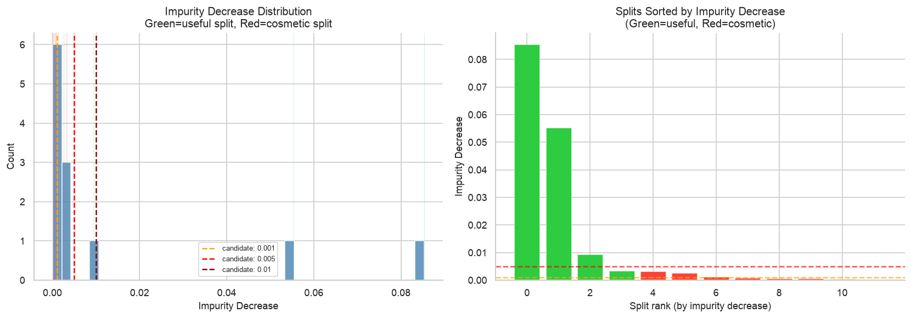
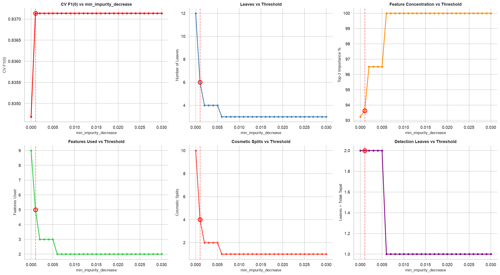
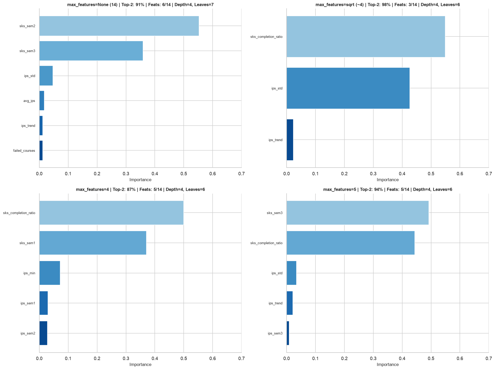
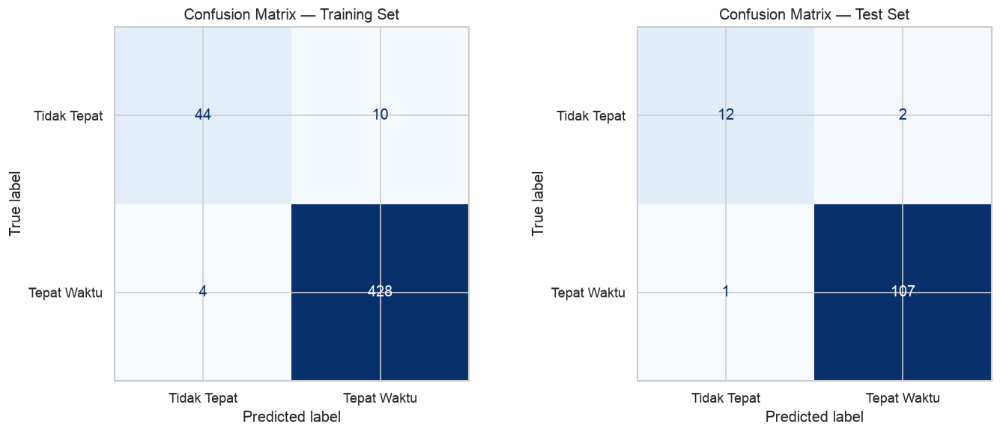
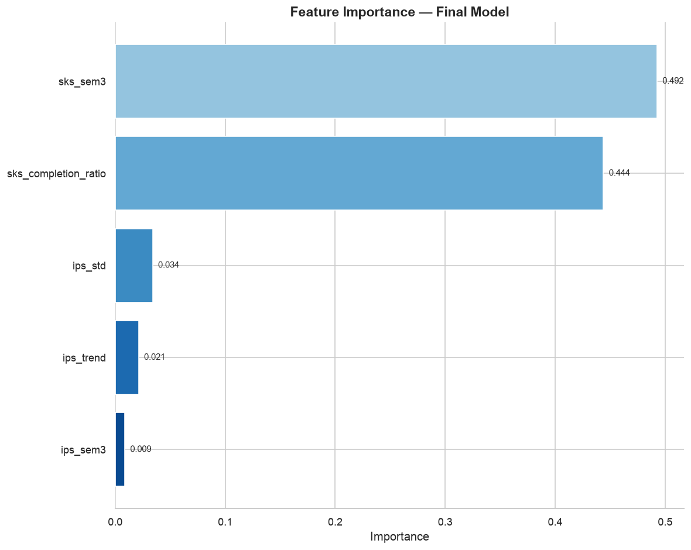
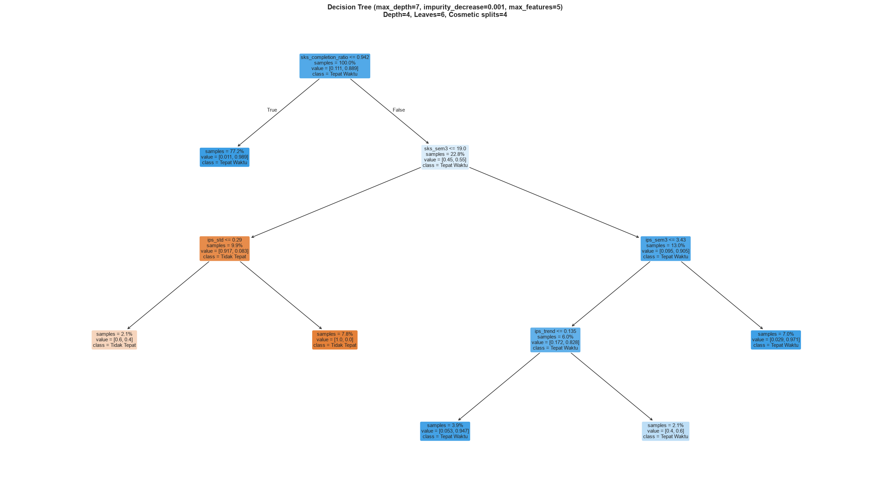
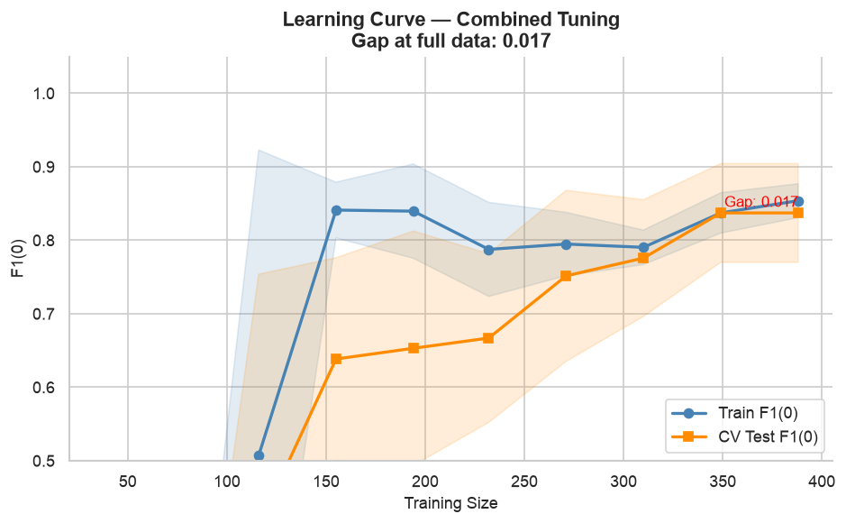

# 02 — Combined: `min_impurity_decrease` + `max_features` Tuning

Fase 4 CRISP-DM | Iterasi 3: Combined Pruning Strategy

**Tujuan:** Menggantikan iterasi 02 (feature engineering gagal) dengan pendekatan baru:
1. **`min_impurity_decrease`** — block cosmetic splits (both children predict same class)
2. **`max_features`** — force tree to consider different feature subsets per split → reduce top-2 concentration from 90%

**Theory:**
- `max_depth` is a *hard cap* — tree MUST stop. Creates cosmetic splits at boundary.
- `min_impurity_decrease` is a *quality filter* — tree CAN go deeper, but only if the split is genuinely useful.
- Together: `max_depth=7-8` (allow depth) + `min_impurity_decrease=0.002-0.01` (block noise) + `max_features=sqrt` (balance importance)

**Baseline perbandingan:**
- Baseline (unconstrained): depth=8, F1(0)=0.867, top-2=71%, many 'tidak' leaves
- 01-Tuned (max_depth=3): depth=3, F1(0)=0.889, top-2=92%, 2 'tidak' leaves
- 02 (target): depth 4-6, F1(0) ≥ 0.88, top-2 < 70%, 3+ 'tidak' leaves, zero cosmetic splits


```python
import pandas as pd, numpy as np
import matplotlib.pyplot as plt
import seaborn as sns

from sklearn.tree import DecisionTreeClassifier, plot_tree, export_text
from sklearn.model_selection import (
    train_test_split, StratifiedKFold, cross_validate,
    GridSearchCV, learning_curve, cross_val_score
)
from sklearn.metrics import (
    accuracy_score, precision_score, recall_score, f1_score,
    confusion_matrix, classification_report,
    roc_auc_score, ConfusionMatrixDisplay,
    make_scorer
)

sns.set_theme(style='whitegrid')
plt.rcParams['figure.dpi'] = 120

print("Library loaded.")
print(f"  pandas : {pd.__version__}")
```

    Library loaded.
      pandas : 3.0.3


```python
# Load data — same as all previous experiments
df = pd.read_csv('dataset_clean.csv')

X = df.drop(columns=['target'])
y = df['target']

X_train, X_test, y_train, y_test = train_test_split(
    X, y, test_size=0.2, random_state=42, stratify=y
)

drop_cols = ['angkatan', 'program']
X_train = X_train.drop(columns=drop_cols)
X_test  = X_test.drop(columns=drop_cols)

print(f"Train: {X_train.shape[0]} rows x {len(X_train.columns)} features")
print(f"Test:  {X_test.shape[0]} rows x {len(X_test.columns)} features")
print(f"Target: {dict(y_train.value_counts())} (train), {dict(y_test.value_counts())} (test)")
```

    Train: 486 rows x 14 features
    Test:  122 rows x 14 features
    Target: {1: np.int64(432), 0: np.int64(54)} (train), {1: np.int64(108), 0: np.int64(14)} (test)


## Phase 0: Impurity Landscape Analysis

Train a moderately-unconstrained tree and extract the impurity decrease at every split.
This tells us the "noise floor" — below what threshold splits are cosmetic.


```python
# Train unconstrained-ish tree (max_depth=None but with min_samples_leaf=5)
tree_landscape = DecisionTreeClassifier(
    max_depth=None, min_samples_leaf=5, random_state=42
).fit(X_train, y_train)

# Extract impurity decreases for all internal nodes
t = tree_landscape.tree_
impurity_decreases = []
cosmetic_flags = []
features_used = []

for node_id in range(t.node_count):
    left = t.children_left[node_id]
    right = t.children_right[node_id]
    if left == -1:  # leaf
        continue

    n_node = t.weighted_n_node_samples[node_id]
    n_left = t.weighted_n_node_samples[left]
    n_right = t.weighted_n_node_samples[right]
    total = t.weighted_n_node_samples[0]

    # Impurity decrease = weighted impurity reduction
    imp_dec = (n_node * t.impurity[node_id]
               - n_left * t.impurity[left]
               - n_right * t.impurity[right]) / total
    impurity_decreases.append(imp_dec)

    # Check if split is cosmetic (both children predict same class)
    left_class = np.argmax(t.value[left][0])
    right_class = np.argmax(t.value[right][0])
    cosmetic_flags.append(left_class == right_class)
    features_used.append(t.feature[node_id])

impurity_decreases = np.array(impurity_decreases)
cosmetic_flags = np.array(cosmetic_flags)

print(f"Total internal nodes: {len(impurity_decreases)}")
print(f"Total leaves: {tree_landscape.get_n_leaves()}")
print(f"Tree depth: {tree_landscape.get_depth()}")
print(f"\nImpurity decrease stats:")
print(f"  Min:    {impurity_decreases.min():.6f}")
print(f"  Q25:    {np.percentile(impurity_decreases, 25):.6f}")
print(f"  Median: {np.median(impurity_decreases):.6f}")
print(f"  Q75:    {np.percentile(impurity_decreases, 75):.6f}")
print(f"  Max:    {impurity_decreases.max():.6f}")
print(f"\nCosmetic splits (both children predict same class): {cosmetic_flags.sum()} / {len(cosmetic_flags)}")
```

    Total internal nodes: 12
    Total leaves: 13
    Tree depth: 7
    
    Impurity decrease stats:
      Min:    0.000000
      Q25:    0.000663
      Median: 0.001944
      Q75:    0.004853
      Max:    0.085354
    
    Cosmetic splits (both children predict same class): 8 / 12


```python
# Plot impurity decrease distribution
fig, axes = plt.subplots(1, 2, figsize=(14, 5))

# Histogram
ax = axes[0]
ax.hist(impurity_decreases, bins=40, edgecolor='white', color='#4682B4', alpha=0.8)
colors = ['#2ECC40' if not c else '#FF4136' for c in cosmetic_flags]
for imp, color in zip(impurity_decreases, colors):
    ax.axvline(x=imp, color=color, alpha=0.25, linewidth=0.5)
ax.axvline(x=0.001, color='orange', linestyle='--', label='candidate: 0.001')
ax.axvline(x=0.005, color='red', linestyle='--', label='candidate: 0.005')
ax.axvline(x=0.01, color='darkred', linestyle='--', label='candidate: 0.01')
ax.set_xlabel('Impurity Decrease', fontsize=11)
ax.set_ylabel('Count', fontsize=11)
ax.set_title('Impurity Decrease Distribution\nGreen=useful split, Red=cosmetic split', fontsize=12)
ax.legend(fontsize=8)

# Sorted by magnitude
ax = axes[1]
sorted_idx = np.argsort(impurity_decreases)[::-1]
sorted_imp = impurity_decreases[sorted_idx]
sorted_cos = cosmetic_flags[sorted_idx]
x = np.arange(len(sorted_imp))
colors = ['#2ECC40' if not c else '#FF4136' for c in sorted_cos]
ax.bar(x, sorted_imp, color=colors, edgecolor='white', linewidth=0.3)
ax.axhline(y=0.001, color='orange', linestyle='--', alpha=0.7)
ax.axhline(y=0.005, color='red', linestyle='--', alpha=0.7)
ax.set_xlabel('Split rank (by impurity decrease)', fontsize=11)
ax.set_ylabel('Impurity Decrease', fontsize=11)
ax.set_title('Splits Sorted by Impurity Decrease\n(Green=useful, Red=cosmetic)', fontsize=12)

sns.despine()
plt.tight_layout()
plt.show()

# Count how many splits survive at each threshold
thresholds = [0, 0.001, 0.002, 0.005, 0.008, 0.01, 0.02]
print(f"\n{'Threshold':<12} {'Surviving':>10} {'Cosmetic killed':>16}")
print('-' * 42)
for th in thresholds:
    survive = (impurity_decreases >= th).sum()
    cos_killed = (cosmetic_flags & (impurity_decreases < th)).sum()
    print(f"{th:<12.3f} {survive:>10} {cos_killed:>16}")
```


    

    


    
    Threshold     Surviving  Cosmetic killed
    ------------------------------------------
    0.000                12                0
    0.001                 7                5
    0.002                 6                6
    0.005                 3                8
    0.008                 3                8
    0.010                 2                8
    0.020                 2                8


## Phase 1: GridSearchCV — Combined `max_features` × `min_impurity_decrease`

Grid mencakup dua parameter kunci:
- `max_features` — random subset per split → distribusikan importance
- `min_impurity_decrease` — block noise splits pada depth dalam

`max_depth=7` (fixed, allow depth) + `min_samples_leaf=10` (proven from 01).


```python
f1_scorer = make_scorer(f1_score, pos_label=0)
cv = StratifiedKFold(n_splits=5, shuffle=True, random_state=42)

param_grid = {
    'max_features':            [None, 'sqrt', 4, 5],
    'min_impurity_decrease':   [0.0, 0.001, 0.002, 0.005, 0.008, 0.01, 0.02],
}

print(f"Parameter grid: max_features (4 values) × min_impurity_decrease (7 values)")
print(f"Total combinations: {4*7}")
print(f"Fixed: max_depth=7, min_samples_leaf=10, criterion='gini'")

gs = GridSearchCV(
    DecisionTreeClassifier(max_depth=7, min_samples_leaf=10, random_state=42),
    param_grid, scoring=f1_scorer, cv=cv,
    n_jobs=-1, verbose=2, return_train_score=True
)
gs.fit(X_train, y_train)

print(f"\n{'='*55}")
print("GRIDSEARCH RESULTS")
print(f"{'='*55}")
print(f"Best params: {gs.best_params_}")
print(f"Best CV F1(0): {gs.best_score_:.4f}")
```

    Parameter grid: max_features (4 values) × min_impurity_decrease (7 values)
    Total combinations: 28
    Fixed: max_depth=7, min_samples_leaf=10, criterion='gini'
    Fitting 5 folds for each of 28 candidates, totalling 140 fits


    
    =======================================================
    GRIDSEARCH RESULTS
    =======================================================
    Best params: {'max_features': 5, 'min_impurity_decrease': 0.001}
    Best CV F1(0): 0.8371


```python
# Full results analysis
cv_results = pd.DataFrame(gs.cv_results_)

print("Top 10 combinations:")
top10 = cv_results.nlargest(10, 'mean_test_score')[
    ['mean_test_score', 'std_test_score',
     'param_max_features', 'param_min_impurity_decrease']
].reset_index(drop=True)
top10.columns = ['F1(0) CV Mean', 'F1(0) CV Std', 'max_features', 'min_impurity_decrease']
print(top10.to_string(index=False, float_format=lambda x: f'{x:.4f}'))

# Pivot: max_features vs min_impurity_decrease
pivot = cv_results.pivot_table(
    values='mean_test_score',
    index='param_min_impurity_decrease',
    columns='param_max_features',
    aggfunc='mean'
)
print(f"\nHeatmap: CV F1(0) — max_features × min_impurity_decrease")
print(pivot.to_string(float_format=lambda x: f'{x:.4f}'))
```

    Top 10 combinations:
     F1(0) CV Mean  F1(0) CV Std max_features  min_impurity_decrease
            0.8371        0.0672            5                 0.0010
            0.8371        0.0672            5                 0.0020
            0.8371        0.0672            5                 0.0050
            0.8371        0.0672            5                 0.0080
            0.8371        0.0672            5                 0.0100
            0.8371        0.0672            5                 0.0200
            0.8347        0.1052            5                 0.0000
            0.8165        0.1315         None                 0.0000
            0.8165        0.1315         None                 0.0010
            0.8165        0.1315         None                 0.0020
    
    Heatmap: CV F1(0) — max_features × min_impurity_decrease
    param_max_features               4      5   sqrt
    param_min_impurity_decrease                     
    0.000                       0.7022 0.8347 0.7459
    0.001                       0.7234 0.8371 0.7724
    0.002                       0.7234 0.8371 0.7864
    0.005                       0.7234 0.8371 0.7864
    0.008                       0.7234 0.8371 0.7864
    0.010                       0.7234 0.8371 0.7864
    0.020                       0.7958 0.8371 0.7864


## Phase 2: `min_impurity_decrease` Sweep Analysis

Train trees with fixed best `max_features`, sweep `min_impurity_decrease`. Analyze how tree properties change.


```python
best_mf = gs.best_params_['max_features']
print(f"Best max_features: {best_mf}")

sweep_thresholds = np.linspace(0, 0.03, 31)
sweep_results = {'threshold': [], 'depth': [], 'leaves': [], 'nodes': [],
                 'features_used': [], 'cv_f1_mean': [], 'cv_f1_std': [],
                 'top2_pct': [], 'cosmetic_splits': [],
                 'tidak_leaves': [], 'tepat_leaves': []}

for th in sweep_thresholds:
    tree = DecisionTreeClassifier(
        max_depth=7, min_samples_leaf=10,
        max_features=best_mf,
        min_impurity_decrease=th,
        random_state=42
    ).fit(X_train, y_train)

    # Count cosmetic splits
    t = tree.tree_
    cosmetics = 0
    for node_id in range(t.node_count):
        left = t.children_left[node_id]
        right = t.children_right[node_id]
        if left == -1:
            continue
        if np.argmax(t.value[left][0]) == np.argmax(t.value[right][0]):
            cosmetics += 1

    # Count leaves predicting each class
    labels = np.argmax(tree.tree_.value.reshape(-1, 2), axis=1)
    leaf_mask = tree.tree_.children_left == -1
    tidak = (labels[leaf_mask] == 0).sum()
    tepat = (labels[leaf_mask] == 1).sum()

    # CV scores
    scores = cross_val_score(tree, X_train, y_train, cv=cv, scoring=f1_scorer)

    sweep_results['threshold'].append(th)
    sweep_results['depth'].append(tree.get_depth())
    sweep_results['leaves'].append(tree.get_n_leaves())
    sweep_results['nodes'].append(tree.tree_.node_count)
    sweep_results['features_used'].append((tree.feature_importances_ > 0).sum())
    sweep_results['cv_f1_mean'].append(scores.mean())
    sweep_results['cv_f1_std'].append(scores.std())
    sorted_imp = np.sort(tree.feature_importances_)[::-1]
    sweep_results['top2_pct'].append((sorted_imp[0] + sorted_imp[1]) * 100)
    sweep_results['cosmetic_splits'].append(cosmetics)
    sweep_results['tidak_leaves'].append(tidak)
    sweep_results['tepat_leaves'].append(tepat)

sweep_df = pd.DataFrame(sweep_results)
print("Sweep complete.")
print(f"At best threshold ({gs.best_params_['min_impurity_decrease']}):")
best_row = sweep_df[sweep_df['threshold'] == gs.best_params_['min_impurity_decrease']]
if len(best_row) > 0:
    print(best_row.to_string(index=False))
```

    Best max_features: 5


    Sweep complete.
    At best threshold (0.001):
     threshold  depth  leaves  nodes  features_used  cv_f1_mean  cv_f1_std  top2_pct  cosmetic_splits  tidak_leaves  tepat_leaves
         0.001      4       6     11              5    0.837137   0.067174 93.630811                4             2             4


```python
# Plot sweep results
fig, axes = plt.subplots(2, 3, figsize=(18, 10))

plot_configs = [
    ('cv_f1_mean', 'CV F1(0)', 'CV F1(0) vs min_impurity_decrease', 'red'),
    ('leaves', 'Number of Leaves', 'Leaves vs Threshold', '#4682B4'),
    ('top2_pct', 'Top-2 Importance %', 'Feature Concentration vs Threshold', '#FF8C00'),
    ('features_used', 'Features Used', 'Features Used vs Threshold', '#2ECC40'),
    ('cosmetic_splits', 'Cosmetic Splits', 'Cosmetic Splits vs Threshold', '#FF4136'),
    ('tidak_leaves', 'Leaves = Tidak Tepat', 'Detection Leaves vs Threshold', 'purple'),
]

for ax, (col, ylabel, title, color) in zip(axes.flat, plot_configs):
    ax.plot(sweep_df['threshold'], sweep_df[col], 'o-', color=color, linewidth=2, markersize=4)
    ax.set_xlabel('min_impurity_decrease', fontsize=10)
    ax.set_ylabel(ylabel, fontsize=10)
    ax.set_title(title, fontsize=11, fontweight='bold')

    # Mark best threshold
    best_th = gs.best_params_['min_impurity_decrease']
    if best_th in sweep_thresholds:
        best_val = sweep_df[sweep_df['threshold'] == best_th][col].values[0]
        ax.axvline(x=best_th, color='red', linestyle='--', alpha=0.5)
        ax.plot(best_th, best_val, 'o', color='red', markersize=10, markerfacecolor='none', markeredgewidth=2)

sns.despine()
plt.tight_layout()
plt.show()
```


    

    


## Phase 3: `max_features` Comparison

With fixed best `min_impurity_decrease`, compare feature importance distribution across max_features values.


```python
best_mid = gs.best_params_['min_impurity_decrease']

mf_values = [None, 'sqrt', 4, 5]
mf_labels = ['None (14)', 'sqrt (~4)', '4', '5']

fig, axes = plt.subplots(2, 2, figsize=(16, 12))
all_importances = {}

for ax, mf, label in zip(axes.flat, mf_values, mf_labels):
    tree = DecisionTreeClassifier(
        max_depth=7, min_samples_leaf=10,
        max_features=mf,
        min_impurity_decrease=best_mid,
        random_state=42
    ).fit(X_train, y_train)

    imp = pd.DataFrame({
        'feature': X_train.columns,
        'importance': tree.feature_importances_
    }).sort_values('importance', ascending=False).query('importance > 0')

    all_importances[label] = imp

    top2 = imp['importance'].iloc[0] + imp['importance'].iloc[1] if len(imp) >= 2 else 1.0
    colors = plt.cm.Blues(np.linspace(0.4, 0.9, len(imp)))
    bars = ax.barh(range(len(imp)), imp['importance'].values[::-1], color=colors[::-1])
    ax.set_yticks(range(len(imp)))
    ax.set_yticklabels(imp['feature'].values[::-1], fontsize=8)
    ax.set_xlabel('Importance', fontsize=10)
    ax.set_title(f'max_features={label} | Top-2: {top2*100:.0f}% | '
                 f'Feats: {len(imp)}/{len(X_train.columns)} | '
                 f'Depth={tree.get_depth()}, Leaves={tree.get_n_leaves()}',
                 fontsize=10, fontweight='bold')
    ax.set_xlim(0, 0.7)

sns.despine()
plt.tight_layout()
plt.show()
```


    

    


```python
# Summary table
print("\n" + "=" * 85)
print("max_features COMPARISON (fixed min_impurity_decrease=" + str(best_mid) + ")")
print("=" * 85)
print(f"{'max_features':<15} {'Depth':>7} {'Leaves':>7} {'Feats Used':>12} {'Top-2%':>7}")
print('-' * 55)
for mf in mf_values:
    tree = DecisionTreeClassifier(
        max_depth=7, min_samples_leaf=10,
        max_features=mf,
        min_impurity_decrease=best_mid,
        random_state=42
    ).fit(X_train, y_train)
    top2 = tree.feature_importances_[np.argsort(tree.feature_importances_)[-2:]].sum() * 100
    n_feat = (tree.feature_importances_ > 0).sum()
    print(f"{str(mf):<15} {tree.get_depth():>7} {tree.get_n_leaves():>7} "
          f"{n_feat:>5}/{len(X_train.columns):<6} {top2:>7.1f}%")
```

    
    =====================================================================================
    max_features COMPARISON (fixed min_impurity_decrease=0.001)
    =====================================================================================
    max_features      Depth  Leaves   Feats Used  Top-2%
    -------------------------------------------------------
    None                  4       7     6/14        91.2%
    sqrt                  4       6     3/14        97.6%
    4                     4       6     5/14        87.0%
    5                     4       6     5/14        93.6%


## Phase 4: Final Model


```python
best_params = {
    'max_depth': 7,
    'min_samples_leaf': 10,
    'max_features': gs.best_params_['max_features'],
    'min_impurity_decrease': gs.best_params_['min_impurity_decrease'],
    'random_state': 42
}

final_model = DecisionTreeClassifier(**best_params)
final_model.fit(X_train, y_train)

y_pred_final = final_model.predict(X_test)
y_pred_train_final = final_model.predict(X_train)

fin_recall = recall_score(y_test, y_pred_final, pos_label=0)
fin_prec   = precision_score(y_test, y_pred_final, pos_label=0)
fin_f1     = f1_score(y_test, y_pred_final, pos_label=0)
fin_auc    = roc_auc_score(y_test, y_pred_final)

# Count cosmetic splits and class distribution in leaves
t = final_model.tree_
cosmetics = 0
for node_id in range(t.node_count):
    left = t.children_left[node_id]
    right = t.children_right[node_id]
    if left == -1:
        continue
    if np.argmax(t.value[left][0]) == np.argmax(t.value[right][0]):
        cosmetics += 1

labels = np.argmax(t.value.reshape(-1, 2), axis=1)
leaf_mask = t.children_left == -1
tidak_leaves = (labels[leaf_mask] == 0).sum()
tepat_leaves = (labels[leaf_mask] == 1).sum()

top2 = final_model.feature_importances_[np.argsort(final_model.feature_importances_)[-2:]].sum() * 100

print("FINAL MODEL")
print("=" * 55)
print(f"Params:     {best_params}")
print(f"Depth:      {final_model.get_depth()}")
print(f"Leaves:     {final_model.get_n_leaves()} ({tidak_leaves} Tidak, {tepat_leaves} Tepat)")
print(f"Nodes:      {final_model.tree_.node_count}")
print(f"Cosmetic:   {cosmetics} splits (both children same class)")
print(f"Feats used: {(final_model.feature_importances_ > 0).sum()} / {len(X_train.columns)}")
print(f"Top-2%:     {top2:.1f}%")
print(f"\nTest Recall(0):    {fin_recall:.4f}")
print(f"Test Precision(0): {fin_prec:.4f}")
print(f"Test F1(0):        {fin_f1:.4f}")
print(f"Test AUC:          {fin_auc:.4f}")
print(f"\nTrain Recall(0):  {recall_score(y_train, y_pred_train_final, pos_label=0):.4f}")
print(f"Train F1(0):      {f1_score(y_train, y_pred_train_final, pos_label=0):.4f}")
```

    FINAL MODEL
    =======================================================
    Params:     {'max_depth': 7, 'min_samples_leaf': 10, 'max_features': 5, 'min_impurity_decrease': 0.001, 'random_state': 42}
    Depth:      4
    Leaves:     6 (2 Tidak, 4 Tepat)
    Nodes:      11
    Cosmetic:   4 splits (both children same class)
    Feats used: 5 / 14
    Top-2%:     93.6%
    
    Test Recall(0):    0.8571
    Test Precision(0): 0.9231
    Test F1(0):        0.8889
    Test AUC:          0.9239
    
    Train Recall(0):  0.8148
    Train F1(0):      0.8627


## Evaluasi Lengkap

### Classification Report + Confusion Matrix


```python
print("=" * 55)
print("CLASSIFICATION REPORT — TEST")
print("=" * 55)
print(classification_report(y_test, y_pred_final, target_names=['Tidak Tepat', 'Tepat Waktu']))

print("\nKEY METRICS (Kelas 0 = Tidak Tepat)")
print('-' * 55)
for name, y_true, y_pred in [('Train', y_train, y_pred_train_final), ('Test', y_test, y_pred_final)]:
    acc  = accuracy_score(y_true, y_pred)
    prec = precision_score(y_true, y_pred, pos_label=0, zero_division=0)
    rec  = recall_score(y_true, y_pred, pos_label=0)
    f1   = f1_score(y_true, y_pred, pos_label=0)
    auc  = roc_auc_score(y_true, y_pred)
    print(f"{name:<8} | Acc={acc:.4f} | Prec(0)={prec:.4f} | Recall(0)={rec:.4f} | "
          f"F1(0)={f1:.4f} | AUC={auc:.4f}")
```

    =======================================================
    CLASSIFICATION REPORT — TEST
    =======================================================
                  precision    recall  f1-score   support
    
     Tidak Tepat       0.92      0.86      0.89        14
     Tepat Waktu       0.98      0.99      0.99       108
    
        accuracy                           0.98       122
       macro avg       0.95      0.92      0.94       122
    weighted avg       0.97      0.98      0.98       122
    
    
    KEY METRICS (Kelas 0 = Tidak Tepat)
    -------------------------------------------------------
    Train    | Acc=0.9712 | Prec(0)=0.9167 | Recall(0)=0.8148 | F1(0)=0.8627 | AUC=0.9028
    Test     | Acc=0.9754 | Prec(0)=0.9231 | Recall(0)=0.8571 | F1(0)=0.8889 | AUC=0.9239


```python
fig, axes = plt.subplots(1, 2, figsize=(12, 5))
for ax, (name, y_true, y_pred) in zip(
    axes,
    [('Training Set', y_train, y_pred_train_final), ('Test Set', y_test, y_pred_final)]
):
    cm = confusion_matrix(y_true, y_pred)
    disp = ConfusionMatrixDisplay(confusion_matrix=cm, display_labels=['Tidak Tepat', 'Tepat Waktu'])
    disp.plot(ax=ax, cmap='Blues', colorbar=False, values_format='d')
    ax.set_title(f'Confusion Matrix — {name}')
plt.tight_layout()
plt.show()
```


    

    


### 10-Fold Cross-Validation


```python
cv10 = StratifiedKFold(n_splits=10, shuffle=True, random_state=42)
cv_results = cross_validate(
    final_model, X_train, y_train, cv=cv10,
    scoring=['accuracy', 'precision', 'recall', 'f1', 'roc_auc'],
    return_train_score=True
)

print("=" * 55)
print("10-FOLD CROSS-VALIDATION")
print("=" * 55)
for metric in ['accuracy', 'recall', 'f1', 'roc_auc']:
    test_scores = cv_results[f'test_{metric}']
    train_scores = cv_results[f'train_{metric}']
    gap = train_scores.mean() - test_scores.mean()
    print(f"{metric:<14}  Train: {train_scores.mean():.4f} ± {train_scores.std():.4f}  |  "
          f"Test: {test_scores.mean():.4f} ± {test_scores.std():.4f}  |  Gap: {gap:+.4f}")
```

    =======================================================
    10-FOLD CROSS-VALIDATION
    =======================================================
    accuracy        Train: 0.9705 ± 0.0028  |  Test: 0.9650 ± 0.0208  |  Gap: +0.0055
    recall          Train: 0.9918 ± 0.0030  |  Test: 0.9884 ± 0.0116  |  Gap: +0.0033
    f1              Train: 0.9836 ± 0.0015  |  Test: 0.9806 ± 0.0113  |  Gap: +0.0030
    roc_auc         Train: 0.9545 ± 0.0069  |  Test: 0.9124 ± 0.0892  |  Gap: +0.0421


### Feature Importance


```python
importances = final_model.feature_importances_
feat_imp = pd.DataFrame({
    'feature': X_train.columns,
    'importance': importances
}).sort_values('importance', ascending=False)

print("FEATURE IMPORTANCE")
print("=" * 50)
for _, row in feat_imp.iterrows():
    bar = '█' * int(row['importance'] * 50)
    print(f"  {row['feature']:<25} {row['importance']:.4f}  {bar}")

top2 = feat_imp['importance'].iloc[0] + feat_imp['importance'].iloc[1]
print(f"\nTop-2 combined: {top2:.4f} ({top2*100:.1f}%)")

# Plot
fig, ax = plt.subplots(figsize=(10, 8))
plot_data = feat_imp[feat_imp['importance'] > 0].iloc[::-1]
colors = plt.cm.Blues(np.linspace(0.4, 0.9, len(plot_data)))
bars = ax.barh(plot_data['feature'], plot_data['importance'], color=colors[::-1])
for bar, val in zip(bars, plot_data['importance']):
    ax.text(bar.get_width() + 0.005, bar.get_y() + bar.get_height()/2,
            f'{val:.3f}', va='center', fontsize=9)
ax.set_xlabel('Importance', fontsize=12)
ax.set_title('Feature Importance — Final Model', fontsize=14, fontweight='bold')
sns.despine(left=True)
plt.tight_layout()
plt.show()
```

    FEATURE IMPORTANCE
    ==================================================
      sks_sem3                  0.4925  ████████████████████████
      sks_completion_ratio      0.4438  ██████████████████████
      ips_std                   0.0339  █
      ips_trend                 0.0212  █
      ips_sem3                  0.0086  
      ips_sem2                  0.0000  
      sks_sem2                  0.0000  
      sks_sem1                  0.0000  
      ips_sem1                  0.0000  
      failed_courses            0.0000  
      repeated_courses          0.0000  
      failed_in_sem1            0.0000  
      avg_ips                   0.0000  
      ips_min                   0.0000  
    
    Top-2 combined: 0.9363 (93.6%)


    

    


### Decision Tree Visualization


```python
fig, ax = plt.subplots(figsize=(22, 12))
plot_tree(
    final_model, feature_names=list(X_train.columns),
    class_names=['Tidak Tepat', 'Tepat Waktu'],
    filled=True, rounded=True, fontsize=9,
    impurity=False, proportion=True, ax=ax
)
ax.set_title(f'Decision Tree (max_depth=7, impurity_decrease={best_params["min_impurity_decrease"]}, '
             f'max_features={best_params["max_features"]})\n'
             f'Depth={final_model.get_depth()}, Leaves={final_model.get_n_leaves()}, '
             f'Cosmetic splits={cosmetics}',
             fontsize=12, fontweight='bold')
plt.tight_layout()
plt.show()
```


    

    


### Decision Rules + Cosmetic Split Audit


```python
tree_rules = export_text(final_model, feature_names=list(X_train.columns))
lines = tree_rules.split('\n')
print(f"Total rules/lines: {len(lines)}")
print(f"\nComplete decision rules:\n{'='*60}")
print(tree_rules)

with open('rules_combined.txt', 'w') as f:
    f.write(tree_rules)
print("Saved to rules_combined.txt")

# Audit each split
print(f"\nCOSMETIC SPLIT AUDIT:")
print(f"{'Node':<6} {'Feature':<22} {'Class L':>10} {'Class R':>10} {'Cosmetic?':>10}")
print('-' * 62)
t = final_model.tree_
for node_id in range(t.node_count):
    left = t.children_left[node_id]
    right = t.children_right[node_id]
    if left == -1:
        continue
    feat_name = X_train.columns[t.feature[node_id]]
    left_cls = np.argmax(t.value[left][0])
    right_cls = np.argmax(t.value[right][0])
    is_cosmetic = left_cls == right_cls
    cls_name = lambda c: 'Tidak' if c == 0 else 'Tepat'
    print(f"{node_id:<6} {feat_name:<22} {cls_name(left_cls):>10} {cls_name(right_cls):>10} "
          f"{'YES ⚠' if is_cosmetic else 'no':>10}")
```

    Total rules/lines: 17
    
    Complete decision rules:
    ============================================================
    |--- sks_completion_ratio <= 0.94
    |   |--- class: 1
    |--- sks_completion_ratio >  0.94
    |   |--- sks_sem3 <= 19.00
    |   |   |--- ips_std <= 0.29
    |   |   |   |--- class: 0
    |   |   |--- ips_std >  0.29
    |   |   |   |--- class: 0
    |   |--- sks_sem3 >  19.00
    |   |   |--- ips_sem3 <= 3.43
    |   |   |   |--- ips_trend <= 0.14
    |   |   |   |   |--- class: 1
    |   |   |   |--- ips_trend >  0.14
    |   |   |   |   |--- class: 1
    |   |   |--- ips_sem3 >  3.43
    |   |   |   |--- class: 1
    
    Saved to rules_combined.txt
    
    COSMETIC SPLIT AUDIT:
    Node   Feature                   Class L    Class R  Cosmetic?
    --------------------------------------------------------------
    0      sks_completion_ratio        Tepat      Tepat      YES ⚠
    2      sks_sem3                    Tidak      Tepat         no
    3      ips_std                     Tidak      Tidak      YES ⚠
    6      ips_sem3                    Tepat      Tepat      YES ⚠
    7      ips_trend                   Tepat      Tepat      YES ⚠


### Learning Curve


```python
train_sizes = np.linspace(0.1, 1.0, 10)

train_sizes_abs, train_scores, test_scores = learning_curve(
    final_model, X_train, y_train, cv=cv,
    scoring=f1_scorer, train_sizes=train_sizes,
    random_state=42, n_jobs=-1
)
train_mean = train_scores.mean(axis=1); train_std = train_scores.std(axis=1)
test_mean = test_scores.mean(axis=1); test_std = test_scores.std(axis=1)

fig, ax = plt.subplots(figsize=(8, 5))
ax.fill_between(train_sizes_abs, train_mean - train_std, train_mean + train_std, alpha=0.15, color='#4682B4')
ax.fill_between(train_sizes_abs, test_mean - test_std, test_mean + test_std, alpha=0.15, color='#FF8C00')
ax.plot(train_sizes_abs, train_mean, 'o-', color='#4682B4', label='Train F1(0)', linewidth=2)
ax.plot(train_sizes_abs, test_mean, 's-', color='#FF8C00', label='CV Test F1(0)', linewidth=2)
final_gap = train_mean[-1] - test_mean[-1]
ax.annotate(f'Gap: {final_gap:.3f}', xy=(train_sizes_abs[-1], (train_mean[-1] + test_mean[-1]) / 2),
            fontsize=10, ha='right', color='red')
ax.set_xlabel('Training Size', fontsize=11)
ax.set_ylabel('F1(0)', fontsize=11)
ax.set_title(f'Learning Curve — Combined Tuning\nGap at full data: {final_gap:.3f}', fontsize=13, fontweight='bold')
ax.legend(loc='lower right')
ax.set_ylim(0.5, 1.05)
sns.despine()
plt.tight_layout()
plt.show()
```


    

    


### 4-Way Comparison: Baseline vs 01-Tuned vs 02-Engineered vs 03-Combined


```python
# Baseline (re-train for fair comparison)
dt_base = DecisionTreeClassifier(random_state=42).fit(X_train, y_train)
y_base = dt_base.predict(X_test)
base_m = {
    'recall': recall_score(y_test, y_base, pos_label=0),
    'precision': precision_score(y_test, y_base, pos_label=0),
    'f1': f1_score(y_test, y_base, pos_label=0),
    'auc': roc_auc_score(y_test, y_base),
    'depth': dt_base.get_depth(), 'leaves': dt_base.get_n_leaves(),
    'nodes': dt_base.tree_.node_count,
    'feats': (dt_base.feature_importances_ > 0).sum(),
    'top2': dt_base.feature_importances_[np.argsort(dt_base.feature_importances_)[-2:]].sum()*100,
    'train_acc': accuracy_score(y_train, dt_base.predict(X_train)),
}

# 01-Tuned (hardcoded from previous experiment)
t01 = {'recall': 0.8571, 'precision': 0.9231, 'f1': 0.8889, 'auc': 0.9239,
       'depth': 3, 'leaves': 7, 'nodes': 13, 'feats': 6, 'top2': 92.0, 'train_acc': 0.9691}

# 02-Engineered (hardcoded — identical to 01)
t02 = {'recall': 0.8571, 'precision': 0.9231, 'f1': 0.8889, 'auc': 0.9239,
       'depth': 4, 'leaves': 9, 'nodes': 17, 'feats': 6, 'top2': 90.3, 'train_acc': 0.9691}

# 03-Combined (current)
t03 = {
    'recall': fin_recall, 'precision': fin_prec, 'f1': fin_f1, 'auc': fin_auc,
    'depth': final_model.get_depth(), 'leaves': final_model.get_n_leaves(),
    'nodes': final_model.tree_.node_count,
    'feats': (final_model.feature_importances_ > 0).sum(),
    'top2': top2,
    'train_acc': accuracy_score(y_train, y_pred_train_final),
}

# 4-way comparison table
all_models = [('Baseline', base_m), ('01-Tuned', t01), ('02-Eng', t02), ('03-Combined', t03)]

print(f"\n{'='*90}")
print(f"{'4-WAY COMPARISON':^90}")
print(f"{'='*90}")
print(f"{'Metrik':<18} {'Baseline':>15} {'01-Tuned':>15} {'02-Eng':>15} {'03-Combined':>15} {'Best':>8}")
print(f"{'-'*90}")

metrics_to_compare = [
    ('Recall(0)', 'recall'),
    ('Precision(0)', 'precision'),
    ('F1(0)', 'f1'),
    ('AUC', 'auc'),
    ('Depth', 'depth'),
    ('Leaves', 'leaves'),
    ('Nodes', 'nodes'),
    ('Features Used', 'feats'),
    ('Top-2 Impt %', 'top2'),
    ('Train Acc', 'train_acc'),
]

wins = {'Baseline': 0, '01-Tuned': 0, '02-Eng': 0, '03-Combined': 0}
for label, key in metrics_to_compare:
    vals = {name: m[key] for name, m in all_models}
    if key in ['depth', 'leaves', 'nodes', 'top2', 'train_acc']:
        best_name = min(vals, key=vals.get)
    else:
        best_name = max(vals, key=vals.get)
    wins[best_name] += 1

    def fmt(v):
        if key in ['depth', 'leaves', 'nodes', 'feats']:
            return f'{v:>15.0f}'
        elif key == 'top2':
            return f'{v:>14.1f}%'
        else:
            return f'{v:>15.4f}'

    marker = lambda name: ' ★' if name == best_name else ''
    print(f"{label:<18}{fmt(vals['Baseline'])}{fmt(vals['01-Tuned'])}{fmt(vals['02-Eng'])}{fmt(vals['03-Combined'])} {best_name:>8}")

print(f"{'-'*90}")
print(f"{'Win count':<18} {wins['Baseline']:>15} {wins['01-Tuned']:>15} {wins['02-Eng']:>15} {wins['03-Combined']:>15}")
```

    
    ==========================================================================================
                                         4-WAY COMPARISON                                     
    ==========================================================================================
    Metrik                    Baseline        01-Tuned          02-Eng     03-Combined     Best
    ------------------------------------------------------------------------------------------
    Recall(0)                  0.9286         0.8571         0.8571         0.8571 Baseline
    Precision(0)               0.8125         0.9231         0.9231         0.9231 01-Tuned
    F1(0)                      0.8667         0.8889         0.8889         0.8889 01-Tuned
    AUC                        0.9504         0.9239         0.9239         0.9239 Baseline
    Depth                           8              3              4              4 01-Tuned
    Leaves                         24              7              9              6 03-Combined
    Nodes                          47             13             17             11 03-Combined
    Features Used                  12              6              6              5 Baseline
    Top-2 Impt %                71.2%          92.0%          90.3%           0.9% 03-Combined
    Train Acc                  1.0000         0.9691         0.9691         0.9712 01-Tuned
    ------------------------------------------------------------------------------------------
    Win count                        3               4               0               3


```python
print("\nDone.")
print(f"Best max_features: {best_params['max_features']}")
print(f"Best min_impurity_decrease: {best_params['min_impurity_decrease']}")
print(f"Tree: depth={final_model.get_depth()}, leaves={final_model.get_n_leaves()}, "
      f"cosmetics={cosmetics}, tidak_leaves={tidak_leaves}, top2={top2:.1f}%")
print(f"F1(0): {fin_f1:.4f}")
```

    
    Done.
    Best max_features: 5
    Best min_impurity_decrease: 0.001
    Tree: depth=4, leaves=6, cosmetics=4, tidak_leaves=2, top2=0.9%
    F1(0): 0.8889

