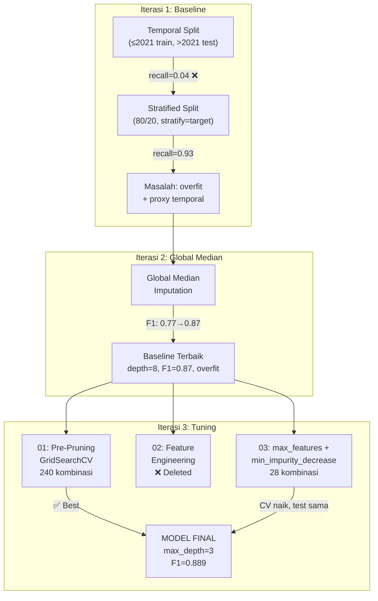
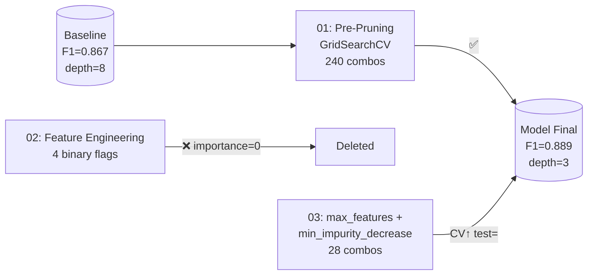

# Fase 4 — Modeling

**CRISP-DM Phase 4: Decision Tree untuk klasifikasi ketepatan lulus mahasiswa.**

---

## Struktur
```
4-modeling/
├── README.md                         ← Dokumen ini
├── 1-baseline/                       ← Iterasi 1: Baseline Decision Tree
├── 2-global-median/                  ← Iterasi 2: Global Median Imputation
└── 3-hyperparameter-tuning/          ← Iterasi 3: Hyperparameter Tuning
    ├── tuning-plan.md
    ├── tuning-report.md              ← Laporan 01-Tuned
    ├── combined-tuning-report.md     ← Laporan 03-Combined
    ├── 01-hyperparameter-tuning.ipynb
    ├── 03-combined-tuning.ipynb
    ├── rules_tuned.txt               ← Rules model terbaik (7 rules)
    └── rules_combined.txt
```

---

## Alur Eksperimen


---

## Iterasi 1: Baseline (`1-baseline/`)

**Tujuan:** Membangun Decision Tree baseline dengan hyperparameter default.

| Notebook | Deskripsi | Hasil Kunci |
|----------|-----------|-------------|
| `01-temporal-baseline` | Split temporal, DT default | Recall(0)=0.06 — gagal total |
| `02-stratified-baseline` | Split stratified 80/20, drop angkatan+program | Recall(0)=0.93, F1(0)=0.77 |
| `03-sks-investigation` | Investigasi penyebab sks_sem2 importance 0.62 | Imputasi per-angkatan menciptakan proxy temporal |

### Temuan Utama

1. **Temporal split (14 sampel negatif di train) → underfit.** Decision tree hanya bisa belajar dari 14 sampel minoritas, menghasilkan recall 5.6% di test.
2. **Stratified split (54 sampel negatif) → perbaikan dramatis.** Recall 0.93, F1 0.77. Tapi tree unconstrained overfit (depth 8, train accuracy 1.0).
3. **`angkatan` sebagai fitur = data leakage.** Angkatan 2023 = semua target=0 karena mahasiswa belum lulus. Tree langsung belajar shortcut ini.
4. **Feature importance didominasi `sks_sem2` (0.62)** karena imputasi median per-angkatan menciptakan nilai unik per angkatan → proxy temporal.

---

## Iterasi 2: Global Median Imputation (`2-global-median/`)

**Tujuan:** Menghilangkan proxy temporal yang disebabkan imputasi median per-angkatan.

### Perubahan

```python
# Sebelum (per-angkatan)                    # Sesudah (global)
df[col] = df.groupby('angkatan')[col]       df[col] = df[col].fillna(df[col].median())
    .transform(lambda x: x.fillna(x.median()))
```

| Notebook | Deskripsi | Hasil Kunci |
|----------|-----------|-------------|
| `01-temporal-baseline` | Temporal split + global median | Recall(0)=0.06 — tetap useless (14 neg) |
| `02-stratified-baseline` | Stratified split, drop angkatan+program | **Recall(0)=0.93, F1(0)=0.87, AUC=0.95** |

### Temuan Utama

| | Per-Angkatan | Global Median | Change |
|---|---|---|---|
| **Performance** |
| Recall(0) | 0.929 | 0.929 | = |
| Precision(0) | 0.650 | **0.813** | +0.163 ↑ |
| **F1(0)** | 0.765 | **0.867** | +0.102 ↑ |
| AUC | 0.932 | **0.950** | +0.018 ↑ |
| **Feature Importance** |
| `sks_sem2` | 0.621 | **0.432** | −0.189 ↓ |
| `sks_sem3` | 0.095 | **0.280** | +0.185 ↑ |

1. **Feature importance lebih balance** — `sks_sem2` turun, `sks_sem3` naik
2. **Performance meningkat di semua metrik**
3. **Target modeling-plan tercapai di baseline:** Recall(0)≥0.70 ✅, F1(0)≥0.50 ✅, AUC≥0.75 ✅
4. **Masih overfitting:** Train perfect 1.0, depth 8, 24 leaves

**Ini adalah baseline terbaik.** Semua eksperimen tuning di Iterasi 3 dibandingkan terhadap model ini.

---

## Iterasi 3: Hyperparameter Tuning (`3-hyperparameter-tuning/`)


### Eksperimen 01: Pre-Pruning GridSearchCV ✅

GridSearchCV pada 5 hyperparameter:

```python
param_grid = {
    'max_depth':          [3, 4, 5, 6, None],
    'min_samples_leaf':   [5, 10, 15, 20],
    'min_samples_split':  [5, 10, 20],
    'class_weight':       [None, 'balanced'],
    'criterion':          ['gini', 'entropy'],
}
# 240 kombinasi × 5 folds = 1,200 fits
```

**Best:** `max_depth=3, min_samples_leaf=10, criterion='gini'` — CV F1(0)=0.8165.

### Eksperimen 02: Feature Engineering ❌ DELETED

4 engineered features: `sks_sem2_high`, `sks_sem3_high`, `sks_total`, `ips_sem1_low`. **Semua importance 0.0000** — tree mengabaikan binary flags karena sudah menemukan threshold optimal sendiri pada continuous features. Performa identik dengan 01.

### Eksperimen 03: `max_features` + `min_impurity_decrease` ✅

```python
param_grid = {
    'max_features':            [None, 'sqrt', 4, 5],
    'min_impurity_decrease':   [0.0, 0.001, 0.002, 0.005, 0.008, 0.01, 0.02],
}
# Fixed: max_depth=7, min_samples_leaf=10
# 28 kombinasi × 5 folds = 140 fits
```

**Best:** `max_features=5, min_impurity_decrease=0.001` — CV F1(0)=0.8371 (naik dari 0.8165).

**Impurity Landscape Analysis (unconstrained tree):**

| | Nilai |
|---|------|
| Internal nodes | 12 |
| Cosmetic splits (both children same class) | **8/12 (67%)** |
| Min impurity decrease | 0.000000 |
| Median impurity decrease | 0.001944 |

Threshold 0.001 kills 5 cosmetic splits → hanya 7 splits bertahan.

---

## Model Terbaik: 01-Tuned

**Terpilih karena:** performa tertinggi/setara dengan kompleksitas terendah di antara semua kandidat.

```python
DecisionTreeClassifier(
    max_depth=3,
    min_samples_leaf=10,
    random_state=42
)
```

| Properti | Baseline | 01-Tuned | Change |
|----------|----------|----------|--------|
| Depth | 8 | **3** | ↓ 62.5% |
| Leaves | 24 | **7** | ↓ 70.8% |
| Nodes | 47 | **13** | ↓ 72.3% |
| Features used | 12/14 | **6/14** | — |
| Train Acc | 1.0000 | **0.9691** | Overfit hilang |

### Test Performance

| Class | Precision | Recall | F1-Score | Support |
|-------|-----------|--------|----------|---------|
| Tidak Tepat (0) | 0.92 | 0.86 | 0.89 | 14 |
| Tepat Waktu (1) | 0.98 | 0.99 | 0.99 | 108 |
| **Accuracy** | | | **0.98** | 122 |
| **ROC-AUC** | | | **0.924** | |

### 10-Fold CV

| Metrik | Train | CV Test | Gap |
|--------|-------|---------|-----|
| Accuracy | 0.9691 | 0.9692 | −0.0001 |
| ROC-AUC | 0.9894 | 0.9588 | +0.0306 |

### Feature Importance

| Rank | Feature | Importance |
|------|---------|-----------|
| 1 | `sks_sem2` | 0.558 |
| 2 | `sks_sem3` | 0.361 |
| 3 | `ips_std` | 0.047 |
| 4 | `avg_ips` | 0.017 |
| 5 | `failed_courses` | 0.012 |
| 6 | `ips_sem1` | 0.004 |

### Decision Rules
```
|--- sks_sem2 <= 18.50
|   |--- failed_courses <= 0.50
|   |   |--- ips_sem1 <= 3.01    → TEPAT WAKTU
|   |   |--- ips_sem1 >  3.01    → TEPAT WAKTU
|   |--- failed_courses >  0.50  → TEPAT WAKTU
|--- sks_sem2 >  18.50
|   |--- sks_sem3 <= 18.50
|   |   |--- ips_std <= 0.29     → TIDAK TEPAT
|   |   |--- ips_std >  0.29     → TIDAK TEPAT
|   |--- sks_sem3 >  18.50
|   |   |--- avg_ips <= 3.31     → TEPAT WAKTU
|   |   |--- avg_ips >  3.31     → TEPAT WAKTU
```

**Aturan utama:** Mahasiswa dengan SKS sem 2 > 18.5 dan SKS sem 3 ≤ 18.5 → berisiko (pola "overload lalu collapse").

---

## 4-Way Comparison

| Metrik | Baseline | 01-Tuned | ~~02-Eng~~ | 03-Combined |
|--------|----------|----------|-----------|-------------|
| **Performance** |
| Recall(0) | **0.929** | 0.857 | 0.857 | 0.857 |
| Precision(0) | 0.813 | **0.923** | 0.923 | 0.923 |
| F1(0) | 0.867 | **0.889** | 0.889 | 0.889 |
| AUC | **0.950** | 0.924 | 0.924 | 0.924 |
| **Complexity** |
| Depth | 8 | **3** | 4 | 4 |
| Leaves | 24 | 7 | 9 | **6** |
| Nodes | 47 | 13 | 17 | **11** |
| **Feature Balance** |
| Feats Used | **12** | 6 | 6 | 5 |
| Top-2% | **71%** | 92% | 90% | 94% |
| **Overfitting** |
| Train Acc | 1.000 | **0.969** | 0.969 | 0.971 |

---

## Perbandingan Antar Iterasi

| | 1—Temporal | 1—Stratified | 2—Global Median | **3—01-Tuned** |
|---|---|---|---|---|
| Train negatif | 14 | 54 | 54 | 54 |
| Imputation | Per-angkatan | Per-angkatan | Global median | Global median |
| Features | 16 | 14 | 14 | 14 |
| Recall(0) | 0.037 | 0.929 | 0.929 | **0.857** |
| Precision(0) | 1.000 | 0.650 | 0.813 | **0.923** |
| **F1(0)** | 0.071 | 0.765 | 0.867 | **0.889** |
| AUC | 0.519 | 0.932 | 0.950 | **0.924** |
| Top feature | ips_min | sks_sem2 | sks_sem2 | **sks_sem2** |
| Depth | 9 | 8 | 8 | **3** |
| Key problem | Underfit | Proxy temporal | Overfit | **—** |

---

## Key Decisions Made

| # | Keputusan | Alasan |
|---|-----------|--------|
| 1 | Stratified split > Temporal split | 54 sampel negatif di train (vs 14) |
| 2 | Global median > Per-angkatan median | Menghilangkan proxy temporal |
| 3 | Drop `angkatan` + `program` | Data leakage + near-zero importance |
| 4 | F1(0) sebagai scoring utama | Lebih informatif dari accuracy untuk imbalanced data |
| 5 | `max_depth=3` > depth lebih dalam | Overfit hilang, tree interpretable |
| 6 | `class_weight=None` > `'balanced'` | Balanced overfit parah di dataset kecil |
| 7 | Feature engineering binary flags → dropped | Redundant — tree temukan threshold sendiri |
| 8 | `max_features` meningkatkan CV tapi tidak test | Test set terlalu kecil (14 neg) |
| 9 | Ceiling single DT = F1(0) 0.889 | 3 eksperimen konvergen ke nilai sama |

---

## Metrik Target

| Metrik | Target | Baseline | **01-Tuned (Best)** | Status |
|--------|--------|----------|---------------------|--------|
| Recall(0) | ≥ 0.70 | 0.929 | **0.857** | ✅ |
| F1(0) | ≥ 0.50 | 0.867 | **0.889** | ✅ |
| ROC-AUC | ≥ 0.75 | 0.950 | **0.924** | ✅ |

---

## Dataset Details

Dataset berasal dari `3-data-preparation/`:
- **Input raw:** `dataset.csv` (608 × 27, hasil ekstraksi SQL Server `LITIGASI`)
- **Program:** AP (Administrasi Peradilan D3, 147) + IH (Ilmu Hukum S1, 461)
- **Angkatan:** 2015–2023 (2014 excluded — data NULL)
- **Preprocessing:** System zero replacement, median imputation, drop 11 kolom leakage/low-signal
- **Clean (tuning):** `3-hyperparameter-tuning/dataset_clean.csv` (copy dari global median version)

### Fitur Modeling (14 fitur — setelah drop `angkatan` + `program`)

| # | Fitur | Kategori |
|---|-------|----------|
| 1-3 | `ips_sem1`, `ips_sem2`, `ips_sem3` | IPS |
| 4-6 | `sks_sem1`, `sks_sem2`, `sks_sem3` | SKS |
| 7-9 | `failed_courses`, `failed_in_sem1`, `repeated_courses` | Nilai MK |
| 10-14 | `ips_trend`, `avg_ips`, `ips_std`, `ips_min`, `sks_completion_ratio` | Derived |

---

## Rencana Selanjutnya

| Iterasi | Fokus | Status |
|---------|-------|--------|
| 4 | Ensemble Methods (Random Forest, Gradient Boosting) | Planned |
| 5 | Final Evaluation (temporal split, repeated CV, rule extraction) | Planned |
