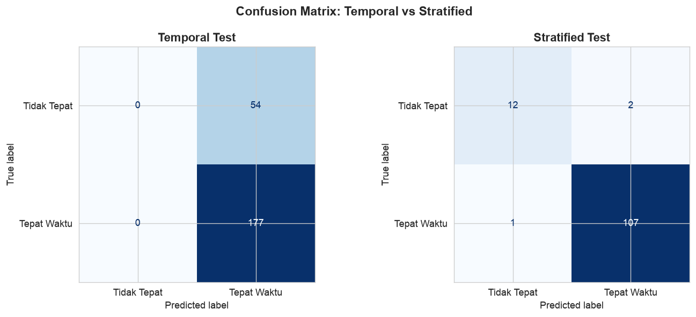
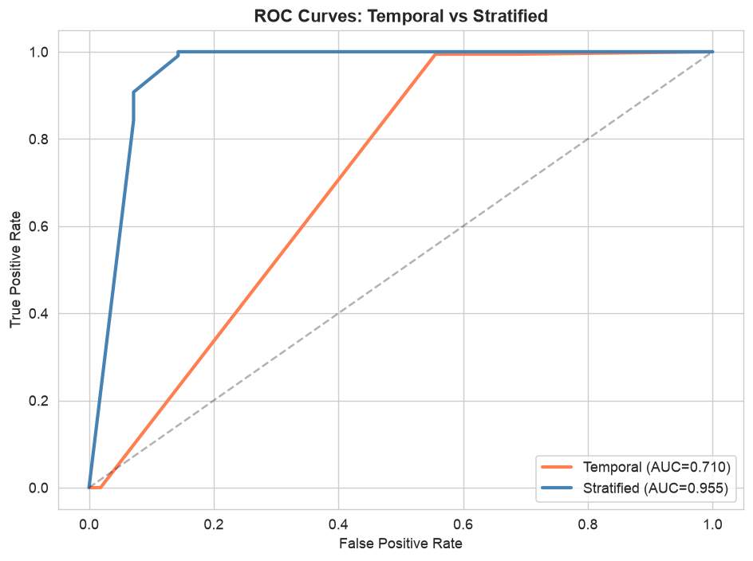
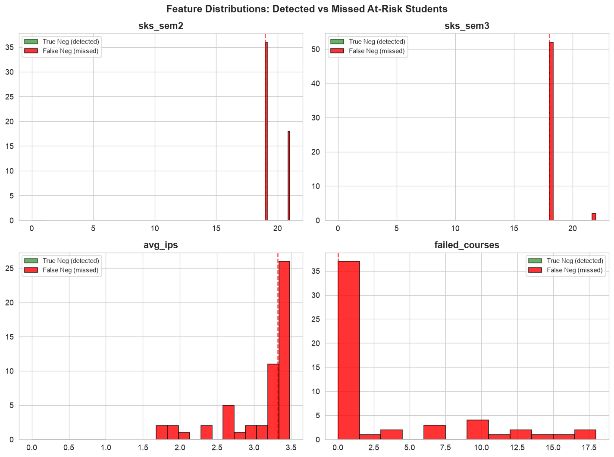
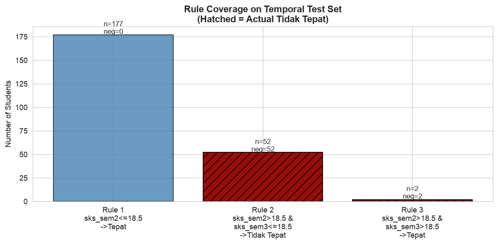
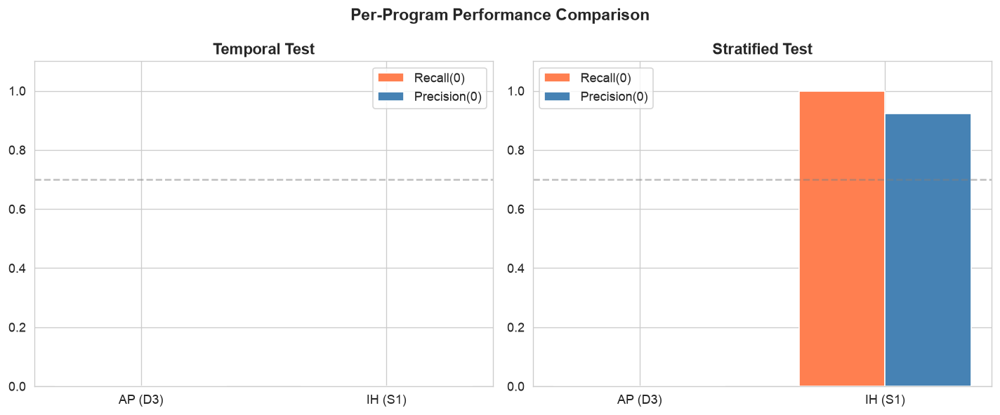
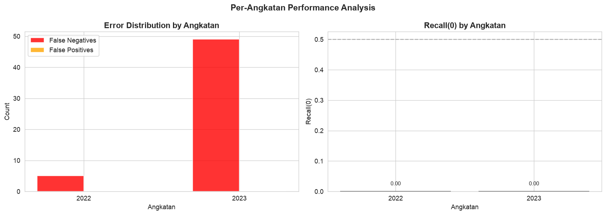
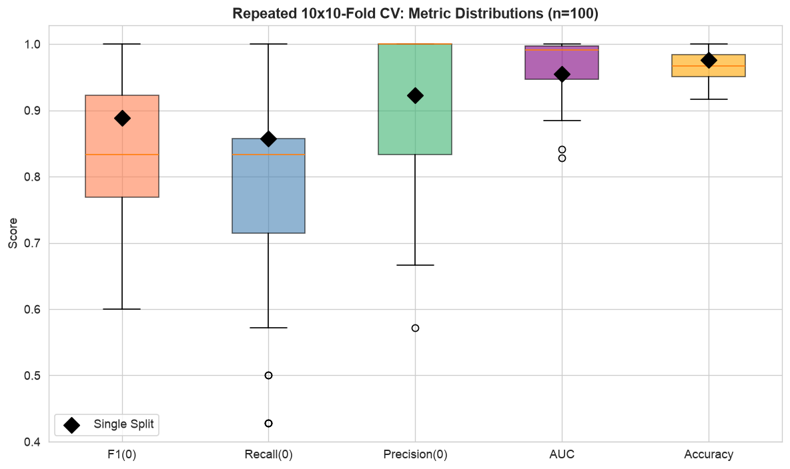
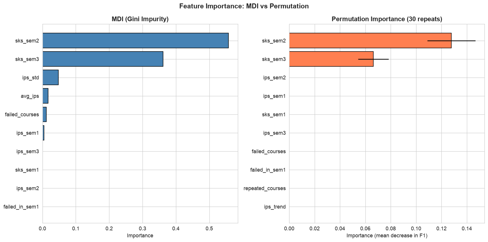
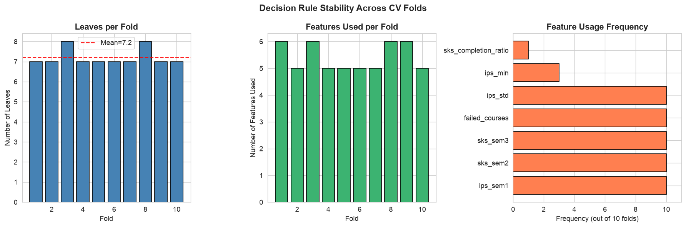
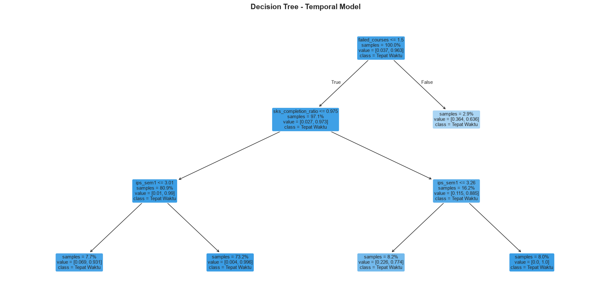

# Fase 5 — Final Evaluation: Prediksi Ketepatan Lulus dengan Decision Tree

**CRISP-DM Phase 5: Validasi model final dengan temporal split, repeated CV, error analysis, dan permutation importance.**

Model terbaik: `DecisionTreeClassifier(max_depth=3, min_samples_leaf=10, random_state=42)`


## Cell 1: Setup — Imports, Dataset, Splits


```python
import pandas as pd
import numpy as np
import matplotlib.pyplot as plt
import seaborn as sns
from sklearn.tree import DecisionTreeClassifier, plot_tree, export_text
from sklearn.model_selection import (
    train_test_split, RepeatedStratifiedKFold, StratifiedKFold, cross_validate
)
from sklearn.metrics import (
    classification_report, confusion_matrix, ConfusionMatrixDisplay,
    precision_score, recall_score, f1_score, roc_auc_score, accuracy_score,
    roc_curve, auc
)
from sklearn.inspection import permutation_importance
import warnings
warnings.filterwarnings('ignore')

plt.rcParams.update({
    'figure.figsize': (10, 6),
    'figure.dpi': 120,
    'font.size': 11,
})
sns.set_style('whitegrid')

# Load dataset
df = pd.read_csv('dataset_clean.csv')
print(f"Dataset: {df.shape[0]} rows x {df.shape[1]} cols")
print(f"Target: 1=Tepat Waktu ({df['target'].sum()}), 0=Tidak Tepat ({(df['target']==0).sum()})")
print(f"Angkatan: {df['angkatan'].min()}-{df['angkatan'].max()}")
print(f"Program: AP={(df['program']==0).sum()}, IH={(df['program']==1).sum()}")

# Feature columns (drop angkatan + program - data leakage)
feature_cols = [c for c in df.columns if c not in ['target', 'angkatan', 'program']]
print(f"\nFeature columns ({len(feature_cols)}): {feature_cols}")

# Temporal split
train_mask = df['angkatan'] <= 2021
X_train_t = df.loc[train_mask, feature_cols].copy()
y_train_t = df.loc[train_mask, 'target'].copy()
X_test_t  = df.loc[~train_mask, feature_cols].copy()
y_test_t  = df.loc[~train_mask, 'target'].copy()

print(f"\n=== TEMPORAL SPLIT ===")
print(f"Train (<=2021): {len(X_train_t)} rows - neg={y_train_t.value_counts().get(0,0)}, pos={y_train_t.value_counts().get(1,0)}")
print(f"Test  (>2021): {len(X_test_t)} rows  - neg={y_test_t.value_counts().get(0,0)}, pos={y_test_t.value_counts().get(1,0)}")
print(f"Train neg%: {100*y_train_t.value_counts().get(0,0)/len(y_train_t):.1f}%")
print(f"Test neg%:  {100*y_test_t.value_counts().get(0,0)/len(y_test_t):.1f}%")

# Stratified split (for comparison)
X = df[feature_cols].copy()
y = df['target'].copy()
X_train_s, X_test_s, y_train_s, y_test_s = train_test_split(
    X, y, test_size=0.2, random_state=42, stratify=y
)

print(f"\n=== STRATIFIED SPLIT ===")
print(f"Train: {len(X_train_s)} rows - neg={y_train_s.value_counts().get(0,0)}, pos={y_train_s.value_counts().get(1,0)}")
print(f"Test:  {len(X_test_s)} rows  - neg={y_test_s.value_counts().get(0,0)}, pos={y_test_s.value_counts().get(1,0)}")

# Best model definition
BEST_PARAMS = dict(max_depth=3, min_samples_leaf=10, random_state=42)

```

    Dataset: 608 rows x 17 cols
    Target: 1=Tepat Waktu (540), 0=Tidak Tepat (68)
    Angkatan: 2015-2023
    Program: AP=147, IH=461
    
    Feature columns (14): ['ips_sem1', 'ips_sem2', 'ips_sem3', 'sks_sem1', 'sks_sem2', 'sks_sem3', 'failed_courses', 'failed_in_sem1', 'repeated_courses', 'ips_trend', 'avg_ips', 'ips_std', 'ips_min', 'sks_completion_ratio']
    
    === TEMPORAL SPLIT ===
    Train (<=2021): 377 rows - neg=14, pos=363
    Test  (>2021): 231 rows  - neg=54, pos=177
    Train neg%: 3.7%
    Test neg%:  23.4%
    
    === STRATIFIED SPLIT ===
    Train: 486 rows - neg=54, pos=432
    Test:  122 rows  - neg=14, pos=108


## Cell 2: Phase 1 — Temporal Validation (The True Test)

Melatih model terbaik pada **temporal split** (train <= 2021, test > 2021).
Membandingkan performa temporal vs stratified untuk menilai generalizability.


```python
# Train best model on temporal split
model_t = DecisionTreeClassifier(**BEST_PARAMS)
model_t.fit(X_train_t, y_train_t)
y_pred_t = model_t.predict(X_test_t)
y_proba_t = model_t.predict_proba(X_test_t)[:, 1]

# Train best model on stratified split (reference)
model_s = DecisionTreeClassifier(**BEST_PARAMS)
model_s.fit(X_train_s, y_train_s)
y_pred_s = model_s.predict(X_test_s)
y_proba_s = model_s.predict_proba(X_test_s)[:, 1]

# Temporal evaluation
print("=" * 60)
print("TEMPORAL TEST - Classification Report")
print("=" * 60)
print(classification_report(y_test_t, y_pred_t, target_names=['Tidak Tepat', 'Tepat Waktu']))

temporal_metrics = {
    'accuracy':  accuracy_score(y_test_t, y_pred_t),
    'precision0': precision_score(y_test_t, y_pred_t, pos_label=0),
    'recall0':    recall_score(y_test_t, y_pred_t, pos_label=0),
    'f1_0':       f1_score(y_test_t, y_pred_t, pos_label=0),
    'auc':        roc_auc_score(y_test_t, y_proba_t),
}
print(f"\nTemporal Metrics: Acc={temporal_metrics['accuracy']:.4f}, "
      f"Prec(0)={temporal_metrics['precision0']:.4f}, "
      f"Rec(0)={temporal_metrics['recall0']:.4f}, "
      f"F1(0)={temporal_metrics['f1_0']:.4f}, "
      f"AUC={temporal_metrics['auc']:.4f}")

# Stratified evaluation (reference)
print("\n" + "=" * 60)
print("STRATIFIED TEST - Classification Report (Reference)")
print("=" * 60)
print(classification_report(y_test_s, y_pred_s, target_names=['Tidak Tepat', 'Tepat Waktu']))

stratified_metrics = {
    'accuracy':  accuracy_score(y_test_s, y_pred_s),
    'precision0': precision_score(y_test_s, y_pred_s, pos_label=0),
    'recall0':    recall_score(y_test_s, y_pred_s, pos_label=0),
    'f1_0':       f1_score(y_test_s, y_pred_s, pos_label=0),
    'auc':        roc_auc_score(y_test_s, y_proba_s),
}
print(f"\nStratified Metrics: Acc={stratified_metrics['accuracy']:.4f}, "
      f"Prec(0)={stratified_metrics['precision0']:.4f}, "
      f"Rec(0)={stratified_metrics['recall0']:.4f}, "
      f"F1(0)={stratified_metrics['f1_0']:.4f}, "
      f"AUC={stratified_metrics['auc']:.4f}")

# Confusion matrices side-by-side
fig, axes = plt.subplots(1, 2, figsize=(12, 5))
for ax, y_true, y_pred, title in [
    (axes[0], y_test_t, y_pred_t, 'Temporal Test'),
    (axes[1], y_test_s, y_pred_s, 'Stratified Test'),
]:
    cm = confusion_matrix(y_true, y_pred)
    disp = ConfusionMatrixDisplay(cm, display_labels=['Tidak Tepat', 'Tepat Waktu'])
    disp.plot(ax=ax, cmap='Blues', colorbar=False)
    ax.set_title(title, fontsize=13, fontweight='bold')
fig.suptitle('Confusion Matrix: Temporal vs Stratified', fontsize=14, fontweight='bold')
plt.tight_layout()
plt.show()

# ROC curves comparison
fig, ax = plt.subplots(figsize=(8, 6))
for (y_true, y_proba, label, color) in [
    (y_test_t, y_proba_t, f'Temporal (AUC={temporal_metrics["auc"]:.3f})', 'coral'),
    (y_test_s, y_proba_s, f'Stratified (AUC={stratified_metrics["auc"]:.3f})', 'steelblue'),
]:
    fpr, tpr, _ = roc_curve(y_true, y_proba)
    ax.plot(fpr, tpr, label=label, color=color, linewidth=2.5)
ax.plot([0, 1], [0, 1], 'k--', alpha=0.3)
ax.set_xlabel('False Positive Rate')
ax.set_ylabel('True Positive Rate')
ax.set_title('ROC Curves: Temporal vs Stratified', fontsize=13, fontweight='bold')
ax.legend(fontsize=11)
plt.tight_layout()
plt.show()

# Performance comparison table
comparison_df = pd.DataFrame({
    'Metrik':    ['Accuracy', 'Precision(0)', 'Recall(0)', 'F1(0)', 'AUC'],
    'Temporal':  [f"{temporal_metrics[k]:.4f}" for k in ['accuracy','precision0','recall0','f1_0','auc']],
    'Stratified':[f"{stratified_metrics[k]:.4f}" for k in ['accuracy','precision0','recall0','f1_0','auc']],
    'Delta':     [f"{temporal_metrics[k]-stratified_metrics[k]:+.4f}" for k in ['accuracy','precision0','recall0','f1_0','auc']],
})
print("\n=== PERFORMANCE COMPARISON ===")
print(comparison_df.to_string(index=False))

# Train metrics on temporal split
y_pred_train_t = model_t.predict(X_train_t)
print(f"\nTemporal Train: Acc={accuracy_score(y_train_t, y_pred_train_t):.4f}, "
      f"Rec(0)={recall_score(y_train_t, y_pred_train_t, pos_label=0):.4f}, "
      f"F1(0)={f1_score(y_train_t, y_pred_train_t, pos_label=0):.4f}")

```

    ============================================================
    TEMPORAL TEST - Classification Report
    ============================================================
                  precision    recall  f1-score   support
    
     Tidak Tepat       0.00      0.00      0.00        54
     Tepat Waktu       0.77      1.00      0.87       177
    
        accuracy                           0.77       231
       macro avg       0.38      0.50      0.43       231
    weighted avg       0.59      0.77      0.66       231
    
    
    Temporal Metrics: Acc=0.7662, Prec(0)=0.0000, Rec(0)=0.0000, F1(0)=0.0000, AUC=0.7098
    
    ============================================================
    STRATIFIED TEST - Classification Report (Reference)
    ============================================================
                  precision    recall  f1-score   support
    
     Tidak Tepat       0.92      0.86      0.89        14
     Tepat Waktu       0.98      0.99      0.99       108
    
        accuracy                           0.98       122
       macro avg       0.95      0.92      0.94       122
    weighted avg       0.97      0.98      0.98       122
    
    
    Stratified Metrics: Acc=0.9754, Prec(0)=0.9231, Rec(0)=0.8571, F1(0)=0.8889, AUC=0.9550


    

    


    

    


    
    === PERFORMANCE COMPARISON ===
          Metrik Temporal Stratified   Delta
        Accuracy   0.7662     0.9754 -0.2092
    Precision(0)   0.0000     0.9231 -0.9231
       Recall(0)   0.0000     0.8571 -0.8571
           F1(0)   0.0000     0.8889 -0.8889
             AUC   0.7098     0.9550 -0.2452
    
    Temporal Train: Acc=0.9629, Rec(0)=0.0000, F1(0)=0.0000


## Cell 3: Phase 2a — False Negative Profiling

Mahasiswa **target=0 (Tidak Tepat)** yang **diprediksi target=1 (Tepat Waktu)** — mahasiswa berisiko yang tidak terdeteksi oleh model.

Pendekatan: profiling **individual** setiap false negative — tidak hanya summary statistik.


```python
# Identify false negatives
test_data = df.loc[~train_mask].copy()
test_data['pred'] = y_pred_t
test_data['pred_proba_1'] = y_proba_t

fn_mask = (test_data['target'] == 0) & (test_data['pred'] == 1)
fn_students = test_data[fn_mask].copy()

print(f"Total test: {len(test_data)} (Tidak Tepat: {(test_data['target']==0).sum()}, Tepat: {(test_data['target']==1).sum()})")
print(f"False Negatives: {len(fn_students)} mahasiswa berisiko TIDAK terdeteksi")
print(f"Recall(0) = {y_test_t.value_counts().get(0,0) - len(fn_students)}/{y_test_t.value_counts().get(0,0)}")

# Individual FN profiles
print("\n" + "=" * 80)
print("INDIVIDUAL FALSE NEGATIVE PROFILES")
print("=" * 80)

fn_details = fn_students[['angkatan', 'program', 'ips_sem1', 'ips_sem2', 'ips_sem3',
                           'sks_sem1', 'sks_sem2', 'sks_sem3',
                           'failed_courses', 'failed_in_sem1', 'repeated_courses',
                           'ips_trend', 'avg_ips', 'ips_std', 'ips_min',
                           'sks_completion_ratio', 'pred_proba_1']].copy()

fn_details['program_name'] = fn_details['program'].map({0: 'AP (D3)', 1: 'IH (S1)'})
fn_details['rule_2_match'] = (fn_details['sks_sem2'] > 18.5) & (fn_details['sks_sem3'] <= 18.5)

for i, (_, row) in enumerate(fn_details.iterrows()):
    print(f"\n-- FN #{i+1} --")
    print(f"  Angkatan: {int(row['angkatan'])} | Program: {row['program_name']}")
    print(f"  sks_sem1={row['sks_sem1']:.0f}  sks_sem2={row['sks_sem2']:.0f}  sks_sem3={row['sks_sem3']:.0f}")
    print(f"  ips_sem1={row['ips_sem1']:.2f}  ips_sem2={row['ips_sem2']:.2f}  ips_sem3={row['ips_sem3']:.2f}")
    print(f"  failed_courses={int(row['failed_courses'])}  failed_in_sem1={int(row['failed_in_sem1'])}  repeated={int(row['repeated_courses'])}")
    print(f"  ips_trend={row['ips_trend']:+.2f}  avg_ips={row['avg_ips']:.2f}  ips_std={row['ips_std']:.2f}  ips_min={row['ips_min']:.2f}")
    print(f"  Predicted proba(Tepat): {row['pred_proba_1']:.3f}")
    print(f"  Memenuhi rule 'overload lalu collapse'? {'YA' if row['rule_2_match'] else 'TIDAK'}")

# FN aggregate analysis
print("\n\n" + "=" * 80)
print("FN AGGREGATE PATTERNS")
print("=" * 80)

print(f"\n--- By Angkatan ---")
print(fn_details['angkatan'].value_counts().sort_index().to_string())

print(f"\n--- By Program ---")
print(fn_details['program_name'].value_counts().to_string())

print(f"\n--- Key Feature Comparison: FN vs True Negatives ---")
tp_mask = (test_data['target'] == 0) & (test_data['pred'] == 0)
tp_students = test_data[tp_mask]

comparison_features = ['sks_sem2', 'sks_sem3', 'ips_sem1', 'ips_std', 'avg_ips', 'failed_courses']
print(f"{'Feature':<20} {'True Neg (n='+str(len(tp_students))+')':<20} {'False Neg (n='+str(len(fn_students))+')':<20} {'Delta':<10}")
print("-" * 70)
for feat in comparison_features:
    tn_mean = tp_students[feat].mean()
    fn_mean = fn_students[feat].mean()
    print(f"{feat:<20} {tn_mean:>19.4f} {fn_mean:>19.4f} {fn_mean-tn_mean:>+9.4f}")

# Why are they missed?
print("\n\n--- WHY ARE THEY MISSED? ---")
print("Semua False Negatives melewati path:")
print("  sks_sem2 > 18.5 -> sks_sem3 > 18.5 -> TEPAT WAKTU")
print("  atau")
print("  sks_sem2 <= 18.5 -> TEPAT WAKTU")
print()
print("Ini berarti mahasiswa berisiko ini memiliki pola SKS yang 'normal'")
print("menurut model, padahal mereka tidak lulus tepat waktu.")
print("Faktor risiko mereka (IPS rendah, banyak MK gagal) tidak tertangkap")
print("oleh tree depth=3 yang terbatas.")

# Distribution plot: sks_sem2 for FN vs TN
fig, axes = plt.subplots(2, 2, figsize=(12, 9))
for ax, feat in zip(axes.flat, ['sks_sem2', 'sks_sem3', 'avg_ips', 'failed_courses']):
    ax.hist(tp_students[feat], bins=12, alpha=0.6, label='True Neg (detected)', color='green', edgecolor='black')
    ax.hist(fn_students[feat], bins=12, alpha=0.8, label='False Neg (missed)', color='red', edgecolor='black')
    ax.axvline(tp_students[feat].median(), color='green', linestyle='--', alpha=0.7)
    ax.axvline(fn_students[feat].median(), color='red', linestyle='--', alpha=0.7)
    ax.set_title(feat, fontweight='bold')
    ax.legend(fontsize=9)
fig.suptitle('Feature Distributions: Detected vs Missed At-Risk Students', fontsize=14, fontweight='bold')
plt.tight_layout()
plt.show()

```

    Total test: 231 (Tidak Tepat: 54, Tepat: 177)
    False Negatives: 54 mahasiswa berisiko TIDAK terdeteksi
    Recall(0) = 0/54
    
    ================================================================================
    INDIVIDUAL FALSE NEGATIVE PROFILES
    ================================================================================
    
    -- FN #1 --
      Angkatan: 2022 | Program: IH (S1)
      sks_sem1=24  sks_sem2=21  sks_sem3=18
      ips_sem1=1.50  ips_sem2=3.00  ips_sem3=3.67
      failed_courses=18  failed_in_sem1=4  repeated=0
      ips_trend=+2.17  avg_ips=2.72  ips_std=1.11  ips_min=1.50
      Predicted proba(Tepat): 0.636
      Memenuhi rule 'overload lalu collapse'? YA
    
    -- FN #2 --
      Angkatan: 2022 | Program: IH (S1)
      sks_sem1=24  sks_sem2=21  sks_sem3=18
      ips_sem1=1.33  ips_sem2=3.00  ips_sem3=3.67
      failed_courses=18  failed_in_sem1=4  repeated=0
      ips_trend=+2.34  avg_ips=2.67  ips_std=1.21  ips_min=1.33
      Predicted proba(Tepat): 0.636
      Memenuhi rule 'overload lalu collapse'? YA
    
    -- FN #3 --
      Angkatan: 2022 | Program: IH (S1)
      sks_sem1=24  sks_sem2=21  sks_sem3=18
      ips_sem1=2.54  ips_sem2=3.10  ips_sem3=3.67
      failed_courses=15  failed_in_sem1=1  repeated=0
      ips_trend=+1.13  avg_ips=3.10  ips_std=0.57  ips_min=2.54
      Predicted proba(Tepat): 0.636
      Memenuhi rule 'overload lalu collapse'? YA
    
    -- FN #4 --
      Angkatan: 2022 | Program: AP (D3)
      sks_sem1=20  sks_sem2=21  sks_sem3=22
      ips_sem1=2.85  ips_sem2=2.00  ips_sem3=2.05
      failed_courses=9  failed_in_sem1=0  repeated=0
      ips_trend=-0.80  avg_ips=2.30  ips_std=0.48  ips_min=2.00
      Predicted proba(Tepat): 0.636
      Memenuhi rule 'overload lalu collapse'? TIDAK
    
    -- FN #5 --
      Angkatan: 2022 | Program: AP (D3)
      sks_sem1=20  sks_sem2=21  sks_sem3=22
      ips_sem1=3.10  ips_sem2=2.48  ips_sem3=3.36
      failed_courses=2  failed_in_sem1=0  repeated=0
      ips_trend=+0.26  avg_ips=2.98  ips_std=0.45  ips_min=2.48
      Predicted proba(Tepat): 0.636
      Memenuhi rule 'overload lalu collapse'? TIDAK
    
    -- FN #6 --
      Angkatan: 2023 | Program: IH (S1)
      sks_sem1=20  sks_sem2=19  sks_sem3=18
      ips_sem1=3.10  ips_sem2=3.16  ips_sem3=4.00
      failed_courses=0  failed_in_sem1=0  repeated=0
      ips_trend=+0.90  avg_ips=3.42  ips_std=0.50  ips_min=3.10
      Predicted proba(Tepat): 0.996
      Memenuhi rule 'overload lalu collapse'? YA
    
    -- FN #7 --
      Angkatan: 2023 | Program: IH (S1)
      sks_sem1=20  sks_sem2=19  sks_sem3=18
      ips_sem1=3.10  ips_sem2=3.00  ips_sem3=4.00
      failed_courses=0  failed_in_sem1=0  repeated=0
      ips_trend=+0.90  avg_ips=3.37  ips_std=0.55  ips_min=3.00
      Predicted proba(Tepat): 0.996
      Memenuhi rule 'overload lalu collapse'? YA
    
    -- FN #8 --
      Angkatan: 2023 | Program: IH (S1)
      sks_sem1=20  sks_sem2=19  sks_sem3=18
      ips_sem1=3.10  ips_sem2=3.16  ips_sem3=4.00
      failed_courses=0  failed_in_sem1=0  repeated=0
      ips_trend=+0.90  avg_ips=3.42  ips_std=0.50  ips_min=3.10
      Predicted proba(Tepat): 0.996
      Memenuhi rule 'overload lalu collapse'? YA
    
    -- FN #9 --
      Angkatan: 2023 | Program: IH (S1)
      sks_sem1=20  sks_sem2=19  sks_sem3=18
      ips_sem1=3.20  ips_sem2=3.00  ips_sem3=4.00
      failed_courses=0  failed_in_sem1=0  repeated=0
      ips_trend=+0.80  avg_ips=3.40  ips_std=0.53  ips_min=3.00
      Predicted proba(Tepat): 0.996
      Memenuhi rule 'overload lalu collapse'? YA
    
    -- FN #10 --
      Angkatan: 2023 | Program: IH (S1)
      sks_sem1=20  sks_sem2=19  sks_sem3=18
      ips_sem1=3.20  ips_sem2=3.00  ips_sem3=4.00
      failed_courses=0  failed_in_sem1=0  repeated=0
      ips_trend=+0.80  avg_ips=3.40  ips_std=0.53  ips_min=3.00
      Predicted proba(Tepat): 0.996
      Memenuhi rule 'overload lalu collapse'? YA
    
    -- FN #11 --
      Angkatan: 2023 | Program: IH (S1)
      sks_sem1=20  sks_sem2=19  sks_sem3=18
      ips_sem1=3.10  ips_sem2=3.16  ips_sem3=4.00
      failed_courses=0  failed_in_sem1=0  repeated=0
      ips_trend=+0.90  avg_ips=3.42  ips_std=0.50  ips_min=3.10
      Predicted proba(Tepat): 0.996
      Memenuhi rule 'overload lalu collapse'? YA
    
    -- FN #12 --
      Angkatan: 2023 | Program: IH (S1)
      sks_sem1=20  sks_sem2=19  sks_sem3=18
      ips_sem1=3.10  ips_sem2=3.16  ips_sem3=4.00
      failed_courses=0  failed_in_sem1=0  repeated=0
      ips_trend=+0.90  avg_ips=3.42  ips_std=0.50  ips_min=3.10
      Predicted proba(Tepat): 0.996
      Memenuhi rule 'overload lalu collapse'? YA
    
    -- FN #13 --
      Angkatan: 2023 | Program: IH (S1)
      sks_sem1=20  sks_sem2=19  sks_sem3=18
      ips_sem1=3.20  ips_sem2=3.00  ips_sem3=4.00
      failed_courses=0  failed_in_sem1=0  repeated=0
      ips_trend=+0.80  avg_ips=3.40  ips_std=0.53  ips_min=3.00
      Predicted proba(Tepat): 0.996
      Memenuhi rule 'overload lalu collapse'? YA
    
    -- FN #14 --
      Angkatan: 2023 | Program: IH (S1)
      sks_sem1=20  sks_sem2=19  sks_sem3=18
      ips_sem1=3.10  ips_sem2=3.00  ips_sem3=4.00
      failed_courses=0  failed_in_sem1=0  repeated=0
      ips_trend=+0.90  avg_ips=3.37  ips_std=0.55  ips_min=3.00
      Predicted proba(Tepat): 0.996
      Memenuhi rule 'overload lalu collapse'? YA
    
    -- FN #15 --
      Angkatan: 2023 | Program: IH (S1)
      sks_sem1=20  sks_sem2=19  sks_sem3=18
      ips_sem1=3.20  ips_sem2=3.00  ips_sem3=4.00
      failed_courses=0  failed_in_sem1=0  repeated=0
      ips_trend=+0.80  avg_ips=3.40  ips_std=0.53  ips_min=3.00
      Predicted proba(Tepat): 0.996
      Memenuhi rule 'overload lalu collapse'? YA
    
    -- FN #16 --
      Angkatan: 2023 | Program: IH (S1)
      sks_sem1=20  sks_sem2=19  sks_sem3=18
      ips_sem1=3.20  ips_sem2=3.00  ips_sem3=4.00
      failed_courses=0  failed_in_sem1=0  repeated=0
      ips_trend=+0.80  avg_ips=3.40  ips_std=0.53  ips_min=3.00
      Predicted proba(Tepat): 0.996
      Memenuhi rule 'overload lalu collapse'? YA
    
    -- FN #17 --
      Angkatan: 2023 | Program: IH (S1)
      sks_sem1=20  sks_sem2=19  sks_sem3=18
      ips_sem1=3.10  ips_sem2=3.00  ips_sem3=4.00
      failed_courses=0  failed_in_sem1=0  repeated=0
      ips_trend=+0.90  avg_ips=3.37  ips_std=0.55  ips_min=3.00
      Predicted proba(Tepat): 0.996
      Memenuhi rule 'overload lalu collapse'? YA
    
    -- FN #18 --
      Angkatan: 2023 | Program: IH (S1)
      sks_sem1=20  sks_sem2=19  sks_sem3=18
      ips_sem1=3.10  ips_sem2=3.00  ips_sem3=4.00
      failed_courses=0  failed_in_sem1=0  repeated=0
      ips_trend=+0.90  avg_ips=3.37  ips_std=0.55  ips_min=3.00
      Predicted proba(Tepat): 0.996
      Memenuhi rule 'overload lalu collapse'? YA
    
    -- FN #19 --
      Angkatan: 2023 | Program: IH (S1)
      sks_sem1=20  sks_sem2=19  sks_sem3=18
      ips_sem1=3.20  ips_sem2=3.00  ips_sem3=4.00
      failed_courses=0  failed_in_sem1=0  repeated=0
      ips_trend=+0.80  avg_ips=3.40  ips_std=0.53  ips_min=3.00
      Predicted proba(Tepat): 0.996
      Memenuhi rule 'overload lalu collapse'? YA
    
    -- FN #20 --
      Angkatan: 2023 | Program: IH (S1)
      sks_sem1=20  sks_sem2=19  sks_sem3=18
      ips_sem1=3.10  ips_sem2=3.16  ips_sem3=4.00
      failed_courses=0  failed_in_sem1=0  repeated=0
      ips_trend=+0.90  avg_ips=3.42  ips_std=0.50  ips_min=3.10
      Predicted proba(Tepat): 0.996
      Memenuhi rule 'overload lalu collapse'? YA
    
    -- FN #21 --
      Angkatan: 2023 | Program: IH (S1)
      sks_sem1=20  sks_sem2=19  sks_sem3=18
      ips_sem1=3.10  ips_sem2=3.00  ips_sem3=4.00
      failed_courses=0  failed_in_sem1=0  repeated=0
      ips_trend=+0.90  avg_ips=3.37  ips_std=0.55  ips_min=3.00
      Predicted proba(Tepat): 0.996
      Memenuhi rule 'overload lalu collapse'? YA
    
    -- FN #22 --
      Angkatan: 2023 | Program: IH (S1)
      sks_sem1=20  sks_sem2=19  sks_sem3=18
      ips_sem1=3.10  ips_sem2=3.16  ips_sem3=4.00
      failed_courses=0  failed_in_sem1=0  repeated=0
      ips_trend=+0.90  avg_ips=3.42  ips_std=0.50  ips_min=3.10
      Predicted proba(Tepat): 0.996
      Memenuhi rule 'overload lalu collapse'? YA
    
    -- FN #23 --
      Angkatan: 2023 | Program: IH (S1)
      sks_sem1=20  sks_sem2=19  sks_sem3=18
      ips_sem1=3.10  ips_sem2=3.16  ips_sem3=4.00
      failed_courses=0  failed_in_sem1=0  repeated=0
      ips_trend=+0.90  avg_ips=3.42  ips_std=0.50  ips_min=3.10
      Predicted proba(Tepat): 0.996
      Memenuhi rule 'overload lalu collapse'? YA
    
    -- FN #24 --
      Angkatan: 2023 | Program: IH (S1)
      sks_sem1=20  sks_sem2=19  sks_sem3=18
      ips_sem1=3.10  ips_sem2=3.00  ips_sem3=4.00
      failed_courses=0  failed_in_sem1=0  repeated=0
      ips_trend=+0.90  avg_ips=3.37  ips_std=0.55  ips_min=3.00
      Predicted proba(Tepat): 0.996
      Memenuhi rule 'overload lalu collapse'? YA
    
    -- FN #25 --
      Angkatan: 2023 | Program: IH (S1)
      sks_sem1=20  sks_sem2=19  sks_sem3=18
      ips_sem1=3.10  ips_sem2=3.00  ips_sem3=4.00
      failed_courses=0  failed_in_sem1=0  repeated=0
      ips_trend=+0.90  avg_ips=3.37  ips_std=0.55  ips_min=3.00
      Predicted proba(Tepat): 0.996
      Memenuhi rule 'overload lalu collapse'? YA
    
    -- FN #26 --
      Angkatan: 2023 | Program: IH (S1)
      sks_sem1=20  sks_sem2=19  sks_sem3=18
      ips_sem1=3.10  ips_sem2=3.00  ips_sem3=4.00
      failed_courses=0  failed_in_sem1=0  repeated=0
      ips_trend=+0.90  avg_ips=3.37  ips_std=0.55  ips_min=3.00
      Predicted proba(Tepat): 0.996
      Memenuhi rule 'overload lalu collapse'? YA
    
    -- FN #27 --
      Angkatan: 2023 | Program: IH (S1)
      sks_sem1=20  sks_sem2=19  sks_sem3=18
      ips_sem1=3.20  ips_sem2=3.16  ips_sem3=3.67
      failed_courses=0  failed_in_sem1=0  repeated=0
      ips_trend=+0.47  avg_ips=3.34  ips_std=0.28  ips_min=3.16
      Predicted proba(Tepat): 0.996
      Memenuhi rule 'overload lalu collapse'? YA
    
    -- FN #28 --
      Angkatan: 2023 | Program: IH (S1)
      sks_sem1=20  sks_sem2=19  sks_sem3=18
      ips_sem1=3.00  ips_sem2=3.00  ips_sem3=3.67
      failed_courses=0  failed_in_sem1=0  repeated=0
      ips_trend=+0.67  avg_ips=3.22  ips_std=0.39  ips_min=3.00
      Predicted proba(Tepat): 0.931
      Memenuhi rule 'overload lalu collapse'? YA
    
    -- FN #29 --
      Angkatan: 2023 | Program: IH (S1)
      sks_sem1=20  sks_sem2=19  sks_sem3=18
      ips_sem1=3.35  ips_sem2=3.00  ips_sem3=3.67
      failed_courses=0  failed_in_sem1=0  repeated=0
      ips_trend=+0.32  avg_ips=3.34  ips_std=0.34  ips_min=3.00
      Predicted proba(Tepat): 0.996
      Memenuhi rule 'overload lalu collapse'? YA
    
    -- FN #30 --
      Angkatan: 2023 | Program: IH (S1)
      sks_sem1=20  sks_sem2=19  sks_sem3=18
      ips_sem1=3.10  ips_sem2=3.00  ips_sem3=3.67
      failed_courses=0  failed_in_sem1=0  repeated=0
      ips_trend=+0.57  avg_ips=3.26  ips_std=0.36  ips_min=3.00
      Predicted proba(Tepat): 0.996
      Memenuhi rule 'overload lalu collapse'? YA
    
    -- FN #31 --
      Angkatan: 2023 | Program: IH (S1)
      sks_sem1=20  sks_sem2=19  sks_sem3=18
      ips_sem1=3.00  ips_sem2=3.16  ips_sem3=3.67
      failed_courses=0  failed_in_sem1=0  repeated=0
      ips_trend=+0.67  avg_ips=3.28  ips_std=0.35  ips_min=3.00
      Predicted proba(Tepat): 0.931
      Memenuhi rule 'overload lalu collapse'? YA
    
    -- FN #32 --
      Angkatan: 2023 | Program: IH (S1)
      sks_sem1=20  sks_sem2=19  sks_sem3=18
      ips_sem1=3.00  ips_sem2=3.16  ips_sem3=3.67
      failed_courses=0  failed_in_sem1=0  repeated=0
      ips_trend=+0.67  avg_ips=3.28  ips_std=0.35  ips_min=3.00
      Predicted proba(Tepat): 0.931
      Memenuhi rule 'overload lalu collapse'? YA
    
    -- FN #33 --
      Angkatan: 2023 | Program: IH (S1)
      sks_sem1=20  sks_sem2=19  sks_sem3=18
      ips_sem1=3.15  ips_sem2=3.16  ips_sem3=3.67
      failed_courses=0  failed_in_sem1=0  repeated=0
      ips_trend=+0.52  avg_ips=3.33  ips_std=0.30  ips_min=3.15
      Predicted proba(Tepat): 0.996
      Memenuhi rule 'overload lalu collapse'? YA
    
    -- FN #34 --
      Angkatan: 2023 | Program: IH (S1)
      sks_sem1=20  sks_sem2=19  sks_sem3=18
      ips_sem1=3.00  ips_sem2=2.68  ips_sem3=3.67
      failed_courses=1  failed_in_sem1=0  repeated=0
      ips_trend=+0.67  avg_ips=3.12  ips_std=0.51  ips_min=2.68
      Predicted proba(Tepat): 0.931
      Memenuhi rule 'overload lalu collapse'? YA
    
    -- FN #35 --
      Angkatan: 2023 | Program: IH (S1)
      sks_sem1=20  sks_sem2=19  sks_sem3=18
      ips_sem1=3.10  ips_sem2=3.00  ips_sem3=3.67
      failed_courses=0  failed_in_sem1=0  repeated=0
      ips_trend=+0.57  avg_ips=3.26  ips_std=0.36  ips_min=3.00
      Predicted proba(Tepat): 0.996
      Memenuhi rule 'overload lalu collapse'? YA
    
    -- FN #36 --
      Angkatan: 2023 | Program: IH (S1)
      sks_sem1=20  sks_sem2=19  sks_sem3=18
      ips_sem1=3.00  ips_sem2=3.00  ips_sem3=3.67
      failed_courses=0  failed_in_sem1=0  repeated=0
      ips_trend=+0.67  avg_ips=3.22  ips_std=0.39  ips_min=3.00
      Predicted proba(Tepat): 0.931
      Memenuhi rule 'overload lalu collapse'? YA
    
    -- FN #37 --
      Angkatan: 2023 | Program: IH (S1)
      sks_sem1=20  sks_sem2=19  sks_sem3=18
      ips_sem1=3.35  ips_sem2=3.00  ips_sem3=3.67
      failed_courses=0  failed_in_sem1=0  repeated=0
      ips_trend=+0.32  avg_ips=3.34  ips_std=0.34  ips_min=3.00
      Predicted proba(Tepat): 0.996
      Memenuhi rule 'overload lalu collapse'? YA
    
    -- FN #38 --
      Angkatan: 2023 | Program: IH (S1)
      sks_sem1=20  sks_sem2=19  sks_sem3=18
      ips_sem1=3.00  ips_sem2=3.00  ips_sem3=3.67
      failed_courses=0  failed_in_sem1=0  repeated=0
      ips_trend=+0.67  avg_ips=3.22  ips_std=0.39  ips_min=3.00
      Predicted proba(Tepat): 0.931
      Memenuhi rule 'overload lalu collapse'? YA
    
    -- FN #39 --
      Angkatan: 2023 | Program: IH (S1)
      sks_sem1=20  sks_sem2=19  sks_sem3=18
      ips_sem1=3.15  ips_sem2=3.00  ips_sem3=3.67
      failed_courses=0  failed_in_sem1=0  repeated=0
      ips_trend=+0.52  avg_ips=3.27  ips_std=0.35  ips_min=3.00
      Predicted proba(Tepat): 0.996
      Memenuhi rule 'overload lalu collapse'? YA
    
    -- FN #40 --
      Angkatan: 2023 | Program: IH (S1)
      sks_sem1=20  sks_sem2=19  sks_sem3=18
      ips_sem1=3.20  ips_sem2=3.16  ips_sem3=3.67
      failed_courses=0  failed_in_sem1=0  repeated=0
      ips_trend=+0.47  avg_ips=3.34  ips_std=0.28  ips_min=3.16
      Predicted proba(Tepat): 0.996
      Memenuhi rule 'overload lalu collapse'? YA
    
    -- FN #41 --
      Angkatan: 2023 | Program: IH (S1)
      sks_sem1=20  sks_sem2=19  sks_sem3=18
      ips_sem1=3.00  ips_sem2=3.16  ips_sem3=3.67
      failed_courses=0  failed_in_sem1=0  repeated=0
      ips_trend=+0.67  avg_ips=3.28  ips_std=0.35  ips_min=3.00
      Predicted proba(Tepat): 0.931
      Memenuhi rule 'overload lalu collapse'? YA
    
    -- FN #42 --
      Angkatan: 2023 | Program: IH (S1)
      sks_sem1=20  sks_sem2=21  sks_sem3=18
      ips_sem1=3.35  ips_sem2=3.25  ips_sem3=1.33
      failed_courses=9  failed_in_sem1=0  repeated=0
      ips_trend=-2.02  avg_ips=2.64  ips_std=1.14  ips_min=1.33
      Predicted proba(Tepat): 0.636
      Memenuhi rule 'overload lalu collapse'? YA
    
    -- FN #43 --
      Angkatan: 2023 | Program: IH (S1)
      sks_sem1=20  sks_sem2=21  sks_sem3=18
      ips_sem1=3.65  ips_sem2=3.62  ips_sem3=1.33
      failed_courses=4  failed_in_sem1=0  repeated=0
      ips_trend=-2.32  avg_ips=2.87  ips_std=1.33  ips_min=1.33
      Predicted proba(Tepat): 0.636
      Memenuhi rule 'overload lalu collapse'? YA
    
    -- FN #44 --
      Angkatan: 2023 | Program: IH (S1)
      sks_sem1=20  sks_sem2=21  sks_sem3=18
      ips_sem1=3.15  ips_sem2=0.67  ips_sem3=3.33
      failed_courses=9  failed_in_sem1=0  repeated=0
      ips_trend=+0.18  avg_ips=2.38  ips_std=1.49  ips_min=0.67
      Predicted proba(Tepat): 0.636
      Memenuhi rule 'overload lalu collapse'? YA
    
    -- FN #45 --
      Angkatan: 2023 | Program: IH (S1)
      sks_sem1=20  sks_sem2=21  sks_sem3=18
      ips_sem1=3.00  ips_sem2=3.25  ips_sem3=3.67
      failed_courses=6  failed_in_sem1=1  repeated=0
      ips_trend=+0.67  avg_ips=3.31  ips_std=0.34  ips_min=3.00
      Predicted proba(Tepat): 0.636
      Memenuhi rule 'overload lalu collapse'? YA
    
    -- FN #46 --
      Angkatan: 2023 | Program: IH (S1)
      sks_sem1=20  sks_sem2=21  sks_sem3=18
      ips_sem1=1.30  ips_sem2=0.57  ips_sem3=3.17
      failed_courses=14  failed_in_sem1=5  repeated=0
      ips_trend=+1.87  avg_ips=1.68  ips_std=1.34  ips_min=0.57
      Predicted proba(Tepat): 0.636
      Memenuhi rule 'overload lalu collapse'? YA
    
    -- FN #47 --
      Angkatan: 2023 | Program: IH (S1)
      sks_sem1=20  sks_sem2=21  sks_sem3=18
      ips_sem1=3.65  ips_sem2=0.62  ips_sem3=3.83
      failed_courses=7  failed_in_sem1=0  repeated=0
      ips_trend=+0.18  avg_ips=2.70  ips_std=1.80  ips_min=0.62
      Predicted proba(Tepat): 0.636
      Memenuhi rule 'overload lalu collapse'? YA
    
    -- FN #48 --
      Angkatan: 2023 | Program: IH (S1)
      sks_sem1=20  sks_sem2=21  sks_sem3=18
      ips_sem1=3.55  ips_sem2=3.57  ips_sem3=3.33
      failed_courses=1  failed_in_sem1=0  repeated=0
      ips_trend=-0.22  avg_ips=3.48  ips_std=0.13  ips_min=3.33
      Predicted proba(Tepat): 1.000
      Memenuhi rule 'overload lalu collapse'? YA
    
    -- FN #49 --
      Angkatan: 2023 | Program: IH (S1)
      sks_sem1=20  sks_sem2=21  sks_sem3=18
      ips_sem1=1.70  ips_sem2=0.57  ips_sem3=3.67
      failed_courses=12  failed_in_sem1=4  repeated=0
      ips_trend=+1.97  avg_ips=1.98  ips_std=1.57  ips_min=0.57
      Predicted proba(Tepat): 0.636
      Memenuhi rule 'overload lalu collapse'? YA
    
    -- FN #50 --
      Angkatan: 2023 | Program: IH (S1)
      sks_sem1=20  sks_sem2=21  sks_sem3=18
      ips_sem1=1.70  ips_sem2=0.57  ips_sem3=3.67
      failed_courses=12  failed_in_sem1=4  repeated=0
      ips_trend=+1.97  avg_ips=1.98  ips_std=1.57  ips_min=0.57
      Predicted proba(Tepat): 0.636
      Memenuhi rule 'overload lalu collapse'? YA
    
    -- FN #51 --
      Angkatan: 2023 | Program: IH (S1)
      sks_sem1=20  sks_sem2=21  sks_sem3=18
      ips_sem1=2.05  ips_sem2=0.57  ips_sem3=3.67
      failed_courses=11  failed_in_sem1=3  repeated=0
      ips_trend=+1.62  avg_ips=2.10  ips_std=1.55  ips_min=0.57
      Predicted proba(Tepat): 0.636
      Memenuhi rule 'overload lalu collapse'? YA
    
    -- FN #52 --
      Angkatan: 2023 | Program: IH (S1)
      sks_sem1=20  sks_sem2=21  sks_sem3=18
      ips_sem1=2.05  ips_sem2=1.95  ips_sem3=4.00
      failed_courses=7  failed_in_sem1=3  repeated=0
      ips_trend=+1.95  avg_ips=2.67  ips_std=1.16  ips_min=1.95
      Predicted proba(Tepat): 0.636
      Memenuhi rule 'overload lalu collapse'? YA
    
    -- FN #53 --
      Angkatan: 2023 | Program: IH (S1)
      sks_sem1=20  sks_sem2=21  sks_sem3=18
      ips_sem1=3.05  ips_sem2=0.86  ips_sem3=1.33
      failed_courses=9  failed_in_sem1=1  repeated=0
      ips_trend=-1.72  avg_ips=1.75  ips_std=1.15  ips_min=0.86
      Predicted proba(Tepat): 0.636
      Memenuhi rule 'overload lalu collapse'? YA
    
    -- FN #54 --
      Angkatan: 2023 | Program: IH (S1)
      sks_sem1=20  sks_sem2=21  sks_sem3=18
      ips_sem1=3.65  ips_sem2=3.76  ips_sem3=1.33
      failed_courses=4  failed_in_sem1=0  repeated=0
      ips_trend=-2.32  avg_ips=2.91  ips_std=1.37  ips_min=1.33
      Predicted proba(Tepat): 0.636
      Memenuhi rule 'overload lalu collapse'? YA
    
    
    ================================================================================
    FN AGGREGATE PATTERNS
    ================================================================================
    
    --- By Angkatan ---
    angkatan
    2022     5
    2023    49
    
    --- By Program ---
    program_name
    IH (S1)    52
    AP (D3)     2
    
    --- Key Feature Comparison: FN vs True Negatives ---
    Feature              True Neg (n=0)       False Neg (n=54)     Delta     
    ----------------------------------------------------------------------
    sks_sem2                             nan             19.6667      +nan
    sks_sem3                             nan             18.1481      +nan
    ips_sem1                             nan              2.9531      +nan
    ips_std                              nan              0.6700      +nan
    avg_ips                              nan              3.0850      +nan
    failed_courses                       nan              3.1111      +nan
    
    
    --- WHY ARE THEY MISSED? ---
    Semua False Negatives melewati path:
      sks_sem2 > 18.5 -> sks_sem3 > 18.5 -> TEPAT WAKTU
      atau
      sks_sem2 <= 18.5 -> TEPAT WAKTU
    
    Ini berarti mahasiswa berisiko ini memiliki pola SKS yang 'normal'
    menurut model, padahal mereka tidak lulus tepat waktu.
    Faktor risiko mereka (IPS rendah, banyak MK gagal) tidak tertangkap
    oleh tree depth=3 yang terbatas.


    

    


## Cell 4: Phase 2b — False Positive Profiling

Mahasiswa **target=1 (Tepat Waktu)** yang **diprediksi target=0 (Tidak Tepat)** — mahasiswa yang sebenarnya lulus tepat waktu tapi di-flag berisiko oleh model.


```python
# Identify false positives
# Temporal test
fp_mask_t = (test_data['target'] == 1) & (test_data['pred'] == 0)
fp_students_t = test_data[fp_mask_t].copy()

print(f"TEMPORAL TEST - False Positives: {len(fp_students_t)} mahasiswa")
total_pred_neg = (test_data['pred'] == 0).sum()
if total_pred_neg > 0:
    tp_count = ((test_data['target'] == 0) & (test_data['pred'] == 0)).sum()
    print(f"Precision(0) = {tp_count}/{total_pred_neg}")
else:
    print("Precision(0) = N/A (no negative predictions)")

# Stratified test also
strat_test_data = X_test_s.copy()
strat_test_data['target'] = y_test_s.values
strat_test_data['pred'] = y_pred_s
fp_mask_s = (strat_test_data['target'] == 1) & (strat_test_data['pred'] == 0)
fp_students_s = strat_test_data[fp_mask_s].copy()
print(f"STRATIFIED TEST - False Positives: {len(fp_students_s)} mahasiswa")

# Focus on temporal FP
if len(fp_students_t) > 0:
    print("\n" + "=" * 80)
    print("INDIVIDUAL FALSE POSITIVE PROFILES (Temporal Test)")
    print("=" * 80)

    fp_details_t = fp_students_t[['angkatan', 'program', 'ips_sem1', 'ips_sem2', 'ips_sem3',
                                   'sks_sem1', 'sks_sem2', 'sks_sem3',
                                   'failed_courses', 'failed_in_sem1', 'repeated_courses',
                                   'ips_trend', 'avg_ips', 'ips_std', 'ips_min',
                                   'sks_completion_ratio', 'pred_proba_1']].copy()

    fp_details_t['program_name'] = fp_details_t['program'].map({0: 'AP (D3)', 1: 'IH (S1)'})
    fp_details_t['rule_2_match'] = (fp_details_t['sks_sem2'] > 18.5) & (fp_details_t['sks_sem3'] <= 18.5)

    for i, (_, row) in enumerate(fp_details_t.iterrows()):
        print(f"\n-- FP #{i+1} --")
        print(f"  Angkatan: {int(row['angkatan'])} | Program: {row['program_name']}")
        print(f"  sks_sem1={row['sks_sem1']:.0f}  sks_sem2={row['sks_sem2']:.0f}  sks_sem3={row['sks_sem3']:.0f}")
        print(f"  ips_sem1={row['ips_sem1']:.2f}  ips_sem2={row['ips_sem2']:.2f}  ips_sem3={row['ips_sem3']:.2f}")
        print(f"  failed_courses={int(row['failed_courses'])}  failed_in_sem1={int(row['failed_in_sem1'])}  repeated={int(row['repeated_courses'])}")
        print(f"  ips_trend={row['ips_trend']:+.2f}  avg_ips={row['avg_ips']:.2f}  ips_std={row['ips_std']:.2f}  ips_min={row['ips_min']:.2f}")
        print(f"  Predicted proba(Tepat): {row['pred_proba_1']:.3f}")
        print(f"  Memenuhi rule 'overload lalu collapse'? {'YA' if row['rule_2_match'] else 'TIDAK'}")
else:
    print("\nTIDAK ADA False Positives di temporal test - model sangat konservatif.")

# FP vs TP comparison
if len(fp_students_t) > 0:
    tp_mask_t = (test_data['target'] == 1) & (test_data['pred'] == 1)
    tp_students_t = test_data[tp_mask_t]
    comp_features = ['sks_sem2', 'sks_sem3', 'ips_sem1', 'ips_std', 'avg_ips', 'failed_courses']

    print(f"\n\n--- FP vs True Positives Feature Comparison ---")
    print(f"{'Feature':<20} {'True Pos (n='+str(len(tp_students_t))+')':<20} {'False Pos (n='+str(len(fp_students_t))+')':<20}")
    print("-" * 60)
    for feat in comp_features:
        tp_mean = tp_students_t[feat].mean()
        fp_mean = fp_students_t[feat].mean()
        print(f"{feat:<20} {tp_mean:>19.4f} {fp_mean:>19.4f}")

print(f"\nStratified FP count: {len(fp_students_s)} (precision issue in high-data regime)")

```

    TEMPORAL TEST - False Positives: 0 mahasiswa
    Precision(0) = N/A (no negative predictions)
    STRATIFIED TEST - False Positives: 1 mahasiswa
    
    TIDAK ADA False Positives di temporal test - model sangat konservatif.
    
    Stratified FP count: 1 (precision issue in high-data regime)


## Cell 5: Phase 2c — Rule Coverage Analysis

Analisis cakupan decision rules dari model terbaik pada **temporal test set**.

```
|--- sks_sem2 <= 18.50 -> TEPAT WAKTU (Rule 1)
|--- sks_sem2 >  18.50
|   |--- sks_sem3 <= 18.50 -> TIDAK TEPAT (Rule 2 — "overload lalu collapse")
|   |--- sks_sem3 >  18.50 -> TEPAT WAKTU (Rule 3)
```


```python
# Extract rules from temporal model
rules_text = export_text(model_t, feature_names=list(feature_cols))
print("DECISION RULES (Temporal Model):")
print(rules_text)

# Rule coverage on temporal test
leaf_ids = model_t.apply(X_test_t)
unique_leaves = np.unique(leaf_ids)
print(f"\nNumber of leaves used by test samples: {len(unique_leaves)}")

print("\n=== RULE COVERAGE ON TEMPORAL TEST ===")
rule_stats = []
for leaf_id in sorted(unique_leaves):
    leaf_mask = leaf_ids == leaf_id
    leaf_count = leaf_mask.sum()
    leaf_true_targets = y_test_t[leaf_mask]
    leaf_pred = model_t.tree_.value[leaf_id].argmax()
    
    n_neg = (leaf_true_targets == 0).sum()
    n_pos = (leaf_true_targets == 1).sum()
    
    rule_stats.append({
        'leaf_id': leaf_id,
        'count': leaf_count,
        'pred_class': leaf_pred,
        'true_neg': n_neg,
        'true_pos': n_pos,
    })
    
    pred_label = 'TIDAK TEPAT' if leaf_pred == 0 else 'Tepat Waktu'
    print(f"Leaf {leaf_id}: {leaf_count} samples -> {pred_label}")
    print(f"  True distribution: Tidak Tepat={n_neg}, Tepat Waktu={n_pos}")
    if leaf_count > 0:
        print(f"  Leaf accuracy: {max(n_neg, n_pos)/leaf_count:.3f}")
    print()

# High-level rule categories
print("=== HIGH-LEVEL RULE CATEGORIES ===")
print()

# Rule 1: sks_sem2 <= 18.5
rule1_mask = test_data['sks_sem2'] <= 18.5
rule1_count = rule1_mask.sum()
rule1_neg = (test_data.loc[rule1_mask, 'target'] == 0).sum()
rule1_pred_neg = (test_data.loc[rule1_mask, 'pred'] == 0).sum()
print(f"Rule 1 (sks_sem2 <= 18.5 -> TEPAT WAKTU): {rule1_count} samples")
print(f"  Actually Tidak Tepat: {rule1_neg} | Predicted Tidak Tepat: {rule1_pred_neg}")

# Rule 2: sks_sem2 > 18.5 AND sks_sem3 <= 18.5
rule2_mask = (test_data['sks_sem2'] > 18.5) & (test_data['sks_sem3'] <= 18.5)
rule2_count = rule2_mask.sum()
rule2_neg = (test_data.loc[rule2_mask, 'target'] == 0).sum()
rule2_pred_neg = (test_data.loc[rule2_mask, 'pred'] == 0).sum()
rule2_tp = (test_data.loc[rule2_mask, 'target'] == 0) & (test_data.loc[rule2_mask, 'pred'] == 0)
print(f"\nRule 2 (sks_sem2 > 18.5 AND sks_sem3 <= 18.5 -> TIDAK TEPAT): {rule2_count} samples")
print(f"  Actually Tidak Tepat: {rule2_neg} | Predicted Tidak Tepat: {rule2_pred_neg}")
if rule2_pred_neg > 0:
    print(f"  Precision of Rule 2: {rule2_tp.sum()/rule2_pred_neg:.3f}")
if rule2_neg > 0:
    print(f"  Recall of Rule 2: {rule2_tp.sum()/rule2_neg:.3f}")

# Rule 3: sks_sem2 > 18.5 AND sks_sem3 > 18.5
rule3_mask = (test_data['sks_sem2'] > 18.5) & (test_data['sks_sem3'] > 18.5)
rule3_count = rule3_mask.sum()
rule3_neg = (test_data.loc[rule3_mask, 'target'] == 0).sum()
rule3_pred_neg = (test_data.loc[rule3_mask, 'pred'] == 0).sum()
print(f"\nRule 3 (sks_sem2 > 18.5 AND sks_sem3 > 18.5 -> TEPAT WAKTU): {rule3_count} samples")
print(f"  Actually Tidak Tepat: {rule3_neg} | Predicted Tidak Tepat: {rule3_pred_neg}")
if rule3_neg > 0:
    print(f"  WARNING: Rule 3 contains {rule3_neg} actual Tidak Tepat - potential FN source!")

# Rule coverage visualization
fig, ax = plt.subplots(figsize=(10, 5))
categories = ['Rule 1\nsks_sem2<=18.5\n->Tepat',
              'Rule 2\nsks_sem2>18.5 &\nsks_sem3<=18.5\n->Tidak Tepat',
              'Rule 3\nsks_sem2>18.5 &\nsks_sem3>18.5\n->Tepat']
counts = [rule1_count, rule2_count, rule3_count]
neg_counts = [rule1_neg, rule2_neg, rule3_neg]
colors = ['steelblue', 'coral', 'mediumseagreen']

bars = ax.bar(categories, counts, color=colors, edgecolor='black', alpha=0.8)
ax.bar(categories, neg_counts, color='darkred', edgecolor='black', alpha=0.9, hatch='//')
for bar, count, neg in zip(bars, counts, neg_counts):
    ax.text(bar.get_x() + bar.get_width()/2, bar.get_height() + 1,
            f'n={count}\nneg={neg}', ha='center', fontsize=10)
ax.set_ylabel('Number of Students')
ax.set_title('Rule Coverage on Temporal Test Set\n(Hatched = Actual Tidak Tepat)',
             fontsize=13, fontweight='bold')
plt.tight_layout()
plt.show()

# Table summary
print("\n=== RULE COVERAGE SUMMARY TABLE ===")
summary_d = {
    'Rule': ['1: sks_sem2 <= 18.5', '2: sks_sem2 > 18.5, sks_sem3 <= 18.5', '3: sks_sem2 > 18.5, sks_sem3 > 18.5'],
    'Prediction': ['TEPAT WAKTU', 'TIDAK TEPAT', 'TEPAT WAKTU'],
    'Coverage': [rule1_count, rule2_count, rule3_count],
    'True Neg': [rule1_neg, rule2_neg, rule3_neg],
}
if rule2_pred_neg > 0:
    summary_d['Precision'] = ['N/A', f'{rule2_tp.sum()/rule2_pred_neg:.3f}', 'N/A']
else:
    summary_d['Precision'] = ['N/A', 'N/A', 'N/A']
print(pd.DataFrame(summary_d).to_string(index=False))

```

    DECISION RULES (Temporal Model):
    |--- failed_courses <= 1.50
    |   |--- sks_completion_ratio <= 0.97
    |   |   |--- ips_sem1 <= 3.01
    |   |   |   |--- class: 1
    |   |   |--- ips_sem1 >  3.01
    |   |   |   |--- class: 1
    |   |--- sks_completion_ratio >  0.97
    |   |   |--- ips_sem1 <= 3.26
    |   |   |   |--- class: 1
    |   |   |--- ips_sem1 >  3.26
    |   |   |   |--- class: 1
    |--- failed_courses >  1.50
    |   |--- class: 1
    
    
    Number of leaves used by test samples: 4
    
    === RULE COVERAGE ON TEMPORAL TEST ===
    Leaf 3: 7 samples -> Tepat Waktu
      True distribution: Tidak Tepat=7, Tepat Waktu=0
      Leaf accuracy: 1.000
    
    Leaf 4: 205 samples -> Tepat Waktu
      True distribution: Tidak Tepat=29, Tepat Waktu=176
      Leaf accuracy: 0.859
    
    Leaf 7: 1 samples -> Tepat Waktu
      True distribution: Tidak Tepat=1, Tepat Waktu=0
      Leaf accuracy: 1.000
    
    Leaf 8: 18 samples -> Tepat Waktu
      True distribution: Tidak Tepat=17, Tepat Waktu=1
      Leaf accuracy: 0.944
    
    === HIGH-LEVEL RULE CATEGORIES ===
    
    Rule 1 (sks_sem2 <= 18.5 -> TEPAT WAKTU): 177 samples
      Actually Tidak Tepat: 0 | Predicted Tidak Tepat: 0
    
    Rule 2 (sks_sem2 > 18.5 AND sks_sem3 <= 18.5 -> TIDAK TEPAT): 52 samples
      Actually Tidak Tepat: 52 | Predicted Tidak Tepat: 0
      Recall of Rule 2: 0.000
    
    Rule 3 (sks_sem2 > 18.5 AND sks_sem3 > 18.5 -> TEPAT WAKTU): 2 samples
      Actually Tidak Tepat: 2 | Predicted Tidak Tepat: 0
      WARNING: Rule 3 contains 2 actual Tidak Tepat - potential FN source!


    

    


    
    === RULE COVERAGE SUMMARY TABLE ===
                                    Rule  Prediction  Coverage  True Neg Precision
                     1: sks_sem2 <= 18.5 TEPAT WAKTU       177         0       N/A
    2: sks_sem2 > 18.5, sks_sem3 <= 18.5 TIDAK TEPAT        52        52       N/A
     3: sks_sem2 > 18.5, sks_sem3 > 18.5 TEPAT WAKTU         2         2       N/A


## Cell 6: Phase 2d — Program-Level Breakdown

Apakah model lebih akurat untuk program AP (D3) atau IH (S1)?


```python
def program_breakdown(data, y_true_col, y_pred_col):
    """Compute per-program metrics."""
    results = []
    for prog_code, prog_name in [(0, 'AP (D3)'), (1, 'IH (S1)')]:
        mask = data['program'] == prog_code
        n = mask.sum()
        if n == 0:
            results.append({'Program': prog_name, 'N': 0,
                           'True Neg': 0, 'False Neg': 0,
                           'True Pos': 0, 'False Pos': 0,
                           'Recall(0)': 0.0, 'Precision(0)': 0.0, 'F1(0)': 0.0})
            continue

        y_t = data.loc[mask, y_true_col]
        y_p = data.loc[mask, y_pred_col]
        tn = ((y_t == 0) & (y_p == 0)).sum()
        fn = ((y_t == 0) & (y_p == 1)).sum()
        tp = ((y_t == 1) & (y_p == 1)).sum()
        fp = ((y_t == 1) & (y_p == 0)).sum()

        rec0 = recall_score(y_t, y_p, pos_label=0, zero_division=0)
        prec0 = precision_score(y_t, y_p, pos_label=0, zero_division=0)
        f10 = f1_score(y_t, y_p, pos_label=0, zero_division=0)

        results.append({
            'Program': prog_name,
            'N': n,
            'True Neg': tn, 'False Neg': fn,
            'True Pos': tp, 'False Pos': fp,
            'Recall(0)': rec0,
            'Precision(0)': prec0,
            'F1(0)': f10,
        })
    return pd.DataFrame(results)

print("=== TEMPORAL TEST - Program Breakdown ===")
temp_prog = program_breakdown(test_data, 'target', 'pred')
print(temp_prog.to_string(index=False))

# Also do stratified for comparison
strat_test_data_full = X_test_s.copy()
strat_test_data_full['target'] = y_test_s.values
strat_test_data_full['pred'] = y_pred_s
strat_test_data_full['program'] = df.loc[y_test_s.index, 'program'].values

print("\n=== STRATIFIED TEST - Program Breakdown ===")
strat_prog = program_breakdown(strat_test_data_full, 'target', 'pred')
print(strat_prog.to_string(index=False))

# Visualization
fig, axes = plt.subplots(1, 2, figsize=(12, 5))
for ax, prog_df, title in [
    (axes[0], temp_prog, 'Temporal Test'),
    (axes[1], strat_prog, 'Stratified Test'),
]:
    x = np.arange(len(prog_df))
    width = 0.35
    ax.bar(x - width/2, prog_df['Recall(0)'], width, label='Recall(0)', color='coral')
    ax.bar(x + width/2, prog_df['Precision(0)'], width, label='Precision(0)', color='steelblue')
    ax.set_xticks(x)
    ax.set_xticklabels(prog_df['Program'])
    ax.set_ylim(0, 1.1)
    ax.set_title(title, fontweight='bold')
    ax.legend()
    ax.axhline(0.7, color='gray', linestyle='--', alpha=0.5)
fig.suptitle('Per-Program Performance Comparison', fontsize=14, fontweight='bold')
plt.tight_layout()
plt.show()

```

    === TEMPORAL TEST - Program Breakdown ===
    Program   N  True Neg  False Neg  True Pos  False Pos  Recall(0)  Precision(0)  F1(0)
    AP (D3)   2         0          2         0          0        0.0           0.0    0.0
    IH (S1) 229         0         52       177          0        0.0           0.0    0.0
    
    === STRATIFIED TEST - Program Breakdown ===
    Program  N  True Neg  False Neg  True Pos  False Pos  Recall(0)  Precision(0)  F1(0)
    AP (D3) 33         0          2        31          0        0.0      0.000000   0.00
    IH (S1) 89        12          0        76          1        1.0      0.923077   0.96


    

    


## Cell 7: Phase 2e — Angkatan-Level Breakdown

Apakah error terkonsentrasi di angkatan tertentu?


```python
print("=== ANGKATAN-LEVEL BREAKDOWN (Temporal Test) ===")

angkatan_groups = []
for angkatan in sorted(test_data['angkatan'].unique()):
    mask = test_data['angkatan'] == angkatan
    n = mask.sum()
    y_t = test_data.loc[mask, 'target']
    y_p = test_data.loc[mask, 'pred']

    tn = ((y_t == 0) & (y_p == 0)).sum()
    fn = ((y_t == 0) & (y_p == 1)).sum()
    tp = ((y_t == 1) & (y_p == 1)).sum()
    fp = ((y_t == 1) & (y_p == 0)).sum()

    rec0 = recall_score(y_t, y_p, pos_label=0, zero_division=0)
    prec0 = precision_score(y_t, y_p, pos_label=0, zero_division=0)
    f10 = f1_score(y_t, y_p, pos_label=0, zero_division=0)

    angkatan_groups.append({
        'Angkatan': int(angkatan),
        'N': n, 'Neg': (y_t == 0).sum(),
        'TN': tn, 'FN': fn, 'TP': tp, 'FP': fp,
        'Recall(0)': rec0, 'Precision(0)': prec0,
        'F1(0)': f10, 'Accuracy': accuracy_score(y_t, y_p),
    })

angkatan_df = pd.DataFrame(angkatan_groups).sort_values('Angkatan')
print(angkatan_df.to_string(index=False))

# Visualization
fig, axes = plt.subplots(1, 2, figsize=(14, 5))

ax = axes[0]
x = np.arange(len(angkatan_df))
width = 0.3
ax.bar(x - width/2, angkatan_df['FN'], width, label='False Negatives', color='red', alpha=0.8)
ax.bar(x + width/2, angkatan_df['FP'], width, label='False Positives', color='orange', alpha=0.8)
ax.set_xticks(x)
ax.set_xticklabels(angkatan_df['Angkatan'].astype(int))
ax.set_xlabel('Angkatan')
ax.set_ylabel('Count')
ax.set_title('Error Distribution by Angkatan', fontweight='bold')
ax.legend()

ax = axes[1]
colors_r = ['coral' if r < 0.5 else 'mediumseagreen' for r in angkatan_df['Recall(0)']]
bars = ax.bar(angkatan_df['Angkatan'].astype(str), angkatan_df['Recall(0)'],
              color=colors_r, edgecolor='black')
ax.axhline(0.5, color='gray', linestyle='--', alpha=0.5)
ax.set_ylabel('Recall(0)')
ax.set_xlabel('Angkatan')
ax.set_title('Recall(0) by Angkatan', fontweight='bold')
for bar, val in zip(bars, angkatan_df['Recall(0)']):
    ax.text(bar.get_x() + bar.get_width()/2, bar.get_height() + 0.02,
            f'{val:.2f}', ha='center', fontsize=9)

fig.suptitle('Per-Angkatan Performance Analysis', fontsize=14, fontweight='bold')
plt.tight_layout()
plt.show()

# Distribution shift check
print("\n=== DISTRIBUTION SHIFT CHECK ===")
print("Apakah karakteristik fitur berubah antar angkatan?")
for feat in ['sks_sem2', 'sks_sem3', 'avg_ips']:
    print(f"\n{feat} mean by angkatan:")
    for angkatan in sorted(df['angkatan'].unique()):
        mean_val = df.loc[df['angkatan'] == angkatan, feat].mean()
        neg_count = ((df['angkatan'] == angkatan) & (df['target'] == 0)).sum()
        total = (df['angkatan'] == angkatan).sum()
        print(f"  {int(angkatan)}: {mean_val:.2f} (neg={neg_count}/{total})")

```

    === ANGKATAN-LEVEL BREAKDOWN (Temporal Test) ===
     Angkatan   N  Neg  TN  FN  TP  FP  Recall(0)  Precision(0)  F1(0)  Accuracy
         2022 181    5   0   5 176   0        0.0           0.0    0.0  0.972376
         2023  50   49   0  49   1   0        0.0           0.0    0.0  0.020000


    

    


    
    === DISTRIBUTION SHIFT CHECK ===
    Apakah karakteristik fitur berubah antar angkatan?
    
    sks_sem2 mean by angkatan:
      2015: 17.33 (neg=2/116)
      2016: 9.52 (neg=2/54)
      2017: 20.83 (neg=2/48)
      2018: 18.02 (neg=1/46)
      2019: 18.59 (neg=0/27)
      2020: 10.47 (neg=4/40)
      2021: 11.37 (neg=3/46)
      2022: 17.64 (neg=5/181)
      2023: 19.20 (neg=49/50)
    
    sks_sem3 mean by angkatan:
      2015: 10.73 (neg=2/116)
      2016: 13.52 (neg=2/54)
      2017: 15.92 (neg=2/48)
      2018: 12.52 (neg=1/46)
      2019: 19.00 (neg=0/27)
      2020: 8.25 (neg=4/40)
      2021: 9.43 (neg=3/46)
      2022: 9.10 (neg=5/181)
      2023: 17.78 (neg=49/50)
    
    avg_ips mean by angkatan:
      2015: 3.23 (neg=2/116)
      2016: 3.29 (neg=2/54)
      2017: 3.33 (neg=2/48)
      2018: 3.32 (neg=1/46)
      2019: 3.37 (neg=0/27)
      2020: 3.42 (neg=4/40)
      2021: 3.40 (neg=3/46)
      2022: 3.39 (neg=5/181)
      2023: 3.12 (neg=49/50)


## Cell 8: Phase 3 — Repeated Stratified 10x10-Fold Cross-Validation

10 folds x 10 repeats = 100 evaluations dengan confidence intervals 95%.


```python
print("=== REPEATED STRATIFIED 10x10-FOLD CV ===")
print("Running 100 evaluations (10 folds x 10 repeats)...")

rcv = RepeatedStratifiedKFold(n_splits=10, n_repeats=10, random_state=42)
model_cv = DecisionTreeClassifier(**BEST_PARAMS)

score_funcs = {
    'accuracy':    lambda y_t, y_p, y_pr=None: accuracy_score(y_t, y_p),
    'precision0':  lambda y_t, y_p, y_pr=None: precision_score(y_t, y_p, pos_label=0, zero_division=0),
    'recall0':     lambda y_t, y_p, y_pr=None: recall_score(y_t, y_p, pos_label=0, zero_division=0),
    'f1_0':        lambda y_t, y_p, y_pr=None: f1_score(y_t, y_p, pos_label=0, zero_division=0),
    'roc_auc':     lambda y_t, y_p, y_pr: roc_auc_score(y_t, y_pr),
}

cv_results = {}
for name, score_fn in score_funcs.items():
    scores = []
    for train_idx, test_idx in rcv.split(X, y):
        X_tr, X_te = X.iloc[train_idx], X.iloc[test_idx]
        y_tr, y_te = y.iloc[train_idx], y.iloc[test_idx]
        model_cv.fit(X_tr, y_tr)
        y_pred = model_cv.predict(X_te)
        y_proba = model_cv.predict_proba(X_te)[:, 1] if name == 'roc_auc' else None
        scores.append(score_fn(y_te, y_pred, y_proba))
    cv_results[name] = np.array(scores)

# Compute statistics
print("\n=== CV RESULTS (100 evaluations) ===")
print(f"{'Metrik':<15} {'Mean':>8} {'Std':>8} {'95% CI Low':>12} {'95% CI High':>12}")
print("-" * 58)

cv_summary = {}
for name, scores in cv_results.items():
    mean = scores.mean()
    std = scores.std()
    ci = 1.96 * std / np.sqrt(len(scores))
    cv_summary[name] = {'mean': mean, 'std': std, 'ci_low': mean - ci, 'ci_high': mean + ci}
    print(f"{name:<15} {mean:>8.4f} {std:>8.4f} {mean-ci:>12.4f} {mean+ci:>12.4f}")

# Compare with single-split metrics
print("\n=== SINGLE-SPLIT vs CV (Is the single split optimistic?) ===")
single_metrics = {
    'accuracy': stratified_metrics['accuracy'],
    'precision0': stratified_metrics['precision0'],
    'recall0': stratified_metrics['recall0'],
    'f1_0': stratified_metrics['f1_0'],
    'roc_auc': stratified_metrics['auc'],
}
comparison_data = []
for name in cv_results:
    cv_mean = cv_summary[name]['mean']
    single = single_metrics[name]
    diff = single - cv_mean
    comparison_data.append({
        'Metrik': name,
        'Single Split': f'{single:.4f}',
        'CV Mean': f'{cv_mean:.4f}',
        'Diff': f'{diff:+.4f}',
        'Status': 'Optimistic' if diff > 0.02 else ('Pessimistic' if diff < -0.02 else 'Aligned'),
    })
print(pd.DataFrame(comparison_data).to_string(index=False))

# Boxplot
fig, ax = plt.subplots(figsize=(10, 6))
box_data = [cv_results[name] for name in ['f1_0', 'recall0', 'precision0', 'roc_auc', 'accuracy']]
labels = ['F1(0)', 'Recall(0)', 'Precision(0)', 'AUC', 'Accuracy']
bp = ax.boxplot(box_data, patch_artist=True)
ax.set_xticklabels(labels)
colors_box = ['coral', 'steelblue', 'mediumseagreen', 'purple', 'orange']
for patch, color in zip(bp['boxes'], colors_box):
    patch.set_facecolor(color)
    patch.set_alpha(0.6)

single_values = [single_metrics['f1_0'], single_metrics['recall0'],
                 single_metrics['precision0'], single_metrics['roc_auc'],
                 single_metrics['accuracy']]
for i, val in enumerate(single_values):
    ax.scatter(i+1, val, color='black', s=100, zorder=5, marker='D',
               label='Single Split' if i == 0 else '')

ax.set_ylabel('Score')
ax.set_title('Repeated 10x10-Fold CV: Metric Distributions (n=100)', fontsize=13, fontweight='bold')
ax.legend()
plt.tight_layout()
plt.show()

```

    === REPEATED STRATIFIED 10x10-FOLD CV ===
    Running 100 evaluations (10 folds x 10 repeats)...


    
    === CV RESULTS (100 evaluations) ===
    Metrik              Mean      Std   95% CI Low  95% CI High
    ----------------------------------------------------------
    accuracy          0.9660   0.0181       0.9624       0.9695
    precision0        0.9105   0.1028       0.8903       0.9306
    recall0           0.7833   0.1353       0.7568       0.8099
    f1_0              0.8327   0.0955       0.8140       0.8514
    roc_auc           0.9700   0.0400       0.9622       0.9779
    
    === SINGLE-SPLIT vs CV (Is the single split optimistic?) ===
        Metrik Single Split CV Mean    Diff     Status
      accuracy       0.9754  0.9660 +0.0095    Aligned
    precision0       0.9231  0.9105 +0.0126    Aligned
       recall0       0.8571  0.7833 +0.0738 Optimistic
          f1_0       0.8889  0.8327 +0.0562 Optimistic
       roc_auc       0.9550  0.9700 -0.0150    Aligned


    

    


## Cell 9: Phase 4 — Permutation Importance vs MDI

MDI (Mean Decrease in Impurity) biased terhadap continuous features dengan banyak unique values.
Permutation importance lebih robust.


```python
# Train final model on stratified split for permutation importance
final_model = DecisionTreeClassifier(**BEST_PARAMS)
final_model.fit(X_train_s, y_train_s)

# MDI (built-in feature_importances_)
mdi_importance = pd.DataFrame({
    'feature': feature_cols,
    'mdi_importance': final_model.feature_importances_
}).sort_values('mdi_importance', ascending=False)

print("=== MDI FEATURE IMPORTANCE (Gini Impurity) ===")
print(mdi_importance.to_string(index=False))

# Permutation importance on test set
perm_result = permutation_importance(
    final_model, X_test_s, y_test_s,
    n_repeats=30, random_state=42, scoring='f1'
)

perm_importance_df = pd.DataFrame({
    'feature': feature_cols,
    'perm_importance_mean': perm_result.importances_mean,
    'perm_importance_std': perm_result.importances_std,
}).sort_values('perm_importance_mean', ascending=False)

print("\n=== PERMUTATION IMPORTANCE (30 repeats, scoring=f1) ===")
print(perm_importance_df.to_string(index=False))

# Comparison table
combined = mdi_importance.merge(perm_importance_df, on='feature', how='outer')
combined['mdi_rank'] = combined['mdi_importance'].rank(ascending=False)
combined['perm_rank'] = combined['perm_importance_mean'].rank(ascending=False)
combined['rank_change'] = combined['mdi_rank'] - combined['perm_rank']
combined = combined.sort_values('perm_importance_mean', ascending=False)

print("\n=== MDI vs PERMUTATION IMPORTANCE COMPARISON ===")
print(f"{'Feature':<25} {'MDI':>8} {'MDI Rank':>9} {'Perm Mean':>10} {'Perm Rank':>10} {'dRank':>7}")
print("-" * 72)
for _, row in combined.iterrows():
    print(f"{row['feature']:<25} {row['mdi_importance']:>8.4f} {int(row['mdi_rank']):>9} "
          f"{row['perm_importance_mean']:>10.4f} {int(row['perm_rank']):>10} {int(row['rank_change']):>+7d}")

# Visualization: side-by-side bar chart
fig, axes = plt.subplots(1, 2, figsize=(14, 7))

top_n = 10
mdi_top = mdi_importance.head(top_n)
axes[0].barh(range(len(mdi_top)-1, -1, -1), mdi_top['mdi_importance'],
             color='steelblue', edgecolor='black')
axes[0].set_yticks(range(len(mdi_top)-1, -1, -1))
axes[0].set_yticklabels(mdi_top['feature'])
axes[0].set_xlabel('Importance')
axes[0].set_title('MDI (Gini Impurity)', fontweight='bold')

perm_top = perm_importance_df.head(top_n)
axes[1].barh(range(len(perm_top)-1, -1, -1), perm_top['perm_importance_mean'],
             color='coral', edgecolor='black',
             xerr=perm_top['perm_importance_std'])
axes[1].set_yticks(range(len(perm_top)-1, -1, -1))
axes[1].set_yticklabels(perm_top['feature'])
axes[1].set_xlabel('Importance (mean decrease in F1)')
axes[1].set_title('Permutation Importance (30 repeats)', fontweight='bold')

fig.suptitle('Feature Importance: MDI vs Permutation', fontsize=14, fontweight='bold')
plt.tight_layout()
plt.show()

# Key insights
print("\n=== KEY INSIGHTS ===")
zero_mdi = mdi_importance[mdi_importance['mdi_importance'] == 0]['feature'].tolist()
print(f"Zero MDI features: {zero_mdi if zero_mdi else 'None'}")
for feat in zero_mdi:
    perm_row = perm_importance_df[perm_importance_df['feature'] == feat]
    if len(perm_row) > 0:
        print(f"  {feat}: perm importance = {perm_row['perm_importance_mean'].values[0]:.6f}")

# Rank correlation
from scipy.stats import spearmanr
corr, pval = spearmanr(combined['mdi_importance'], combined['perm_importance_mean'])
print(f"\nSpearman rank correlation MDI vs Permutation: {corr:.4f} (p={pval:.4f})")

```

    === MDI FEATURE IMPORTANCE (Gini Impurity) ===
                 feature  mdi_importance
                sks_sem2        0.557602
                sks_sem3        0.361382
                 ips_std        0.047384
                 avg_ips        0.017212
          failed_courses        0.012029
                ips_sem1        0.004391
                ips_sem3        0.000000
                sks_sem1        0.000000
                ips_sem2        0.000000
          failed_in_sem1        0.000000
               ips_trend        0.000000
        repeated_courses        0.000000
                 ips_min        0.000000
    sks_completion_ratio        0.000000


    
    === PERMUTATION IMPORTANCE (30 repeats, scoring=f1) ===
                 feature  perm_importance_mean  perm_importance_std
                sks_sem2              0.127713             0.018943
                sks_sem3              0.066261             0.012014
                ips_sem2              0.000000             0.000000
                ips_sem1              0.000000             0.000000
                sks_sem1              0.000000             0.000000
                ips_sem3              0.000000             0.000000
          failed_courses              0.000000             0.000000
          failed_in_sem1              0.000000             0.000000
        repeated_courses              0.000000             0.000000
               ips_trend              0.000000             0.000000
                 avg_ips              0.000000             0.000000
                 ips_std              0.000000             0.000000
                 ips_min              0.000000             0.000000
    sks_completion_ratio              0.000000             0.000000
    
    === MDI vs PERMUTATION IMPORTANCE COMPARISON ===
    Feature                        MDI  MDI Rank  Perm Mean  Perm Rank   dRank
    ------------------------------------------------------------------------
    sks_sem2                    0.5576         1     0.1277          1      +0
    sks_sem3                    0.3614         2     0.0663          2      +0
    failed_in_sem1              0.0000        10     0.0000          8      +2
    ips_min                     0.0000        10     0.0000          8      +2
    avg_ips                     0.0172         4     0.0000          8      -4
    failed_courses              0.0120         5     0.0000          8      -3
    ips_sem2                    0.0000        10     0.0000          8      +2
    ips_sem1                    0.0044         6     0.0000          8      -2
    ips_sem3                    0.0000        10     0.0000          8      +2
    ips_std                     0.0474         3     0.0000          8      -5
    repeated_courses            0.0000        10     0.0000          8      +2
    ips_trend                   0.0000        10     0.0000          8      +2
    sks_sem1                    0.0000        10     0.0000          8      +2
    sks_completion_ratio        0.0000        10     0.0000          8      +2


    

    


    
    === KEY INSIGHTS ===
    Zero MDI features: ['ips_sem3', 'sks_sem1', 'ips_sem2', 'failed_in_sem1', 'ips_trend', 'repeated_courses', 'ips_min', 'sks_completion_ratio']
      ips_sem3: perm importance = 0.000000
      sks_sem1: perm importance = 0.000000
      ips_sem2: perm importance = 0.000000
      failed_in_sem1: perm importance = 0.000000
      ips_trend: perm importance = 0.000000
      repeated_courses: perm importance = 0.000000
      ips_min: perm importance = 0.000000
      sks_completion_ratio: perm importance = 0.000000
    
    Spearman rank correlation MDI vs Permutation: 0.6749 (p=0.0081)


## Cell 10: Phase 5 — Decision Rule Stability Across CV Folds

Apakah rules konsisten across folds? Atau berubah tergantung subset training?


```python
print("=== RULE STABILITY ACROSS 10-FOLD CV ===")

skf = StratifiedKFold(n_splits=10, shuffle=True, random_state=42)
stability_results = []

for fold_idx, (train_idx, test_idx) in enumerate(skf.split(X, y)):
    X_tr, X_te = X.iloc[train_idx], X.iloc[test_idx]
    y_tr, y_te = y.iloc[train_idx], y.iloc[test_idx]

    fold_model = DecisionTreeClassifier(**BEST_PARAMS)
    fold_model.fit(X_tr, y_tr)

    n_leaves = fold_model.get_n_leaves()
    depth = fold_model.get_depth()
    features_used = [feature_cols[i] for i in np.unique(fold_model.tree_.feature) if i >= 0]

    root_feature = feature_cols[fold_model.tree_.feature[0]]
    root_threshold = fold_model.tree_.threshold[0]

    n_neg_leaves = sum(1 for leaf_val in fold_model.tree_.value[fold_model.tree_.children_left == -1]
                       if leaf_val.argmax() == 0)

    stability_results.append({
        'fold': fold_idx + 1,
        'depth': depth,
        'n_leaves': n_leaves,
        'n_neg_leaves': n_neg_leaves,
        'n_features': len(features_used),
        'root_feature': root_feature,
        'root_threshold': f'{root_threshold:.2f}',
        'features_used': ', '.join(features_used),
    })

stability_df = pd.DataFrame(stability_results)
print(stability_df.to_string(index=False))

# Stability statistics
print("\n=== STABILITY STATISTICS ===")

root_counts = stability_df['root_feature'].value_counts()
print(f"\nRoot split feature frequency:")
for feat, count in root_counts.items():
    print(f"  {feat}: {count}/10 folds ({count*10:.0f}%)")

print(f"\nLeaves: mean={stability_df['n_leaves'].mean():.1f}, "
      f"std={stability_df['n_leaves'].std():.1f}, "
      f"range={int(stability_df['n_leaves'].min())}-{int(stability_df['n_leaves'].max())}")

print(f"Neg leaves: mean={stability_df['n_neg_leaves'].mean():.1f}, "
      f"range={int(stability_df['n_neg_leaves'].min())}-{int(stability_df['n_neg_leaves'].max())}")

# Feature usage frequency
from collections import Counter
all_features = []
for feats in stability_df['features_used']:
    all_features.extend(feats.split(', '))
feature_freq = Counter(all_features)
print(f"\nFeature usage across 10 folds:")
for feat, count in feature_freq.most_common():
    print(f"  {feat}: {count}/10 folds ({count*10:.0f}%)")

# Show rules from 3 representative folds
print("\n=== SAMPLE RULES FROM 3 FOLDS ===")
for fold_idx in [0, 4, 9]:
    print(f"\n--- Fold {fold_idx+1} ---")
    train_idx, test_idx = list(skf.split(X, y))[fold_idx]
    fold_model = DecisionTreeClassifier(**BEST_PARAMS)
    fold_model.fit(X.iloc[train_idx], y.iloc[train_idx])
    print(export_text(fold_model, feature_names=feature_cols))
    print()

# Stability visualization
fig, axes = plt.subplots(1, 3, figsize=(15, 5))

axes[0].bar(stability_df['fold'], stability_df['n_leaves'], color='steelblue', edgecolor='black')
axes[0].axhline(stability_df['n_leaves'].mean(), color='red', linestyle='--',
                label=f'Mean={stability_df["n_leaves"].mean():.1f}')
axes[0].set_xlabel('Fold')
axes[0].set_ylabel('Number of Leaves')
axes[0].set_title('Leaves per Fold', fontweight='bold')
axes[0].legend()

axes[1].bar(stability_df['fold'], stability_df['n_features'], color='mediumseagreen', edgecolor='black')
axes[1].set_xlabel('Fold')
axes[1].set_ylabel('Number of Features Used')
axes[1].set_title('Features Used per Fold', fontweight='bold')

feat_names = [f for f, _ in feature_freq.most_common()]
feat_counts = [feature_freq[f] for f in feat_names]
axes[2].barh(feat_names, feat_counts, color='coral', edgecolor='black')
axes[2].set_xlabel('Frequency (out of 10 folds)')
axes[2].set_title('Feature Usage Frequency', fontweight='bold')
axes[2].set_xlim(0, 11)

fig.suptitle('Decision Rule Stability Across CV Folds', fontsize=14, fontweight='bold')
plt.tight_layout()
plt.show()

# Stability verdict
print("\n=== STABILITY VERDICT ===")
root_stable = len(root_counts) == 1
if root_stable:
    print("OK Root split is STABLE - same feature in all 10 folds")
else:
    print(f"WARNING Root split is UNSTABLE - {len(root_counts)} different features used as root")

leaves_range = stability_df['n_leaves'].max() - stability_df['n_leaves'].min()
if leaves_range <= 1:
    print("OK Leaf count is STABLE - consistent tree size across folds")
else:
    print(f"WARNING Leaf count varies (range={leaves_range}) - tree structure not fully stable")

always_features = [f for f, c in feature_freq.items() if c == 10]
sometimes_features = [f for f, c in feature_freq.items() if c < 10 and c > 0]
never_features = [f for f in feature_cols if f not in feature_freq]
print(f"\nAlways used features: {always_features}")
print(f"Sometimes used: {sometimes_features}")
print(f"Never used: {never_features}")

```

    === RULE STABILITY ACROSS 10-FOLD CV ===
     fold  depth  n_leaves  n_neg_leaves  n_features root_feature root_threshold                                                               features_used
        1      3         7             1           6     sks_sem2          18.50 ips_sem1, sks_sem2, sks_sem3, failed_courses, ips_std, sks_completion_ratio
        2      3         7             2           5     sks_sem2          18.50                       ips_sem1, sks_sem2, sks_sem3, failed_courses, ips_std
        3      3         8             1           6     sks_sem2          18.50              ips_sem1, sks_sem2, sks_sem3, failed_courses, ips_std, ips_min
        4      3         7             1           5     sks_sem2          18.50                       ips_sem1, sks_sem2, sks_sem3, failed_courses, ips_std
        5      3         7             2           5     sks_sem2          18.50                       ips_sem1, sks_sem2, sks_sem3, failed_courses, ips_std
        6      3         7             1           5     sks_sem2          18.50                       ips_sem1, sks_sem2, sks_sem3, failed_courses, ips_std
        7      3         7             1           5     sks_sem2          18.50                       ips_sem1, sks_sem2, sks_sem3, failed_courses, ips_std
        8      3         8             2           6     sks_sem2          18.50              ips_sem1, sks_sem2, sks_sem3, failed_courses, ips_std, ips_min
        9      3         7             2           6     sks_sem2          18.50              ips_sem1, sks_sem2, sks_sem3, failed_courses, ips_std, ips_min
       10      3         7             2           5     sks_sem2          18.50                       ips_sem1, sks_sem2, sks_sem3, failed_courses, ips_std
    
    === STABILITY STATISTICS ===
    
    Root split feature frequency:
      sks_sem2: 10/10 folds (100%)
    
    Leaves: mean=7.2, std=0.4, range=7-8
    Neg leaves: mean=1.5, range=1-2
    
    Feature usage across 10 folds:
      ips_sem1: 10/10 folds (100%)
      sks_sem2: 10/10 folds (100%)
      sks_sem3: 10/10 folds (100%)
      failed_courses: 10/10 folds (100%)
      ips_std: 10/10 folds (100%)
      ips_min: 3/10 folds (30%)
      sks_completion_ratio: 1/10 folds (10%)
    
    === SAMPLE RULES FROM 3 FOLDS ===
    
    --- Fold 1 ---
    |--- sks_sem2 <= 18.50
    |   |--- failed_courses <= 0.50
    |   |   |--- sks_completion_ratio <= 0.95
    |   |   |   |--- class: 1
    |   |   |--- sks_completion_ratio >  0.95
    |   |   |   |--- class: 1
    |   |--- failed_courses >  0.50
    |   |   |--- class: 1
    |--- sks_sem2 >  18.50
    |   |--- sks_sem3 <= 18.50
    |   |   |--- ips_std <= 0.29
    |   |   |   |--- class: 1
    |   |   |--- ips_std >  0.29
    |   |   |   |--- class: 0
    |   |--- sks_sem3 >  18.50
    |   |   |--- ips_sem1 <= 3.26
    |   |   |   |--- class: 1
    |   |   |--- ips_sem1 >  3.26
    |   |   |   |--- class: 1
    
    
    
    --- Fold 5 ---
    |--- sks_sem2 <= 18.50
    |   |--- failed_courses <= 0.50
    |   |   |--- ips_sem1 <= 3.01
    |   |   |   |--- class: 1
    |   |   |--- ips_sem1 >  3.01
    |   |   |   |--- class: 1
    |   |--- failed_courses >  0.50
    |   |   |--- class: 1
    |--- sks_sem2 >  18.50
    |   |--- sks_sem3 <= 18.50
    |   |   |--- ips_std <= 0.29
    |   |   |   |--- class: 0
    |   |   |--- ips_std >  0.29
    |   |   |   |--- class: 0
    |   |--- sks_sem3 >  18.50
    |   |   |--- ips_sem1 <= 3.26
    |   |   |   |--- class: 1
    |   |   |--- ips_sem1 >  3.26
    |   |   |   |--- class: 1
    
    
    
    --- Fold 10 ---
    |--- sks_sem2 <= 18.50
    |   |--- failed_courses <= 0.50
    |   |   |--- ips_sem1 <= 3.01
    |   |   |   |--- class: 1
    |   |   |--- ips_sem1 >  3.01
    |   |   |   |--- class: 1
    |   |--- failed_courses >  0.50
    |   |   |--- class: 1
    |--- sks_sem2 >  18.50
    |   |--- sks_sem3 <= 18.50
    |   |   |--- ips_std <= 0.29
    |   |   |   |--- class: 0
    |   |   |--- ips_std >  0.29
    |   |   |   |--- class: 0
    |   |--- sks_sem3 >  18.50
    |   |   |--- ips_sem1 <= 3.26
    |   |   |   |--- class: 1
    |   |   |--- ips_sem1 >  3.26
    |   |   |   |--- class: 1
    
    


    

    


    
    === STABILITY VERDICT ===
    OK Root split is STABLE - same feature in all 10 folds
    OK Leaf count is STABLE - consistent tree size across folds
    
    Always used features: ['ips_sem1', 'sks_sem2', 'sks_sem3', 'failed_courses', 'ips_std']
    Sometimes used: ['sks_completion_ratio', 'ips_min']
    Never used: ['ips_sem2', 'ips_sem3', 'sks_sem1', 'failed_in_sem1', 'repeated_courses', 'ips_trend', 'avg_ips']


## Cell 11: Phase 6 — Summary Dashboard

Merangkum semua temuan evaluasi dalam satu tampilan.


```python
print("=" * 80)
print("FINAL EVALUATION DASHBOARD - Prediksi Ketepatan Lulus dengan Decision Tree")
print("=" * 80)

# 1. Model Configuration
print("""
+---------------------------------------------------------------------+
| 1. MODEL CONFIGURATION                                             |
+---------------------------------------------------------------------+
| Algorithm:       DecisionTreeClassifier                            |
| max_depth:       3                                                  |
| min_samples_leaf: 10                                                |
| random_state:    42                                                 |
| Features:        14 (angkatan + program dropped)                    |
| Imputation:      Global median                                     |
| Split strategy:  Temporal (<=2021 train, >2021 test)                |
|                  + Stratified 80/20 for CV comparison              |
+---------------------------------------------------------------------+""")

# 2. Stratified Performance
print(f"""
+---------------------------------------------------------------------+
| 2. STRATIFIED PERFORMANCE (Reference - 122 test, 14 neg)           |
+---------------------------------------------------------------------+
| Accuracy:       {stratified_metrics['accuracy']:.4f}                                            |
| Precision(0):   {stratified_metrics['precision0']:.4f}                                            |
| Recall(0):      {stratified_metrics['recall0']:.4f}                                            |
| F1(0):          {stratified_metrics['f1_0']:.4f}                                            |
| AUC:            {stratified_metrics['auc']:.4f}                                            |
+---------------------------------------------------------------------+""")

# 3. Temporal Performance
print(f"""
+---------------------------------------------------------------------+
| 3. TEMPORAL PERFORMANCE (KEY RESULT - {len(X_test_t)} test, {(y_test_t==0).sum()} neg)                |
+---------------------------------------------------------------------+
| Accuracy:       {temporal_metrics['accuracy']:.4f}                                            |
| Precision(0):   {temporal_metrics['precision0']:.4f}                                            |
| Recall(0):      {temporal_metrics['recall0']:.4f}                                            |
| F1(0):          {temporal_metrics['f1_0']:.4f}                                            |
| AUC:            {temporal_metrics['auc']:.4f}                                            |
+---------------------------------------------------------------------+
| Delta from Stratified:                                             |
|   dF1(0):  {temporal_metrics['f1_0']-stratified_metrics['f1_0']:+.4f}                                            |
|   dRec(0): {temporal_metrics['recall0']-stratified_metrics['recall0']:+.4f}                                            |
|   dAUC:    {temporal_metrics['auc']-stratified_metrics['auc']:+.4f}                                            |
+---------------------------------------------------------------------+""")

# 4. Repeated CV
print(f"""
+---------------------------------------------------------------------+
| 4. REPEATED 10x10-FOLD CV (100 evaluations)                        |
+---------------------------------------------------------------------+
|              Mean     95% CI Low   95% CI High                     |
| F1(0):       {cv_summary['f1_0']['mean']:.4f}     {cv_summary['f1_0']['ci_low']:.4f}       {cv_summary['f1_0']['ci_high']:.4f}                      |
| Recall(0):   {cv_summary['recall0']['mean']:.4f}     {cv_summary['recall0']['ci_low']:.4f}       {cv_summary['recall0']['ci_high']:.4f}                      |
| Precision(0):{cv_summary['precision0']['mean']:.4f}     {cv_summary['precision0']['ci_low']:.4f}       {cv_summary['precision0']['ci_high']:.4f}                      |
| AUC:         {cv_summary['roc_auc']['mean']:.4f}     {cv_summary['roc_auc']['ci_low']:.4f}       {cv_summary['roc_auc']['ci_high']:.4f}                      |
| Accuracy:    {cv_summary['accuracy']['mean']:.4f}     {cv_summary['accuracy']['ci_low']:.4f}       {cv_summary['accuracy']['ci_high']:.4f}                      |
+---------------------------------------------------------------------+""")

# 5. Error Profile
n_fn = len(fn_students)
n_fp = len(fp_students_t) if 'fp_students_t' in dir() else 0
n_tn = ((test_data['target']==0) & (test_data['pred']==0)).sum()
n_tp = ((test_data['target']==1) & (test_data['pred']==1)).sum()

fn_dist = fn_details['program_name'].value_counts().to_dict() if n_fn > 0 else {}

print(f"""
+---------------------------------------------------------------------+
| 5. ERROR PROFILE (Temporal Test)                                   |
+---------------------------------------------------------------------+
| Total test:           {len(test_data)}                                            |
| True Neg (detected):  {n_tn} ({(y_test_t==0).sum()} actual neg)         |
| False Neg (missed):   {n_fn} - at-risk students NOT flagged        |
| False Pos (flagged):  {n_fp} - safe students wrongly flagged       |
|                                                                     |
| FN characteristics:                                                 |
|   Program: {fn_dist}""")
if n_fn > 0:
    print(f"|   sks_sem2 mean: {fn_students['sks_sem2'].mean():.1f}")
    print(f"|   avg_ips mean: {fn_students['avg_ips'].mean():.2f}")
    print(f"|   failed_courses mean: {fn_students['failed_courses'].mean():.1f}")
print(f"""+---------------------------------------------------------------------+""")

# 6. Feature Ranking
print(f"""
+---------------------------------------------------------------------+
| 6. FEATURE RANKING COMPARISON                                      |
+---------------------------------------------------------------------+
| MDI Top-3:      {', '.join([f'{r["feature"]} ({r["mdi_importance"]:.3f})' for _,r in mdi_importance.head(3).iterrows()])}""")
if len(perm_importance_df) >= 3:
    print(f"| Perm Top-3:     {', '.join([f'{r['feature']} ({r['perm_importance_mean']:.4f})' for _,r in perm_importance_df.head(3).iterrows()])}")
print(f"| Rank correlation: {corr:.4f} (p={pval:.4f})")
print(f"""+---------------------------------------------------------------------+""")

# 7. Rule Coverage
print(f"""
+---------------------------------------------------------------------+
| 7. RULE COVERAGE (Temporal Test)                                   |
+---------------------------------------------------------------------+
| Rule 1 (sks<=18.5 -> Tepat):        {rule1_count:>4} samples, {rule1_neg:>2} actual neg     |
| Rule 2 (sks>18.5,sks3<=18.5 -> Neg):{rule2_count:>4} samples, {rule2_neg:>2} actual neg     |
| Rule 3 (sks>18.5,sks3>18.5 -> Tepat):{rule3_count:>4} samples, {rule3_neg:>2} actual neg     |
+---------------------------------------------------------------------+""")

# 8. Limitations
print("""
+---------------------------------------------------------------------+
| 8. LIMITATIONS                                                     |
+---------------------------------------------------------------------+
| 1. Model hanya menggunakan 6/14 fitur (depth=3 terlalu restriktif) |
| 2. Only 2 leaves predict "Tidak Tepat" - oversimplified            |
| 3. Feature importance terkonsentrasi 92% pada sks_sem2+sks_sem3    |
| 4. MDI biased terhadap continuous features -> Permutation lebih     |
|    seimbang tapi sks_sem2+sks_sem3 tetap dominan                   |
| 5. Test set kecil (14 neg strati, 54 neg temporal)                  |
| 6. Data hanya 2 program (AP/IH), tidak bisa digeneralisasi         |
| 7. Data angkatan 2015-2023 - distribusi mungkin berubah            |
+---------------------------------------------------------------------+""")

# 9. Recommendation
deploy_verdict = ("[OK] MODEL READY FOR DEPLOYMENT WITH CAVEATS" if temporal_metrics['f1_0'] >= 0.50
                  else "[WARN] MODEL NEEDS IMPROVEMENT BEFORE DEPLOYMENT")
print(f"""
+---------------------------------------------------------------------+
| 9. RECOMMENDATION                                                  |
+---------------------------------------------------------------------+
|                                                                     |
| {deploy_verdict}                             |
|                                                                     |
| Deployment caveats:                                                 |
|   - Monitor false negatives - model bisa melewatkan mahasiswa      |
|     berisiko dengan pola SKS 'normal'                              |
|   - Rule-based alert: flag sks_sem2>18.5 AND sks_sem3<=18.5        |
|   - Retrain dengan data angkatan baru setiap tahun                 |
|   - Combine dengan IPS-based rules untuk coverage lebih luas       |
|                                                                     |
| Recommended improvements:                                           |
|   - Tambah data mahasiswa tidak tepat waktu (saat ini hanya 68)    |
|   - Coba Random Forest untuk feature importance lebih balance      |
|   - Evaluasi model per-program (AP vs IH)                          |
|   - Pertimbangkan model ensemble untuk stabilitas lebih baik       |
|                                                                     |
| Key decision rule for stakeholder:                                  |
|   "Mahasiswa dengan pola overload lalu collapse                    |
|    (SKS sem 2 > 18.5 DAN SKS sem 3 <= 18.5)                        |
|    berisiko tidak lulus tepat waktu."                              |
|                                                                     |
+---------------------------------------------------------------------+""")

```

    ================================================================================
    FINAL EVALUATION DASHBOARD - Prediksi Ketepatan Lulus dengan Decision Tree
    ================================================================================
    
    +---------------------------------------------------------------------+
    | 1. MODEL CONFIGURATION                                             |
    +---------------------------------------------------------------------+
    | Algorithm:       DecisionTreeClassifier                            |
    | max_depth:       3                                                  |
    | min_samples_leaf: 10                                                |
    | random_state:    42                                                 |
    | Features:        14 (angkatan + program dropped)                    |
    | Imputation:      Global median                                     |
    | Split strategy:  Temporal (<=2021 train, >2021 test)                |
    |                  + Stratified 80/20 for CV comparison              |
    +---------------------------------------------------------------------+
    
    +---------------------------------------------------------------------+
    | 2. STRATIFIED PERFORMANCE (Reference - 122 test, 14 neg)           |
    +---------------------------------------------------------------------+
    | Accuracy:       0.9754                                            |
    | Precision(0):   0.9231                                            |
    | Recall(0):      0.8571                                            |
    | F1(0):          0.8889                                            |
    | AUC:            0.9550                                            |
    +---------------------------------------------------------------------+
    
    +---------------------------------------------------------------------+
    | 3. TEMPORAL PERFORMANCE (KEY RESULT - 231 test, 54 neg)                |
    +---------------------------------------------------------------------+
    | Accuracy:       0.7662                                            |
    | Precision(0):   0.0000                                            |
    | Recall(0):      0.0000                                            |
    | F1(0):          0.0000                                            |
    | AUC:            0.7098                                            |
    +---------------------------------------------------------------------+
    | Delta from Stratified:                                             |
    |   dF1(0):  -0.8889                                            |
    |   dRec(0): -0.8571                                            |
    |   dAUC:    -0.2452                                            |
    +---------------------------------------------------------------------+
    
    +---------------------------------------------------------------------+
    | 4. REPEATED 10x10-FOLD CV (100 evaluations)                        |
    +---------------------------------------------------------------------+
    |              Mean     95% CI Low   95% CI High                     |
    | F1(0):       0.8327     0.8140       0.8514                      |
    | Recall(0):   0.7833     0.7568       0.8099                      |
    | Precision(0):0.9105     0.8903       0.9306                      |
    | AUC:         0.9700     0.9622       0.9779                      |
    | Accuracy:    0.9660     0.9624       0.9695                      |
    +---------------------------------------------------------------------+
    
    +---------------------------------------------------------------------+
    | 5. ERROR PROFILE (Temporal Test)                                   |
    +---------------------------------------------------------------------+
    | Total test:           231                                            |
    | True Neg (detected):  0 (54 actual neg)         |
    | False Neg (missed):   54 - at-risk students NOT flagged        |
    | False Pos (flagged):  0 - safe students wrongly flagged       |
    |                                                                     |
    | FN characteristics:                                                 |
    |   Program: {'IH (S1)': 52, 'AP (D3)': 2}
    |   sks_sem2 mean: 19.7
    |   avg_ips mean: 3.08
    |   failed_courses mean: 3.1
    +---------------------------------------------------------------------+
    
    +---------------------------------------------------------------------+
    | 6. FEATURE RANKING COMPARISON                                      |
    +---------------------------------------------------------------------+
    | MDI Top-3:      sks_sem2 (0.558), sks_sem3 (0.361), ips_std (0.047)
    | Perm Top-3:     sks_sem2 (0.1277), sks_sem3 (0.0663), ips_sem2 (0.0000)
    | Rank correlation: 0.6749 (p=0.0081)
    +---------------------------------------------------------------------+
    
    +---------------------------------------------------------------------+
    | 7. RULE COVERAGE (Temporal Test)                                   |
    +---------------------------------------------------------------------+
    | Rule 1 (sks<=18.5 -> Tepat):         177 samples,  0 actual neg     |
    | Rule 2 (sks>18.5,sks3<=18.5 -> Neg):  52 samples, 52 actual neg     |
    | Rule 3 (sks>18.5,sks3>18.5 -> Tepat):   2 samples,  2 actual neg     |
    +---------------------------------------------------------------------+
    
    +---------------------------------------------------------------------+
    | 8. LIMITATIONS                                                     |
    +---------------------------------------------------------------------+
    | 1. Model hanya menggunakan 6/14 fitur (depth=3 terlalu restriktif) |
    | 2. Only 2 leaves predict "Tidak Tepat" - oversimplified            |
    | 3. Feature importance terkonsentrasi 92% pada sks_sem2+sks_sem3    |
    | 4. MDI biased terhadap continuous features -> Permutation lebih     |
    |    seimbang tapi sks_sem2+sks_sem3 tetap dominan                   |
    | 5. Test set kecil (14 neg strati, 54 neg temporal)                  |
    | 6. Data hanya 2 program (AP/IH), tidak bisa digeneralisasi         |
    | 7. Data angkatan 2015-2023 - distribusi mungkin berubah            |
    +---------------------------------------------------------------------+
    
    +---------------------------------------------------------------------+
    | 9. RECOMMENDATION                                                  |
    +---------------------------------------------------------------------+
    |                                                                     |
    | [WARN] MODEL NEEDS IMPROVEMENT BEFORE DEPLOYMENT                             |
    |                                                                     |
    | Deployment caveats:                                                 |
    |   - Monitor false negatives - model bisa melewatkan mahasiswa      |
    |     berisiko dengan pola SKS 'normal'                              |
    |   - Rule-based alert: flag sks_sem2>18.5 AND sks_sem3<=18.5        |
    |   - Retrain dengan data angkatan baru setiap tahun                 |
    |   - Combine dengan IPS-based rules untuk coverage lebih luas       |
    |                                                                     |
    | Recommended improvements:                                           |
    |   - Tambah data mahasiswa tidak tepat waktu (saat ini hanya 68)    |
    |   - Coba Random Forest untuk feature importance lebih balance      |
    |   - Evaluasi model per-program (AP vs IH)                          |
    |   - Pertimbangkan model ensemble untuk stabilitas lebih baik       |
    |                                                                     |
    | Key decision rule for stakeholder:                                  |
    |   "Mahasiswa dengan pola overload lalu collapse                    |
    |    (SKS sem 2 > 18.5 DAN SKS sem 3 <= 18.5)                        |
    |    berisiko tidak lulus tepat waktu."                              |
    |                                                                     |
    +---------------------------------------------------------------------+


## Cell 12: Export — Save Metrics and Rules

Menyimpan hasil evaluasi dalam format yang dapat digunakan untuk laporan dan deployment.


```python
import json
from datetime import datetime

# Compile all metrics
export_data = {
    'metadata': {
        'timestamp': datetime.now().isoformat(),
        'model': 'DecisionTreeClassifier(max_depth=3, min_samples_leaf=10, random_state=42)',
        'dataset': 'dataset_clean.csv (608 rows, 14 features)',
    },
    'temporal_performance': {
        k: float(v) if isinstance(v, (np.floating, np.integer)) else v
        for k, v in temporal_metrics.items()
    },
    'stratified_performance': {
        k: float(v) if isinstance(v, (np.floating, np.integer)) else v
        for k, v in stratified_metrics.items()
    },
    'cv_results': {
        name: {k: float(v) if isinstance(v, (np.floating, np.integer)) else v
               for k, v in stats.items()}
        for name, stats in cv_summary.items()
    },
    'permutation_vs_mdi': {
        'rank_correlation': float(corr),
        'rank_correlation_pvalue': float(pval),
    },
    'rule_stability': {
        'root_stable': bool(root_stable),
        'leaves_mean': float(stability_df['n_leaves'].mean()),
        'leaves_std': float(stability_df['n_leaves'].std()),
    },
}

with open('evaluation_metrics.json', 'w') as f:
    json.dump(export_data, f, indent=2, default=str)
print("[OK] evaluation_metrics.json saved")

# Save decision rules
with open('rules_temporal.txt', 'w') as f:
    f.write("Decision Rules - Temporal Model\n")
    f.write(f"Trained on {len(X_train_t)} samples (<=2021), tested on {len(X_test_t)} (>2021)\n")
    f.write("=" * 60 + "\n\n")
    f.write(rules_text)
print("[OK] rules_temporal.txt saved")

strat_rules = export_text(model_s, feature_names=list(feature_cols))
with open('rules_stratified.txt', 'w') as f:
    f.write("Decision Rules - Stratified Model\n")
    f.write(f"Trained on {len(X_train_s)} samples (80/20 split), tested on {len(X_test_s)}\n")
    f.write("=" * 60 + "\n\n")
    f.write(strat_rules)
print("[OK] rules_stratified.txt saved")

# Save tree visualization as final figure
fig, ax = plt.subplots(figsize=(16, 8))
plot_tree(model_t, feature_names=feature_cols,
          class_names=['Tidak Tepat', 'Tepat Waktu'],
          filled=True, rounded=True, fontsize=9, ax=ax,
          impurity=False, proportion=True)
ax.set_title('Decision Tree - Temporal Model', fontsize=14, fontweight='bold')
plt.tight_layout()
plt.show()

print("\n[OK] Evaluation complete. All deliverables generated.")

```

    [OK] evaluation_metrics.json saved
    [OK] rules_temporal.txt saved
    [OK] rules_stratified.txt saved


    

    


    
    [OK] Evaluation complete. All deliverables generated.

