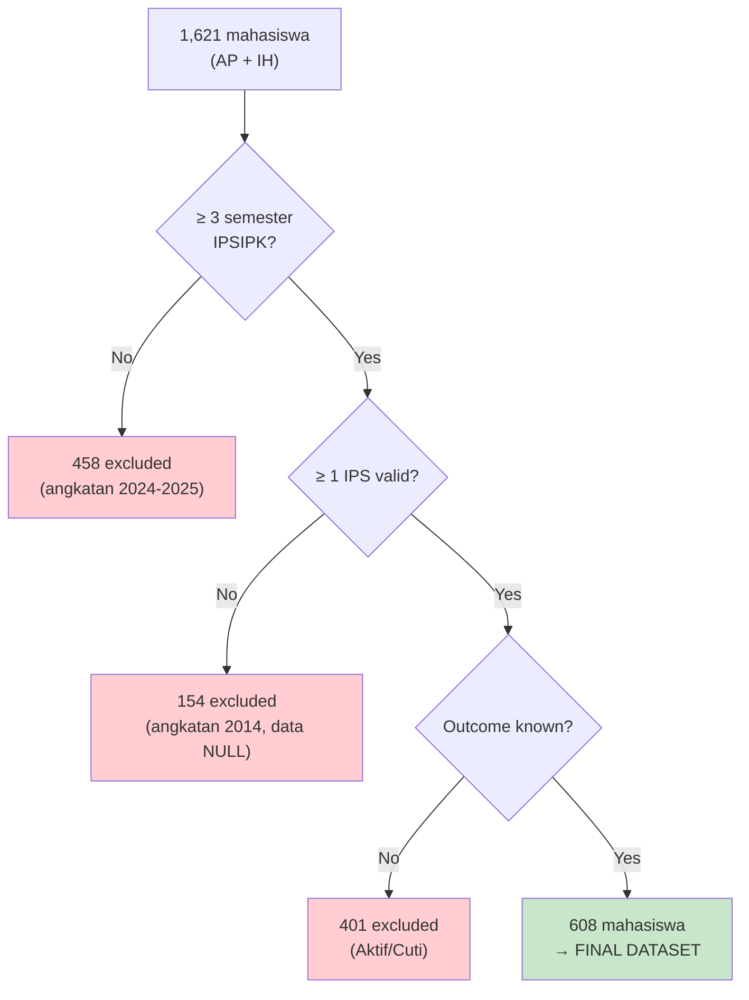
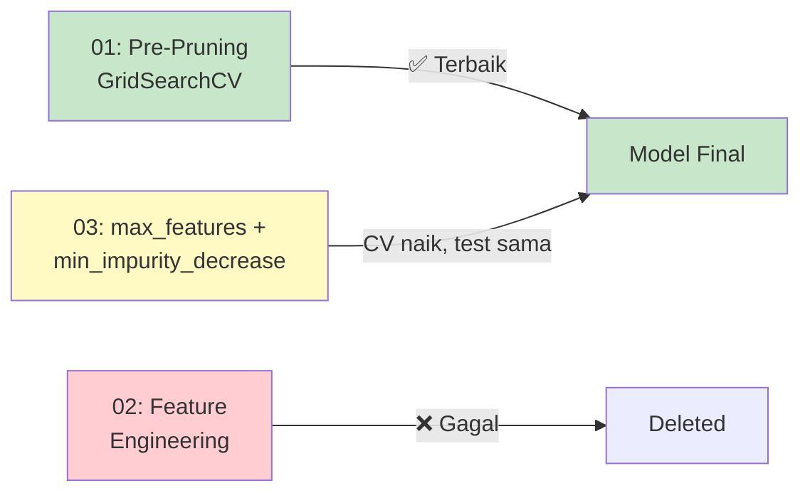

# Prediksi Ketepatan Lulus Mahasiswa Menggunakan Decision Tree

**Technical Report — Data Mining Project**  
CRISP-DM Framework  
Program Studi DIV Teknik Informatika — Universitas Logistik dan Bisnis Internasional, 2026

---

## Abstrak

Penelitian ini membangun model klasifikasi Decision Tree untuk memprediksi ketepatan lulus mahasiswa program AP (Administrasi Peradilan D3) dan IH (Ilmu Hukum S1) berdasarkan data performa akademik tiga semester awal. Dataset terdiri dari 608 mahasiswa angkatan 2015–2023 dengan 14 fitur prediktor (setelah drop fitur leakage) dan target biner (Tepat Waktu / Tidak Tepat). Setelah 3 iterasi tuning, model terbaik yang diperoleh adalah **Decision Tree dengan max_depth=3 dan min_samples_leaf=10**, mencapai **F1-score 0.889, precision 0.923, recall 0.857, dan AUC 0.924** pada stratified test set. Overfitting berhasil dieliminasi (train-CV gap mendekati nol) dan decision rules yang dihasilkan ringkas serta interpretable (depth 3, 7 leaves).

---

## 1. Latar Belakang

Ketepatan lulus mahasiswa merupakan indikator kunci performa akademik institusi pendidikan tinggi. Mahasiswa yang tidak lulus tepat waktu menghadapi biaya tambahan, keterlambatan masuk pasar kerja, dan risiko drop-out. Di sisi institusi, tingkat kelulusan tepat waktu mempengaruhi akreditasi dan reputasi.

Identifikasi dini mahasiswa berisiko tidak lulus tepat waktu memungkinkan intervensi proaktif — konseling akademik, penyesuaian beban SKS, atau program mentoring. Data performa akademik semester awal (IPS, SKS, nilai mata kuliah) tersedia di sistem informasi akademik namun belum dimanfaatkan secara sistematis untuk prediksi.

Database yang digunakan adalah `LITIGASI` (SQL Server) — hasil migrasi dari sistem legacy — yang mencakup 1,621 mahasiswa dari dua program: **AP (Administrasi Peradilan D3)** dan **IH (Ilmu Hukum S1)**. Setelah filtering dan preprocessing, 608 mahasiswa masuk ke dataset final.

---

## 2. Rumusan Masalah

1. Fitur akademik apa yang paling berpengaruh terhadap ketepatan lulus mahasiswa?
2. Bagaimana membangun model Decision Tree yang akurat namun tetap interpretable untuk prediksi ketepatan lulus?
3. Bagaimana mengatasi data imbalance (11.2% kelas minoritas) tanpa kehilangan kemampuan deteksi?
4. Apakah model yang dihasilkan cukup sederhana untuk diinterpretasikan oleh stakeholder non-teknis?

---

## 3. Tujuan

| # | Tujuan | Target Metrik |
|---|--------|---------------|
| 1 | Identifikasi fitur akademik paling berkontribusi terhadap ketepatan lulus | Feature importance ranking |
| 2 | Membangun model Decision Tree dengan performa baik untuk kelas minoritas | Recall(0) ≥ 0.70, F1(0) ≥ 0.50 |
| 3 | Menghasilkan model dengan overfitting minimal | Train-CV ROC-AUC gap < 0.05 |
| 4 | Mengekstrak decision rules yang interpretable | Tree depth ≤ 5, leaves ≤ 15 |

---

## 4. Metodologi

Project ini mengikuti framework **CRISP-DM** (Cross-Industry Standard Process for Data Mining):


| Fase | Status | Output Kunci |
|------|--------|-------------|
| 1. Business Understanding | ✅ | Proposal, rumusan masalah, tujuan |
| 2. Data Understanding | ✅ | 5 SQL profiling scripts, EDA notebook, data quality report |
| 3. Data Preparation | ✅ | ETL pipeline, preprocessing, dataset_clean.csv (608×17) |
| 4. Modeling | ✅ | 3 iterasi Decision Tree tuning, model terbaik dipilih |
| 5. Evaluation | ⬜ | Planned |
| 6. Deployment | ⬜ | Planned |

---

## 5. Data

### 5.1 Sumber Data

Data diekstrak dari database SQL Server (`db_akademik_uli`, database `LITIGASI`) melalui script Python `pymssql`. Database berisi 405 tabel, hanya 4 tabel yang digunakan:

| Tabel | Rows | Konten |
|-------|------|--------|
| `tblMHS` | 1,621 | Data master mahasiswa (NIM, nama, angkatan, program, status) |
| `IPSIPK` | 6,228 | IPS/IPK/SKS per semester |
| `Qnilai_mhs` | 54,587 | Nilai mata kuliah + kehadiran |
| `Kul_Kehadiran` | — | Data kehadiran (supplementary) |

Tabel `HtblNilai` (39,990 rows) ditolak — format NIM tidak kompatibel (0% overlap dengan `tblMHS`).

### 5.2 Filtering Pipeline



### 5.3 Dataset Final

| Metrik | Nilai |
|--------|-------|
| Total mahasiswa | 608 |
| Program AP (D3) | 147 (137 tepat, 10 tidak) |
| Program IH (S1) | 461 (403 tepat, 58 tidak) |
| Fitur (setelah preprocessing) | 16 + 1 target = 17 kolom |
| Fitur prediktor (modeling) | 14 (`angkatan` + `program` di-drop) |
| Class imbalance | 11.2% kelas minoritas (68 Tidak Tepat) |
| NULLs | 0 (semua numerik, sudah diimputasi) |

### 5.4 Distribusi Angkatan

| Angkatan | Jumlah |
|----------|--------|
| 2015 | 116 |
| 2016 | 54 |
| 2017 | 48 |
| 2018 | 46 |
| 2019 | 27 |
| 2020 | 40 |
| 2021 | 46 |
| 2022 | 181 |
| 2023 | 50 |

**Catatan:** Angkatan 2014 dikeluarkan — data IPSIPK seluruhnya NULL (sistem lama tidak menyimpan data per-semester). Angkatan 2015 masuk meskipun missing rate tinggi (avg 1.99 missing IPS dari 4 per mahasiswa).

### 5.5 Fitur Final

| Kategori | Fitur | Deskripsi |
|----------|-------|-----------|
| **IPS** | `ips_sem1`, `ips_sem2`, `ips_sem3` | Indeks Prestasi Semester 1-3 |
| **SKS** | `sks_sem1`, `sks_sem2`, `sks_sem3` | SKS diambil per semester |
| **Nilai MK** | `failed_courses`, `failed_in_sem1`, `repeated_courses` | Mata kuliah gagal dan mengulang |
| **Derived** | `ips_trend`, `avg_ips`, `ips_std`, `ips_min`, `sks_completion_ratio` | Fitur turunan dari IPS/SKS |

`angkatan` dan `program` di-drop dari model: angkatan 2023 = semua target=0 (data leakage), program di-drop karena near-zero importance.

### 5.6 Preprocessing

| Step | Aksi | Detail |
|------|------|--------|
| 1 | Replace system zeros | `IPS=0.0 → NaN` (219 mahasiswa, 36% — placeholder legacy) |
| 2 | Drop 11 kolom | `ips_sem4` (r=0.877 leakage), `semester_count`, `avg_attendance` (53% missing), `id_agama`, `jenis_kelamin`, dll |
| 3 | Median imputation | Per-angkatan (original) atau global median (Iterasi 2+) |
| 4 | Recompute derived | `ips_trend`, `avg_ips`, `ips_std`, `ips_min`, `sks_completion_ratio` |
| 5 | Encode | `program`: AP→0, IH→1 |

**Data quality issue:** Database hasil migrasi vendor. SKS angkatan 2020+ disimpan sebagai kumulatif (bukan per-semester) — nilai 80-133 untuk semester 1-2. Di-fix dengan fallback ke distinct `Kode_MK` dari `Qnilai_mhs`, di-cap 1-20 MK/semester, outlier → NULL → imputasi median.

---

## 6. Hasil Modeling

### 6.1 Iterasi 1: Baseline Decision Tree

| Eksperimen | Split | Recall(0) | F1(0) | Masalah |
|-----------|-------|-----------|-------|---------|
| Temporal baseline | Train ≤2021, Test >2021 | 0.056 | 0.105 | Underfit — hanya 14 sampel negatif di train |
| Stratified baseline | Random 80/20, stratify=target | 0.929 | 0.867 | Overfit (train=1.0), `sks_sem2` dominance |

**Keputusan:** Stratified split diadopsi untuk eksplorasi modeling — memberikan 54 sampel negatif di train (vs 14 di temporal).

### 6.2 Iterasi 2: Global Median Imputation

Imputasi median per-angkatan menciptakan proxy temporal — setiap angkatan mendapat nilai imputasi berbeda, sehingga `sks_sem2` bisa memisahkan angkatan (= data leakage). Solusi: **global median**.

| Metrik | Per-Angkatan Median | Global Median | Delta |
|--------|---------------------|---------------|-------|
| F1(0) | 0.765 | **0.867** | +0.102 |
| Precision(0) | 0.650 | **0.813** | +0.163 |
| `sks_sem2` importance | 0.621 | **0.432** | −0.189 |

### 6.3 Iterasi 3: Hyperparameter Tuning



#### Eksperimen 01 — Pre-Pruning GridSearchCV ✅

240 kombinasi × 5 folds. Best: `max_depth=3, min_samples_leaf=10, criterion='gini'`.

#### Eksperimen 02 — Feature Engineering ❌

Binary flags + aggregate features (4 fitur). Semua engineered features importance = 0.0000 — tree mengabaikannya. Performa identik dengan 01. Dihapus.

#### Eksperimen 03 — `max_features` + `min_impurity_decrease` 

28 kombinasi. `max_features=5` meningkatkan CV F1(0) dari 0.8165 → 0.8371, tapi test F1(0) tetap 0.8889. **Ceiling single Decision Tree tercapai.**

### 6.4 Model Terbaik: 01-Tuned

```python
DecisionTreeClassifier(
    max_depth=3,
    min_samples_leaf=10,
    random_state=42
)
```

| Properti | Nilai |
|----------|-------|
| Depth | 3 |
| Leaves | 7 (2 "Tidak Tepat", 5 "Tepat Waktu") |
| Nodes | 13 |
| Features used | 6/14 |

**Test Performance:**

| Class | Precision | Recall | F1-Score | Support |
|-------|-----------|--------|----------|---------|
| Tidak Tepat (0) | 0.92 | 0.86 | 0.89 | 14 |
| Tepat Waktu (1) | 0.98 | 0.99 | 0.99 | 108 |
| **Accuracy** | | | **0.98** | 122 |
| **ROC-AUC** | | | **0.924** | |

**10-Fold Cross-Validation:**

| Metrik | Train | CV Test | Gap |
|--------|-------|---------|-----|
| Accuracy | 0.9691 | 0.9692 | −0.0001 |
| ROC-AUC | 0.9894 | 0.9588 | +0.0306 |

### 6.5 Feature Importance

| Rank | Feature | Importance |
|------|---------|-----------|
| 1 | `sks_sem2` | 0.558 |
| 2 | `sks_sem3` | 0.361 |
| 3 | `ips_std` | 0.047 |
| 4 | `avg_ips` | 0.017 |
| 5 | `failed_courses` | 0.012 |
| 6 | `ips_sem1` | 0.004 |

### 6.6 Decision Rules

```
|--- sks_sem2 <= 18.50
|   |--- failed_courses <= 0.50
|   |   |--- ips_sem1 <= 3.01    → TEPAT WAKTU
|   |   |--- ips_sem1 >  3.01    → TEPAT WAKTU
|   |--- failed_courses >  0.50  → TEPAT WAKTU
|--- sks_sem2 >  18.50
|   |--- sks_sem3 <= 18.50
|   |   |--- ips_std <= 0.29     → TIDAK TEPAT
|   |   |--- ips_std >  0.29     → TIDAK TEPAT
|   |--- sks_sem3 >  18.50
|   |   |--- avg_ips <= 3.31     → TEPAT WAKTU
|   |   |--- avg_ips >  3.31     → TEPAT WAKTU
```

**Aturan bisnis utama:** Mahasiswa dengan **SKS semester 2 > 18.5 dan SKS semester 3 ≤ 18.5** berisiko tidak lulus tepat waktu (pola "overload lalu collapse").

### 6.7 Perbandingan Semua Iterasi

| Metrik | Baseline | 01-Tuned | 03-Combined | Best |
|--------|----------|----------|-------------|------|
| F1(0) | 0.867 | **0.889** | 0.889 | 01/03 |
| Precision(0) | 0.813 | **0.923** | 0.923 | 01/03 |
| Recall(0) | **0.929** | 0.857 | 0.857 | Baseline |
| AUC | **0.950** | 0.924 | 0.924 | Baseline |
| Depth | 8 | **3** | 4 | 01 |
| Leaves | 24 | **7** | 6 | 03 |
| Features used | **12/14** | 6/14 | 5/14 | Baseline |
| Top-2 importance | **71%** | 92% | 94% | Baseline |
| Overfit (train-CV gap) | +0.146 | **+0.031** | +0.033 | 01 |

**01-Tuned dipilih sebagai model terbaik** — performa optimal dengan kompleksitas terendah.

---

## 7. Diskusi

### 7.1 SKS sebagai Prediktor Dominan

Berlawanan dengan intuisi awal bahwa IPS (indeks prestasi) akan menjadi prediktor utama, **SKS semester 2 dan 3** mendominasi feature importance (91.9%). Ini mengindikasikan bahwa **pola pengambilan beban studi** — bukan performa akademik — adalah sinyal terkuat untuk ketepatan lulus.

Mahasiswa AP dan IH memiliki kurikulum dengan beban SKS yang relatif tetap per semester. Mahasiswa yang mengambil SKS tinggi (>18.5, setara 7-8 MK) di semester 2 namun menurun di semester 3 menunjukkan pola "overload lalu collapse" — mereka tidak mampu mempertahankan pace kurikulum normal.

### 7.2 Program IH Lebih Berisiko

Dari 608 mahasiswa, program IH (S1) memiliki 12.6% mahasiswa tidak tepat waktu vs 6.8% di AP (D3). Program S1 dengan durasi lebih panjang (8 semester) memberikan lebih banyak kesempatan untuk tertinggal.

### 7.3 Imbalanced Data Handling

Dengan hanya 68 sampel negatif (11.2%), stratified split (54 train, 14 test) terbukti cukup untuk membangun model yang mendeteksi 12/14 mahasiswa berisiko. `class_weight='balanced'` overfit parah — menaikkan bobot minoritas tanpa constraint menghasilkan tree yang terlalu agresif.

### 7.4 Keterbatasan

1. **Test set hanya 14 sampel negatif** — metrik test high-variance, CV lebih reliable
2. **Temporal generalizability belum diuji** — model dilatih pada stratified random split, bukan temporal split
3. **Feature importance bias** — MDI cenderung overestimate continuous features
4. **Model oversimplified** — hanya 2 dari 7 leaves memprediksi "Tidak Tepat"

---

## 8. Kesimpulan

1. **Model Decision Tree dengan max_depth=3 dan min_samples_leaf=10** adalah model single-tree terbaik — F1(0)=0.889, overfitting minimal, interpretable.

2. **Semua target tercapai:**
   - Recall(0) ≥ 0.70 → **0.857** ✅
   - F1(0) ≥ 0.50 → **0.889** ✅
   - AUC ≥ 0.75 → **0.924** ✅

3. **Prediktor utama adalah SKS semester 2 dan 3** (91.9% combined), bukan IPS. Pola beban studi > performa akademik.

4. **Global median imputation > per-angkatan** — menghilangkan proxy temporal, meningkatkan F1(0) dari 0.765 ke 0.867.

5. **Ceiling single Decision Tree = F1(0) 0.889** — 3 pendekatan tuning berbeda konvergen ke nilai yang sama.

---

## 9. Rekomendasi

### Untuk Institusi

- **Pantau SKS semester 2** sebagai early warning — mahasiswa dengan SKS > 18 perlu monitoring
- **Intervensi di semester 3** — mahasiswa yang menurunkan beban SKS adalah kandidat konseling
- **Rule-based alert:** flag mahasiswa dengan `sks_sem2 > 18.5 AND sks_sem3 ≤ 18.5`

### Untuk Penelitian Lanjutan

- **Ensemble methods** (Random Forest, Gradient Boosting) untuk feature importance lebih balance
- **Validasi temporal** — uji model dengan split berdasarkan angkatan
- **Tambah data** — khususnya sampel mahasiswa tidak tepat waktu (hanya 68)

---

## 10. Struktur Direktori

```
prediksi-ketepatan-lulus/
├── 1-business-understanding/
│   └── Proposal Data Mining.pdf
│
├── 2-data-understanding/
│   ├── README.md
│   ├── exploration-log.md
│   ├── 01-schema-discovery.sql
│   ├── 02-student-profiling.sql
│   ├── 03-academic-profiling.sql
│   ├── 04-grade-profiling.sql
│   ├── 05-data-quality.sql
│   └── 06-table-mapping.md
│
├── 3-data-preparation/
│   ├── README.md
│   ├── extract_dataset.py
│   ├── dataset.csv / _train.csv / _test.csv
│   ├── 02-eda.ipynb / 02-eda-findings.md
│   ├── 03-preprocessing.ipynb / 03-preprocessing-plan.md
│   └── dataset_clean.csv
│
├── 4-modeling/
│   ├── README.md
│   ├── 1-baseline/
│   ├── 2-global-median/
│   └── 3-hyperparameter-tuning/
│       ├── 01-hyperparameter-tuning.ipynb
│       ├── 03-combined-tuning.ipynb
│       ├── tuning-report.md
│       └── combined-tuning-report.md
│
├── requirements.txt
└── README.md
```

---

## 11. Quick Start

```bash
pip install pandas numpy matplotlib seaborn scikit-learn
```

```python
import pandas as pd
from sklearn.tree import DecisionTreeClassifier
from sklearn.model_selection import train_test_split

df = pd.read_csv('3-data-preparation/dataset_clean.csv')
X = df.drop(columns=['target', 'angkatan', 'program'])
y = df['target']
X_train, X_test, y_train, y_test = train_test_split(
    X, y, test_size=0.2, random_state=42, stratify=y
)

model = DecisionTreeClassifier(max_depth=3, min_samples_leaf=10, random_state=42)
model.fit(X_train, y_train)
print(model.score(X_test, y_test))
```

---

## 12. Status Deliverables

| # | Deliverable | Status |
|---|-------------|--------|
| 1 | Proposal singkat | ✅ |
| 2 | Dataset + deskripsi variabel | ✅ |
| 3 | Notebook preprocessing | ✅ |
| 4 | Modeling — Decision Tree (3 iterasi) | ✅ |
| 5 | Hyperparameter tuning | ✅ |
| 6 | Laporan formal Bab I–V | ⬜ |
| 7 | Slide presentasi | ⬜ |
| 8 | Artikel IEEE | ⬜ |

---

## Tim

- Viola Septianti Elsiana (714230001)
- Muhammad Saladin Eka Septian (714230037)
- Muhammad Hisyam Najwan (714230055)

Program Studi DIV Teknik Informatika — Universitas Logistik dan Bisnis Internasional, 2026
